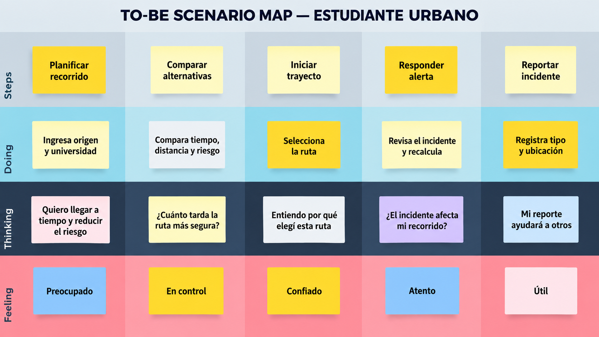
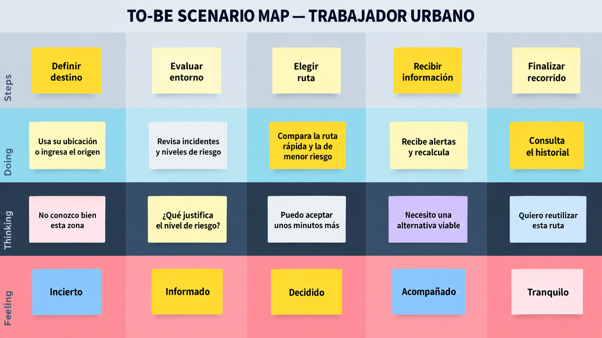
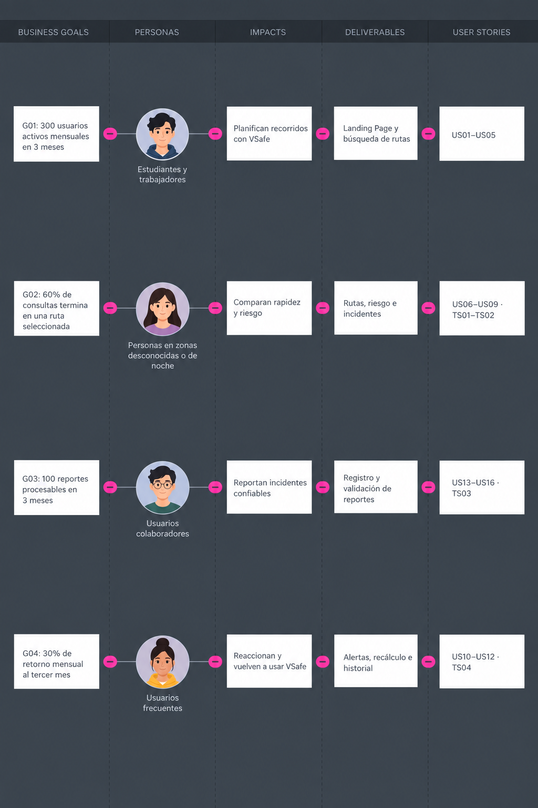

     
    <strong>Universidad Peruana de Ciencias Aplicadas</strong>  
    <strong>Ingeniería de Software</strong>  
    <strong>1ASI0657 Fundamentos de Arquitectura de Software</strong> 
    <strong>202610</strong>  
    <strong>NRC: 16363</strong>  
    <strong>Profesor: Marino Humberto Jara Palacios</strong>  
    <strong>TRABAJO FINAL</strong>  
    <strong>Nombre del Producto:</strong> VSafe

| Alumno | Código |
|:---:|:---:|
| Gianfranco Jared Durand Vega | U202312614 |
| Stephano Mayrzon Landauri Preciado | U202311828 |
| Oscar Leonardo Espinoza Quijandría | U202311842 |
| Renzo Sebastián Uribe Livia | U202311745 |

## Registro de Versiones del Informe

| Versión | Fecha | Autor(es) | Descripción |
|---|---|---|---|

## Student Outcome

El curso contribuye al cumplimiento del Student Outcome ABET:

**ABET – EAC - Student Outcome 7**

**Aprendizaje Continuo y Autónomo**

**Criterio:** La capacidad de adquirir y aplicar nuevos conocimientos según sea necesario, utilizando estrategias de aprendizaje apropiadas.

En el siguiente cuadro se describen las acciones realizadas y las conclusiones del equipo que sustentan el cumplimiento del **ABET – EAC - Student Outcome 7**.

| Criterio específico | Acciones realizadas | Conclusiones |
|---|---|---|
| **3.c1.** Comunica oralmente sus ideas y/o resultados con objetividad a público de diferentes especialidades y niveles jerárquicos, en el marco del desarrollo de un proyecto en ingeniería de software. | **TB1:** - **Oscar Espinoza:** Desarrollé el capítulo IV completo y preparé la explicación oral de las decisiones arquitectónicas de VSafe. Organicé las ideas sobre ADD, DDD, Clean Architecture y microservicios, apoyándome en los diagramas para explicar las responsabilidades de cada contexto y sus relaciones con un lenguaje comprensible para públicos con distintos conocimientos técnicos. - **Renzo Sebastián Uribe Livia:** Desarrollé todo el capítulo III y preparé la explicación oral de la especificación de requisitos de VSafe. Organicé los To-Be Scenario Maps, las Epics y User Stories con sus criterios de aceptación, el Impact Mapping y el Product Backlog, relacionando las necesidades de los usuarios con los objetivos del negocio mediante un lenguaje comprensible para públicos técnicos y no técnicos. - **Stephano Mayrzon Landauri Preciado:** Desarrollé el capítulo II de VSafe y preparé la explicación oral del proceso de Requirements Elicitation & Analysis. Organicé el análisis competitivo, las entrevistas a los segmentos objetivo y las técnicas de Needfinding, incluyendo User Personas, User Task Matrix, Empathy Mapping y As-Is Scenario Mapping. Asimismo, expliqué el Ubiquitous Language definido para el proyecto, relacionando los hallazgos sobre estudiantes universitarios y trabajadores urbanos con las necesidades que busca abordar VSafe mediante un lenguaje comprensible para públicos técnicos y no técnicos. - **Gianfranco Jared Durand Vega:** Desarrollé y documenté el capítulo I de VSafe, estructurando el Startup Profile y Solution Profile del proyecto. Definí la descripción de la startup, misión, visión, valores, objetivo general y objetivos específicos, además de los antecedentes y la problemática, junto con el análisis 5W + 2H. Asimismo, desarrollé el proceso Lean UX mediante los Problem Statements, Business Assumptions, User Assumptions, Hypothesis Statements y Lean UX Canvas, sustentando la problemática con fuentes y referencias y manteniendo coherencia entre las necesidades identificadas, los usuarios objetivo y la solución propuesta. | **TB1:** La preparación de VSafe permitió integrar los aportes del equipo en una explicación del problema, las necesidades de los usuarios, los requerimientos y la solución propuesta. El uso de ejemplos y diagramas facilita comunicar las decisiones del proyecto a públicos con diferentes especialidades y niveles de responsabilidad, distinguiendo los resultados obtenidos de los aspectos pendientes de validación. |
| **3.c2.** Comunica en forma escrita ideas y/o resultados con objetividad a público de diferentes especialidades y niveles jerárquicos, en el marco del desarrollo de un proyecto de ingeniería de software. | **TB1:** - **Oscar Espinoza:** Elaboré y documenté todo el capítulo IV de VSafe, incluyendo el diseño guiado por atributos de calidad, los drivers y las decisiones arquitectónicas, el EventStorming, el descubrimiento de contextos, los flujos del dominio, los Bounded Context Canvases, el Context Mapping y los diagramas de arquitectura. Expliqué la propuesta de microservicios y la aplicación de Clean Architecture, manteniendo coherencia con los capítulos anteriores y diferenciando las decisiones propuestas de los resultados pendientes de validación. - **Renzo Sebastián Uribe Livia:** Elaboré y documenté todo el capítulo III de VSafe, incluyendo los To-Be Scenario Maps, la definición de Epics, User Stories y Technical Stories con criterios de aceptación, el Impact Mapping y la priorización del Product Backlog. Organicé los requisitos y su trazabilidad con los objetivos del negocio, manteniendo coherencia con la problemática, los segmentos objetivo y las hipótesis definidas en el capítulo I. - **Stephano Mayrzon Landauri Preciado:** Elaboré y documenté el capítulo II de VSafe, correspondiente a Requirements Elicitation & Analysis, incluyendo el análisis de competidores y las estrategias frente a ellos, el diseño y análisis de entrevistas para los segmentos de estudiantes universitarios y trabajadores urbanos, y las técnicas de Needfinding mediante User Personas, User Task Matrix, Empathy Mapping y As-Is Scenario Mapping. Además, definí el Ubiquitous Language del proyecto para mantener una terminología consistente sobre conceptos como rutas, incidentes, reportes y riesgo estimado, manteniendo coherencia con la problemática, los segmentos objetivo y la propuesta de valor definida en el capítulo I. - **Gianfranco Jared Durand Vega:** Elaboré y documenté el capítulo I de VSafe, estructurando el Startup Profile y Solution Profile del proyecto. Definí la descripción de la startup, misión, visión, valores, objetivos generales y específicos, antecedentes y problemática, así como el análisis 5W + 2H. Asimismo, desarrollé y documenté el proceso Lean UX mediante los Problem Statements, Business Assumptions, User Assumptions, Hypothesis Statements y Lean UX Canvas, sustentando la problemática mediante fuentes y referencias y manteniendo coherencia entre las necesidades identificadas, los usuarios objetivo y la solución propuesta. | **TB1:** La documentación de VSafe consolidó los aportes del equipo y estableció una relación entre el análisis del problema, los objetivos, las necesidades de los usuarios, los requerimientos y el diseño de la solución. La organización del informe mediante textos, tablas y diagramas facilita su comprensión y revisión por lectores técnicos y no técnicos, y proporciona una base común para continuar el desarrollo y validar las decisiones propuestas. |

## Contenido

### Tabla de contenidos

- [Student Outcome](#student-outcome)
- [Capítulo I: Introducción](#capítulo-i-introducción)
  - [1.1 Startup Profile](#11-startup-profile)
    - [1.1.1 Descripción de la Startup](#111-descripción-de-la-startup)
    - [1.1.2 Perfiles de integrantes del equipo](#112-perfiles-de-integrantes-del-equipo)
  - [1.2 Solution Profile](#12-solution-profile)
    - [1.2.1 Nombre del producto](#121-nombre-del-producto)
    - [1.2.2 Antecedentes y problemática](#122-antecedentes-y-problemática)
    - [1.2.3 Lean UX Process](#123-lean-ux-process)
      - [1.2.3.1 Lean UX Problem Statements](#1231-lean-ux-problem-statements)
      - [1.2.3.2 Lean UX Assumptions](#1232-lean-ux-assumptions)
      - [1.2.3.3 Lean UX Hypothesis Statements](#1233-lean-ux-hypothesis-statements)
      - [1.2.3.4 Lean UX Canvas](#1234-lean-ux-canvas)
  - [1.3 Segmentos objetivo](#13-segmentos-objetivo)
- [Capítulo II: Requirements Elicitation & Analysis](#capítulo-ii--requirements-elicitation--analysis)
  - [2.1 Competidores](#21-competidores)
    - [2.1.1 Análisis competitivo](#211-análisis-competitivo)
    - [2.1.2 Estrategias y tácticas frente a competidores](#212-estrategias-y-tácticas-frente-a-competidores)
  - [2.2 Entrevistas](#22-entrevistas)
    - [2.2.1 Diseño de entrevistas](#221-diseño-de-entrevistas)
    - [2.2.2 Registro de entrevistas](#222-registro-de-entrevistas)
    - [2.2.3 Análisis de entrevistas](#223-análisis-de-entrevistas)
  - [2.3 Needfinding](#23-needfinding)
    - [2.3.1 User Personas](#231-user-personas)
    - [2.3.2 User Task Matrix](#232-user-task-matrix)
    - [2.3.3 Empathy Mapping](#233-empathy-mapping)
    - [2.3.4 As-is Scenario Mapping](#234-as-is-scenario-mapping)
  - [2.4 Ubiquitous Language](#24-ubiquitous-language)
- [Capítulo III: Requirements Specification](#capítulo-iii-requirements-specification)
  - [3.1 To-Be Scenario Mapping](#31-to-be-scenario-mapping)
  - [3.2 User Stories](#32-user-stories)
  - [3.3 Impact Map](#33-impact-map)
  - [3.4 Product Backlog](#34-product-backlog)
- [Capítulo IV: Product Architecture Design](#capítulo-iv-product-architecture-design)
  - [4.1 Design Concepts, ViewPoints & ER Diagrams](#41-design-concepts-viewpoints--er-diagrams)
  - [4.2 Architectural Drivers](#42-architectural-drivers)
  - [4.3 ADD Iterations](#43-add-iterations)
- [Capítulo V: Product Implementation, Validation & Deployment](#capítulo-v-product-implementation-validation--deployment)
- [Conclusiones](#conclusiones)
- [Referencias Bibliográficas](#referencias-bibliográficas)
- [Anexos](#anexos)

# Capítulo I: Introducción

## 1.1 Startup Profile

### 1.1.1 Descripción de la Startup

VSafe es una startup tecnológica enfocada en mejorar la experiencia de desplazamiento de las personas dentro de la ciudad mediante una plataforma de navegación urbana inteligente. Nuestra solución utiliza inteligencia artificial, geolocalización y reportes de incidentes para permitir la evaluación de rutas considerando no solo aspectos como el tiempo y la distancia, sino también el nivel de riesgo estimado de las zonas por las que transita el usuario.

A través de la plataforma, los usuarios podrán ingresar un punto de origen y destino para visualizar diferentes alternativas de recorrido, conocer incidentes reportados cerca de su ubicación y recibir alertas sobre situaciones que puedan afectar su desplazamiento. Asimismo, podrán contribuir con la comunidad registrando incidentes relacionados con robos, asaltos u otras situaciones que puedan representar un riesgo para las personas que transitan por determinadas zonas.

Nuestra startup busca complementar los sistemas tradicionales de navegación incorporando el riesgo estimado como un criterio adicional para la elección de una ruta. De esta manera, los usuarios podrán contar con mayor información antes y durante sus desplazamientos y elegir el recorrido que mejor se adapte a sus necesidades.

### Misión

Facilitar el desplazamiento urbano de las personas mediante una solución tecnológica que combine inteligencia artificial, geolocalización y reportes de incidentes para ofrecer alternativas de recorrido considerando tiempo, distancia y nivel de riesgo estimado.

### Visión

Convertirse en una plataforma de navegación urbana reconocida por incorporar información sobre el riesgo estimado como un factor relevante dentro de la planificación de rutas, contribuyendo a que las personas puedan movilizarse de manera más informada por la ciudad.

### Valores

Nuestros valores se basan en la innovación, utilizando nuevas tecnologías para mejorar la experiencia de navegación urbana; la seguridad, proporcionando información que permita a los usuarios tomar decisiones más informadas durante sus recorridos; la colaboración, fomentando la participación de la comunidad mediante el reporte de incidentes; la accesibilidad, desarrollando una plataforma sencilla y fácil de utilizar; y la responsabilidad, gestionando adecuadamente la información y ubicación de los usuarios.

### Objetivo General

Desarrollar una plataforma de navegación urbana inteligente que permita a los usuarios evaluar diferentes alternativas de recorrido considerando tiempo, distancia y nivel de riesgo estimado mediante el uso de inteligencia artificial, geolocalización y reportes de incidentes.

### 1.1.2 Perfiles de integrantes del equipo

| Foto | Nombre completo | Código | Carrera | Habilidades técnicas y rol |
|---|---|---|---|---|
|  | Gianfranco Jared Durand Vega | U202312614 | Ingeniería de Software | Desarrollo Frontend (Vue/React), UI/UX, Integración de servicios externos. |
|  | Oscar Leonardo Espinoza Quijandria | U202311842 | Ingeniería de Software | Desarrollo de software, análisis de requerimientos, diseño de arquitectura y documentación técnica. Colaboración en equipo para proponer soluciones y organizar el desarrollo del proyecto. |
|  | Renzo Sebastián Uribe Livia | U202311745 | Ingeniería de Software | Análisis y especificación de requisitos, elaboración de User Stories y criterios de aceptación, Impact Mapping, Product Backlog y documentación técnica. |
|  | Stephano Mayrzon Landauri Preciado | U202311828 | Ingeniería de Software | Análisis de requerimientos, investigación de usuarios y documentación técnica para soluciones de software. Experiencia en Needfinding, User Personas, User Stories, Ubiquitous Language y análisis competitivo, colaborando en equipo para definir funcionalidades y organizar el desarrollo de proyectos. |

## 1.2 Solution Profile

### 1.2.1 Nombre del producto

**VSafe** es una plataforma tecnológica de navegación urbana inteligente orientada a mejorar la información disponible durante los desplazamientos dentro de la ciudad. La solución utiliza inteligencia artificial, geolocalización y reportes de incidentes para permitir que los usuarios comparen alternativas de recorrido considerando factores como el tiempo, la distancia y el nivel de riesgo estimado de las zonas por las que transitarán.

A través de la plataforma, los usuarios podrán ingresar un punto de origen y destino, visualizar diferentes alternativas de recorrido, conocer incidentes reportados cerca de su ubicación y recibir alertas sobre situaciones relevantes para su desplazamiento. Asimismo, podrán contribuir con la comunidad registrando incidentes relacionados con robos, asaltos u otras situaciones de riesgo.

VSafe busca complementar los sistemas tradicionales de navegación incorporando información sobre el riesgo estimado como un criterio adicional para evaluar las alternativas de recorrido.

### 1.2.2 Antecedentes y problemática

La inseguridad ciudadana representa una preocupación importante para las personas que se desplazan diariamente dentro de los espacios urbanos. Según el Instituto Nacional de Estadística e Informática (INEI, 2026), durante el año 2025 el **84.4 % de la población urbana de 15 años a más consideraba que podía ser víctima de algún hecho delictivo durante los siguientes doce meses**, mientras que en Lima Metropolitana esta percepción alcanzó el **85.5 %**; además, el **62.9 % de la población de Lima Metropolitana manifestó sentirse insegura al caminar sola durante la noche por su zona o barrio**, evidenciando que la seguridad puede influir en las decisiones relacionadas con los desplazamientos cotidianos.

En este contexto, las herramientas de navegación suelen centrarse principalmente en factores como la distancia, el tiempo y el tráfico, a pesar de que diferentes investigaciones han demostrado que es posible incorporar datos relacionados con criminalidad e incidentes para calcular rutas considerando también niveles de riesgo (Galbrun et al., 2016; Mata et al., 2016). Asimismo, Sohrabi et al. (2022) señalan que la búsqueda de rutas con criterios de seguridad requiere considerar diferentes fuentes de información, métodos para estimar riesgos y el equilibrio entre la rapidez y la seguridad del recorrido.

Frente a esta problemática, se propone **VSafe**, una plataforma que utiliza inteligencia artificial, geolocalización y reportes de incidentes para estimar el nivel de riesgo de diferentes recorridos y ofrecer a los usuarios información que les permita comparar alternativas y tomar decisiones más informadas.

#### Análisis 5W + 2H

| Elemento | Descripción |
|---|---|
| **What? (¿Qué?)** | Dificultad de las personas para conocer y considerar el nivel de riesgo de determinadas zonas al momento de seleccionar una ruta para desplazarse por la ciudad. |
| **Why? (¿Por qué?)** | Porque los sistemas de navegación suelen priorizar factores como el tiempo y la distancia, mientras que la información relacionada con incidentes o niveles de riesgo no siempre se encuentra integrada dentro del proceso de selección de una ruta (Galbrun et al., 2016). |
| **Who? (¿Quién?)** | Personas que se desplazan diariamente por la ciudad, especialmente estudiantes y trabajadores que deben transitar por zonas que desconocen o en determinados horarios. |
| **Where? (¿Dónde?)** | En entornos urbanos, principalmente en ciudades que presentan altos niveles de percepción de inseguridad, como Lima Metropolitana (INEI, 2026). |
| **When? (¿Cuándo?)** | Durante los desplazamientos cotidianos, especialmente cuando una persona se moviliza por lugares desconocidos, durante la noche o cuando debe elegir entre diferentes recorridos para llegar a un destino. |
| **How? (¿Cómo?)** | Los usuarios seleccionan sus recorridos principalmente a partir de información relacionada con distancia, tiempo o tráfico, sin disponer necesariamente de información integrada sobre incidentes ocurridos en las zonas por las que transitarán. |
| **How much? (¿Cuánto?)** | En 2025, el 84.4 % de la población urbana del Perú consideraba que podía ser víctima de un hecho delictivo durante los siguientes doce meses, mientras que en Lima Metropolitana esta cifra alcanzó el 85.5 % (INEI, 2026). |

### 1.2.3 Lean UX Process

#### 1.2.3.1 Lean UX Problem Statements

Las personas que se desplazan diariamente por la ciudad pueden presentar dificultades para identificar qué recorridos poseen un menor nivel de riesgo estimado, debido a que las herramientas tradicionales de navegación se enfocan principalmente en factores como el tiempo, la distancia y el tráfico, mientras que la información relacionada con incidentes de seguridad no siempre se encuentra integrada durante la planificación del recorrido.

Investigaciones relacionadas con navegación urbana han demostrado que los datos sobre criminalidad pueden incorporarse a modelos de rutas para comparar recorridos según distancia y riesgo, mientras que la combinación de información oficial y datos proporcionados por ciudadanos puede contribuir a mejorar este tipo de sistemas.

Por ello, VSafe busca integrar geolocalización, reportes de incidentes e inteligencia artificial para ofrecer diferentes alternativas de navegación y permitir que el usuario tome una decisión considerando tanto la rapidez como el nivel de riesgo estimado del recorrido.

> **¿Cómo podríamos ayudar a las personas que se desplazan por la ciudad a tomar decisiones más informadas sobre sus recorridos, considerando tanto la rapidez como el nivel de riesgo de las zonas por las que transitan?**

#### 1.2.3.2 Lean UX Assumptions

##### Business Assumptions

- Creemos que los usuarios necesitan una herramienta de navegación que considere el nivel de riesgo además del tiempo y la distancia al momento de evaluar una ruta.
- Creemos que integrar inteligencia artificial, geolocalización y reportes de incidentes permitirá ofrecer alternativas de recorrido más útiles para los usuarios.
- Creemos que los usuarios valorarán poder visualizar información sobre incidentes antes de iniciar un desplazamiento.
- Creemos que la participación de los usuarios mediante reportes puede contribuir a mantener actualizada la información disponible en la plataforma.
- Creemos que una plataforma disponible desde dispositivos móviles facilitará el acceso a la información durante los desplazamientos cotidianos.

##### User Assumptions

- Creemos que los usuarios sienten preocupación al desplazarse por zonas que desconocen o consideran poco seguras.
- Creemos que los usuarios desean conocer el nivel de riesgo estimado de una ruta antes de iniciar su recorrido.
- Creemos que los usuarios estarían dispuestos a elegir una ruta ligeramente más larga si esta presenta un menor nivel de riesgo estimado.
- Creemos que los usuarios consideran importante recibir alertas sobre incidentes cercanos que puedan afectar su recorrido.
- Creemos que algunos usuarios estarían dispuestos a reportar incidentes para contribuir con información útil para otros miembros de la comunidad.
- Creemos que los usuarios utilizarían una plataforma de navegación enfocada en proporcionar información sobre riesgo si esta resulta sencilla, rápida y confiable.

#### 1.2.3.3 Lean UX Hypothesis Statements

1. Creemos que mostrar diferentes alternativas de ruta acompañadas de un nivel de riesgo estimado permitirá que los usuarios tomen decisiones más informadas antes de iniciar un desplazamiento.
2. Creemos que integrar reportes de incidentes dentro del mapa ayudará a los usuarios a identificar zonas que podrían representar un mayor riesgo durante su recorrido.
3. Creemos que utilizar inteligencia artificial para analizar datos de ubicación e incidentes permitirá mejorar la estimación del riesgo asociado a las diferentes alternativas de recorrido.
4. Creemos que enviar alertas cuando se detecten incidentes relevantes cerca de la ruta seleccionada ayudará a los usuarios a conocer posibles riesgos y evaluar recorridos alternativos.
5. Creemos que permitir que los usuarios reporten incidentes de manera sencilla contribuirá a incrementar la información disponible y mantener actualizados los niveles de riesgo estimados de las diferentes zonas.
6. Creemos que ofrecer una plataforma sencilla, accesible y organizada aumentará la disposición de las personas a utilizar VSafe como complemento de sus herramientas habituales de navegación.

#### 1.2.3.4 Lean UX Canvas

| Sección | Contenido |
|---|---|
| **1. Business Problem** | • Los usuarios no cuentan con información integrada sobre el nivel de riesgo de las rutas que utilizan. • Las aplicaciones de navegación suelen priorizar tiempo, distancia y tráfico, sin integrar necesariamente información relacionada con el riesgo del recorrido. • Existe dificultad para conocer incidentes recientes ocurridos en determinadas zonas de la ciudad. • Los usuarios pueden desplazarse por zonas desconocidas sin información suficiente sobre posibles riesgos. • La información relacionada con incidentes urbanos se encuentra distribuida en diferentes fuentes y no siempre está disponible durante el recorrido. |
| **2. Business Outcomes** | • Incrementar la adopción de VSafe como herramienta complementaria para la planificación de desplazamientos. • Incrementar el porcentaje de usuarios que consideran el riesgo estimado al seleccionar una ruta. • Incrementar las consultas recurrentes de rutas dentro de la plataforma. • Fomentar la generación de reportes comunitarios. • Incrementar la cantidad de información validada disponible para mejorar progresivamente las estimaciones de riesgo. |
| **3. Users and Customers** | • Estudiantes universitarios que realizan desplazamientos frecuentes hacia y desde la universidad. • Trabajadores urbanos que realizan recorridos frecuentes por motivos laborales, incluyendo zonas desconocidas o desplazamientos nocturnos. |
| **4. User Benefits** | • Conocer el nivel de riesgo estimado de una ruta antes de iniciar el recorrido. • Identificar incidentes reportados cerca de su ubicación o destino. • Comparar rutas considerando tiempo, distancia y nivel de riesgo estimado. • Recibir alertas sobre incidentes relevantes durante el desplazamiento. • Tomar decisiones más informadas al desplazarse por zonas desconocidas. • Tener mayor control sobre la planificación de sus recorridos. • Contribuir con otros usuarios mediante el reporte de incidentes. |
| **5. Solution Ideas** | • Mapa interactivo con visualización de rutas e incidentes. • Estimación del riesgo de las alternativas mediante análisis de información geográfica y de incidentes. • Clasificación del nivel de riesgo mediante indicadores visuales. • Sistema de reportes de incidentes urbanos. • Geolocalización del usuario. • Alertas sobre incidentes cercanos al recorrido seleccionado. • Comparación entre diferentes alternativas considerando tiempo, distancia y riesgo estimado. • Historial de recorridos. • Sistema de validación de reportes realizados por la comunidad. |
| **6. Hypotheses** | • Creemos que mostrar el nivel de riesgo estimado de diferentes rutas permitirá a los usuarios tomar decisiones más informadas sobre sus recorridos. • Creemos que integrar reportes de incidentes dentro del mapa ayudará a los usuarios a identificar zonas que podrían representar un mayor riesgo. • Creemos que algunos usuarios estarán dispuestos a elegir una ruta ligeramente más larga si presenta un menor nivel de riesgo estimado. • Creemos que enviar alertas sobre incidentes cercanos permitirá a los usuarios evaluar rutas alternativas durante su desplazamiento. • Creemos que permitir reportar incidentes de manera sencilla aumentará la información disponible dentro de la plataforma. • Creemos que utilizar inteligencia artificial para analizar información de ubicación e incidentes permitirá mejorar las estimaciones de riesgo. • Creemos que una plataforma sencilla y rápida aumentará la intención de los usuarios de utilizar VSafe de manera recurrente. |
| **7. What's the most important thing we need to learn first?** | • Validar si los usuarios consideran importante conocer el nivel de riesgo antes de seleccionar una ruta. • Identificar qué factores utilizan actualmente los usuarios para decidir por dónde desplazarse. • Determinar si los usuarios estarían dispuestos a utilizar una ruta más larga a cambio de un menor nivel de riesgo estimado. • Conocer qué tipos de incidentes consideran más relevantes para evaluar una ruta. • Identificar si los usuarios estarían dispuestos a reportar incidentes dentro de la plataforma. • Determinar qué información necesitan visualizar para confiar en una estimación de VSafe. • Validar qué tipo de alertas consideran útiles durante sus desplazamientos. |
| **8. What's the least amount of work we need to do to learn the next most important thing?** | • Realizar entrevistas a potenciales usuarios de VSafe. • Aplicar encuestas para conocer hábitos de navegación y percepción de riesgo. • Crear un prototipo de baja fidelidad de la plataforma. • Realizar pruebas de usabilidad con usuarios potenciales. • Diseñar un mapa simulado que muestre rutas con diferentes niveles de riesgo estimado. • Probar diferentes formas de representar visualmente el nivel de riesgo. • Crear una Landing Page para evaluar el interés de los usuarios en la propuesta. • Desarrollar un MVP con las funcionalidades principales de búsqueda de rutas, visualización de incidentes y reporte de eventos. |

## 1.3 Segmentos objetivo

### Estudiantes universitarios

Estudiantes universitarios que realizan desplazamientos frecuentes entre su hogar, universidad y otros destinos relacionados con sus actividades académicas. Este segmento puede requerir información adicional al movilizarse por zonas desconocidas o en horarios nocturnos, por lo que VSafe busca permitirles comparar alternativas considerando tiempo, distancia, incidentes y nivel de riesgo estimado.

### Trabajadores urbanos

Trabajadores que realizan desplazamientos frecuentes por motivos laborales y que pueden necesitar movilizarse hacia diferentes zonas de la ciudad, incluyendo lugares desconocidos o recorridos realizados durante horarios nocturnos. VSafe busca proporcionarles información que les permita evaluar diferentes alternativas de recorrido considerando tiempo, distancia, incidentes y nivel de riesgo estimado.

# Capítulo II : Requirements Elicitation & Analysis

## 2.1. Competidores

El análisis competitivo permite identificar plataformas relacionadas con la navegación, movilidad y seguridad urbana que poseen características similares o complementarias a VSafe. Para este análisis se consideran Google Maps, Waze, My Safetipin y Citizen, debido a que presentan funcionalidades relacionadas con la planificación de rutas, información de tráfico, reportes colaborativos, alertas de incidentes o evaluación de condiciones de seguridad urbana.

El análisis de estas plataformas permite reconocer sus principales fortalezas y debilidades, así como identificar oportunidades de diferenciación para VSafe. La propuesta de VSafe se enfoca en integrar la planificación de recorridos con información relacionada con el nivel de riesgo estimado, permitiendo que los usuarios comparen alternativas considerando principalmente tiempo, distancia e información sobre incidentes relevantes.

### 2.1.1. Análisis competitivo

| Sección | Subcategoría | VSafe | Google Maps | Waze | My Safetipin | Citizen App |
|---|---|---|---|---|---|---|
| **Perfil** | **Overview** | Plataforma de navegación urbana inteligente que compara rutas según tiempo, distancia y nivel de riesgo estimado mediante geolocalización, información de incidentes e inteligencia artificial. | Plataforma de mapas y navegación que permite buscar lugares, obtener indicaciones, visualizar rutas alternativas y consultar tráfico en tiempo real. | Aplicación de navegación colaborativa orientada principalmente a conductores, utilizando información de tráfico y reportes de su comunidad. | Plataforma enfocada en seguridad urbana que analiza información de espacios públicos para apoyar decisiones sobre desplazamientos. | Aplicación de seguridad pública que proporciona alertas e información sobre incidentes cercanos a la ubicación del usuario. |
| **Ventaja competitiva** | **¿Qué valor ofrece a los clientes?** | Integra la comparación de tiempo, distancia y riesgo estimado, acompañada de información sobre incidentes relevantes asociados al recorrido. | Amplia infraestructura cartográfica, navegación multimodal e información de tráfico en tiempo real. | Información colaborativa sobre tráfico, accidentes y condiciones de las vías que permite adaptar los recorridos. | Utiliza un Safety Score para evaluar aspectos relacionados con seguridad urbana y dispone de funcionalidades orientadas a recorridos. | Permite conocer incidentes cercanos mediante alertas basadas en ubicación e información contextual. |
| **Perfil de Marketing** | **Mercado objetivo** | Estudiantes universitarios y trabajadores urbanos que realizan desplazamientos frecuentes, especialmente por zonas desconocidas o en determinados horarios. | Público general que necesita mapas, navegación, búsqueda de lugares y planificación de desplazamientos. | Principalmente conductores que desean optimizar sus desplazamientos considerando las condiciones del tráfico. | Personas interesadas en conocer información relacionada con la seguridad de espacios urbanos durante sus desplazamientos. | Personas interesadas en conocer incidentes relacionados con seguridad que ocurren cerca de su ubicación. |
| | **Estrategias de marketing** | Posicionamiento como plataforma de movilidad urbana inteligente enfocada en decisiones informadas sobre rapidez y riesgo, inicialmente dirigida a estudiantes y trabajadores de Lima. | Integración con el ecosistema de Google y disponibilidad en múltiples plataformas y dispositivos. | Posicionamiento basado en navegación colaborativa y participación de una comunidad de conductores. | Posicionamiento basado en seguridad urbana, análisis de espacios públicos y utilización de datos. | Posicionamiento como plataforma de información y alertas en tiempo real relacionadas con seguridad pública. |
| **Perfil de Producto** | **Productos & Servicios** | Búsqueda de rutas, comparación de tiempo, distancia y riesgo estimado, visualización de incidentes, reportes comunitarios, alertas y recálculo de recorridos. | Mapas, navegación, rutas alternativas, tráfico en tiempo real, transporte público, búsqueda de lugares e información sobre incidentes viales. | Navegación, planificación de viajes, tráfico, alertas viales, reportes comunitarios y redireccionamiento. | Safety Score, mapas de seguridad, análisis de espacios urbanos y funcionalidades relacionadas con recorridos. | Alertas de incidentes cercanos, búsqueda de incidentes, actualizaciones e información contextual. |
| | **Precios & Costos** | El MVP tendrá inicialmente acceso gratuito para facilitar la validación de la propuesta. El modelo de monetización será evaluado posteriormente. | Uso general gratuito para el usuario final. | Uso gratuito para el usuario final. | Aplicación disponible gratuitamente para usuarios y servicios especializados para organizaciones y ciudades. | Funcionalidades principales gratuitas y servicios adicionales mediante Citizen Premium. |
| | **Canales de distribución (Web/Móvil)** | Landing Page, aplicación web y aplicación móvil según el alcance de VSafe. | Web, Android e iOS, además de integraciones con diferentes dispositivos y vehículos. | Android, iOS y servicios web relacionados con mapas y planificación de viajes. | Aplicaciones móviles y plataformas web pertenecientes al ecosistema Safetipin. | Principalmente aplicaciones móviles para Android e iOS y plataforma web informativa. |
| **Análisis SWOT** | **Fortalezas** | Integración de navegación, riesgo estimado, incidentes y participación comunitaria, con adaptación inicial al contexto urbano de Lima. | Amplia cobertura cartográfica, navegación multimodal, tráfico en tiempo real y ecosistema tecnológico consolidado. | Comunidad colaborativa, información vial en tiempo real y capacidad de adaptar los recorridos. | Especialización en seguridad urbana, Safety Score y experiencia analizando espacios urbanos. | Especialización en información sobre incidentes y alertas basadas en ubicación. |
| | **Debilidades** | Producto nuevo sin una comunidad inicial amplia. La calidad de las estimaciones dependerá de la disponibilidad, actualidad y confiabilidad de los datos. | No está específicamente enfocado en comparar rutas mediante un indicador explícito de riesgo de seguridad ciudadana. | Su enfoque principal está en tráfico y condiciones viales y no específicamente en estimar el riesgo de seguridad ciudadana de una ruta. | Sus funcionalidades dependen de la disponibilidad y cobertura de información existente en cada ciudad. | Su función principal es informar sobre incidentes y no proporcionar una experiencia completa de navegación entre origen y destino. |
| | **Oportunidades** | Aprovechar datos abiertos, IA, geolocalización y participación comunitaria para desarrollar estimaciones adaptadas a Lima y establecer alianzas con universidades y organizaciones. | Incorporar nuevas fuentes de información contextual y ampliar funcionalidades relacionadas con movilidad urbana. | Incorporar nuevos tipos de información colaborativa relevante durante los desplazamientos. | Expandir su metodología y cobertura hacia nuevas ciudades y proyectos de seguridad urbana. | Ampliar su cobertura geográfica e incorporar nuevas fuentes de información sobre incidentes. |
| | **Amenazas** | Competencia de plataformas consolidadas, disponibilidad limitada de datos, reportes falsos, privacidad de ubicación y responsabilidad asociada a las estimaciones de riesgo. | Competencia de otras plataformas y preocupaciones relacionadas con privacidad y datos de ubicación. | Dependencia de la participación de su comunidad y competencia de otras plataformas de navegación. | Competencia de plataformas de navegación que incorporen características similares y necesidad de mantener información actualizada. | Problemas relacionados con moderación, confiabilidad de información, privacidad, cobertura y competencia de plataformas de navegación. |

### 2.1.2. Estrategias y tácticas frente a competidores

A partir del análisis competitivo realizado, se desarrolla una matriz FODA y C.A.M.E. para establecer las estrategias que VSafe puede aplicar frente a sus competidores. La matriz relaciona las fortalezas y debilidades internas de VSafe con las oportunidades y amenazas del entorno.

<table>
  <thead>
    <tr>
      <th>MATRIZ FODA y C.A.M.E.</th>
      <th>Oportunidades: Crecimiento de soluciones de movilidad inteligente, disponibilidad de datos abiertos y mayor interés por información de seguridad urbana.</th>
      <th>Amenazas: Competidores consolidados, calidad de los datos, privacidad de ubicación y aparición de funcionalidades similares.</th>
    </tr>
  </thead>
  <tbody>
    <tr>
      <td>
        <strong>Fortalezas:</strong> 
        Integración de navegación, riesgo estimado, información de incidentes, inteligencia artificial y participación comunitaria, con un enfoque inicial adaptado al contexto urbano de Lima.
      </td>
      <td>
        <strong>Estrategia Ofensiva (F + O):</strong> 
        Aprovechar la integración de navegación, IA e información de incidentes para desarrollar una solución especializada en movilidad urbana. El enfoque inicial en Lima permitirá adaptar progresivamente el análisis de riesgo a las características del mercado local y diferenciar la propuesta frente a plataformas de navegación generalistas.
      </td>
      <td>
        <strong>Estrategia Defensiva (F + A):</strong> 
        Diferenciar VSafe frente a Google Maps, Waze y otras plataformas consolidadas mediante la comparación de tiempo, distancia y riesgo estimado. La presentación de información contextual sobre los incidentes permitirá fortalecer la transparencia de las estimaciones.
      </td>
    </tr>
    <tr>
      <td>
        <strong>Debilidades:</strong> 
        Bajo reconocimiento de marca, ausencia de una comunidad inicial, cantidad limitada de reportes propios y dependencia de la disponibilidad, actualidad y confiabilidad de los datos.
      </td>
      <td>
        <strong>Estrategia de Reorientación (D + O):</strong> 
        Aprovechar la disponibilidad de datos abiertos para reducir la dependencia inicial de reportes propios. Además, establecer alianzas con universidades, municipalidades y otras organizaciones para facilitar la obtención de información, incrementar la adopción inicial y desarrollar la comunidad de VSafe.
      </td>
      <td>
        <strong>Estrategia de Supervivencia (D + A):</strong> 
        Concentrar inicialmente VSafe en estudiantes y trabajadores urbanos de Lima. Implementar mecanismos de validación de reportes, protección de datos de ubicación y transparencia en las estimaciones para fortalecer progresivamente la confianza de los usuarios.
      </td>
    </tr>
  </tbody>
</table>

## 2.2. Entrevistas

### 2.2.1. Diseño de entrevistas

Para cada segmento se elaboró un conjunto de diez preguntas. Las entrevistas buscan explorar experiencias reales relacionadas con la planificación de recorridos, uso de aplicaciones de navegación, percepción de riesgo, desplazamientos por zonas desconocidas, horarios de viaje y acceso a información sobre incidentes.

#### Segmento 1: Estudiantes universitarios

**Objetivo de la entrevista:** Comprender cómo los estudiantes universitarios planifican sus desplazamientos hacia y desde la universidad, qué factores consideran al seleccionar una ruta y qué dificultades experimentan cuando transitan por zonas que desconocen o consideran de mayor riesgo.

1. ¿Cómo sueles desplazarte desde tu casa hacia la universidad y de regreso?
2. ¿Qué aplicaciones o herramientas utilizas normalmente para planificar tus recorridos y por qué las utilizas?
3. ¿Qué factores consideras más importantes al momento de elegir una ruta hacia la universidad?
4. ¿Alguna vez has cambiado o evitado una ruta porque considerabas que una zona podía ser peligrosa? ¿Qué ocurrió?
5. Cuando tienes que desplazarte por una zona que no conoces, ¿qué haces para decidir por dónde ir?
6. ¿Tu manera de elegir una ruta cambia cuando te desplazas de noche? ¿De qué manera?
7. ¿Cómo obtienes actualmente información sobre zonas que consideras peligrosas o sobre incidentes ocurridos durante tus recorridos?
8. Si tuvieras dos rutas hacia el mismo destino, una más rápida y otra un poco más larga pero con información que indique un menor nivel de riesgo, ¿qué aspectos considerarías para elegir entre ellas?
9. ¿Qué tipo de información sobre un recorrido te ayudaría a sentirte mejor informado antes de iniciar el viaje?
10. ¿Qué necesitarías conocer sobre una aplicación que estima el nivel de riesgo de diferentes rutas para confiar en la información que presenta?

#### Segmento 2: Trabajadores urbanos

**Objetivo de la entrevista:** Comprender cómo los trabajadores urbanos planifican sus desplazamientos laborales, especialmente cuando deben movilizarse hacia lugares desconocidos o durante horarios nocturnos, e identificar los principales factores que influyen en la elección y modificación de sus recorridos.

1. ¿Cómo sueles desplazarte durante un día normal de trabajo?
2. ¿Con qué frecuencia necesitas trasladarte hacia lugares o zonas que no conoces bien por motivos laborales?
3. ¿Qué aplicaciones o herramientas utilizas para planificar tus desplazamientos y qué información consultas en ellas?
4. ¿Qué factores consideras más importantes cuando tienes que elegir una ruta para llegar a un destino de trabajo?
5. ¿Puedes contarme alguna situación en la que hayas decidido cambiar de ruta debido a que una zona te generaba preocupación o inseguridad?
6. Cuando debes dirigirte hacia un lugar que no conoces, ¿cómo investigas previamente la zona o el recorrido que vas a realizar?
7. ¿Tu forma de seleccionar una ruta cambia cuando debes desplazarte en horarios nocturnos? ¿Por qué?
8. ¿Qué haces actualmente si durante tu recorrido te enteras de que ocurrió un incidente cerca de la ruta que estás utilizando?
9. ¿En qué circunstancias estarías dispuesto a utilizar una ruta que tome más tiempo si cuentas con información que indique un menor nivel de riesgo?
10. ¿Qué información necesitarías para confiar en una aplicación que compara rutas utilizando tiempo, distancia e información sobre el nivel de riesgo estimado?

### 2.2.2. Registro de entrevistas

#### Segmento 1: Estudiantes universitarios

##### Entrevista 1

| Campo | Información |
| --- | --- |
| **Nombre** | Fernanda Valderrama |
| **Edad** | 20 años |
| **Ocupación** | Estudiante universitaria |
| **Duración** | 00:00 - 04:23 |
| **Resumen** | Fernanda Valderrama, de 20 años, se desplaza hacia la universidad en auto propio y utiliza principalmente Google Maps porque le permite visualizar diferentes rutas y considera acertadas sus estimaciones de tiempo. Al elegir un recorrido, sus prioridades cambian según el horario: durante el día prioriza el tiempo de llegada, mientras que durante la noche presta mayor atención a las zonas por las que transitará. Indicó que ha optado por recorridos más largos para evitar lugares que considera peligrosos y que, cuando se encuentra en zonas desconocidas, prefiere utilizar avenidas o carreteras en lugar de calles pequeñas. Durante la noche busca transitar por lugares conocidos, concurridos e iluminados. Actualmente, la información que utiliza sobre determinadas zonas proviene principalmente de su conocimiento previo, por lo que reconoce que no dispone de información actualizada ni en tiempo real. Ante dos alternativas, afirmó que elegiría una ruta más larga si conoce que la opción más rápida presenta mayor presencia de delincuencia o robos. Considera importante conocer la seguridad de las zonas, el tiempo estimado de llegada y el estado actual del tráfico antes de iniciar un recorrido. Para confiar en una estimación de riesgo, considera relevante que esta se encuentre respaldada por información como casos registrados de robos, noticias e incidentes ocurridos en la zona. |

  

## Entrevista 1: [Entrevista 1 || Trabajadores urbanos](https://youtu.be/35xNbh2UCRI)

##### Entrevista 2

| Campo | Información |
| --- | --- |
| **Nombre** | Adrián Navarro |
| **Edad** | 21 años |
| **Ocupación** | Estudiante de Contabilidad y Administración / Practicante preprofesional |
| **Duración** | 00:00 - 04:29 |
| **Resumen** | Adrián Navarro, de 21 años, suele desplazarse hacia la universidad en transporte público y utiliza taxi cuando necesita reducir el tiempo de viaje, especialmente antes de una evaluación. Para estos viajes utiliza principalmente Cabify y Yango, mientras que emplea Google Maps cuando se desplaza caminando y Moovit para consultar los recorridos del transporte público. Al seleccionar una ruta prioriza principalmente el tiempo y señaló que, incluso ante una alternativa más larga con menor nivel de riesgo, su decisión dependería del destino, aunque mantendría el tiempo como principal criterio. Debido a que conoce las zonas por las que suele movilizarse, generalmente no modifica sus recorridos durante la noche. Sin embargo, cuando debe pasar por lugares que considera peligrosos utiliza Google Maps para observar previamente la zona y Moovit para identificar por dónde circulará el transporte público. Considera útil disponer de información sobre accidentes y sobre el nivel de riesgo de las zonas. Además, señaló que para confiar en información relacionada con la seguridad considera importante conocer los mecanismos de validación utilizados por la plataforma. En el contexto de servicios de taxi, también manifestó preocupación por la confiabilidad de los conductores y mencionó medidas como evaluaciones adicionales y grabación de audio durante el trayecto, destacando que el riesgo percibido durante un desplazamiento no depende únicamente de la ruta. |

  

## Entrevista 2: [Entrevista 1 || Trabajadores urbanos](https://youtu.be/OmTxK0tkRHo)

##### Entrevista 3

| Campo | Información |
| --- | --- |
| **Nombre** | Aixa Valle |
| **Edad** | 21 años |
| **Ocupación** | Estudiante universitaria de Ingeniería de Sistemas de Información |
| **Duración** | 00:00 - 04:10 |
| **Resumen** | Aixa Valle, de 21 años, se desplaza normalmente en auto hacia la universidad y utiliza principalmente Waze para consultar el tráfico, accidentes, calles cerradas y cambios de ruta. Al seleccionar un recorrido considera principalmente el tiempo, el tráfico y qué tan conocida es la ruta, aunque la importancia del riesgo aumenta cuando debe transitar de noche o por lugares desconocidos. Ha evitado rutas sugeridas por Waze que atraviesan calles pequeñas o zonas que no conoce, prefiriendo continuar por avenidas principales aunque esto incremente el tiempo de viaje. Antes de desplazarse por una zona desconocida revisa previamente el recorrido e identifica las principales avenidas utilizando Waze o Google Maps. Durante la noche prioriza avenidas grandes, iluminadas y transitadas. Actualmente obtiene información sobre las zonas mediante familiares, amigos, noticias, redes sociales y alertas de aplicaciones de navegación. Ante dos rutas, estaría dispuesta a utilizar una alternativa con menor nivel de riesgo estimado si la diferencia de tiempo es razonable, especialmente durante la noche. Considera importante conocer robos y accidentes recientes, las partes del recorrido con mayor riesgo, el horario de los incidentes y su frecuencia. Para confiar en una aplicación que estime el riesgo, considera fundamental conocer el origen y la actualidad de los datos, así como entender por qué una zona recibe determinado nivel de riesgo, por ejemplo, mediante denuncias, reportes oficiales o incidentes recientes. |

  

## Entrevista 3: [Entrevista 1 || Trabajadores urbanos]https://youtu.be/nTg6DkAB5Uo)

#### Segmento 2: Trabajadores urbanos

##### Entrevista 1

| Campo | Información |
| --- | --- |
| **Nombre** | Zayda Preciado |
| **Edad** | 42 años |
| **Ocupación** | Jefa de Finanzas |
| **Segmento** | Trabajador urbano |
| **Duración** | 00:00 - 06:29 |
| **Resumen** | Zayda Preciado, de 42 años, se desplaza diariamente en auto propio y utiliza principalmente Waze para sus recorridos habituales y Google Maps para viajes de mayor distancia. Al seleccionar una ruta prioriza la rapidez, incluso si implica recorrer más kilómetros; sin embargo, relató una experiencia negativa en la que una aplicación la dirigió por una zona desconocida y que percibió como peligrosa en Chorrillos. Indicó que actualmente no investiga previamente las zonas por las que transitará, sino que revisa principalmente el tiempo y la distancia del recorrido. Considera importante contar con alertas sobre cierres, accidentes y condiciones de las vías, así como conocer si una ruta presenta zonas de mayor riesgo estimado o características como vías no asfaltadas. Señaló que durante la noche estaría dispuesta a utilizar una ruta más larga si cuenta con información que indique un menor nivel de riesgo. También valoró disponer de rutas alternativas, alertas sobre recorridos no habituales, configuración de indicaciones por voz, participación de otros usuarios mediante comentarios y una posible integración con el calendario para recibir recomendaciones sobre cuándo iniciar un desplazamiento según las condiciones del tráfico. |

  

## Entrevista 1: [Entrevista 1 || Trabajadores urbanos](https://youtu.be/6niMgI2TcJQ)

##### Entrevista 2

| Campo | Información |
| --- | --- |
| **Nombre** | Pedro Romano Preciado Carvajal |
| **Edad** | 73 años |
| **Ocupación** | Conductor de taxi |
| **Duración** | 00:00 - 06:03 |
| **Resumen** | Pedro Romano Preciado Carvajal, de 73 años, trabaja como conductor de taxi mediante Uber y se desplaza constantemente hacia diferentes zonas de la ciudad según los destinos solicitados por sus pasajeros. Para planificar sus recorridos utiliza principalmente Waze, donde consulta las rutas y los tiempos estimados de llegada. Su principal criterio al seleccionar una ruta es el tiempo, debido a que este influye directamente en su actividad laboral y sus ganancias. Sin embargo, también relaciona determinadas condiciones del recorrido con el riesgo, señalando que una congestión vehicular puede incrementar su exposición a posibles asaltos al mantener el vehículo detenido. Antes de dirigirse hacia una zona desconocida revisa previamente el recorrido propuesto y, si no está conforme, busca una alternativa. Durante la noche modifica sus prioridades y está dispuesto a utilizar una ruta que tome más tiempo cuando considera que permite evitar zonas de mayor riesgo. Ante accidentes durante el recorrido, reduce la velocidad y conduce con mayor precaución. Asimismo, estaría dispuesto a modificar una ruta previamente establecida cuando exista información que indique un riesgo elevado en la zona. Para confiar en una aplicación que compare tiempo, distancia y riesgo estimado, considera fundamental conocer la procedencia de la información, que esta sea verificable y confiable, y que la estimación del riesgo sea revisada y actualizada constantemente. |

  

## Entrevista 2: [Entrevista 1 || Trabajadores urbanos](https://youtu.be/B6ImZAACEMI)

### 2.2.3. Análisis de entrevistas

A partir de las entrevistas realizadas a los segmentos objetivo de VSafe, se identificaron patrones relacionados con la elección de rutas, el uso de aplicaciones de navegación, la importancia del tiempo de viaje, la percepción del riesgo y la confiabilidad de la información. Los resultados se analizaron de manera independiente para los segmentos de estudiantes universitarios y trabajadores urbanos.

#### Estudiantes universitarios

Las entrevistas realizadas a Fernanda Valderrama, Adrián Navarro y Aixa Valle muestran que el tiempo de llegada es uno de los principales factores considerados al seleccionar una ruta, aunque la importancia del riesgo varía según el contexto y las preferencias de cada estudiante. Fernanda y Aixa indicaron que durante la noche prestan mayor atención a las zonas por las que transitan y están dispuestas a utilizar recorridos más largos cuando estos presentan un menor nivel de riesgo estimado, mientras que Adrián mantiene el tiempo como su principal criterio de decisión. Los entrevistados utilizan herramientas como Google Maps, Waze, Moovit, Cabify y Yango dependiendo de su medio de transporte y necesidades, pero también recurren a conocimientos previos, familiares, amigos, noticias y redes sociales para obtener información sobre determinadas zonas. Los tres manifestaron interés por conocer incidentes y riesgos asociados al recorrido, así como por disponer de información actualizada y verificable que permita comprender por qué una zona presenta determinado nivel de riesgo. En conjunto, los resultados evidencian que VSafe debe permitir comparar tiempo, distancia y riesgo estimado sin asumir que todos los usuarios priorizarán el mismo factor, proporcionando información transparente para facilitar decisiones más informadas sobre sus recorridos.

  

Los resultados muestran que los tres estudiantes consideran el tiempo al seleccionar sus recorridos, toman en cuenta el riesgo de las zonas, utilizan aplicaciones de navegación, valoran disponer de información sobre incidentes y consideran relevante la confiabilidad de los datos. Sin embargo, solo dos de los tres entrevistados manifestaron una disposición clara a aceptar un mayor tiempo de recorrido a cambio de una ruta con menor nivel de riesgo estimado. Esto demuestra que VSafe debe permitir al usuario comparar diferentes factores y tomar su propia decisión, en lugar de asumir que el menor riesgo será siempre su principal criterio.

#### Trabajadores urbanos

Las entrevistas realizadas a Zayda Preciado y Pedro Romano Preciado Carvajal muestran que el tiempo constituye un factor fundamental en sus desplazamientos laborales, ya que Zayda prioriza los recorridos que le permiten llegar más rápido y Pedro relaciona directamente el tiempo de viaje con su actividad como conductor de taxi y sus ganancias. Ambos utilizan Waze para apoyar sus desplazamientos, mientras que Zayda también emplea Google Maps para recorridos de mayor distancia. A pesar de priorizar el tiempo, los entrevistados modifican sus decisiones cuando identifican zonas o situaciones que consideran de mayor riesgo, especialmente durante la noche o al transitar por lugares desconocidos, y ambos manifestaron disposición a utilizar rutas alternativas de mayor duración para evitar zonas con mayor riesgo estimado. También se identificaron preocupaciones relacionadas con accidentes, congestión vehicular, rutas desconocidas y falta de información previa sobre las condiciones del recorrido. Asimismo, ambos consideran fundamental conocer la procedencia de los datos y que la información utilizada para estimar el riesgo sea verificable, confiable y se mantenga actualizada. Estos hallazgos respaldan que VSafe presente alternativas de recorrido considerando tiempo, distancia, incidentes y riesgo estimado, permitiendo que el usuario evalúe estos factores antes de seleccionar una ruta.

El siguiente gráfico presenta la frecuencia de los principales hallazgos identificados en las entrevistas realizadas hasta el momento a trabajadores urbanos.

  

Los resultados actuales muestran coincidencias entre los trabajadores entrevistados respecto a la importancia del tiempo, la consideración del riesgo de las zonas, el uso de aplicaciones de navegación, la necesidad de rutas alternativas y la confiabilidad de la información. Ambos también manifestaron disposición a aceptar un recorrido de mayor duración cuando este permita evitar una zona que presente un mayor nivel de riesgo estimado.

En conjunto, los resultados de ambos segmentos evidencian que el tiempo continúa siendo un criterio fundamental en la planificación de los desplazamientos, pero no constituye el único factor considerado. El contexto del recorrido, el horario, el conocimiento previo de la zona, los incidentes registrados y el nivel de riesgo estimado pueden modificar la decisión del usuario. Estos hallazgos respaldan el enfoque de VSafe de presentar alternativas que permitan comparar tiempo, distancia y riesgo estimado, proporcionando información transparente para que cada usuario pueda tomar una decisión más informada sobre su recorrido.

## 2.3. Needfinding

### 2.3.1. User Personas

A partir de los segmentos objetivo definidos para VSafe, se plantean dos User Personas que representan a los principales tipos de usuarios de la solución. Estas personas permiten sintetizar sus objetivos, necesidades, motivaciones, frustraciones y comportamiento tecnológico relacionado con sus desplazamientos urbanos.

#### User Persona - Estudiante universitario

Este User Persona representa a estudiantes universitarios que realizan desplazamientos frecuentes entre su hogar, universidad y otros destinos de la ciudad. Su principal necesidad se relaciona con poder evaluar sus recorridos considerando no solo el tiempo y la distancia, sino también información sobre las zonas transitadas, especialmente cuando se movilizan por lugares desconocidos o en horarios nocturnos.

  

#### User Persona - Trabajador urbano

Este User Persona representa a trabajadores que se desplazan frecuentemente por diferentes zonas de la ciudad debido a sus actividades laborales. Sus recorridos pueden involucrar lugares desconocidos y diferentes horarios, por lo que requieren información que les permita comparar alternativas y tomar decisiones más informadas ante posibles incidentes o cambios durante el desplazamiento.

  

### 2.3.2. User Task Matrix

La User Task Matrix permite identificar y comparar las principales actividades que realizan los segmentos objetivo de VSafe durante sus desplazamientos urbanos. Para cada tarea se considera la frecuencia con la que se realiza y su nivel de importancia para cada tipo de usuario. Este análisis permite identificar las actividades que deben recibir mayor prioridad dentro de la solución.

| Tarea del usuario | Estudiante - Frecuencia | Estudiante - Importancia | Trabajador - Frecuencia | Trabajador - Importancia |
| --- | --- | --- | --- | --- |
| Definir origen y destino | Alta | Alta | Alta | Alta |
| Utilizar la ubicación actual como origen | Alta | Alta | Alta | Alta |
| Consultar rutas alternativas | Alta | Alta | Alta | Alta |
| Comparar tiempo y distancia entre rutas | Alta | Alta | Alta | Alta |
| Consultar el riesgo estimado de una ruta | Alta | Alta | Alta | Alta |
| Visualizar incidentes asociados al recorrido | Alta | Alta | Alta | Alta |
| Seleccionar una ruta considerando tiempo, distancia y riesgo estimado | Alta | Alta | Alta | Alta |
| Recibir alertas sobre incidentes durante el recorrido | Media | Alta | Alta | Alta |
| Solicitar una ruta alternativa ante un incidente | Media | Alta | Alta | Alta |
| Reportar un incidente observado | Media | Media | Media | Media |
| Consultar el estado de un reporte | Baja | Media | Baja | Media |
| Consultar recorridos anteriores | Media | Media | Alta | Media |

A partir de la matriz se observa que ambos segmentos comparten como tareas prioritarias la definición del recorrido, la consulta de rutas alternativas y la comparación de tiempo, distancia y riesgo estimado. Estas actividades constituyen el núcleo de la experiencia de VSafe y permiten que los usuarios dispongan de mayor información antes de seleccionar un recorrido.

En el caso del trabajador urbano, las alertas, la solicitud de rutas alternativas y la consulta de recorridos anteriores presentan una mayor frecuencia debido a que sus actividades laborales pueden requerir desplazamientos hacia diferentes zonas de la ciudad. Por otro lado, el estudiante universitario suele realizar recorridos más recurrentes entre su hogar, universidad y otros destinos habituales.

A partir de este análisis, las funcionalidades relacionadas con la planificación de rutas, estimación de riesgo, visualización de incidentes y comparación de alternativas representan actividades de alta prioridad para ambos segmentos y deberán considerarse dentro de las principales funcionalidades de VSafe.

### 2.3.3. Empathy Mapping

El Empathy Mapping permite comprender con mayor profundidad las necesidades, pensamientos, emociones, comportamientos y dificultades de los segmentos objetivo de VSafe. A partir de este análisis se identifican los principales factores que influyen en la manera en que estudiantes universitarios y trabajadores urbanos toman decisiones durante sus desplazamientos.

#### Empathy Mapping - Estudiante universitario

El mapa de empatía del estudiante universitario representa a usuarios que se desplazan frecuentemente entre su hogar, universidad y otros destinos de la ciudad. Este segmento busca llegar puntualmente a sus actividades y contar con información que le permita tomar decisiones más informadas, especialmente cuando debe transitar por zonas desconocidas o en determinados horarios.

Entre sus principales preocupaciones se encuentran la falta de información confiable sobre determinadas zonas, la dificultad para evaluar diferentes recorridos y la incertidumbre que puede generar desplazarse por lugares poco conocidos. Asimismo, suele recurrir a aplicaciones de navegación, recomendaciones de amigos o familiares, noticias y redes sociales para obtener información antes de desplazarse.

  

#### Empathy Mapping - Trabajador urbano

El mapa de empatía del trabajador urbano representa a personas que realizan desplazamientos frecuentes por motivos laborales y que pueden necesitar movilizarse hacia diferentes zonas de la ciudad. Para este segmento resulta importante optimizar el tiempo de traslado y disponer de información suficiente para evaluar las alternativas disponibles.

Sus principales dificultades se relacionan con el tráfico, los cambios inesperados durante el recorrido, la falta de información consolidada sobre incidentes y la incertidumbre al desplazarse hacia lugares poco conocidos. Debido a ello, consulta aplicaciones de navegación, alertas, noticias, recomendaciones y otras fuentes antes o durante sus recorridos.

  

A partir de ambos mapas de empatía se identifica que los dos segmentos comparten la necesidad de acceder a información clara y actualizada antes de seleccionar un recorrido. Sin embargo, mientras el estudiante universitario presenta una mayor preocupación por sus desplazamientos habituales hacia la universidad y el cumplimiento de sus horarios académicos, el trabajador urbano requiere una mayor capacidad de adaptación debido a la variedad de destinos y situaciones que pueden presentarse durante sus actividades laborales.

### 2.3.4. As-is Scenario Mapping

#### As-Is Scenario Mapping - Estudiante universitario

El As-Is Scenario Mapping del estudiante universitario representa la experiencia actual de un estudiante que necesita desplazarse desde su hogar hacia la universidad u otros destinos relacionados con sus actividades académicas. El escenario permite identificar las acciones, pensamientos, emociones y dificultades que experimenta actualmente antes de contar con una solución como VSafe.

| Aspecto | Planificar | Buscar información | Evaluar | Desplazarse | Reaccionar |
| --- | --- | --- | --- | --- | --- |
| **Doing** | Define su destino y calcula a qué hora debe salir. | Consulta aplicaciones de mapas, redes sociales o recomendaciones de conocidos. | Compara rutas principalmente por tiempo y distancia. | Sigue la ruta seleccionada hacia la universidad. | Busca otra alternativa si encuentra un problema durante el recorrido. |
| **Thinking** | “Quiero llegar a tiempo a clases.” | “¿Por qué zona me conviene ir?” | “¿Cuál de estas rutas debería elegir?” | “Espero no encontrar problemas en el camino.” | “¿Por dónde puedo continuar?” |
| **Feeling** | Preocupación | Incertidumbre | Duda | Atención | Estrés |
| **Pain Points** | Debe equilibrar el tiempo disponible con sus preocupaciones sobre determinadas zonas. | La información sobre incidentes se encuentra dispersa entre diferentes fuentes. | No dispone de una comparación integrada entre tiempo, distancia e información sobre incidentes. | Puede encontrarse con situaciones que desconocía antes de iniciar el recorrido. | Debe buscar una alternativa mientras ya se encuentra desplazándose. |
| **Opportunities** | Facilitar la planificación previa del recorrido. | Centralizar información relevante sobre las zonas transitadas. | Facilitar la comparación de diferentes factores antes de seleccionar una ruta. | Proporcionar información contextual durante el recorrido. | Facilitar la evaluación de alternativas ante cambios o incidentes. |

#### As-Is Scenario Mapping - Trabajador urbano

El As-Is Scenario Mapping del trabajador urbano representa la experiencia actual de una persona que necesita desplazarse hacia diferentes destinos por motivos laborales, incluyendo lugares que conoce poco o recorridos realizados en determinados horarios. El escenario permite identificar las dificultades que enfrenta al planificar, seleccionar y modificar sus recorridos.

| Aspecto | Buscar destino | Investigar | Seleccionar | Desplazarse | Adaptarse |
| --- | --- | --- | --- | --- | --- |
| **Doing** | Busca la ubicación de su destino laboral. | Consulta mapas, tráfico, noticias y referencias disponibles sobre la zona. | Selecciona una ruta considerando principalmente tiempo y distancia. | Sigue las indicaciones proporcionadas por su aplicación de navegación. | Busca otra ruta cuando encuentra tráfico, incidentes u otros inconvenientes. |
| **Thinking** | “Necesito llegar puntual.” | “No conozco bien esta zona.” | “¿Cuál de estas rutas me conviene más?” | “¿Habrá algún problema más adelante?” | “Necesito encontrar otra ruta rápidamente.” |
| **Feeling** | Presión | Incertidumbre | Duda | Precaución | Estrés |
| **Pain Points** | Puede disponer de poco tiempo para planificar el desplazamiento. | Debe consultar distintas fuentes para conocer las condiciones de una zona. | No cuenta con información consolidada para evaluar el recorrido desde diferentes criterios. | Los cambios inesperados pueden afectar su tiempo de llegada. | Debe tomar una nueva decisión mientras se encuentra en movimiento. |
| **Opportunities** | Simplificar la planificación de desplazamientos laborales. | Consolidar información relevante sobre las zonas y recorridos. | Facilitar la comparación de alternativas utilizando información contextual. | Proporcionar información oportuna durante el desplazamiento. | Facilitar la búsqueda de alternativas ante situaciones inesperadas. |

## 2.4. Ubiquitous Language

El Ubiquitous Language de VSafe establece un vocabulario común para describir los principales conceptos del dominio de la solución. Su propósito es mantener una terminología consistente entre el equipo de desarrollo, los stakeholders, la documentación, los modelos de dominio y la implementación del software, reduciendo ambigüedades durante el desarrollo del proyecto.

| Término | Definición |
| --- | --- |
| **Usuario (User)** | Persona registrada o que utiliza VSafe para consultar información y planificar sus desplazamientos. |
| **Origen (Origin)** | Punto desde el cual el usuario desea iniciar un recorrido. Puede ser ingresado manualmente o determinado mediante su ubicación actual. |
| **Destino (Destination)** | Punto al cual el usuario desea llegar mediante un recorrido. |
| **Ubicación actual (Current Location)** | Posición geográfica actual del usuario obtenida mediante los servicios de geolocalización autorizados. |
| **Ruta (Route)** | Recorrido posible entre un origen y un destino que contiene información como distancia, duración e información contextual asociada. |
| **Ruta alternativa (Route Alternative)** | Opción adicional de recorrido entre el mismo origen y destino que puede diferir en tiempo, distancia y riesgo estimado. |
| **Ruta activa (Active Route)** | Ruta seleccionada por el usuario y utilizada durante un desplazamiento en curso. |
| **Comparación de rutas (Route Comparison)** | Proceso mediante el cual el usuario evalúa diferentes alternativas considerando tiempo, distancia, riesgo estimado e incidentes asociados. |
| **Incidente (Incident)** | Evento ocurrido en una ubicación determinada que puede ser relevante para evaluar las condiciones de una zona o recorrido. |
| **Reporte de incidente (Incident Report)** | Registro realizado por un usuario para comunicar la ocurrencia de un incidente observado. |
| **Categoría de incidente (Incident Category)** | Clasificación utilizada para identificar el tipo de incidente reportado. |
| **Ubicación del incidente (Incident Location)** | Posición geográfica asociada a un incidente registrado en la plataforma. |
| **Estado del reporte (Report Status)** | Situación actual de un reporte dentro de su proceso de registro y validación. |
| **Validez del reporte (Report Validity)** | Resultado del proceso mediante el cual se determina si un reporte puede considerarse válido para ser utilizado por la plataforma. |
| **Confiabilidad del reporte (Report Reliability)** | Nivel de confianza asignado a un reporte considerando la información disponible y los mecanismos de validación definidos por VSafe. |
| **Reporte duplicado (Duplicate Report)** | Reporte que representa un incidente previamente registrado en una ubicación y periodo similares. |
| **Riesgo (Risk)** | Concepto utilizado para representar la posibilidad de exposición a incidentes o condiciones desfavorables durante un recorrido. |
| **Estimación de riesgo (Risk Estimation)** | Proceso mediante el cual VSafe analiza la información disponible para estimar el nivel de riesgo asociado a una ruta o zona. |
| **Puntuación de riesgo (Risk Score)** | Valor generado por el proceso de estimación para representar cuantitativamente el riesgo asociado a una ruta o zona. |
| **Nivel de riesgo (Risk Level)** | Representación comprensible de la estimación de riesgo que permite al usuario interpretar y comparar diferentes alternativas. |
| **Incidente relevante (Relevant Incident)** | Incidente cuya ubicación, momento u otras características hacen que pueda afectar la evaluación de una ruta activa o alternativa. |
| **Alerta (Alert)** | Notificación presentada al usuario cuando se identifica información relevante relacionada con su recorrido. |
| **Recálculo de ruta (Route Recalculation)** | Proceso de obtención y evaluación de nuevas alternativas cuando cambian las condiciones del recorrido o el usuario solicita otra opción. |
| **Historial de recorridos (Route History)** | Registro de recorridos anteriores asociados a un usuario para su posterior consulta. |

# Capítulo III: Requirements Specification

## 3.1 To-Be Scenario Mapping

Los To-Be Scenario Maps representan la experiencia esperada después de incorporar VSafe al desplazamiento cotidiano. Para mantener correspondencia con los segmentos identificados, se consideran dos perfiles representativos: una persona que realiza recorridos frecuentes por estudio y una persona que se moviliza por trabajo, en ocasiones de noche o por zonas que no conoce. En ambos casos, el cambio principal consiste en pasar de elegir una ruta únicamente por tiempo o distancia a tomar una decisión informada mediante un nivel de riesgo estimado, incidentes cercanos y alertas contextualizadas.

### 3.1.1 Estudiante que se desplaza diariamente

**Objetivo del escenario:** llegar a la universidad mediante una ruta que mantenga un equilibrio aceptable entre duración y nivel de riesgo estimado.

**Cambio frente a la situación actual:** la persona deja de depender únicamente de recomendaciones genéricas o de su conocimiento previo de la zona. VSafe centraliza la información necesaria para comparar alternativas y reaccionar ante incidentes que puedan afectar el recorrido.

### 3.1.2 Trabajador que transita por zonas desconocidas o en horario nocturno

**Objetivo del escenario:** completar un desplazamiento laboral con información actualizada sobre los posibles riesgos de las zonas atravesadas.

**Cambio frente a la situación actual:** la planificación deja de ser una decisión estática tomada antes de salir. VSafe acompaña el recorrido con información contextual, permite reconsiderar la ruta y conserva un historial útil para futuros desplazamientos.

## 3.2 User Stories

Las historias de usuario convierten las necesidades identificadas en capacidades verificables para el Landing Page y la aplicación de VSafe. También se incluyen historias técnicas para los servicios que calculan el riesgo, consultan incidentes y protegen los datos de ubicación. Los criterios de aceptación están redactados en formato Gherkin y evitan depender de una implementación visual específica.

### 3.2.1 Epics

| Epic ID | Título | Descripción |
|---|---|---|
| **EP01** | Descubrimiento de VSafe | Comunicar la propuesta de valor y conducir a los visitantes desde el Landing Page hacia la experiencia principal. |
| **EP02** | Planificación de rutas informadas | Permitir que las personas definan un recorrido, comparen alternativas y elijan considerando tiempo, distancia y riesgo estimado. |
| **EP03** | Acompañamiento durante el recorrido | Informar sobre incidentes relevantes y ofrecer alternativas cuando cambien las condiciones del trayecto. |
| **EP04** | Colaboración comunitaria | Facilitar el registro de incidentes y aprovechar los aportes de la comunidad para mantener actualizada la información. |
| **EP05** | Inteligencia y confianza de la plataforma | Proveer capacidades técnicas para calcular el riesgo, procesar información geoespacial, validar reportes y tratar responsablemente los datos de ubicación. |

### 3.2.2 Historias de usuario y técnicas

| Epic / User Story ID | Título | Descripción | Criterios de aceptación | Relacionado con |
|---|---|---|---|---|
| **EP01** | Descubrimiento de VSafe | Como visitante, deseo conocer la propuesta de VSafe para decidir si puede ayudarme en mis desplazamientos. | No aplica a nivel de Epic. | — |
| **US01** | Comprender la propuesta de valor | Como visitante, deseo conocer qué problema resuelve VSafe para evaluar su utilidad. | **Escenario 1:** Dado que el visitante accede al Landing Page, cuando consulta la presentación del producto, entonces comprende que VSafe compara rutas mediante tiempo, distancia y riesgo estimado.  **Escenario 2:** Dado que el visitante revisa la propuesta, cuando consulta los beneficios, entonces identifica la visualización de incidentes, las alertas y los reportes comunitarios. | EP01 |
| **US02** | Conocer las capacidades principales | Como visitante, deseo revisar las principales capacidades de VSafe para entender cómo puede acompañar mi recorrido. | **Escenario 1:** Dado que el visitante explora el contenido informativo, cuando revisa las capacidades, entonces encuentra la búsqueda de rutas, la comparación de alternativas, los incidentes y las alertas.  **Escenario 2:** Dado que el visitante necesita más contexto, cuando consulta una capacidad, entonces recibe una explicación coherente con el propósito de seguridad urbana de VSafe. | EP01 |
| **US03** | Acceder a la aplicación | Como visitante, deseo ingresar a la aplicación desde el Landing Page para comenzar a planificar un recorrido. | **Escenario 1:** Dado que el visitante decide utilizar VSafe, cuando solicita comenzar, entonces accede al punto de entrada de la aplicación.  **Escenario 2:** Dado que el acceso no está disponible, cuando el visitante intenta continuar, entonces recibe información clara sobre la indisponibilidad. | EP01 |
| **EP02** | Planificación de rutas informadas | Como usuario, deseo comparar rutas con información de riesgo para elegir una alternativa adecuada a mis necesidades. | No aplica a nivel de Epic. | — |
| **US04** | Definir origen y destino | Como usuario, deseo indicar mi origen y destino para solicitar alternativas de recorrido. | **Escenario 1:** Dado que el usuario proporciona un origen y un destino válidos, cuando solicita rutas, entonces el sistema procesa ambos puntos.  **Escenario 2:** Dado que falta uno de los puntos o no puede identificarse, cuando el usuario solicita rutas, entonces el sistema informa qué dato debe corregirse. | EP02 |
| **US05** | Utilizar la ubicación actual | Como usuario, deseo utilizar mi ubicación actual como origen para iniciar una búsqueda con menor esfuerzo. | **Escenario 1:** Dado que el usuario autoriza el acceso a su ubicación, cuando selecciona usarla como origen, entonces el sistema registra la posición disponible.  **Escenario 2:** Dado que el usuario no autoriza o no dispone de ubicación, cuando intenta utilizarla, entonces el sistema permite ingresar el origen manualmente. | EP02 |
| **US06** | Visualizar rutas alternativas | Como usuario, deseo recibir diferentes alternativas de ruta para no depender de una única opción. | **Escenario 1:** Dado que existen recorridos disponibles, cuando finaliza el cálculo, entonces el sistema presenta más de una alternativa cuando las condiciones lo permiten.  **Escenario 2:** Dado que solo existe una alternativa válida, cuando finaliza el cálculo, entonces el sistema presenta esa ruta e informa la limitación. | EP02 |
| **US07** | Comparar tiempo distancia y riesgo | Como usuario, deseo comparar las rutas por duración, distancia y nivel de riesgo estimado para tomar una decisión informada. | **Escenario 1:** Dado que se obtuvieron rutas alternativas, cuando el usuario las compara, entonces cada alternativa presenta duración, distancia y riesgo estimado bajo criterios consistentes.  **Escenario 2:** Dado que falta información suficiente para estimar el riesgo, cuando se muestra la ruta afectada, entonces el sistema comunica la incertidumbre sin presentar el valor como concluyente. | EP02 |
| **US08** | Seleccionar una ruta | Como usuario, deseo elegir una de las alternativas para iniciar el recorrido que mejor se adapte a mis prioridades. | **Escenario 1:** Dado que el usuario revisó las alternativas, cuando selecciona una ruta, entonces el sistema la establece como recorrido activo.  **Escenario 2:** Dado que cambian los datos antes del inicio, cuando la ruta seleccionada deja de estar disponible, entonces el sistema solicita elegir una alternativa vigente. | EP02 |
| **US09** | Consultar incidentes del recorrido | Como usuario, deseo conocer los incidentes cercanos a las rutas para comprender el contexto del riesgo estimado. | **Escenario 1:** Dado que existen incidentes relevantes, cuando el usuario consulta una ruta, entonces el sistema presenta su tipo, ubicación aproximada y vigencia.  **Escenario 2:** Dado que no existen incidentes relevantes registrados, cuando el usuario consulta la ruta, entonces el sistema comunica que no se encontraron reportes aplicables sin afirmar que la zona carece de riesgo. | EP02 |
| **EP03** | Acompañamiento durante el recorrido | Como usuario en desplazamiento, deseo recibir información relevante para reaccionar ante cambios que afecten la ruta seleccionada. | No aplica a nivel de Epic. | — |
| **US10** | Recibir alertas de incidentes | Como usuario, deseo recibir alertas sobre incidentes relevantes cercanos a mi ruta para evaluar oportunamente si debo modificarla. | **Escenario 1:** Dado que existe un recorrido activo, cuando aparece un incidente relevante dentro del área evaluada, entonces el sistema informa al usuario sobre la situación.  **Escenario 2:** Dado que un incidente no afecta el recorrido activo, cuando es procesado, entonces el sistema evita generar una alerta innecesaria. | EP03 |
| **US11** | Solicitar una ruta alternativa | Como usuario, deseo recalcular mi recorrido después de una alerta para continuar por una alternativa disponible. | **Escenario 1:** Dado que el usuario recibe una alerta, cuando solicita recalcular, entonces el sistema evalúa rutas vigentes desde su posición disponible.  **Escenario 2:** Dado que no existe una alternativa, cuando finaliza el recálculo, entonces el sistema informa la situación sin ocultar el incidente detectado. | EP03 |
| **US12** | Consultar recorridos anteriores | Como usuario, deseo revisar mis rutas consultadas anteriormente para reutilizar información en desplazamientos similares. | **Escenario 1:** Dado que existen consultas anteriores, cuando el usuario accede a su historial, entonces el sistema presenta los datos esenciales de cada recorrido.  **Escenario 2:** Dado que no existen consultas anteriores, cuando el usuario accede al historial, entonces el sistema informa que todavía no hay recorridos registrados. | EP03 |
| **EP04** | Colaboración comunitaria | Como miembro de la comunidad, deseo registrar incidentes para aportar información útil a otros usuarios. | No aplica a nivel de Epic. | — |
| **US13** | Registrar un incidente | Como usuario, deseo reportar un incidente observado para contribuir con información sobre el entorno urbano. | **Escenario 1:** Dado que el usuario dispone de los datos requeridos, cuando envía el reporte, entonces el sistema lo registra para su procesamiento.  **Escenario 2:** Dado que falta información requerida, cuando el usuario intenta enviar el reporte, entonces el sistema identifica los datos pendientes. | EP04 |
| **US14** | Clasificar el incidente | Como usuario, deseo indicar el tipo de incidente para que otras personas comprendan la situación reportada. | **Escenario 1:** Dado que el usuario crea un reporte, cuando selecciona una categoría válida, entonces el sistema asocia esa categoría al incidente.  **Escenario 2:** Dado que ninguna categoría representa lo ocurrido, cuando el usuario elige la opción correspondiente, entonces puede proporcionar una descripción complementaria. | EP04 |
| **US15** | Confirmar la ubicación del reporte | Como usuario, deseo confirmar la ubicación aproximada del incidente para evitar que el reporte afecte zonas incorrectas. | **Escenario 1:** Dado que existe una ubicación disponible, cuando el usuario la confirma, entonces el sistema la asocia al reporte.  **Escenario 2:** Dado que la ubicación detectada no corresponde al incidente, cuando el usuario la corrige, entonces el sistema conserva la ubicación confirmada. | EP04 |
| **US16** | Conocer el estado del reporte | Como usuario, deseo conocer el estado de mis reportes para saber si fueron incorporados a la información de la plataforma. | **Escenario 1:** Dado que el usuario registró un incidente, cuando consulta sus reportes, entonces el sistema muestra el estado vigente de cada uno.  **Escenario 2:** Dado que el estado de un reporte cambia, cuando el usuario vuelve a consultarlo, entonces el sistema presenta el estado actualizado. | EP04 |
| **EP05** | Inteligencia y confianza de la plataforma | Como equipo de desarrollo, deseamos procesar rutas e incidentes de forma consistente para ofrecer información útil y responsable. | No aplica a nivel de Epic. | — |
| **TS01** | Consultar información geoespacial | Como desarrollador, deseo disponer de un servicio que obtenga rutas e incidentes aplicables para construir las alternativas de recorrido. | **Escenario 1:** Dado un origen y un destino válidos, cuando el servicio recibe la solicitud, entonces devuelve las alternativas disponibles con sus datos geoespaciales.  **Escenario 2:** Dado que una fuente no responde, cuando se procesa la solicitud, entonces el servicio devuelve un estado controlado y registra la incidencia técnica. | EP05 |
| **TS02** | Estimar el riesgo de una ruta | Como desarrollador, deseo disponer de un servicio de estimación de riesgo para comparar rutas bajo un criterio consistente. | **Escenario 1:** Dada una ruta y la información disponible de incidentes, cuando se solicita una estimación, entonces el servicio devuelve un nivel de riesgo y la vigencia de los datos utilizados.  **Escenario 2:** Dado que la información es insuficiente, cuando se solicita una estimación, entonces el servicio devuelve un resultado identificado como incierto. | EP05 |
| **TS03** | Procesar la confiabilidad de reportes | Como desarrollador, deseo validar los reportes comunitarios para reducir información duplicada, inconsistente o desactualizada. | **Escenario 1:** Dado que ingresa un reporte, cuando coincide con otro incidente próximo en tipo, espacio y tiempo, entonces el servicio lo identifica como posible duplicado.  **Escenario 2:** Dado que un reporte supera su periodo de vigencia, cuando se actualiza la información, entonces deja de influir como incidente activo. | EP05 |
| **TS04** | Proteger datos de ubicación | Como desarrollador, deseo limitar el tratamiento de la ubicación a lo necesario para que VSafe gestione la información de manera responsable. | **Escenario 1:** Dado que una función necesita la ubicación, cuando solicita acceso, entonces utiliza únicamente los datos autorizados para esa finalidad.  **Escenario 2:** Dado que el usuario no autoriza la ubicación, cuando utiliza una función compatible, entonces puede continuar mediante el ingreso manual de datos. | EP05 |

## 3.3 Impact Mapping

El Impact Mapping conecta los resultados de negocio de VSafe con los comportamientos esperados de sus usuarios y con las capacidades que debe entregar el producto. Las metas se formulan para una etapa piloto del MVP y deberán revisarse con evidencia real una vez que se establezcan la fecha de lanzamiento y una línea base de uso.

La siguiente tabla conserva el detalle textual y la trazabilidad del mapa:

| Goal | Actor | Impacto esperado | Deliverable | User Stories relacionadas |
|---|---|---|---|---|
| **G01. Alcanzar 300 usuarios activos mensuales al finalizar los primeros tres meses del piloto del MVP.** | Estudiantes y trabajadores que realizan desplazamientos frecuentes. | Incorporan VSafe a la planificación de recorridos cotidianos. | Landing Page con propuesta de valor clara y acceso a la aplicación. | US01, US02, US03 |
| G01 | Estudiantes y trabajadores que realizan desplazamientos frecuentes. | Consultan VSafe antes de iniciar un recorrido. | Búsqueda mediante origen, destino y ubicación actual. | US04, US05 |
| **G02. Lograr que al menos el 60 % de las consultas válidas del piloto termine en la selección de una ruta durante sus primeras ocho semanas.** | Personas que transitan por zonas desconocidas o en horario nocturno. | Comparan explícitamente rapidez y riesgo antes de elegir. | Alternativas de ruta con duración, distancia y riesgo estimado. | US06, US07, TS01, TS02 |
| G02 | Personas que transitan por zonas desconocidas o en horario nocturno. | Revisan el contexto del riesgo antes de comenzar. | Consulta de incidentes relevantes asociados al recorrido. | US08, US09 |
| **G03. Conseguir 100 reportes comunitarios procesables durante los primeros tres meses del piloto.** | Usuarios dispuestos a contribuir con la comunidad. | Registran incidentes con información suficiente y una ubicación confirmada. | Flujo de reporte con categoría, descripción y ubicación aproximada. | US13, US14, US15 |
| G03 | Usuarios que ya enviaron reportes. | Consultan el resultado de su contribución y vuelven a reportar cuando corresponde. | Seguimiento del estado de reportes. | US16, TS03 |
| **G04. Alcanzar una tasa de retorno mensual del 30 % al cierre del tercer mes del piloto.** | Usuarios con recorridos frecuentes. | Mantienen VSafe disponible durante el desplazamiento y reaccionan a información nueva. | Alertas relevantes y recálculo de alternativas. | US10, US11 |
| G04 | Usuarios con recorridos frecuentes. | Reutilizan información de recorridos anteriores. | Historial de rutas consultadas. | US12 |
| G04 | Todos los usuarios de VSafe. | Mantienen confianza en el tratamiento de su información de ubicación. | Controles de autorización y uso limitado de datos de ubicación. | TS04 |

La cadena de impacto prioriza primero la comprensión de la propuesta de valor y la planificación de rutas, ya que ambas capacidades permiten validar el beneficio central de VSafe. Después se incorporan las alertas y la participación comunitaria, que aumentan el valor recurrente de la plataforma y mejoran progresivamente la información disponible.

## 3.4 Product Backlog

| Orden | User Story ID | Título | Descripción resumida | Story Points |
|---:|---|---|---|---:|
| 1 | US01 | Comprender la propuesta de valor | Explicar el problema, el enfoque y los beneficios de VSafe. | 3 |
| 2 | US02 | Conocer las capacidades principales | Presentar rutas, incidentes, alertas y colaboración comunitaria. | 3 |
| 3 | US03 | Acceder a la aplicación | Conectar el Landing Page con la experiencia principal. | 2 |
| 4 | US04 | Definir origen y destino | Registrar los puntos necesarios para calcular un recorrido. | 5 |
| 5 | US05 | Utilizar la ubicación actual | Permitir el uso autorizado de la posición como origen. | 3 |
| 6 | TS01 | Consultar información geoespacial | Obtener alternativas de ruta e incidentes aplicables. | 8 |
| 7 | US06 | Visualizar rutas alternativas | Presentar diferentes recorridos cuando estén disponibles. | 5 |
| 8 | TS02 | Estimar el riesgo de una ruta | Calcular un nivel de riesgo e informar la vigencia o incertidumbre. | 13 |
| 9 | US07 | Comparar tiempo distancia y riesgo | Facilitar una comparación consistente entre rutas. | 5 |
| 10 | US09 | Consultar incidentes del recorrido | Explicar el contexto asociado al riesgo estimado. | 5 |
| 11 | US08 | Seleccionar una ruta | Establecer una alternativa como recorrido activo. | 3 |
| 12 | US10 | Recibir alertas de incidentes | Informar cambios relevantes durante el trayecto. | 8 |
| 13 | US11 | Solicitar una ruta alternativa | Recalcular el recorrido después de una alerta. | 8 |
| 14 | US13 | Registrar un incidente | Recibir aportes de información de la comunidad. | 5 |
| 15 | US14 | Clasificar el incidente | Asociar el reporte con un tipo comprensible. | 3 |
| 16 | US15 | Confirmar la ubicación del reporte | Evitar que el incidente se asocie a una zona incorrecta. | 3 |
| 17 | TS03 | Procesar la confiabilidad de reportes | Identificar duplicados y controlar la vigencia de los incidentes. | 8 |
| 18 | US16 | Conocer el estado del reporte | Comunicar si el aporte fue procesado por la plataforma. | 5 |
| 19 | US12 | Consultar recorridos anteriores | Permitir la reutilización de información de rutas consultadas. | 3 |
| 20 | TS04 | Proteger datos de ubicación | Limitar el uso de la ubicación a finalidades autorizadas. | 5 |

# Capítulo IV: Strategic-Level Software Design

VSafe es una plataforma de navegación urbana orientada a estudiantes universitarios y trabajadores que necesitan planificar sus desplazamientos considerando tiempo, distancia y nivel de riesgo estimado. Su propuesta integra información geoespacial, reportes comunitarios y estimación de riesgo para facilitar decisiones informadas antes y durante un recorrido.

El presente capítulo establece el diseño estratégico de la solución mediante Attribute-Driven Design, Strategic Domain-Driven Design y el modelo C4. Se identifican las funcionalidades con mayor impacto arquitectónico, se especifican escenarios de calidad, se evalúan alternativas de diseño y se delimitan las responsabilidades de los principales contextos del dominio.

La arquitectura de VSafe se basa en microservicios, de acuerdo con el requisito del proyecto. Route Planning, Risk Assessment, Incident Reporting y Journey Alerts se implementan como servicios ejecutables y desplegables de forma independiente, cada uno con datos propios y contratos explícitos. Un API Gateway expone el acceso de la aplicación y RabbitMQ transporta los eventos de integración. Esta estructura mantiene la trazabilidad entre requisitos, reglas del negocio y elementos de la solución.

## 4.1. Strategic-Level Attribute-Driven Design

Attribute-Driven Design permite orientar la arquitectura a partir de requisitos funcionales, atributos de calidad y restricciones. En VSafe, este enfoque se utiliza para determinar cómo obtener alternativas de recorrido, estimar su riesgo, procesar reportes y comunicar cambios relevantes sin comprometer la privacidad de los usuarios.

El Quality Attribute Workshop sirve como referencia para identificar, priorizar y refinar escenarios. Posteriormente, las iteraciones de diseño permiten evaluar tácticas y patrones capaces de responder a esos escenarios. [Wojcik et al., 2006](https://www.sei.cmu.edu/library/attribute-driven-design-add-version-20/); [Barbacci et al., 2003](https://www.sei.cmu.edu/library/quality-attribute-workshops-qaws-third-edition/).

### 4.1.1. Design Purpose

El propósito del diseño arquitectónico de VSafe es establecer una estructura que permita ofrecer alternativas de desplazamiento con información comprensible, oportuna y consistente sobre duración, distancia y riesgo estimado.

La problemática identificada en los capítulos anteriores requiere integrar información que suele encontrarse distribuida entre herramientas cartográficas, datos de incidentes y experiencias de los propios usuarios. Por ello, la arquitectura debe facilitar la integración de estas fuentes y permitir que sus limitaciones sean visibles durante la comparación de rutas.

El diseño se orienta a los siguientes objetivos:

1. Permitir la consulta y comparación de alternativas de recorrido.
2. Separar el cálculo cartográfico de la estimación de riesgo.
3. Procesar reportes comunitarios mediante reglas de consistencia, duplicidad y vigencia.
4. Informar incidentes pertinentes durante un recorrido activo.
5. Mantener una respuesta controlada ante fallos de servicios externos.
6. Proteger los datos de ubicación y limitar su almacenamiento.
7. Facilitar cambios de proveedores, reglas y modelos sin afectar innecesariamente toda la solución.

Estos objetivos se relacionan con las metas del capítulo III:

| Objetivo de negocio | Relación con el diseño arquitectónico |
|---|---|
| **G01:** alcanzar 300 usuarios activos mensuales al finalizar los primeros tres meses del piloto. | Requiere una experiencia accesible y una plataforma operativa para consultar recorridos. |
| **G02:** conseguir que al menos el 60 % de las consultas válidas termine en la selección de una ruta durante las primeras ocho semanas. | Requiere alternativas comparables, respuestas oportunas y una presentación clara del riesgo y su incertidumbre. |
| **G03:** obtener 100 reportes comunitarios procesables durante los primeros tres meses. | Requiere recepción confiable, validación y seguimiento de los reportes. |
| **G04:** alcanzar una tasa de retorno mensual del 30 % al cierre del tercer mes. | Requiere alertas pertinentes, reutilización de recorridos y confianza en el tratamiento de la información. |

Para concretar el diseño se propone el siguiente alcance inicial:

| Aspecto | Alcance propuesto |
|---|---|
| Productos digitales | Landing Page, aplicación web adaptable a dispositivos móviles, API Gateway y cuatro microservicios de negocio. |
| Estilo arquitectónico | Microservicios con despliegue independiente, base de datos por servicio y comunicación mediante HTTP y eventos. |
| Segmentos principales | Estudiantes universitarios y trabajadores urbanos. |
| Cobertura inicial | Zonas de Lima Metropolitana habilitadas mediante configuración. La cobertura cartográfica y la cobertura de datos de riesgo se evaluarán por separado. |
| Modalidad de desplazamiento | Recorridos peatonales. La incorporación de transporte público o navegación vehicular requerirá ampliar los requisitos. |
| Alertas | Disponibles durante un recorrido activo, mientras la aplicación esté visible y conectada. |
| Acceso | Sesión anónima asociada al navegador, sin registro obligatorio en el MVP. |
| Historial | Almacenamiento local y optativo en el navegador. |
| Estimación de riesgo | Modelo de aprendizaje automático versionado, sujeto a disponibilidad de datos y validación. |
| Capacidad de referencia | Pruebas con 50 sesiones simultáneas, 5 consultas de rutas por segundo y 100 000 incidentes de prueba. |

Los valores de capacidad son hipótesis técnicas para evaluar la solución. No representan demanda observada ni se deducen directamente de la cantidad de usuarios activos mensuales.

### 4.1.2. Attribute-Driven Design Inputs

Las entradas del proceso de diseño se clasifican en tres grupos:

- Funcionalidades principales que afectan la organización de la solución.
- Escenarios de atributos de calidad que establecen condiciones verificables.
- Restricciones impuestas por la guía y el requisito del proyecto de utilizar microservicios.

Se conservan los identificadores de las historias del capítulo III para mantener trazabilidad entre requisitos y arquitectura.

#### 4.1.2.1. Primary Functionality (Primary User Stories)

Se seleccionan las historias que requieren integración geoespacial, estimación de riesgo, procesamiento de reportes, comunicación de alertas y protección de datos.

Las historias del Landing Page mantienen su importancia comercial, pero no determinan la descomposición principal del dominio.

| Epic / User Story ID | Título | Descripción | Criterios de aceptación | Epic ID |
|---|---|---|---|---|
| **US06** | Visualizar rutas alternativas | Como usuario, deseo recibir diferentes alternativas de ruta para no depender de una única opción. | **Escenario 1:** Dado que existen recorridos disponibles, cuando finaliza el cálculo, entonces el sistema presenta más de una alternativa cuando las condiciones lo permiten.  **Escenario 2:** Dado que solo existe una alternativa válida, cuando finaliza el cálculo, entonces presenta esa ruta e informa la limitación. | EP02 |
| **US07** | Comparar tiempo, distancia y riesgo | Como usuario, deseo comparar las rutas por duración, distancia y nivel de riesgo estimado para tomar una decisión informada. | **Escenario 1:** Dado que se obtuvieron alternativas, cuando el usuario las compara, entonces cada una presenta duración, distancia y riesgo estimado bajo criterios consistentes.  **Escenario 2:** Dado que falta información suficiente, cuando se muestra una ruta, entonces el sistema comunica la incertidumbre. | EP02 |
| **US09** | Consultar incidentes del recorrido | Como usuario, deseo conocer los incidentes cercanos a las rutas para comprender el contexto del riesgo estimado. | **Escenario 1:** Dado que existen incidentes relevantes, cuando se consulta una ruta, entonces el sistema presenta tipo, ubicación aproximada y vigencia.  **Escenario 2:** Dado que no existen reportes aplicables, cuando se consulta la ruta, entonces informa esta condición sin afirmar que la zona carece de riesgo. | EP02 |
| **US10** | Recibir alertas de incidentes | Como usuario, deseo recibir alertas sobre incidentes relevantes cercanos a mi ruta para evaluar si debo modificarla. | **Escenario 1:** Dado un recorrido activo, cuando aparece un incidente pertinente, entonces el sistema informa al usuario.  **Escenario 2:** Dado que el incidente no afecta el recorrido, cuando se procesa, entonces evita generar una alerta innecesaria. | EP03 |
| **US11** | Solicitar una ruta alternativa | Como usuario, deseo recalcular mi recorrido después de una alerta para continuar por una alternativa disponible. | **Escenario 1:** Dado que el usuario recibe una alerta, cuando solicita recalcular, entonces el sistema evalúa rutas vigentes desde su posición disponible.  **Escenario 2:** Dado que no existe una alternativa, cuando termina el cálculo, entonces informa la situación sin ocultar el incidente. | EP03 |
| **US12** | Consultar recorridos anteriores | Como usuario, deseo revisar mis rutas consultadas anteriormente para reutilizar información en desplazamientos similares. | **Escenario 1:** Dado que existen consultas anteriores, cuando se accede al historial, entonces se presentan sus datos esenciales.  **Escenario 2:** Dado que no existen consultas, cuando se accede al historial, entonces se informa que no hay recorridos registrados. | EP03 |
| **US13** | Registrar un incidente | Como usuario, deseo reportar un incidente observado para contribuir con información sobre el entorno urbano. | **Escenario 1:** Dados los datos requeridos, cuando el usuario envía el reporte, entonces se registra para procesamiento.  **Escenario 2:** Dado que falta información, cuando intenta enviarlo, entonces el sistema identifica los datos pendientes. | EP04 |
| **US15** | Confirmar la ubicación del reporte | Como usuario, deseo confirmar la ubicación aproximada del incidente para evitar que afecte zonas incorrectas. | **Escenario 1:** Dada una ubicación disponible, cuando el usuario la confirma, entonces se asocia al reporte.  **Escenario 2:** Dado que la posición detectada es incorrecta, cuando el usuario la corrige, entonces se conserva la ubicación confirmada. | EP04 |
| **TS01** | Consultar información geoespacial | Como desarrollador, deseo disponer de un servicio que obtenga rutas e incidentes aplicables para construir alternativas de recorrido. | **Escenario 1:** Dados origen y destino válidos, cuando se recibe la solicitud, entonces se devuelven alternativas con sus datos geoespaciales.  **Escenario 2:** Dado que una fuente no responde, cuando se procesa la solicitud, entonces se devuelve un estado controlado y se registra la incidencia técnica. | EP05 |
| **TS02** | Estimar el riesgo de una ruta | Como desarrollador, deseo disponer de un servicio de estimación de riesgo para comparar rutas bajo un criterio consistente. | **Escenario 1:** Dada una ruta e información de incidentes, cuando se solicita una estimación, entonces se devuelve un nivel de riesgo y la vigencia de los datos.  **Escenario 2:** Dada información insuficiente, cuando se solicita una estimación, entonces se devuelve un resultado identificado como incierto. | EP05 |
| **TS03** | Procesar la confiabilidad de reportes | Como desarrollador, deseo validar reportes comunitarios para reducir información duplicada, inconsistente o desactualizada. | **Escenario 1:** Dado un reporte coincidente en tipo, espacio y tiempo con otro incidente, cuando se procesa, entonces se identifica como posible duplicado.  **Escenario 2:** Dado que un reporte supera su vigencia, cuando se actualiza la información, entonces deja de influir como incidente activo. | EP05 |
| **TS04** | Proteger datos de ubicación | Como desarrollador, deseo limitar el tratamiento de la ubicación a lo necesario para gestionar la información responsablemente. | **Escenario 1:** Dada una función que necesita ubicación, cuando solicita acceso, entonces utiliza únicamente los datos autorizados para esa finalidad.  **Escenario 2:** Dada la ausencia de autorización, cuando se utiliza una función compatible, entonces permite continuar mediante ingreso manual. | EP05 |

US04, US05 y US08 completan el flujo de definición, ubicación y selección de ruta. US14 y US16 completan la clasificación y consulta del estado de los reportes. Estas historias se incorporan a la distribución de responsabilidades presentada en la sección 4.2.

#### 4.1.2.2. Quality Attribute Scenarios

Los escenarios iniciales concretan las condiciones que debe satisfacer la solución. Sus métricas constituyen objetivos propuestos que deberán verificarse durante la implementación.

| Atributo | Fuente | Estímulo | Artefacto | Entorno | Respuesta | Medida |
|---|---|---|---|---|---|---|
| **QA01. Eficiencia de desempeño** | Estudiante o trabajador. | Solicita alternativas entre dos puntos válidos. | Consulta de rutas y estimador. | Carga de referencia; proveedor operativo. | Devuelve alternativas con sus datos y estimación o incertidumbre. | p95 ≤ 4 s; p99 ≤ 6 s; éxito técnico ≥ 99 %. |
| **QA02. Oportunidad de alertas** | Gestión de incidentes. | Publica un incidente pertinente. | Procesamiento de eventos y alertas. | 50 recorridos activos; aplicación visible y conectada. | Muestra una alerta por incidente y versión de recorrido. | p95 ≤ 15 s desde publicación hasta visualización; cero duplicados en pruebas. |
| **QA03. Tolerancia a fallos externos** | Proveedor cartográfico. | No responde o devuelve un error. | Adaptador cartográfico. | Dependencia degradada. | Limita la espera e informa indisponibilidad. | 100 % de fallos controlados en ≤ 4 s; recepción de reportes disponible. |
| **QA04. Calidad de información** | Datos de incidentes o modelo. | Información insuficiente, vencida o fuera de cobertura. | Estimación de riesgo. | Consulta con evidencia insuficiente. | Devuelve incertidumbre y explica su causa. | 100 % de casos insuficientes identificados; ninguna etiqueta LOW causada solo por ausencia de reportes. |
| **QA05. Seguridad y privacidad** | Usuario o cliente sin autorización. | Revoca ubicación o intenta acceder a otra sesión. | Sesiones, recorridos e historial. | Uso normal y solicitudes manipuladas. | Respeta permisos y limita acceso por propietario. | Cero accesos cruzados en pruebas; cero coordenadas precisas en logs; limpieza del recorrido en ≤ 5 min tras cierre o revocación. |
| **QA06. Integridad y consistencia** | Cliente, productor o consumidor de eventos. | Reenvía una operación o reinicia durante su procesamiento. | Base del propietario, outbox, RabbitMQ e inbox. | Reintentos y fallos temporales. | Recupera el procesamiento sin duplicar efectos. | Un reporte por clave idempotente; cero eventos confirmados perdidos por reinicio del consumidor; recuperación ≤ 60 s tras su retorno. |
| **QA07. Modificabilidad** | Equipo de desarrollo. | Sustituye proveedor o modelo. | Adaptadores y contratos. | Evolución de la solución. | Incorpora el cambio sin modificar las reglas de los consumidores. | 100 % de pruebas de contrato aprobadas; objetivo ≤ 2 jornadas para cambios compatibles. |
| **QA08. Disponibilidad y recuperación** | Fallo de proceso o infraestructura. | Detiene un microservicio, gateway, broker o host. | Despliegue y respaldos. | Operación del piloto. | Detecta, reinicia o restaura el servicio. | Objetivo 99,5 % mensual para funciones propias; reinicio ≤ 60 s; RTO ≤ 4 h; RPO ≤ 24 h. |
| **QA09. Despliegue independiente** | Equipo de desarrollo. | Publica una versión compatible de Incident Reporting Service. | Pipeline e imagen del servicio. | Piloto operativo con los demás servicios estables. | Actualiza únicamente el servicio y mantiene consultas de rutas mediante proyecciones vigentes o incertidumbre explícita. | Cero recompilaciones o despliegues de otros servicios; 100 % de contratos aprobados; éxito técnico de rutas ≥ 99 % durante la prueba. |

Una respuesta con riesgo desconocido puede ser técnicamente correcta, pero no constituye una estimación informativa. Por ello, se medirá también la proporción de consultas con estimaciones utilizables, diferenciándola de la disponibilidad del API.

#### 4.1.2.3. Constraints

CON01–CON07 proceden de la guía del trabajo. CON08 incorpora el requisito explícito del proyecto de utilizar microservicios; no se atribuye esta condición al docente. Las tecnologías concretas siguen siendo decisiones propuestas para implementar esa arquitectura.

| Technical Story ID | Título | Descripción | Criterios de aceptación | Epic ID |
|---|---|---|---|---|
| **CON01** | Servicios e integración | Como desarrollador, deseo implementar servicios internos REST e integrar un servicio externo para conectar los productos digitales. | Dada una solicitud válida, cuando se procesa, entonces el backend utiliza contratos definidos e integra la fuente externa correspondiente. | EP05 |
| **CON02** | Backend permitido | Como desarrollador, deseo utilizar Spring Boot con Java, ASP.NET Core con C# o Nest con TypeScript para respetar las opciones del curso. | Dado el backend, cuando se revisa su configuración, entonces utiliza una de las alternativas autorizadas. | EP05 |
| **CON03** | Tecnologías web | Como desarrollador, deseo construir el Landing Page con HTML5, CSS3 y JavaScript, y la aplicación con Angular o Vue. | Dado el código de interfaz, cuando se inspecciona, entonces utiliza las tecnologías permitidas y una biblioteca de componentes compatible con la guía. | EP01 |
| **CON04** | Internacionalización y accesibilidad | Como desarrollador, deseo soportar en_US y es_419, con inglés predeterminado y accesibilidad web. | Dado un idioma seleccionado, cuando se recorren las funciones principales, entonces los mensajes utilizan ese idioma y los controles tienen nombres accesibles y navegación por teclado. | EP01 / EP02 |
| **CON05** | Documentación de arquitectura | Como desarrollador, deseo mantener C4 en Structurizr y documentar el dominio mediante las herramientas indicadas. | Dado el modelo arquitectónico, cuando se revisa, entonces incluye las vistas Landscape, Context, Container y Deployment, junto con los artefactos DDD. | EP05 |
| **CON06** | Contratos OpenAPI | Como desarrollador, deseo documentar los servicios mediante OpenAPI y Swagger. | Dado un endpoint, cuando se consulta su documentación, entonces se identifican entradas, respuestas, errores y requisitos de sesión. | EP05 |
| **CON07** | Control de versiones | Como desarrollador, deseo versionar el informe y sus diagramas en GitHub mediante GitFlow y conventional commits. | Dado un cambio integrado, cuando se revisa el repositorio, entonces las fuentes, imágenes y referencias corresponden a la misma versión. | EP05 |
| **CON08** | Arquitectura de microservicios | Como desarrollador, deseo implementar servicios con ejecución, datos y despliegue independientes para cumplir el requisito arquitectónico del proyecto. | Dado un cambio compatible en un servicio, cuando se construye y despliega su versión, entonces no se requiere recompilar ni desplegar los demás; cada servicio accede únicamente a su propia base de datos. | EP05 |

### 4.1.3. Architectural Drivers Backlog

El backlog arquitectónico reúne cuatro drivers funcionales, nueve drivers de calidad y ocho restricciones: veintiún drivers en total.

La importancia para stakeholders expresa el efecto sobre la utilidad del producto, la confianza y las condiciones de entrega. El impacto en complejidad técnica considera integración, coordinación de procesos y dificultad de verificación.

Los drivers High–High se ubican primero. La ordenación presentada constituye una priorización técnica propuesta para su revisión con el equipo.

| Driver ID | Título del driver | Descripción | Importancia para stakeholders | Impacto en complejidad técnica |
|---|---|---|---|---|
| **QA04** | Transparencia del riesgo | Distinguir datos suficientes, insuficientes y vencidos. | High | High |
| **QA05** | Protección de ubicación | Controlar permisos, propiedad y retención de información. | High | High |
| **QA02** | Alertas oportunas | Informar incidentes pertinentes durante un recorrido activo. | High | High |
| **FD01** | Comparación de recorridos | Integrar US04–US09, TS01 y TS02. | High | High |
| **QA01** | Respuesta de planificación | Mantener tiempos aceptables bajo la carga propuesta. | High | High |
| **QA03** | Aislamiento de fallos externos | Evitar esperas indefinidas y respuestas engañosas. | High | High |
| **FD02** | Gestión de reportes | Integrar US13–US16 y TS03. | High | High |
| **QA06** | Procesamiento íntegro | Evitar efectos duplicados y recuperar eventos confirmados. | High | High |
| **FD03** | Acompañamiento del recorrido | Integrar selección, alertas y recálculo de US08, US10 y US11. | High | High |
| **CON01** | Integración de productos | Utilizar servicios REST internos y una dependencia externa. | High | High |
| **CON08** | Microservicios independientes | Descomponer el backend en servicios con despliegue y persistencia propios. | High | High |
| **QA09** | Despliegue independiente | Actualizar un servicio manteniendo compatibles los contratos de sus consumidores. | High | High |
| **QA08** | Recuperación del piloto | Recuperar procesos y datos dentro de los objetivos establecidos. | High | Medium |
| **FD04** | Historial y acceso responsable | Relacionar US12 con TS04. | High | Medium |
| **CON02** | Backend autorizado | Respetar las familias tecnológicas de la guía. | High | Medium |
| **CON03** | Experiencia web | Utilizar las tecnologías de interfaz permitidas. | High | Medium |
| **CON04** | Idiomas y accesibilidad | Incorporar internacionalización y accesibilidad desde el diseño. | High | Medium |
| **CON05** | Modelado arquitectónico | Mantener representaciones C4 y DDD revisables. | High | Low |
| **CON06** | Documentación de servicios | Definir contratos mediante OpenAPI. | High | Low |
| **CON07** | Versionado del informe | Conservar trazabilidad del documento y los diagramas. | High | Low |
| **QA07** | Cambios acotados | Sustituir adaptadores y modelos sin propagar cambios innecesarios. | Medium | Medium |

El orden arquitectónico no sustituye al Product Backlog. Por ejemplo, aunque TS04 figure al final del backlog comercial, la protección de ubicación debe implementarse desde la primera funcionalidad que utilice esos datos.

### 4.1.4. Architectural Design Decisions

El análisis se estructura utilizando las etapas del QAW. La siguiente tabla describe cómo se aplicarán al proyecto y qué artefactos permiten revisar cada etapa; no representa un acta de una sesión realizada.

| Etapa | Aplicación en VSafe | Resultado esperado |
|---|---|---|
| Presentación e introducciones | Delimitar el piloto y los roles participantes. | Alcance y responsabilidades de revisión. |
| Presentación del negocio | Relacionar necesidades y funcionalidades con G01–G04. | Criterios de valor. |
| Presentación del plan arquitectónico | Examinar interfaz, backend, datos y proveedores. | Visión inicial de integración. |
| Identificación de drivers | Clasificar funcionalidades, atributos y restricciones. | Backlog arquitectónico. |
| Generación de escenarios | Considerar lentitud, incertidumbre, fallos, duplicados y permisos. | Escenarios iniciales. |
| Consolidación | Unificar escenarios equivalentes y separar problemas distintos. | Conjunto consistente de escenarios. |
| Priorización | Evaluar importancia y complejidad. | Orden de atención. |
| Refinamiento | Precisar condiciones, métricas y preguntas pendientes. | Escenarios verificables. |

Estas etapas siguen la organización propuesta por el SEI para el QAW. [Barbacci et al., 2003](https://www.sei.cmu.edu/documents/716/2003_005_001_14249.pdf).

#### Iteraciones de diseño

| Iteración | Drivers considerados | Resultado | Criterio de decisión |
|---|---|---|---|
| **I1. Estructura** | FD01–FD04, QA07, QA09, CON02 y CON08. | Cuatro microservicios, API Gateway y bases de datos privadas. | Respetar el requisito de independencia de despliegue y propiedad de datos. |
| **I2. Rutas y riesgo** | QA01, QA03 y QA04. | Adaptadores, límites de espera y estimación con incertidumbre explícita. | Responder oportunamente sin ocultar limitaciones. |
| **I3. Reportes y alertas** | FD02, FD03, QA02 y QA06. | RabbitMQ, outbox por productor e inbox por consumidor. | Recuperar mensajes entre servicios y evitar efectos duplicados. |
| **I4. Privacidad y operación** | FD04, QA05, QA08 y restricciones documentales. | Sesión anónima, historial local y despliegue recuperable. | Limitar datos persistentes y facilitar soporte del piloto. |

#### Candidate Pattern Evaluation Matrix

| Driver ID | Título | Patrón 1: Pro / Con | Patrón 2: Pro / Con | Patrón 3: Pro / Con |
|---|---|---|---|---|
| CON08, QA09 | Descomposición en servicios | **Un servicio por bounded context.** Pro: responsabilidades y despliegues coherentes. Con: requiere contratos y coordinación de eventos. | **Un servicio por operación.** Pro: unidades pequeñas. Con: fragmentación y llamadas excesivas. | **Un servicio por capa técnica.** Pro: separación técnica visible. Con: los cambios de negocio atraviesan varios servicios. |
| CON01, QA03 | Integración cartográfica | **Adaptador con ACL.** Pro: contratos propios. Con: requiere traducción y pruebas. | **SDK dentro del dominio.** Pro: menos código inicial. Con: dependencia directa del proveedor. | **Motor cartográfico propio.** Pro: control de los datos. Con: mantenimiento y procesamiento adicionales. |
| QA01, QA03 | Fallos externos | **Timeout y Circuit Breaker.** Pro: tiempos acotados. Con: rechazo temporal de solicitudes. | **Reintentos ilimitados.** Pro: algunas operaciones terminan recuperándose. Con: consumo y espera sin límites. | **Proveedor secundario.** Pro: alternativa ante fallos. Con: doble integración y diferencias de cobertura. |
| QA04 | Estimación de riesgo | **Modelo versionado con abstención.** Pro: aprendizaje y límites explícitos. Con: exige datos y validación. | **Reglas fijas.** Pro: explicación sencilla. Con: umbrales rígidos y sin aprendizaje. | **Modelo generativo que califica zonas.** Pro: explicación textual. Con: difícil calibración y riesgo de afirmaciones no sustentadas. |
| QA06 | Publicación de eventos | **Transactional Outbox.** Pro: estado y evento se guardan juntos. Con: necesita procesamiento e inbox. | **Guardar y luego publicar.** Pro: implementación corta. Con: posible pérdida entre ambas operaciones. | **Event Sourcing completo.** Pro: reconstrucción histórica. Con: mayor complejidad de modelos y retención. |
| QA02 | Comunicación de alertas | **SSE.** Pro: canal servidor-cliente y reconexión. Con: restricciones en segundo plano. | **Polling frecuente.** Pro: implementación sencilla. Con: solicitudes repetidas y retraso por intervalo. | **WebSocket.** Pro: comunicación bidireccional. Con: administración adicional de conexiones y protocolo. |
| QA05, FD04 | Identidad e historial | **Sesión anónima e historial local.** Pro: menor almacenamiento central. Con: no sincroniza dispositivos. | **Cuenta persistente.** Pro: recuperación y sincronización. Con: amplía requisitos y gestión de credenciales. | **Consulta pública por identificador.** Pro: acceso simple. Con: riesgo de exposición de datos. |
| QA08 | Despliegue | **Host recuperable con respaldos externos.** Pro: operación controlable. Con: punto único de fallo. | **Clúster con réplica de base.** Pro: tolerancia a determinados fallos. Con: mayor costo y administración. | **Multirregión.** Pro: aislamiento geográfico. Con: replicación y consistencia más complejas. |
| QA06, CON08 | Mensajería entre servicios | **RabbitMQ con outbox.** Pro: colas por consumidor y desacoplamiento temporal. Con: operación del broker e idempotencia. | **HTTP encadenado para propagar eventos.** Pro: menos infraestructura. Con: dependencia de disponibilidad simultánea. | **Log distribuido de eventos.** Pro: retención y reproducción extensas. Con: mayor administración para el piloto. |

#### ADR01. Microservicios por bounded context y datos privados

Se implementarán cuatro microservicios de negocio, propuestos en **NestJS y TypeScript**: Route Planning Service, Risk Assessment Service, Incident Reporting Service y Journey Alerts Service. Cada uno tendrá proceso ejecutable, imagen de despliegue, configuración, health checks, pruebas y migraciones propios. Los contextos se asignan inicialmente uno a uno por la coherencia de sus reglas; esta correspondencia se revisará si aparecen interacciones excesivas.

Un API Gateway implementado como aplicación independiente centraliza el enrutamiento de las solicitudes públicas y las verificaciones comunes de acceso. Las decisiones de rutas, riesgo, incidentes y pertinencia de alertas permanecen en sus respectivos servicios. Route Planning consulta Risk Assessment por HTTP; la propagación de cambios se realiza mediante RabbitMQ.

Se adopta **Database per Service**: `route_planning_db`, `risk_assessment_db`, `incident_reporting_db` y `journey_alerts_db`. Cada servicio dispone de credenciales exclusivas y solo ejecuta sus propias migraciones. Se prohíben consultas SQL, claves foráneas y transacciones que atraviesen estas bases. Los consumidores mantienen proyecciones locales construidas mediante eventos o contratos autorizados. Esta autonomía de datos permite acotar cambios y despliegues. [Microsoft, Data considerations for microservices](https://learn.microsoft.com/en-us/azure/architecture/microservices/design/data-considerations).

El piloto puede alojar las cuatro bases lógicas en un mismo servidor PostgreSQL, manteniendo aislamiento de permisos. Compartir infraestructura física supone una dependencia operativa común; no autoriza compartir tablas ni modelos de dominio.

El repositorio puede ser único o dividirse por servicio, pero cada microservicio tendrá un pipeline de construcción y despliegue seleccionable. Los contratos se versionan por separado; las bibliotecas compartidas no incluirán entidades, repositorios ni reglas que obliguen a actualizar todos los servicios a la vez. La consecuencia de esta decisión es asumir latencia de red, consistencia eventual y mayor observabilidad operativa.

#### ADR02. Proveedor cartográfico mediante adaptador

Route Planning utiliza un puerto denominado `RouteProvider`. Su implementación inicial propuesta integra **Mapbox Directions** con perfil peatonal.

El adaptador transforma la respuesta externa en un contrato propio con geometría, duración, distancia y puntos del recorrido. También traduce errores y resultados incompletos.

Mapbox permite solicitar alternativas, aunque no garantiza que existan para todas las consultas. VSafe comparará los recorridos obtenidos y comunicará cuando solo exista una opción. [Mapbox, Directions API](https://docs.mapbox.com/api/navigation/directions/).

El riesgo ciudadano será calculado por VSafe. La comparación se limita a las alternativas disponibles; no se afirmará que la opción elegida es la ruta globalmente más segura de toda la ciudad.

En el alcance inicial, origen y destino pueden definirse sobre el mapa. Una búsqueda textual de direcciones requerirá añadir el servicio de geocodificación correspondiente.

#### ADR03. Respuestas acotadas ante fallos

Se propone un límite de dos segundos para cada consulta al proveedor cartográfico y un presupuesto global de respuesta coherente con QA01.

Tras cinco fallos consecutivos, el Circuit Breaker suspenderá las llamadas durante treinta segundos. Posteriormente permitirá una solicitud de prueba para comprobar la recuperación.

No se realizarán reintentos ilimitados dentro de una misma consulta. Ante indisponibilidad se devolverá un error controlado, manteniendo operativas las funciones que no dependan de cartografía.

Una ruta ya mostrada podrá conservarse como referencia fechada, pero no se presentará como una recomendación actualizada.

La llamada de Route Planning a Risk Assessment tendrá un límite inicial de 1 s, dentro del presupuesto extremo a extremo de QA01. Si falla únicamente Risk Assessment, Route Planning podrá devolver la cartografía obtenida con riesgo UNKNOWN y causa `RISK_SERVICE_UNAVAILABLE`. Las llamadas internas tendrán límites de concurrencia y cancelación. La caída de Incident Reporting no bloqueará las consultas de rutas: Risk Assessment utiliza su proyección local y aplica controles de frescura.

Si RabbitMQ no está disponible, los productores conservan eventos en sus outboxes y muestran los reportes como pendientes. En ese intervalo no se promete cumplir QA02. Los consumidores verifican un checkpoint periódico de sincronización: el productor emite un heartbeat con la última secuencia confirmada cada 30 s y el consumidor solo marca vigente su proyección si ha procesado hasta esa secuencia. Tras 60 s sin sincronización comprobada, Risk Assessment se abstiene de clasificar y devuelve UNKNOWN. Estos intervalos son parámetros iniciales de prueba.

#### ADR04. Estimación versionada y manejo de incertidumbre

Risk Assessment será responsable de combinar geometría, información temporal e incidentes disponibles.

Se propone un modelo supervisado compacto, exportable a **ONNX**, para estimar intensidad relativa de incidentes reportados por segmento y franja horaria. ONNX Runtime dispone de integración con Node.js, compatible con el entorno tecnológico propuesto. [ONNX Runtime, Node.js binding](https://onnxruntime.ai/docs/get-started/with-javascript/node.html).

El modelo podrá considerar:

- Densidad de incidentes por categoría.
- Recencia de los reportes.
- Franja horaria.
- Cobertura de información.
- Distribución de incidentes a lo largo de los segmentos.

Sus resultados no se interpretarán como una probabilidad individual de sufrir un delito.

Las categorías propuestas son:

| Categoría | Interpretación |
|---|---|
| **LOW** | Menor intensidad estimada dentro de los criterios y cobertura del modelo. |
| **MEDIUM** | Intensidad intermedia según los umbrales validados. |
| **HIGH** | Mayor intensidad estimada según los umbrales validados. |
| **UNKNOWN** | Información, cobertura o validación insuficiente para emitir una clasificación. |

Los umbrales se establecerán después de evaluar datos históricos y una línea base. Se utilizarán separaciones temporales de entrenamiento y prueba, evitando que reportes duplicados del mismo incidente aparezcan en ambos conjuntos.

Hasta disponer de un modelo y cobertura aceptables, VSafe podrá mostrar rutas e incidentes, pero devolverá `UNKNOWN` en la estimación.

Cada resultado contendrá fecha de evaluación, vigencia, versión del método, cobertura y causa de incertidumbre cuando corresponda.

#### ADR05. Mensajería distribuida con RabbitMQ y outbox por servicio

Incident Reporting guarda un reporte y su evento en una transacción de su base privada. Route Planning aplica el mismo principio a los cambios del recorrido. Cada productor ejecuta un relay de outbox propio que publica en RabbitMQ y conserva el pendiente hasta recibir confirmación. No existe un worker global con acceso a todas las bases. El outbox resuelve la separación entre guardar el estado y publicar su evento. [AWS, Transactional outbox pattern](https://docs.aws.amazon.com/prescriptive-guidance/latest/cloud-design-patterns/transactional-outbox.html).

Se propone un exchange de eventos de VSafe con claves de enrutamiento y colas durables por suscripción: Risk Assessment recibe incidentes y Journey Alerts recibe incidentes y recorridos. Los mensajes se publican como persistentes; cada consumidor confirma recepción después de guardar su inbox y el efecto de negocio en una transacción local. Las confirmaciones del publicador y del consumidor cumplen funciones diferentes. [RabbitMQ, Consumer Acknowledgements and Publisher Confirms](https://www.rabbitmq.com/docs/confirms).

La entrega es **al menos una vez**. `eventId` identifica reentregas y `aggregateVersion` permite detectar cambios antiguos o faltantes. Los mensajes no procesables utilizan reintentos limitados con espera creciente y una cola de errores para inspección y reejecución. La retención se coordina con los checkpoints y la capacidad de reconstruir proyecciones; un mensaje no se descarta silenciosamente.

Si un consumidor pierde una versión, solicita la información vigente al servicio propietario antes de continuar. La recuperación de un host completo requiere reconstruir las proyecciones desde los datos autorizados del productor y reanudar eventos; una copia de una base aislada no equivale a una instantánea consistente de todo el sistema.

El análisis de reportes distingue formato, consistencia espacial y temporal, duplicidad, vigencia y condición de publicación. Un reporte procesable no equivale a un hecho confirmado. La publicación de información comunitaria no verificada debe indicar esa condición.

Los eventos de recorridos transportan identificadores, versión y expiración; no llevan geometrías precisas. Journey Alerts obtiene el mínimo estado vigente mediante un endpoint interno autorizado de Route Planning y lo conserva temporalmente. Las transacciones fuertes son locales a cada servicio; la coordinación de proyecciones es eventualmente consistente.

#### ADR06. Alertas mediante Server-Sent Events

Se utilizará **SSE** desde Journey Alerts Service, a través del API Gateway y el reverse proxy, hacia la aplicación web. El gateway retransmite el flujo sin concentrar la lógica de alertas. NestJS proporciona soporte para este mecanismo de comunicación. [NestJS, Server-Sent Events](https://docs.nestjs.com/techniques/server-sent-events).

Journey Alerts mantendrá en su base privada una proyección de los recorridos activos y de los incidentes recibidos por RabbitMQ. Sus consumidores evaluarán los incidentes cercanos al tramo restante. El gateway y el reverse proxy deshabilitarán el buffering del flujo SSE y permitirán heartbeats y reconexión por identificador de alerta.

Como regla inicial, se propone un radio de 200 metros. Las consultas deben utilizar distancias métricas; PostGIS proporciona operaciones como `ST_DWithin` para evaluar proximidad. [PostGIS, ST_DWithin](https://postgis.net/docs/ST_DWithin.html).

La combinación de incidente, recorrido y versión de ruta permitirá evitar alertas duplicadas. Al reconectarse, el cliente recuperará únicamente las alertas que sigan siendo pertinentes.

El usuario decidirá si solicita un recálculo. La alerta no modificará automáticamente la ruta seleccionada.

#### ADR07. Sesión anónima e historial local

El MVP utilizará una sesión anónima asociada al navegador mediante una cookie protegida con Secure, HttpOnly y SameSite. El API Gateway verifica la credencial y genera un contexto interno firmado, de corta duración y con audiencia del servicio receptor. Los servicios verifican ese contexto y autorizan cada recurso según su propietario; no confían en encabezados de identidad enviados libremente por el cliente. Las llamadas entre servicios utilizan identidad técnica y canal protegido. El gateway concentra funciones de acceso y transporte, sin almacenar reglas ni bases de negocio.

El historial de US12 será local, optativo y limitado inicialmente a veinte consultas durante siete días. Su reutilización generará una nueva evaluación, evitando presentar estimaciones antiguas como actuales.

Se evitará almacenar una trayectoria continua del usuario. El servidor conservará solo la información temporal necesaria para el recorrido activo.

El cierre del recorrido o la revocación de autorización provocará la eliminación de sus proyecciones en un máximo de cinco minutos. Route Planning registra el cierre y publica el evento correspondiente. Para que una caída del broker no mantenga datos personales indefinidamente, la proyección de Journey Alerts tiene una vigencia máxima de cinco minutos y solo se renueva consultando un recorrido activo al propietario. Si esa consulta falla, se suspende la alerta y se deja expirar la proyección. Al regresar, el servicio ejecuta la limpieza de expirados antes de atender solicitudes. Los eventos durables no incluyen coordenadas precisas.

Los logs técnicos no incluirán coordenadas precisas. Las operaciones de cambio de estado incorporarán validación, protección contra solicitudes cruzadas y límites de frecuencia.

#### ADR08. Despliegue independiente y recuperación de infraestructura

Se propone un piloto en una máquina virtual Linux de AWS con contenedores separados para API Gateway, Route Planning, Risk Assessment, Incident Reporting, Journey Alerts y RabbitMQ. Un reverse proxy sirve archivos estáticos y termina HTTPS. PostgreSQL aloja cuatro bases privadas, con credenciales y migraciones independientes. Los costos y recursos definitivos deberán evaluarse antes del despliegue.

Cada servicio se construye y publica como una imagen versionada. Un despliegue compatible actualiza únicamente la imagen del servicio afectado. Las migraciones seguirán cambios aditivos y eliminación posterior de campos, manteniendo compatibilidad entre la versión nueva y la anterior. Las comprobaciones de readiness y las pruebas de contratos forman parte del pipeline. El rollback aplica al servicio y no revierte automáticamente migraciones destructivas.

La operación local puede utilizar Docker Compose y DNS de la red de contenedores para resolver servicios. En el piloto se permite actualizar o replicar selectivamente un proceso; su escalado se valida con métricas de CPU, memoria, conexiones y cola. Una sola réplica por servicio puede interrumpir su propia función durante un reemplazo; QA09 comprueba que no obliga a desplegar las demás funciones.

Se realizarán respaldos diarios por base y se conservarán siete copias fuera del host. El broker utilizará almacenamiento persistente, configuración versionada, colas durables y mensajes persistentes. Las pruebas de recuperación deberán incluir productores, broker, consumidores y reconciliación de proyecciones. La fiabilidad depende de la colaboración de estas partes. [RabbitMQ, Reliability Guide](https://www.rabbitmq.com/docs/reliability).

Los respaldos excluirán el estado transitorio de recorridos y la información personal que ya deba eliminarse. Tras una restauración completa, se iniciarán nuevos recorridos y se reconstruirán las proyecciones de incidentes. Las copias independientes se reconciliarán mediante IDs, versiones y snapshots del propietario; no se asumirá atomicidad entre bases.

La independencia de despliegue no elimina los puntos únicos de fallo: el host, el gateway, el servidor de bases y el broker del piloto aún pueden interrumpir varias funciones. El RTO de 4 h, RPO de 24 h y disponibilidad objetivo se mantendrán sujetos a pruebas y medición; una evolución posterior puede distribuir instancias e infraestructura.

### 4.1.5. Quality Attribute Scenario Refinements

Los escenarios refinados se presentan por prioridad. Cada ficha conserva el identificador inicial e incorpora condiciones de verificación, objetivos de negocio y preguntas pendientes.

#### Scenario Refinement for Scenario QA04

| Campo | Especificación |
|---|---|
| **Scenario(s)** | Consulta de una ruta con información insuficiente, vencida o fuera de cobertura. |
| **Business Goals** | G02 y G04. |
| **Relevant Quality Attributes** | Calidad de información y transparencia. |
| **Stimulus** | Se solicita una estimación sin evidencia suficiente. |
| **Stimulus Source** | Servicio de incidentes, cobertura o modelo de inferencia. |
| **Environment** | Operación normal con datos incompletos. |
| **Artifact** | Risk Assessment y comparación de rutas. |
| **Response** | Devuelve `UNKNOWN`, conserva los datos cartográficos disponibles y explica la causa. |
| **Response Measure** | El 100 % de los casos insuficientes del conjunto de prueba se identifica; ninguno recibe LOW por ausencia de reportes. |
| **Verificación** | Probar falta de datos, cobertura parcial, modelo ausente, inferencia inválida y resultados caducados. Verificar metadatos de vigencia y método. |
| **Questions** | ¿Qué información permite considerar suficiente la cobertura de una zona? |
| **Issues** | Los criterios de suficiencia y aceptación del modelo necesitan datos reales y revisión del dominio. |
| **Decisión relacionada** | ADR04. |

#### Scenario Refinement for Scenario QA05

| Campo | Especificación |
|---|---|
| **Scenario(s)** | Revocación de ubicación o intento de acceso a información de otra sesión. |
| **Business Goals** | G04. |
| **Relevant Quality Attributes** | Seguridad y privacidad. |
| **Stimulus** | Se revoca un permiso o se manipula un identificador. |
| **Stimulus Source** | Usuario o cliente sin autorización. |
| **Environment** | Navegador personal o compartido; solicitudes normales y manipuladas. |
| **Artifact** | Sesiones, recorridos activos e historial. |
| **Response** | Limita el acceso al propietario, detiene el uso no autorizado y permite ingreso manual cuando corresponda. |
| **Response Measure** | Cero accesos cruzados en pruebas; cero coordenadas precisas en logs; eliminación del estado activo en ≤ 5 minutos tras cierre o revocación. |
| **Verificación** | Intercambiar identificadores entre sesiones; probar permisos permitidos, denegados y revocados; inspeccionar respuestas, logs y persistencia. |
| **Questions** | ¿Se incorporarán cuentas y sincronización en una versión posterior? |
| **Issues** | El permiso del navegador debe acompañarse de información clara sobre el uso de datos y su envío al proveedor cartográfico. |
| **Decisión relacionada** | ADR07. |

#### Scenario Refinement for Scenario QA02

| Campo | Especificación |
|---|---|
| **Scenario(s)** | Aparición de un incidente pertinente durante un recorrido. |
| **Business Goals** | G04. |
| **Relevant Quality Attributes** | Oportunidad y consistencia de alertas. |
| **Stimulus** | Se publica un incidente activo próximo al tramo restante. |
| **Stimulus Source** | Incident Reporting. |
| **Environment** | Cincuenta recorridos activos; aplicación visible y conectada. |
| **Artifact** | Relay de Incident Reporting, RabbitMQ, Journey Alerts, API Gateway y SSE. |
| **Response** | Evalúa la pertinencia y entrega una alerta identificable. |
| **Response Measure** | p95 ≤ 15 segundos desde el commit de publicación hasta la visualización; cero duplicados lógicos. |
| **Verificación** | Publicar incidentes pertinentes y no pertinentes; registrar tiempos sincronizados y acuses del cliente; reenviar eventos. |
| **Questions** | ¿El radio inicial de 200 metros produce demasiadas alertas? |
| **Issues** | La meta no aplica a pestañas suspendidas, pérdida de conectividad o dispositivos bloqueados. |
| **Decisiones relacionadas** | ADR05 y ADR06. |

#### Scenario Refinement for Scenario QA01

| Campo | Especificación |
|---|---|
| **Scenario(s)** | Consulta de alternativas bajo carga de referencia. |
| **Business Goals** | G01 y G02. |
| **Relevant Quality Attributes** | Eficiencia de desempeño. |
| **Stimulus** | Se envían solicitudes válidas de rutas. |
| **Stimulus Source** | Estudiantes y trabajadores. |
| **Environment** | Cincuenta sesiones, cinco consultas por segundo y 100 000 incidentes de prueba. |
| **Artifact** | API Gateway, Route Planning Service, Risk Assessment Service y sus bases privadas. |
| **Response** | Devuelve alternativas completas o incertidumbre explícita. |
| **Response Measure** | p95 ≤ 4 segundos; p99 ≤ 6 segundos; éxito técnico ≥ 99 %. |
| **Verificación** | Ejecutar quince minutos de carga estable después del calentamiento. Utilizar un proveedor simulado con respuesta ≤ 2 segundos. Medir desde el envío hasta la recepción completa. |
| **Questions** | ¿Cuál será la carga real por horario y zona? |
| **Issues** | Los percentiles de respuestas exitosas y la tasa de errores deben reportarse por separado; las fallas no se excluirán del análisis global. |
| **Decisiones relacionadas** | ADR01, ADR02, ADR03 y ADR04. |

#### Scenario Refinement for Scenario QA03

| Campo | Especificación |
|---|---|
| **Scenario(s)** | Indisponibilidad del proveedor cartográfico. |
| **Business Goals** | G02 y G04. |
| **Relevant Quality Attributes** | Tolerancia a fallos. |
| **Stimulus** | Timeout, rechazo por cuota, error de servidor o geometría inválida. |
| **Stimulus Source** | Proveedor externo. |
| **Environment** | Dependencia degradada durante dos minutos. |
| **Artifact** | Adaptador cartográfico y búsqueda. |
| **Response** | Limita la espera, aísla la dependencia e informa el problema. |
| **Response Measure** | El 100 % de los casos fallidos termina de forma controlada en ≤ 4 segundos. Las operaciones de reportes continúan funcionando. |
| **Verificación** | Inyectar fallos y verificar timeout, apertura del circuito, recuperación y ausencia de respuestas inventadas. |
| **Questions** | ¿Qué cuotas tendrá la cuenta del proveedor? |
| **Issues** | El Circuit Breaker protege la aplicación, pero no hace disponible el cálculo de nuevas rutas durante la caída externa. |
| **Decisiones relacionadas** | ADR02 y ADR03. |

#### Scenario Refinement for Scenario QA06

| Campo | Especificación |
|---|---|
| **Scenario(s)** | Reenvío de reportes o interrupción del procesamiento. |
| **Business Goals** | G03 y G04. |
| **Relevant Quality Attributes** | Integridad y consistencia eventual. |
| **Stimulus** | Se repite una solicitud o reinicia un productor, consumidor o broker después del commit. |
| **Stimulus Source** | Cliente o infraestructura. |
| **Environment** | Reentrega de operaciones y fallos temporales. |
| **Artifact** | Bases privadas, relays, RabbitMQ, inbox por consumidor y alertas. |
| **Response** | Recupera los pendientes y conserva un único efecto lógico. |
| **Response Measure** | Un reporte por clave idempotente; cero eventos confirmados perdidos por reinicio; recuperación ≤ 60 segundos tras el retorno del consumidor y del broker. |
| **Verificación** | Repetir solicitudes con la misma clave, modificar su contenido para comprobar conflicto y reiniciar por separado productor, broker y consumidor entre almacenamiento y confirmación; comprobar reentrega sin duplicados. |
| **Questions** | ¿Qué retención de claves y eventos necesita el piloto? |
| **Issues** | Se propone retener claves idempotentes durante 24 horas. La garantía de reinicio no equivale a ausencia de pérdida ante destrucción completa del almacenamiento. |
| **Decisiones relacionadas** | ADR05 y ADR06. |

#### Scenario Refinement for Scenario QA09

| Campo | Especificación |
|---|---|
| **Scenario(s)** | Actualización independiente de Incident Reporting Service. |
| **Business Goals** | G01 y G04. |
| **Relevant Quality Attributes** | Desplegabilidad, modificabilidad y aislamiento de fallos. |
| **Stimulus** | Se publica una versión con un cambio compatible de contrato y migración aditiva. |
| **Stimulus Source** | Equipo de desarrollo y pipeline del servicio. |
| **Environment** | Piloto con Route Planning, Risk Assessment, Journey Alerts, gateway y broker operativos. |
| **Artifact** | Imagen, pipeline, base privada y contratos de Incident Reporting. |
| **Response** | Actualiza únicamente Incident Reporting. Los demás procesos conservan su versión; sus proyecciones se reconcilian al recibir nuevos eventos. |
| **Response Measure** | Cero recompilaciones o despliegues de otros servicios; 100 % de pruebas de contrato aprobadas; éxito técnico de consultas de rutas ≥ 99 % durante quince minutos de prueba. |
| **Verificación** | Registrar hashes de imágenes antes y después; desplegar Incident Reporting durante la carga de QA01 y ejecutar su rollback compatible. Verificar versiones sin cambios en los otros servicios, ausencia de consultas cruzadas a bases y recuperación de eventos. |
| **Questions** | ¿Qué periodo de convivencia necesitan las versiones anterior y nueva de cada contrato? |
| **Issues** | Una sola réplica puede interrumpir temporalmente la función del servicio reemplazado. UNKNOWN por proyección vencida no cuenta como estimación informativa; el objetivo técnico de rutas se reporta junto con ese indicador. |
| **Decisiones relacionadas** | ADR01, ADR05 y ADR08; restricción CON08. |

#### Scenario Refinement for Scenario QA08

| Campo | Especificación |
|---|---|
| **Scenario(s)** | Fallo del proceso o pérdida del host. |
| **Business Goals** | G01 y G04. |
| **Relevant Quality Attributes** | Disponibilidad y recuperabilidad. |
| **Stimulus** | Se interrumpe un microservicio, gateway, broker o servidor. |
| **Stimulus Source** | Infraestructura. |
| **Environment** | Piloto con un host de aplicación. |
| **Artifact** | Despliegue, monitoreo y respaldos. |
| **Response** | Detecta el fallo, reinicia procesos o restaura la solución. |
| **Response Measure** | Objetivo 99,5 % mensual para funciones propias; reinicio ≤ 60 segundos; RTO ≤ 4 horas; RPO ≤ 24 horas. |
| **Verificación** | Ejecutar sondeos por minuto, pruebas de reinicio y restauración aislada. Medir tiempo de recuperación y antigüedad del último dato recuperado. |
| **Questions** | ¿El presupuesto permite incorporar redundancia? |
| **Issues** | El objetivo no es un SLA demostrado. La disponibilidad de las rutas dependientes del proveedor se medirá por separado. |
| **Decisión relacionada** | ADR08. |

#### Scenario Refinement for Scenario QA07

| Campo | Especificación |
|---|---|
| **Scenario(s)** | Sustitución de un proveedor o modelo compatible. |
| **Business Goals** | G02. |
| **Relevant Quality Attributes** | Modificabilidad e interoperabilidad. |
| **Stimulus** | Se introduce otra implementación de un adaptador. |
| **Stimulus Source** | Equipo de desarrollo. |
| **Environment** | Pruebas de integración entre versiones compatibles de servicios desplegados por separado. |
| **Artifact** | Puertos, adaptadores y contratos. |
| **Response** | Integra el cambio conservando los contratos públicos. |
| **Response Measure** | El 100 % de las pruebas de contrato se aprueba; objetivo de hasta dos jornadas para cambios compatibles. |
| **Verificación** | Sustituir el proveedor o modelo y ejecutar contratos HTTP y de eventos de los servicios consumidores; comprobar que no requieren cambios de código. |
| **Questions** | ¿La alternativa ofrece capacidades equivalentes? |
| **Issues** | La estimación de esfuerzo no aplica a proveedores que exijan nuevas capacidades del producto. |
| **Decisiones relacionadas** | ADR01, ADR02 y ADR04. |

<!-- 4.1.4. Clean Architecture -->

  

## 4.2. Strategic-Level Domain-Driven Design

El diseño estratégico del dominio organiza VSafe alrededor de capacidades del negocio. La separación se fundamenta en diferencias de lenguaje, reglas, datos y ciclos de vida. Los cuatro contextos identificados se materializan en microservicios independientes, con contratos HTTP y eventos de integración.

Una ruta describe un recorrido posible; una estimación expresa una evaluación contextual; un reporte representa una contribución comunitaria; y una alerta comunica información pertinente para un recorrido activo. Estos conceptos se relacionan, pero no comparten las mismas reglas.

### 4.2.1. EventStorming

EventStorming permite explorar el dominio mediante eventos que representan hechos relevantes del negocio. Para VSafe, el análisis se estructura alrededor de planificación de recorridos, contribución de incidentes y acompañamiento durante el desplazamiento. [Brandolini, EventStorming](https://www.eventstorming.com/).

Se propone una sesión de entre una y dos horas con representantes del equipo y de los segmentos objetivo. El modelo presentado constituye una base para esa sesión y deberá ajustarse con sus observaciones.

#### Organización del análisis

| Etapa | Actividad | Resultado esperado |
|---|---|---|
| Identificación de hechos | Enumerar acontecimientos relevantes expresados en pasado. | Catálogo inicial de eventos. |
| Ordenamiento | Ubicar los eventos según su relación temporal. | Flujos de planificación y reportes. |
| Identificación de causas | Asociar actores y comandos que desencadenan los eventos. | Relación entre intención y resultado. |
| Identificación de reglas | Incorporar políticas de publicación, vigencia y alertas. | Reglas del dominio. |
| Detección de dudas | Señalar criterios todavía no definidos. | Hotspots para discusión. |
| Revisión de límites | Agrupar eventos con lenguaje y responsabilidades comunes. | Contextos candidatos. |

#### Catálogo inicial de eventos

| Actor o fuente | Comando o acción | Evento del dominio | Regla o consecuencia |
|---|---|---|---|
| Usuario | Solicitar alternativas. | `RouteAlternativesObtained` | Solo se presentan recorridos cartográficamente válidos. |
| Route Planning | Solicitar evaluación. | `RiskAssessmentCompleted` | La evaluación puede terminar con una clasificación o con UNKNOWN. |
| Usuario | Seleccionar una ruta. | `JourneyStarted` | Se establece una ruta activa con una versión. |
| Usuario | Enviar un reporte. | `IncidentReportSubmitted` | El reporte se almacena como pendiente. |
| Procesamiento de reportes | Evaluar formato y consistencia. | `IncidentReportAssessed` | Se determina si puede publicarse, rechazarse o revisarse como duplicado. |
| Procesamiento de reportes | Vincular un duplicado. | `ReportLinkedToIncident` | El aporte no crea un segundo incidente equivalente. |
| Política de publicación | Publicar información procesable. | `IncidentPublished` | Se comunica procedencia y condición de verificación. |
| Reloj del sistema | Evaluar vigencia. | `IncidentExpired` | El incidente deja de influir como activo. |
| Journey Alerts | Evaluar pertinencia. | `JourneyAlertCreated` | Solo se alerta sobre un recorrido activo afectado. |
| Usuario | Solicitar otro recorrido. | `JourneyRouteChanged` | Se incrementa la versión de la ruta activa. |
| Usuario o expiración | Finalizar el recorrido. | `JourneyClosed` | Se detienen las alertas y se elimina el estado temporal. |

#### Hotspots identificados

| Hotspot | Tratamiento propuesto |
|---|---|
| Diferencia entre reporte y hecho confirmado. | Mantener procedencia y estado de verificación; no atribuir confirmación a una validación automática de formato. |
| Falta de información para calcular riesgo. | Utilizar UNKNOWN y explicar la causa. |
| Reportes similares. | Detectarlos como posibles duplicados antes de sumar su influencia. |
| Tiempo de vigencia. | Configurarlo por categoría; utilizar 24 horas como hipótesis inicial del piloto. |
| Pertinencia de una alerta. | Evaluar incidente activo y proximidad al tramo restante de la ruta. |
| Cambio de recorrido mientras se procesa una alerta. | Comprobar la versión vigente antes de entregar y mostrar la notificación. |

<!-- 4.2.1. EventStorming -->

  

### 4.2.2. Candidate Context Discovery

La identificación de contextos combina las técnicas **start-with-value** y **look-for-pivotal-events**.

Primero se identifican las capacidades que generan el principal valor: comparación informada y estimación de riesgo. Después se analizan los eventos que representan cambios relevantes, como publicar un incidente, iniciar un recorrido o completar una evaluación.

#### Primera agrupación

Inicialmente se reconocen tres grupos:

| Grupo inicial | Capacidades incluidas | Observación |
|---|---|---|
| Navegación | Obtener rutas, estimar riesgo, seleccionar recorridos y recalcular. | Agrupa reglas cartográficas y analíticas que cambian por razones diferentes. |
| Comunidad | Registrar, clasificar y procesar reportes. | Presenta un ciclo de vida propio. |
| Acompañamiento | Mantener recorridos activos y comunicar alertas. | Depende de rutas e incidentes, pero tiene reglas temporales particulares. |

#### Refinamiento de los límites

El grupo Navegación se divide porque la obtención de rutas y la estimación de riesgo requieren modelos distintos:

- Route Planning administra alternativas y recorridos.
- Risk Assessment administra evaluaciones, cobertura, vigencia y versiones del modelo.

La evolución propuesta queda representada así:

<!-- 4.2.2. Candidate Context Discovery -->

  

#### Contextos candidatos

| Bounded Context | Clasificación | Responsabilidad principal | Historias relacionadas |
|---|---|---|---|
| **Route Planning** | Core. | Obtener alternativas, compararlas y administrar la ruta seleccionada. | US04–US09, US11, US12 y TS01. |
| **Risk Assessment** | Core. | Evaluar el riesgo estimado y representar su incertidumbre. | US07 y TS02. |
| **Incident Reporting** | Supporting. | Gestionar aportes comunitarios e información publicable. | US09, US13–US16 y TS03. |
| **Journey Alerts** | Supporting. | Determinar y comunicar incidentes pertinentes durante un recorrido. | US10 y US11. |

La clasificación distingue capacidades centrales para la diferenciación de VSafe y capacidades que las sostienen. El Bounded Context Canvas propone este tipo de clasificación estratégica como parte del análisis de cada contexto. [DDD Crew, Bounded Context Canvas](https://github.com/ddd-crew/bounded-context-canvas).

Cada bounded context corresponde inicialmente a un microservicio de negocio con despliegue y base propios. La sesión anónima y las verificaciones comunes de acceso se incorporan al API Gateway; la autorización de recursos permanece en cada servicio. Configuración y observabilidad son capacidades de infraestructura. No se añaden contextos de negocio por cada herramienta técnica.

#### Lenguaje del dominio propuesto

| Término | Definición |
|---|---|
| **Route** | Alternativa cartográfica entre origen y destino, con geometría, distancia y duración. |
| **Journey** | Recorrido que el usuario ha activado para recibir acompañamiento. |
| **Route Version** | Número que identifica la alternativa vigente dentro de un recorrido activo. |
| **Incident Report** | Contribución enviada por un usuario sobre una situación observada. |
| **Published Incident** | Información procesada y habilitada para consulta según la política de publicación. |
| **Risk Estimate** | Evaluación contextual de una ruta mediante un método y datos identificables. |
| **Coverage** | Disponibilidad y suficiencia de información para una zona y periodo. |
| **Validity Period** | Intervalo durante el cual un dato o evaluación puede considerarse vigente. |
| **Journey Alert** | Comunicación sobre un incidente pertinente para un recorrido activo. |
| **Unknown Risk** | Estado utilizado cuando no existe evidencia suficiente para clasificar una ruta. |

### 4.2.3. Domain Message Flows Modeling

La colaboración se modela mediante **Domain Storytelling**, utilizando actores, objetos de trabajo y actividades numeradas. Esta representación permite explicar quién realiza una actividad, sobre qué información y con qué participante colabora. [Hofer y Schwentner, Domain Storytelling Quick-Start Guide](https://domainstorytelling.org/quick-start-guide).

Los siguientes diagramas muestran escenarios concretos. Las variaciones y errores se describen después de cada historia.

#### Historia 1. Comparación informada de rutas

Un estudiante define origen y destino. Route Planning obtiene alternativas del proveedor cartográfico y solicita su evaluación a Risk Assessment. Finalmente, presenta información comparable para que el estudiante seleccione un recorrido.

<!-- 4.2.3. Domain Message Flows Modeling: comparar rutas -->

  

Si Risk Assessment no dispone de información suficiente, devuelve UNKNOWN con su causa. Route Planning conserva las alternativas cartográficas disponibles y permite comparar sus demás características.

Si el proveedor no responde, el sistema informa indisponibilidad; no fabrica geometrías ni tiempos.

#### Historia 2. Registro y publicación de un incidente

Un trabajador reporta un incidente y confirma su ubicación aproximada. Incident Reporting comprueba el aporte y determina su condición de publicación.

Cuando el reporte se incorpora como incidente publicable, Risk Assessment y Journey Alerts reciben la información necesaria para actualizar sus proyecciones.

<!-- 4.2.3. Domain Message Flows Modeling: reportar incidente -->

  

La detección de un posible duplicado evita crear un segundo incidente equivalente. Un reporte rechazado o todavía pendiente no se incorpora a la evaluación de rutas.

#### Historia 3. Alerta y cambio de recorrido

Journey Alerts recibe información de un incidente publicado, evalúa su relación con un recorrido activo y entrega una alerta. El usuario decide solicitar una nueva alternativa a Route Planning.

<!-- 4.2.3. Domain Message Flows Modeling: alerta y recálculo -->

  

Si no existe una alternativa, se mantiene visible la información del incidente y se comunica la limitación. Si el usuario selecciona otra ruta, se incrementa su versión y se actualizan las condiciones utilizadas por Journey Alerts.

#### Contratos de colaboración

| Mensaje | Emisor | Receptor | Tipo | Información principal |
|---|---|---|---|---|
| `FindRouteAlternatives` | Aplicación web. | Route Planning. | Solicitud. | Origen, destino y modalidad. |
| `AssessRoutes` | Route Planning Service. | Risk Assessment Service. | HTTP interno síncrono. | Geometrías, instante de consulta e identificadores de ruta; timeout y autenticación entre servicios. |
| `SubmitIncidentReport` | Aplicación web. | Incident Reporting. | Comando. | Categoría, descripción, ubicación aproximada y momento observado. |
| `IncidentPublished` | Incident Reporting. | Risk Assessment y Journey Alerts. | Evento. | Incidente, categoría, ubicación, vigencia, procedencia y versión. |
| `IncidentExpired` | Incident Reporting. | Risk Assessment y Journey Alerts. | Evento. | Identificador, fecha de expiración y versión. |
| `JourneyStarted` | Route Planning Service. | Journey Alerts Service. | Evento por RabbitMQ. | Identificador del recorrido, versión, expiración y referencia de propietario; el consumidor consulta la geometría vigente mediante un contrato interno. |
| `JourneyRouteChanged` | Route Planning. | Journey Alerts. | Evento. | Recorrido y nueva versión de ruta. |
| `JourneyClosed` | Route Planning. | Journey Alerts. | Evento. | Recorrido y motivo de cierre. |
| `JourneyAlertCreated` | Journey Alerts. | Canal de entrega al cliente. | Evento interno. | Alerta, recorrido, incidente y versión de ruta. |

Los eventos incorporarán `eventId`, `occurredAt`, `schemaVersion`, `aggregateVersion` y un identificador de correlación. Los consumidores comprobarán duplicados y versiones antes de aplicar cambios. La comunicación de consultas se realiza mediante HTTP interno y la distribución de eventos mediante RabbitMQ. Cada consumidor actualiza únicamente su base privada. Los eventos con una versión faltante activan reconciliación con el productor; los eventos de recorridos no contienen coordenadas precisas.

### 4.2.4. Bounded Context Canvases

Los canvases detallan propósito, clasificación, lenguaje, capacidades, reglas y dependencias de cada contexto.

Su elaboración sigue una secuencia de definición general, identificación de reglas, captura del lenguaje, análisis de capacidades, revisión de dependencias y crítica del diseño.

#### Bounded Context Canvas: Route Planning

| Elemento | Definición |
|---|---|
| **Nombre** | Route Planning. |
| **Propósito** | Permitir que el usuario obtenga, compare y seleccione alternativas de recorrido. |
| **Clasificación estratégica** | Core domain. |
| **Valor para el negocio** | Hace posible la principal experiencia de comparación de VSafe y contribuye a G01 y G02. |
| **Usuarios** | Estudiantes y trabajadores. |
| **Lenguaje ubicuo** | Route, Origin, Destination, Route Alternative, Journey y Route Version. |
| **Capacidades** | Definir puntos, consultar alternativas, asociar evaluaciones, seleccionar una ruta, recalcular y cerrar recorridos. |
| **Datos propios** | Solicitudes de alternativas, rutas seleccionadas y estado temporal de recorridos activos. |
| **Reglas de negocio** | Origen y destino deben ser válidos; una alternativa debe corresponder a la modalidad; solo una versión de ruta está vigente por recorrido. |
| **Reglas de vigencia** | Una estimación vencida se vuelve a solicitar antes de presentarse como actual. |
| **Entradas** | Solicitudes del usuario, alternativas del proveedor y evaluaciones de Risk Assessment. |
| **Salidas** | Comparaciones, rutas activas y eventos de inicio, cambio y cierre. |
| **Dependencias** | Proveedor cartográfico y Risk Assessment. |
| **Límites** | No valida reportes ni decide los umbrales del modelo de riesgo. |
| **Capas de capacidades** | Experiencia de planificación; coordinación de consultas; integración cartográfica. |
| **Crítica del diseño** | Debe evitar convertirse en un módulo que concentre todas las reglas. La estimación y la pertinencia de alertas permanecen en sus respectivos contextos. |

<!-- 4.2.4. Bounded Context Canvas: Route Planning -->

  

#### Bounded Context Canvas: Risk Assessment

| Elemento | Definición |
|---|---|
| **Nombre** | Risk Assessment. |
| **Propósito** | Producir evaluaciones comparables y explicar cuándo la información es insuficiente. |
| **Clasificación estratégica** | Core domain. |
| **Valor para el negocio** | Sostiene la diferenciación de VSafe y contribuye a G02 y G04. |
| **Consumidor principal** | Route Planning. |
| **Lenguaje ubicuo** | Risk Estimate, Coverage, Model Version, Assessment Time, Validity Period y Unknown Risk. |
| **Capacidades** | Construir características geoespaciales, ejecutar inferencia, revisar suficiencia y emitir resultados con metadatos. |
| **Datos propios** | Proyección de incidentes para análisis, metadatos del modelo y evaluaciones temporales. |
| **Reglas de negocio** | Ausencia de reportes no implica bajo riesgo; una evaluación debe identificar método, vigencia y cobertura. |
| **Reglas del modelo** | Solo una versión aceptada puede emitir LOW, MEDIUM o HIGH; un fallo o falta de evidencia produce UNKNOWN. |
| **Entradas** | Geometrías de rutas y eventos de publicación, modificación o expiración de incidentes. |
| **Salidas** | Evaluaciones asociadas a cada alternativa. |
| **Dependencias** | Información publicable de Incident Reporting y motor de inferencia. |
| **Límites** | No obtiene rutas del proveedor ni administra sesiones de navegación. |
| **Capas de capacidades** | Preparación de información; evaluación; interpretación y comunicación de incertidumbre. |
| **Crítica del diseño** | Debe distinguir calidad técnica de la inferencia y validez de la información. Un servicio disponible puede devolver una evaluación no utilizable. |

<!-- 4.2.4. Bounded Context Canvas: Risk Assessment -->

  

#### Bounded Context Canvas: Incident Reporting

| Elemento | Definición |
|---|---|
| **Nombre** | Incident Reporting. |
| **Propósito** | Gestionar aportes comunitarios y determinar qué información puede consultarse como incidente publicable. |
| **Clasificación estratégica** | Supporting domain. |
| **Valor para el negocio** | Facilita contribuciones y mejora la información disponible; contribuye a G03. |
| **Usuarios** | Miembros de la comunidad. |
| **Lenguaje ubicuo** | Incident Report, Category, Observed At, Approximate Location, Duplicate Candidate y Published Incident. |
| **Capacidades** | Registrar, clasificar, validar, detectar duplicados, publicar, expirar y consultar estados. |
| **Datos propios** | Reportes, incidentes, categorías, relaciones de duplicidad y trazabilidad de procesamiento. |
| **Reglas de negocio** | El reporte requiere información mínima; la publicación no equivale a confirmación del hecho; los duplicados no se cuentan como incidentes independientes. |
| **Reglas temporales** | La vigencia se calcula desde el momento observado y puede variar por categoría. |
| **Entradas** | Reportes de usuarios y acciones programadas de revisión temporal. |
| **Salidas** | Estados de reportes e información publicable para otros contextos. |
| **Dependencias** | Sesión y autorización técnica del propietario. |
| **Límites** | No selecciona rutas ni decide si un incidente afecta a un recorrido particular. |
| **Capas de capacidades** | Recepción; evaluación; publicación y mantenimiento de vigencia. |
| **Crítica del diseño** | La validación automática debe evitar aparentar una verificación de hechos. Los estados y mensajes deben expresar claramente qué comprobaciones se realizaron. |

<!-- 4.2.4. Bounded Context Canvas: Incident Reporting -->

  

#### Bounded Context Canvas: Journey Alerts

| Elemento | Definición |
|---|---|
| **Nombre** | Journey Alerts. |
| **Propósito** | Informar incidentes pertinentes para un recorrido activo. |
| **Clasificación estratégica** | Supporting domain. |
| **Valor para el negocio** | Aporta utilidad durante el desplazamiento y contribuye a G04. |
| **Usuarios** | Personas con un recorrido activo. |
| **Lenguaje ubicuo** | Active Journey, Remaining Route, Relevant Incident, Journey Alert y Delivery Status. |
| **Capacidades** | Mantener suscripciones, evaluar proximidad, generar alertas, deduplicar y recuperar entregas. |
| **Datos propios** | Proyección de recorridos activos, incidentes pertinentes, alertas y estados de entrega. |
| **Reglas de negocio** | Solo se generan alertas para recorridos activos; el incidente debe estar vigente y afectar el tramo restante. |
| **Reglas de consistencia** | La versión de ruta se comprueba antes de emitir; una reentrega no crea una nueva alerta lógica. |
| **Entradas** | Eventos de recorridos y de incidentes. |
| **Salidas** | Alertas destinadas a la sesión propietaria. |
| **Dependencias** | Route Planning e Incident Reporting. |
| **Límites** | No modifica automáticamente la ruta ni calcula su riesgo global. |
| **Capas de capacidades** | Suscripción; determinación de pertinencia; entrega y recuperación. |
| **Crítica del diseño** | Debe separar pertinencia y transporte. Una alerta correctamente generada puede no ser visible si el navegador pierde conexión o queda suspendido. |

<!-- 4.2.4. Bounded Context Canvas: Journey Alerts -->

  

### 4.2.5. Context Mapping

El Context Map representa las relaciones estructurales entre los contextos y define quién proporciona información, quién la consume y cómo se evita trasladar modelos externos al dominio.

Los patrones seleccionados consideran las relaciones Customer/Supplier, Open Host Service, Published Language y Anti-corruption Layer. [DDD Crew, Context Mapping](https://github.com/ddd-crew/context-mapping).

#### Alternativas evaluadas

| Alternativa | Beneficio | Dificultad | Decisión |
|---|---|---|---|
| Unir rutas y riesgo. | Menos interfaces internas. | Mezcla integración cartográfica con evolución analítica. | Separar Route Planning y Risk Assessment. |
| Unir incidentes y alertas. | Acceso inmediato a los reportes. | Mezcla publicación general con pertinencia individual. | Mantener contextos separados. |
| Compartir todas las entidades. | Reduce mapeos iniciales. | Acopla ciclos de vida y cambios. | Compartir contratos, no un modelo de dominio completo. |
| Un microservicio por bounded context. | Despliegue y propiedad de datos independientes. | Requiere contratos, observabilidad y consistencia eventual. | Adoptar cuatro servicios de negocio, conforme a CON08. |
| Utilizar eventos para todas las consultas. | Uniformidad del transporte. | Complica respuestas que el usuario necesita inmediatamente. | Combinar HTTP entre servicios y eventos asíncronos mediante RabbitMQ. |

#### Mapa de contextos

Las flechas representan suministro de información o servicios desde el proveedor hacia el consumidor.

<!-- 4.2.5. Context Mapping -->

  

#### Relaciones seleccionadas

| Proveedor — Upstream | Consumidor — Downstream | Patrón | Aplicación |
|---|---|---|---|
| Proveedor cartográfico. | Route Planning. | Anti-corruption Layer. | El adaptador transforma el modelo externo a tipos propios. |
| Incident Reporting. | Risk Assessment. | Customer/Supplier y Published Language. | El consumidor recibe eventos estables para actualizar su proyección analítica. |
| Incident Reporting. | Journey Alerts. | Customer/Supplier y Published Language. | El consumidor recibe incidentes publicables y sus cambios de vigencia. |
| Risk Assessment. | Route Planning. | Customer/Supplier y Open Host Service. | Un API HTTP interno versionado permite solicitar evaluaciones sin acceder a su base privada. |
| Route Planning. | Journey Alerts. | Customer/Supplier y Published Language. | Los eventos comunican inicio, cambio de versión y cierre de recorridos. |

No se propone un Shared Kernel de entidades de negocio para el MVP. Los identificadores y contratos pueden compartirse mediante esquemas versionados, manteniendo independientes las reglas, bases de datos e imágenes de despliegue de cada microservicio.

Los consumidores aplicarán estas reglas de integración:

1. Ignorar eventos ya procesados.
2. Rechazar versiones incompatibles del contrato.
3. Aplicar solo cambios más recientes que el estado conocido.
4. Mantener referencias por identificador.
5. Evitar consultas directas a las bases privadas de otros microservicios.
6. Eliminar las proyecciones temporales cuando termine su finalidad.

## 4.3. Software Architecture

La arquitectura se representa mediante las vistas System Landscape, System Context, Container y Deployment.

En C4, un container representa una aplicación o un almacén de datos. Por ello, las vistas de containers describen responsabilidades lógicas y tecnologías, mientras que Deployment muestra dónde se ejecutan sus instancias. [Brown, Container diagram](https://c4model.com/diagrams/container); [Brown, Deployment diagram](https://c4model.com/diagrams/deployment).

Los diagramas siguientes presentan el modelo para revisión. La versión formal del informe deberá conservar su fuente en Structurizr, de acuerdo con CON05.

### 4.3.1. Software Architecture System Landscape Diagram

El System Landscape ubica a VSafe dentro de su entorno de uso y desarrollo.

Los estudiantes y trabajadores utilizan el producto. El proveedor cartográfico aporta mapas y alternativas de recorrido. El equipo mantiene el código, los contratos y los diagramas mediante GitHub.

<!-- 4.3.1. Software Architecture System Landscape Diagram -->

  

GitHub forma parte del entorno de construcción y mantenimiento. La navegación de los usuarios no depende de consultar GitHub durante su ejecución.

El diseño no presupone que exista una integración disponible con una municipalidad o una fuente oficial de incidentes. La incorporación de esas fuentes requerirá comprobar acceso, cobertura, formato y condiciones de uso.

### 4.3.2. Software Architecture Context Level Diagrams

El Context Diagram representa a VSafe como un sistema único, delimitando sus usuarios y dependencias externas.

<!-- 4.3.2. Software Architecture Context Level Diagram -->

  

#### Responsabilidades del sistema

| Elemento | Responsabilidad |
|---|---|
| Estudiante | Definir recorridos, comparar alternativas y aportar información de incidentes. |
| Trabajador | Planificar desplazamientos, consultar contexto y reaccionar ante alertas. |
| VSafe | Coordinar navegación, estimación de riesgo, reportes y acompañamiento. |
| Proveedor cartográfico | Entregar datos cartográficos y alternativas de recorrido. |
| Operador técnico | Supervisar disponibilidad, fallos, trabajos pendientes y recuperación. |

La geolocalización procede del dispositivo a través de las capacidades del navegador y requiere autorización. VSafe debe informar al usuario cuando origen y destino se envían al proveedor para calcular las rutas.

### 4.3.3. Software Architecture Container Level Diagrams

La solución incluye un API Gateway y cuatro microservicios de negocio desplegables de manera independiente. Cada servicio tiene su propia base de datos y administra sus procesos de recepción, consumo de eventos y publicación. RabbitMQ conecta productores y consumidores sin convertir sus bases en un almacenamiento compartido.

<!-- 4.3.3. Software Architecture Container Level Diagram -->

  

<!-- Diagrama de contenedores -->

  

#### Descripción de containers

| Container | Tecnología propuesta | Responsabilidad |
|---|---|---|
| **Landing Page** | HTML5, CSS3 y JavaScript. | Comunicar la propuesta de valor y conducir a la aplicación. |
| **Aplicación web** | Vue, TypeScript y PrimeVue. | Gestionar mapas, comparación, reportes, permisos y visualización de alertas. |
| **API Gateway** | NestJS y TypeScript. | Verificar la sesión, emitir contexto interno autorizado, enrutar solicitudes y retransmitir SSE. |
| **Route Planning Service** | NestJS y TypeScript. | Obtener alternativas, consultar evaluaciones y administrar recorridos; publicar sus eventos. |
| **Risk Assessment Service** | NestJS, TypeScript y ONNX Runtime. | Mantener la proyección de incidentes, evaluar rutas y devolver incertidumbre cuando corresponda. |
| **Incident Reporting Service** | NestJS y TypeScript. | Registrar, evaluar, publicar y expirar reportes; mantener su outbox y relay. |
| **Journey Alerts Service** | NestJS y TypeScript. | Consumir eventos, evaluar pertinencia, deduplicar alertas y entregarlas mediante SSE. |
| **Message Broker** | RabbitMQ. | Enrutar eventos mediante exchange, colas durables por consumidor y colas de errores. |
| **Route Planning Database** | PostgreSQL y PostGIS. | Recorridos temporales, versiones y outbox; acceso exclusivo de Route Planning. |
| **Risk Assessment Database** | PostgreSQL y PostGIS. | Proyección analítica, inbox, checkpoints y metadatos de evaluación; acceso exclusivo de Risk Assessment. |
| **Incident Reporting Database** | PostgreSQL y PostGIS. | Reportes, incidentes, estados, categorías y outbox; acceso exclusivo de Incident Reporting. |
| **Journey Alerts Database** | PostgreSQL y PostGIS. | Proyecciones temporales, inbox, checkpoints, alertas y estado de entrega; acceso exclusivo de Journey Alerts. |
| **Historial local** | IndexedDB. | Conservar consultas autorizadas en el navegador. |
| **Respaldos** | Almacenamiento de objetos fuera del host. | Conservar copias por servicio con políticas de retención y recuperación. |

#### Distribución de contextos y despliegues

| Bounded Context | Microservicio | Base privada | Unidad de despliegue |
|---|---|---|---|
| Route Planning | Route Planning Service. | `route_planning_db`. | Imagen y pipeline `route-planning-service`. |
| Risk Assessment | Risk Assessment Service. | `risk_assessment_db`. | Imagen y pipeline `risk-assessment-service`. |
| Incident Reporting | Incident Reporting Service. | `incident_reporting_db`. | Imagen y pipeline `incident-reporting-service`. |
| Journey Alerts | Journey Alerts Service. | `journey_alerts_db`. | Imagen y pipeline `journey-alerts-service`. |

Cada servicio controla sus repositorios y migraciones. Sus relays e inbox pertenecen al mismo propietario; no existe una tabla de integración que permita a todos los servicios leer los datos privados de los demás. PostgreSQL puede compartir servidor físico en el piloto, pero las bases, roles y permisos se mantienen separados.

La aplicación accede a rutas públicas a través del gateway. Risk Assessment expone únicamente contratos internos; no requiere un endpoint público para el usuario. Los servicios permanecen en red privada y autentican las llamadas internas, aun cuando procedan de esa red.

#### Comunicaciones principales

| Origen | Destino | Mecanismo | Finalidad |
|---|---|---|---|
| Aplicación web. | API Gateway. | HTTPS y JSON. | Acceder a las operaciones públicas mediante una entrada controlada. |
| API Gateway. | Route Planning, Incident Reporting o Journey Alerts. | HTTP protegido y contexto de identidad verificable. | Enrutar la solicitud al propietario de la capacidad. |
| Route Planning Service. | Risk Assessment Service. | HTTP interno síncrono con timeout. | Solicitar evaluación de alternativas sin consultar su base. |
| Journey Alerts Service. | Route Planning Service. | HTTP interno autenticado. | Obtener y renovar el mínimo estado vigente de un recorrido. |
| Route Planning Service. | Mapbox. | HTTPS. | Obtener alternativas cartográficas. |
| Aplicación web. | Proveedor de mapas. | HTTPS. | Obtener cartografía con credenciales públicas restringidas. |
| Route Planning e Incident Reporting. | RabbitMQ. | AMQP protegido y publisher confirms. | Publicar eventos desde sus respectivos outboxes. |
| RabbitMQ. | Risk Assessment y Journey Alerts. | Colas por consumidor y acuse manual. | Entregar eventos para actualizar proyecciones privadas. |
| Journey Alerts Service. | Aplicación web, mediante gateway. | SSE sobre HTTPS. | Entregar alertas autorizadas y recuperar mensajes vigentes. |
| Cada microservicio. | Su propia base. | Credencial exclusiva y conexión protegida. | Mantener datos, versiones y transacciones locales. |
| Tarea operativa de respaldo. | Bases privadas y almacenamiento de copias. | Acceso administrativo restringido. | Generar y recuperar respaldos por propietario. |

#### Contratos públicos propuestos

El gateway conserva una dirección pública estable, mientras la operación pertenece a un microservicio. Cada servicio mantiene su especificación OpenAPI y las pruebas de sus consumidores.

| Operación | Endpoint público | Servicio responsable | Resultado esperado |
|---|---|---|---|
| Consultar alternativas. | `POST /api/v1/routes/search` | Route Planning. | Rutas con distancia, duración y evaluación o incertidumbre. |
| Iniciar recorrido. | `POST /api/v1/journeys` | Route Planning. | Identificador y versión inicial. |
| Cambiar ruta. | `PATCH /api/v1/journeys/{id}/route` | Route Planning. | Nueva versión del recorrido. |
| Cerrar recorrido. | `DELETE /api/v1/journeys/{id}` | Route Planning. | Cierre local, evento durable y limpieza temporal. |
| Registrar reporte. | `POST /api/v1/incident-reports` | Incident Reporting. | Identificador y estado pendiente. |
| Consultar reporte propio. | `GET /api/v1/incident-reports/{id}` | Incident Reporting. | Estado autorizado por propietario. |
| Consultar incidentes aplicables. | `GET /api/v1/incidents` | Incident Reporting. | Información publicable filtrada por zona y vigencia. |
| Recibir alertas. | `GET /api/v1/journeys/{id}/alerts/stream` | Journey Alerts. | Flujo SSE autorizado y retransmitido por el gateway. |

#### Contratos internos propuestos

| Endpoint interno | Propietario | Consumidor | Condiciones |
|---|---|---|---|
| `POST /internal/v1/risk-assessments` | Risk Assessment. | Route Planning. | Lista acotada de rutas; respuesta versionada; timeout y resultado UNKNOWN ante insuficiencia. |
| `GET /internal/v1/journeys/{id}/active` | Route Planning. | Journey Alerts. | Identidad técnica autorizada; devuelve versión, geometría mínima y expiración; recorrido cerrado responde sin datos activos. |
| `GET /internal/v1/incidents/snapshot` | Incident Reporting. | Risk Assessment y Journey Alerts. | Snapshot paginado con watermark consistente; permite reconstruir una proyección y reanudar desde una secuencia conocida. |

El snapshot se obtiene sobre una vista consistente del productor. Los cambios posteriores a su watermark se conservan para reanudación; la reconstrucción no se considera completa hasta alcanzar el checkpoint correspondiente. Estos contratos no se exponen al navegador.

Los errores públicos utilizan códigos identificables, como `INVALID_LOCATION`, `OUTSIDE_COVERAGE`, `PROVIDER_UNAVAILABLE` y `JOURNEY_NOT_ACTIVE`. La caída de Risk Assessment puede representarse en una consulta cartográfica exitosa como UNKNOWN con causa `RISK_SERVICE_UNAVAILABLE`. No se confunden la disponibilidad de rutas y la disponibilidad de una estimación informativa.

### 4.3.4. Software Architecture Deployment Diagrams

El entorno inicial contiene instancias separadas del gateway y de cada microservicio. Se propone un piloto en una región de AWS. La independencia de ejecución y despliegue se conserva aunque las instancias compartan una máquina virtual por razones operativas.

<!-- 4.3.4. Software Architecture Deployment Diagram -->

  

<!-- Diagrama de despliegue -->

  

#### Nodos de despliegue

| Nodo | Elementos alojados | Consideraciones |
|---|---|---|
| Dispositivo del usuario | Navegador e IndexedDB. | Permisos y persistencia local optativa. |
| Reverse proxy | HTTPS y archivos estáticos. | Entrada pública, retransmisión de SSE sin buffering y enrutamiento al gateway. |
| API Gateway | Aplicación NestJS independiente. | Control de entrada y transporte; no contiene reglas de riesgo ni acceso a bases de negocio. |
| Route Planning | Contenedor del servicio. | Imagen propia, credencial de `route_planning_db`, timeout y Circuit Breaker. |
| Risk Assessment | Contenedor del servicio e inferencia ONNX. | Imagen y modelo versionados; credencial de `risk_assessment_db`. |
| Incident Reporting | Contenedor del servicio con su procesamiento y relay. | Imagen propia y credencial de `incident_reporting_db`. |
| Journey Alerts | Contenedor del servicio con consumidores y SSE. | Imagen propia y credencial de `journey_alerts_db`. |
| Message Broker | RabbitMQ con almacenamiento persistente. | Colas y permisos por servicio; puerto y administración sin exposición pública. |
| Servidor de persistencia | PostgreSQL y PostGIS. | Cuatro bases lógicas privadas y volumen persistente. |
| Almacenamiento de respaldos | Copias externas al host. | Retención, cifrado y acceso operativo restringido. |
| Proveedor cartográfico | Mapbox. | Dependencia externa separada de la operación interna. |

#### Configuración operativa propuesta

| Aspecto | Definición |
|---|---|
| Entornos | Desarrollo local y piloto con datos, colas y secretos separados. |
| Construcción | Una imagen por servicio y otra para el gateway; cada imagen tiene versión propia. |
| Pipelines | Construcción, pruebas de contrato, despliegue y rollback seleccionables por servicio. |
| Despliegue | Actualizar solo el servicio modificado cuando sus contratos sean compatibles; conservar los demás hashes de imagen. |
| Descubrimiento | DNS de la red de contenedores y nombres configurados por entorno; sin direcciones fijas dentro del código. |
| Persistencia | Database per Service, credenciales exclusivas y migraciones ejecutadas por el propietario. |
| Mensajería | RabbitMQ, colas durables por suscripción, confirmaciones, inbox y reintentos limitados. |
| Seguridad | HTTPS público, autenticación interna, sesiones verificables y broker/bases en red privada. |
| Escalado | Ajustar recursos o réplicas por microservicio según métricas; comprobar concurrencia e idempotencia antes de aumentar consumidores. |
| Recuperación | Respaldos por base, reconstrucción de proyecciones, reinicio controlado de consumidores y pruebas de reconciliación. |
| Observabilidad | Correlation ID entre gateway, HTTP y eventos; latencia por servicio, backlog de colas, antigüedad de outbox, UNKNOWN y errores. |
| Limitación inicial | Host, gateway, PostgreSQL y RabbitMQ sin redundancia; no se presupone alta disponibilidad. |

#### Secuencia de despliegue de una versión compatible

1. Construir la imagen del servicio modificado y ejecutar sus pruebas y contratos.
2. Ejecutar migraciones aditivas de su base con la credencial del propietario.
3. Publicar la nueva imagen y actualizar únicamente esa instancia o conjunto de réplicas.
4. Comprobar readiness, errores, consumo de eventos y compatibilidad con los servicios existentes.
5. Conservar la imagen anterior para rollback; las eliminaciones de campos se posponen hasta retirar consumidores antiguos.

Las actualizaciones incompatibles exigen una transición de versiones del contrato. No se consideran independientes si requieren cambiar simultáneamente todos los servicios para que el producto continúe funcionando.

#### Trazabilidad entre drivers y arquitectura

| Driver o capacidad | Elementos que lo atienden |
|---|---|
| Comparación de recorridos. | Aplicación web, gateway, Route Planning y adaptador cartográfico. |
| Estimación e incertidumbre. | Risk Assessment, base privada, proyección vigente y modelo versionado. |
| Reportes comunitarios. | Incident Reporting, persistencia privada y relay de outbox. |
| Alertas oportunas. | RabbitMQ, Journey Alerts, contratos de recorrido activo y SSE. |
| Integridad ante reintentos. | Transacciones locales, outbox por productor, inbox por consumidor y claves idempotentes. |
| Protección de ubicación. | Gateway, autorización por recurso en cada servicio, historial local y expiración de proyecciones. |
| Tolerancia a fallos. | Timeouts y límites de concurrencia por llamada, Circuit Breaker y abstención ante información no sincronizada. |
| Recuperabilidad. | Supervisión por proceso, almacenamiento durable, respaldos y reconciliación entre servicios. |
| Modificabilidad. | APIs y eventos versionados, adaptadores y pruebas de contratos. |
| Despliegue independiente. | Imágenes, pipelines, migraciones y datos privados de cada servicio; QA09 y CON08. |

La arquitectura responde al requisito de microservicios mediante independencia de despliegue, propiedad de datos y comunicación contractual. Sus metas de desempeño y recuperación deberán verificarse con servicios y broker ejecutándose como procesos separados. La validación del dominio y de la información de riesgo continúa siendo necesaria para que la solución resulte útil.
