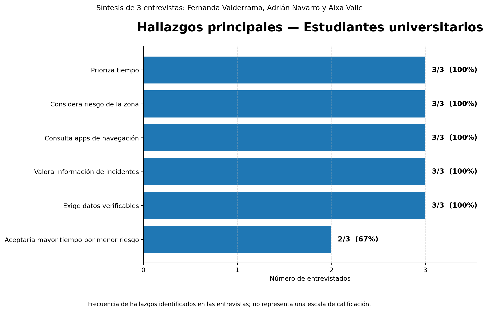
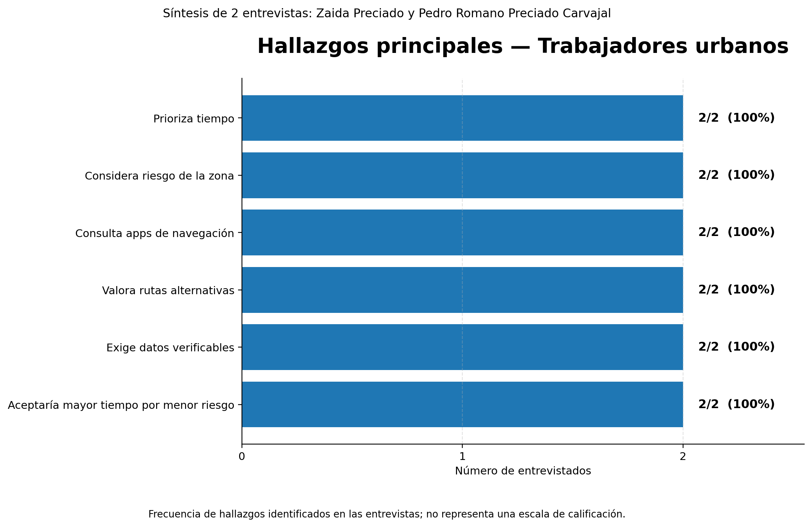

    </img> 
    <strong>Universidad Peruana de Ciencias Aplicadas</strong> 
     
    <strong>Ingeniería de Software</strong>  
    <strong>1ASI0657 Fundamentos de Arquitectura de Software</strong> 
    <strong>202610</strong>
       
    <strong>NRC: 16363</strong>
       
    <strong>Profesor: Marino Humberto Jara Palacios</strong>
      
    <strong>TRABAJO FINAL</strong>
      
    <strong>Nombre del Producto:</strong> VSafe

| Alumno | Código |
|:---:|:---:|
| Gianfranco Jared Durand Vega | u202312614 |
| Stephano Mayrzon Landauri Preciado | u202311828 |
| Oscar Leonardo Espinoza Quijandría | u202311842 |
| Renzo Sebastián Uribe Livia | u202311745 |

## Registro de Versiones del Informe

| Versión | Fecha | Autor(es) | Descripción |
|---------|-------|-----------|-------------|

## Student Outcome

El curso contribuye al cumplimiento del Student Outcome ABET:

**ABET – EAC - Student Outcome 7**

**Aprendizaje Continuo y Autónomo**

**Criterio:** La capacidad de adquirir y aplicar nuevos conocimientos según sea necesario, utilizando estrategias de aprendizaje apropiadas.

En el siguiente cuadro se describen las acciones realizadas y las conclusiones del equipo que sustentan el cumplimiento del **ABET – EAC - Student Outcome 7**.

| Criterio específico | Acciones realizadas | Conclusiones |
|---|---|---|
| **3.c1.** Comunica oralmente sus ideas y/o resultados con objetividad a público de diferentes especialidades y niveles jerárquicos, en el marco del desarrollo de un proyecto en ingeniería de software. | **TB1:** - **Oscar Espinoza:** Desarrollé el capítulo IV completo y preparé la explicación oral de las decisiones arquitectónicas de VSafe. Organicé las ideas sobre ADD, DDD, Clean Architecture y microservicios, apoyándome en los diagramas para explicar las responsabilidades de cada contexto y sus relaciones con un lenguaje comprensible para públicos con distintos conocimientos técnicos. - **Renzo Sebastián Uribe Livia:** Desarrollé todo el capítulo III y preparé la explicación oral de la especificación de requisitos de VSafe. Organicé los To-Be Scenario Maps, las Epics y User Stories con sus criterios de aceptación, el Impact Mapping y el Product Backlog, relacionando las necesidades de los usuarios con los objetivos del negocio mediante un lenguaje comprensible para públicos técnicos y no técnicos. - **Stephano Mayrzon Landauri Preciado:** Desarrollé el capítulo II de VSafe y preparé la explicación oral del proceso de Requirements Elicitation & Analysis. Organicé el análisis competitivo, las entrevistas a los segmentos objetivo y las técnicas de Needfinding, incluyendo User Personas, User Task Matrix, Empathy Mapping y As-Is Scenario Mapping. Asimismo, expliqué el Ubiquitous Language definido para el proyecto, relacionando los hallazgos sobre estudiantes universitarios y trabajadores urbanos con las necesidades que busca abordar VSafe mediante un lenguaje comprensible para públicos técnicos y no técnicos. | **TB1:** La preparación de VSafe permitió integrar los aportes del equipo en una explicación del problema, las necesidades de los usuarios, los requerimientos y la solución propuesta. El uso de ejemplos y diagramas facilita comunicar las decisiones del proyecto a públicos con diferentes especialidades y niveles de responsabilidad, distinguiendo los resultados obtenidos de los aspectos pendientes de validación. |
| **3.c2.** Comunica en forma escrita ideas y/o resultados con objetividad a público de diferentes especialidades y niveles jerárquicos, en el marco del desarrollo de un proyecto de ingeniería de software. | **TB1:** - **Oscar Espinoza:** Elaboré y documenté todo el capítulo IV de VSafe, incluyendo el diseño guiado por atributos de calidad, los drivers y las decisiones arquitectónicas, el EventStorming, el descubrimiento de contextos, los flujos del dominio, los Bounded Context Canvases, el Context Mapping y los diagramas de arquitectura. Expliqué la propuesta de microservicios y la aplicación de Clean Architecture, manteniendo coherencia con los capítulos anteriores y diferenciando las decisiones propuestas de los resultados pendientes de validación. - **Renzo Sebastián Uribe Livia:** Elaboré y documenté todo el capítulo III de VSafe, incluyendo los To-Be Scenario Maps, la definición de Epics, User Stories y Technical Stories con criterios de aceptación, el Impact Mapping y la priorización del Product Backlog. Organicé los requisitos y su trazabilidad con los objetivos del negocio, manteniendo coherencia con la problemática, los segmentos objetivo y las hipótesis definidas en el capítulo I. - **Stephano Mayrzon Landauri Preciado:** Elaboré y documenté el capítulo II de VSafe, correspondiente a Requirements Elicitation & Analysis, incluyendo el análisis de competidores y las estrategias frente a ellos, el diseño y análisis de entrevistas para los segmentos de estudiantes universitarios y trabajadores urbanos, y las técnicas de Needfinding mediante User Personas, User Task Matrix, Empathy Mapping y As-Is Scenario Mapping. Además, definí el Ubiquitous Language del proyecto para mantener una terminología consistente sobre conceptos como rutas, incidentes, reportes y riesgo estimado, manteniendo coherencia con la problemática, los segmentos objetivo y la propuesta de valor definida en el capítulo I. | **TB1:** La documentación de VSafe consolidó los aportes del equipo y estableció una relación entre el análisis del problema, los objetivos, las necesidades de los usuarios, los requerimientos y el diseño de la solución. La organización del informe mediante textos, tablas y diagramas facilita su comprensión y revisión por lectores técnicos y no técnicos, y proporciona una base común para continuar el desarrollo y validar las decisiones propuestas. |

## Contenido

### Tabla de contenidos

- [Student Outcome](#student-outcome)
- [Capítulo I: Introducción](#capítulo-i-introducción)
  - [1.1 Startup Profile](#11-startup-profile)
    - [1.1.1 Descripción de la Startup](#111-descripción-de-la-startup)
    - [1.1.2 Perfiles de integrantes del equipo](#112-perfiles-de-integrantes-del-equipo)
  - [1.2 Solution Profile](#12-solution-profile)
    - [1.2.1 Nombre del producto](#121-nombre-del-producto)
    - [1.2.2 Antecedentes y problemática](#122-antecedentes-y-problemática)
    - [1.2.3 Lean UX Process](#123-lean-ux-process)
      - [1.2.3.1 Lean UX Problem Statements](#1231-lean-ux-problem-statements)
      - [1.2.3.2 Lean UX Assumptions](#1232-lean-ux-assumptions)
      - [1.2.3.3 Lean UX Hypothesis Statements](#1233-lean-ux-hypothesis-statements)
      - [1.2.3.4 Lean UX Canvas](#1234-lean-ux-canvas)
  - [1.3 Segmentos objetivo](#13-segmentos-objetivo)
- [Capítulo II: Requirements Elicitation & Analysis](#capítulo-ii--requirements-elicitation--analysis)
  - [2.1 Competidores](#21-competidores)
    - [2.1.1 Análisis competitivo](#211-análisis-competitivo)
    - [2.1.2 Estrategias y tácticas frente a competidores](#212-estrategias-y-tácticas-frente-a-competidores)
  - [2.2 Entrevistas](#22-entrevistas)
    - [2.2.1 Diseño de entrevistas](#221-diseño-de-entrevistas)
    - [2.2.2 Registro de entrevistas](#222-registro-de-entrevistas)
    - [2.2.3 Análisis de entrevistas](#223-análisis-de-entrevistas)
  - [2.3 Needfinding](#23-needfinding)
    - [2.3.1 User Personas](#231-user-personas)
    - [2.3.2 User Task Matrix](#232-user-task-matrix)
    - [2.3.3 Empathy Mapping](#233-empathy-mapping)
    - [2.3.4 As-is Scenario Mapping](#234-as-is-scenario-mapping)
  - [2.4 Ubiquitous Language](#24-ubiquitous-language)
- [Capítulo III: Requirements Specification](#capítulo-iii-requirements-specification)
  - [3.1 To-Be Scenario Mapping](#31-to-be-scenario-mapping)
  - [3.2 User Stories](#32-user-stories)
  - [3.3 Impact Map](#33-impact-map)
  - [3.4 Product Backlog](#34-product-backlog)
- [Capítulo IV: Product Architecture Design](#capítulo-iv-product-architecture-design)
  - [4.1 Design Concepts, ViewPoints & ER Diagrams](#41-design-concepts-viewpoints--er-diagrams)
    - [4.1.1 Principles Statements](#411-principles-statements)
    - [4.1.2 Approaches Statements Architectural Styles & Patterns](#412-approaches-statements-architectural-styles--patterns)
    - [4.1.3 Context Diagram](#413-context-diagram)
    - [4.1.4 Approach driven ViewPoints Diagrams](#414-approach-driven-viewpoints-diagrams)
    - [4.1.5 Relational/Non Relational Database Diagram](#415-relationalnon-relational-database-diagram)
    - [4.1.6 Design Patterns](#416-design-patterns)
    - [4.1.7 Tactics](#417-tactics)
  - [4.2 Architectural Drivers](#42-architectural-drivers)
    - [4.1.8 Design Purpose](#418-design-purpose)
    - [4.1.9 Primary Functionality (Primary User Stories)](#419-primary-functionality-primary-user-stories)
    - [4.1.10 Quality Attribute Scenarios](#4110-quality-attribute-scenarios)
    - [4.1.11 Constraints](#4111-constraints)
    - [4.1.12 Architectural Concerns](#4112-architectural-concerns)
  - [4.3 ADD Iterations](#43-add-iterations)
- [Capítulo V: Product Implementation, Validation & Deployment](#capítulo-v-product-implementation-validation--deployment)
  - [5.1 Testing Suites & General Patterns](#51-testing-suites--general-patterns)
    - [5.1.1 Backend Application Core Testing Suite](#511-backend-application-core-testing-suite)
    - [5.1.2 Pattern Based Backend Application(s)](#512-pattern-based-backend-applications)
    - [5.1.3 Pattern Based Custom Software Library](#513-pattern-based-custom-software-library)
    - [5.1.4 Framework Pattern Driven Refactoring Report](#514-framework-pattern-driven-refactoring-report)
  - [5.2 Software Configuration Management](#52-software-configuration-management)
    - [5.2.1 Software Development Environment Configuration](#521-software-development-environment-configuration)
    - [5.2.2 Source Code Management](#522-source-code-management)
    - [5.2.3 Source Code Style Guide & Conventions](#523-source-code-style-guide--conventions)
    - [5.2.4 Software Deployment Configuration](#524-software-deployment-configuration)
  - [5.3 Microservices Implementation](#53-microservices-implementation)
    - [Sprint 1](#sprint-1)
    - [Sprint 2](#sprint-2)
    - [Sprint 3](#sprint-3)
    - [Sprint 4](#sprint-4)
  - [5.4 Microservices Deployment](#54-microservices-deployment)
    - [5.3.1 Cloud Architecture Diagram](#531-cloud-architecture-diagram)
    - [5.3.2 Cloud Architecture Deployment](#532-cloud-architecture-deployment)
- [Conclusiones](#conclusiones)
- [Referencias Bibliográficas](#referencias-bibliográficas)
- [Anexos](#anexos)

## Capítulo I: Introducción

### 1.1 Startup Profile

#### 1.1.1 Descripción de la Startup

Vsafe es una startup tecnológica enfocada en mejorar la experiencia de desplazamiento de las personas dentro de la ciudad mediante una plataforma de navegación urbana inteligente. Nuestra solución utiliza inteligencia artificial, geolocalización y reportes de incidentes para recomendar rutas considerando no solo aspectos como el tiempo y la distancia, sino también el nivel de riesgo estimado de las zonas por las que transita el usuario. A través de la plataforma, los usuarios podrán ingresar un punto de origen y destino para visualizar diferentes alternativas de recorrido, conocer incidentes reportados cerca de su ubicación y recibir alertas sobre situaciones que puedan afectar su desplazamiento. Asimismo, podrán contribuir con la comunidad registrando incidentes relacionados con robos, asaltos u otras situaciones que puedan representar un riesgo para las personas que transitan por determinadas zonas. Nuestra startup busca complementar los sistemas tradicionales de navegación incorporando la seguridad como un criterio adicional para la elección de una ruta. De esta manera, los usuarios podrán contar con mayor información antes y durante sus desplazamientos y elegir el recorrido que mejor se adapte a sus necesidades.

### Misión

Facilitar el desplazamiento urbano de las personas mediante una solución tecnológica que combine inteligencia artificial, geolocalización y reportes de incidentes para recomendar rutas rápidas y con un menor nivel de riesgo estimado.

### Visión

Convertirse en una plataforma de navegación urbana reconocida por incorporar la seguridad como un factor importante dentro de la planificación de rutas, contribuyendo a que las personas puedan movilizarse de manera más informada por la ciudad.

### Valores

Nuestros valores se basan en la innovación, utilizando nuevas tecnologías para mejorar la experiencia de navegación urbana; la seguridad, priorizando información que permita a los usuarios tomar mejores decisiones durante sus recorridos; la colaboración, fomentando la participación de la comunidad mediante el reporte de incidentes; la accesibilidad, desarrollando una plataforma sencilla y fácil de utilizar; y la responsabilidad, gestionando adecuadamente la información y ubicación de los usuarios.

### Objetivo General

Desarrollar una plataforma de navegación urbana inteligente que permita a los usuarios encontrar rutas rápidas y con menor nivel de riesgo estimado mediante el uso de inteligencia artificial, geolocalización y reportes de incidentes.

#### 1.1.2 Perfiles de integrantes del equipo

| Foto | Nombre completo | Código | Carrera | Habilidades técnicas y rol |
|---|---|---|---|---|
|  | Gianfranco Jared Durand Vega | U202312614 | Ingeniería de Software | Desarrollo Frontend (Vue/React), UI/UX, Integración de servicios externos |
|  | Oscar Leonardo Espinoza Quijandria | U202311842 | Ingeniería de Software | Desarrollo de software, análisis de requerimientos, diseño de arquitectura y documentación técnica. Colaboración en equipo para proponer soluciones y organizar el desarrollo del proyecto. |
|  | Renzo Sebastián Uribe Livia | U202311745 | Ingeniería de Software | Análisis y especificación de requisitos, elaboración de User Stories y criterios de aceptación, Impact Mapping, Product Backlog y documentación técnica. |
|  | Stephano Mayrzon Landauri Preciado | U202311828 | Ingeniería de Software | Análisis de requerimientos, investigación de usuarios y documentación técnica para soluciones de software. Experiencia en Needfinding, User Personas, User Stories, Ubiquitous Language y análisis competitivo, colaborando en equipo para definir funcionalidades y organizar el desarrollo de proyectos. |

### 1.2 Solution Profile

#### 1.2.1 Nombre del producto

**Vsafe** es una plataforma tecnológica enfocada en mejorar la experiencia de desplazamiento de las personas dentro de la ciudad mediante navegación urbana inteligente. La solución utiliza inteligencia artificial, geolocalización y reportes de incidentes para recomendar rutas considerando no solo factores como el tiempo y la distancia, sino también el nivel de riesgo estimado de las zonas por las que transita el usuario. A través de la plataforma, los usuarios podrán ingresar un punto de origen y destino, visualizar diferentes alternativas de recorrido, conocer incidentes reportados cerca de su ubicación y recibir alertas sobre situaciones que puedan afectar su desplazamiento. Asimismo, podrán contribuir con la comunidad registrando incidentes relacionados con robos, asaltos u otras situaciones de riesgo, permitiendo que Vsafe complemente los sistemas tradicionales de navegación al incorporar la seguridad como un criterio adicional para elegir una ruta.

### 1.2.2. Antecedentes y problemática

La inseguridad ciudadana representa una preocupación importante para las personas que se desplazan diariamente dentro de los espacios urbanos. Según el Instituto Nacional de Estadística e Informática (INEI, 2026), durante el año 2025 el **84.4 % de la población urbana de 15 años a más consideraba que podía ser víctima de algún hecho delictivo durante los siguientes doce meses**, mientras que en Lima Metropolitana esta percepción alcanzó el **85.5 %**; además, el **62.9 % de la población de Lima Metropolitana manifestó sentirse insegura al caminar sola durante la noche por su zona o barrio**, evidenciando que la seguridad puede influir en las decisiones relacionadas con los desplazamientos cotidianos. En este contexto, las herramientas de navegación suelen centrarse principalmente en factores como la distancia, el tiempo y el tráfico, a pesar de que diferentes investigaciones han demostrado que es posible incorporar datos relacionados con criminalidad e incidentes para calcular rutas considerando también niveles de riesgo (Galbrun et al., 2016; Mata et al., 2016). Asimismo, Sohrabi et al. (2022) señalan que la búsqueda de rutas con criterios de seguridad requiere considerar diferentes fuentes de información, métodos para estimar riesgos y el equilibrio entre la rapidez y la seguridad del recorrido. Frente a esta problemática, se propone **Vsafe**, una plataforma que utiliza inteligencia artificial, geolocalización y reportes de incidentes para estimar el nivel de riesgo de diferentes recorridos y ofrecer a los usuarios alternativas que les permitan desplazarse de manera más informada.

#### Análisis 5W + 2H

| Elemento | Descripción |
| --- | --- |
| **What? (¿Qué?)** | Dificultad de las personas para conocer y considerar el nivel de riesgo de determinadas zonas al momento de seleccionar una ruta para desplazarse por la ciudad. |
| **Why? (¿Por qué?)** | Porque los sistemas de navegación suelen priorizar factores como el tiempo y la distancia, mientras que la información relacionada con incidentes o niveles de riesgo no siempre se encuentra integrada dentro del proceso de selección de una ruta (Galbrun et al., 2016). |
| **Who? (¿Quién?)** | Personas que se desplazan diariamente por la ciudad, especialmente estudiantes, trabajadores, peatones y usuarios que deben transitar por zonas que desconocen. |
| **Where? (¿Dónde?)** | En entornos urbanos, principalmente en ciudades que presentan altos niveles de percepción de inseguridad, como Lima Metropolitana (INEI, 2026). |
| **When? (¿Cuándo?)** | Durante los desplazamientos cotidianos, especialmente cuando una persona se moviliza por lugares desconocidos, durante la noche o cuando debe elegir entre diferentes recorridos para llegar a un destino. |
| **How? (¿Cómo?)** | Los usuarios seleccionan sus recorridos principalmente a partir de información relacionada con distancia, tiempo o tráfico, sin disponer necesariamente de información integrada sobre incidentes ocurridos en las zonas por las que transitarán. |
| **How much? (¿Cuánto?)** | En 2025, el 84.4 % de la población urbana del Perú consideraba que podía ser víctima de un hecho delictivo durante los siguientes doce meses, mientras que en Lima Metropolitana esta cifra alcanzó el 85.5 % (INEI, 2026). |

### 1.2.3. Lean UX Process

#### 1.2.3.1. Lean UX Problem Statements

Las personas que se desplazan diariamente por la ciudad pueden presentar dificultades para identificar qué recorridos poseen un menor nivel de riesgo, debido a que las herramientas tradicionales de navegación se enfocan principalmente en factores como el tiempo, la distancia y el tráfico, mientras que la información relacionada con incidentes de seguridad no siempre se encuentra integrada durante la planificación del recorrido. Investigaciones relacionadas con navegación urbana han demostrado que los datos sobre criminalidad pueden incorporarse a modelos de rutas para comparar recorridos según distancia y riesgo, mientras que la combinación de información oficial y datos proporcionados por ciudadanos puede contribuir a mejorar este tipo de sistemas. Por ello, Vsafe busca integrar geolocalización, reportes de incidentes e inteligencia artificial para ofrecer diferentes alternativas de navegación y permitir que el usuario tome una decisión considerando tanto la rapidez como el nivel de riesgo estimado del recorrido.

> **¿Cómo podríamos facilitar el desplazamiento de las personas por la ciudad, permitiéndoles encontrar rutas rápidas y con menor nivel de riesgo mediante información actualizada sobre los incidentes ocurridos en su entorno?**

#### 1.2.3.2. Lean UX Assumptions

##### Business Assumptions

- Creemos que los usuarios necesitan una herramienta de navegación que considere el nivel de riesgo además del tiempo y la distancia al momento de recomendar una ruta.
- Creemos que integrar inteligencia artificial, geolocalización y reportes de incidentes permitirá ofrecer alternativas de recorrido más útiles para los usuarios.
- Creemos que los usuarios valorarán poder visualizar información sobre incidentes antes de iniciar un desplazamiento.
- Creemos que la participación de los usuarios mediante reportes puede contribuir a mantener actualizada la información disponible en la plataforma.
- Creemos que una plataforma disponible desde dispositivos móviles facilitará el acceso a la información durante los desplazamientos cotidianos.

##### User Assumptions

- Creemos que los usuarios sienten preocupación al desplazarse por zonas que desconocen o consideran poco seguras.
- Creemos que los usuarios desean conocer el nivel de riesgo estimado de una ruta antes de iniciar su recorrido.
- Creemos que los usuarios estarían dispuestos a elegir una ruta ligeramente más larga si esta presenta un menor nivel de riesgo estimado.
- Creemos que los usuarios consideran importante recibir alertas sobre incidentes cercanos que puedan afectar su recorrido.
- Creemos que algunos usuarios estarían dispuestos a reportar incidentes para contribuir con información útil para otros miembros de la comunidad.
- Creemos que los usuarios utilizarían una plataforma de navegación enfocada en la seguridad si esta resulta sencilla, rápida y confiable.

#### 1.2.3.3. Lean UX Hypothesis Statements

1. Creemos que mostrar diferentes alternativas de ruta acompañadas de un nivel de riesgo estimado permitirá que los usuarios tomen decisiones más informadas antes de iniciar un desplazamiento.
2. Creemos que integrar reportes de incidentes dentro del mapa ayudará a los usuarios a identificar zonas que podrían representar un mayor riesgo durante su recorrido.
3. Creemos que utilizar inteligencia artificial para analizar datos de ubicación e incidentes permitirá ofrecer recomendaciones de rutas más adecuadas a las necesidades de los usuarios.
4. Creemos que enviar alertas cuando se detecten incidentes relevantes cerca de la ruta seleccionada ayudará a los usuarios a conocer posibles riesgos y evaluar recorridos alternativos.
5. Creemos que permitir que los usuarios reporten incidentes de manera sencilla contribuirá a incrementar la información disponible y mantener actualizados los niveles de riesgo estimados de las diferentes zonas.
6. Creemos que ofrecer una plataforma sencilla, accesible y organizada aumentará la disposición de las personas a utilizar Vsafe como complemento de sus herramientas habituales de navegación.

#### 1.2.3.4. Lean UX Canvas

| Sección | Contenido |
|---|---|
| **1. Business Problem** | • Los usuarios no cuentan con información integrada sobre el nivel de riesgo de las rutas que utilizan. • Las aplicaciones de navegación suelen priorizar tiempo, distancia y tráfico, sin considerar suficientemente la seguridad del recorrido. • Existe dificultad para conocer incidentes recientes ocurridos en determinadas zonas de la ciudad. • Los usuarios pueden desplazarse por zonas desconocidas sin información suficiente sobre posibles riesgos. • La información relacionada con incidentes urbanos se encuentra distribuida en diferentes fuentes y no siempre está disponible durante el recorrido. |
| **2. Business Outcomes** | • Incrementar la cantidad de usuarios que utilizan Vsafe para planificar sus desplazamientos. • Aumentar la cantidad de rutas consultadas dentro de la plataforma. • Incrementar la cantidad de reportes de incidentes realizados por los usuarios. • Lograr que los usuarios consulten el nivel de riesgo antes de seleccionar una ruta. • Incrementar el uso recurrente de la plataforma. • Mejorar progresivamente la precisión de las recomendaciones mediante la información recopilada. |
| **3. Users and Customers** | • Estudiantes que se desplazan diariamente hacia universidades o institutos. • Trabajadores que realizan recorridos frecuentes dentro de la ciudad. • Peatones que se movilizan por zonas que no conocen. • Personas que realizan desplazamientos durante horarios nocturnos. • Usuarios de transporte público que necesitan caminar hasta paraderos o estaciones. • Personas que visitan zonas desconocidas y necesitan orientación sobre sus recorridos. |
| **4. User Benefits** | • Conocer el nivel de riesgo estimado de una ruta antes de iniciar el recorrido. • Identificar incidentes reportados cerca de su ubicación o destino. • Comparar rutas considerando tiempo, distancia y nivel de riesgo. • Recibir alertas sobre incidentes relevantes durante el desplazamiento. • Tomar decisiones más informadas al desplazarse por zonas desconocidas. • Tener mayor control sobre la planificación de sus recorridos. • Contribuir con otros usuarios mediante el reporte de incidentes. |
| **5. Solution Ideas** | • Mapa interactivo con visualización de rutas y zonas de riesgo. • Sistema de recomendación de rutas mediante inteligencia artificial. • Clasificación del nivel de riesgo de las rutas mediante indicadores visuales. • Sistema de reportes de robos, asaltos y otros incidentes urbanos. • Geolocalización en tiempo real del usuario. • Alertas sobre incidentes cercanos al recorrido seleccionado. • Comparación entre la ruta más rápida y una ruta con menor nivel de riesgo estimado. • Historial de rutas realizadas y consultadas. • Sistema de validación de reportes realizados por la comunidad. |
| **6. Hypotheses** | • Creemos que mostrar el nivel de riesgo estimado de diferentes rutas permitirá a los usuarios tomar decisiones más informadas sobre sus recorridos. • Creemos que integrar reportes de incidentes dentro del mapa ayudará a los usuarios a identificar zonas que podrían representar un mayor riesgo. • Creemos que los usuarios estarán dispuestos a elegir una ruta ligeramente más larga si presenta un menor nivel de riesgo estimado. • Creemos que enviar alertas sobre incidentes cercanos permitirá a los usuarios evaluar rutas alternativas durante su desplazamiento. • Creemos que permitir reportar incidentes de manera sencilla aumentará la información disponible dentro de la plataforma. • Creemos que utilizar inteligencia artificial para analizar información de ubicación e incidentes permitirá mejorar las recomendaciones de rutas. • Creemos que una plataforma sencilla y rápida aumentará la intención de los usuarios de utilizar Vsafe de manera recurrente. |
| **7. What's the most important thing we need to learn first?** | • Validar si los usuarios consideran importante conocer el nivel de riesgo antes de seleccionar una ruta. • Identificar qué factores utilizan actualmente los usuarios para decidir por dónde desplazarse. • Determinar si los usuarios estarían dispuestos a utilizar una ruta más larga a cambio de un menor nivel de riesgo estimado. • Conocer qué tipos de incidentes consideran más relevantes para evaluar una ruta. • Identificar si los usuarios estarían dispuestos a reportar incidentes dentro de la plataforma. • Determinar qué información necesitan visualizar para confiar en una recomendación de Vsafe. • Validar qué tipo de alertas consideran útiles durante sus desplazamientos. |
| **8. What's the least amount of work we need to do to learn the next most important thing?** | • Realizar entrevistas a potenciales usuarios de Vsafe. • Aplicar encuestas para conocer hábitos de navegación y percepción de seguridad. • Crear un prototipo de baja fidelidad de la plataforma. • Realizar pruebas de usabilidad con usuarios potenciales. • Diseñar un mapa simulado que muestre rutas con diferentes niveles de riesgo. • Probar diferentes formas de representar visualmente el nivel de riesgo. • Crear una landing page para evaluar el interés de los usuarios en la propuesta. • Desarrollar un MVP con las funcionalidades principales de búsqueda de rutas, visualización de incidentes y reporte de eventos. |

# Capítulo II : Requirements Elicitation & Analysis

## 2.1. Competidores

El análisis competitivo permite identificar plataformas relacionadas con la navegación, movilidad y seguridad urbana que poseen características similares o complementarias a VSafe. Para este análisis se consideran Google Maps, Waze, My Safetipin y Citizen, debido a que presentan funcionalidades relacionadas con la planificación de rutas, información de tráfico, reportes colaborativos, alertas de incidentes o evaluación de condiciones de seguridad urbana.

El análisis de estas plataformas permite reconocer sus principales fortalezas y debilidades, así como identificar oportunidades de diferenciación para VSafe. La propuesta de VSafe se enfoca en integrar la planificación de recorridos con información relacionada con el nivel de riesgo estimado, permitiendo que los usuarios comparen alternativas considerando principalmente tiempo, distancia e información sobre incidentes relevantes.

### 2.1.1. Análisis competitivo

| Sección | Subcategoría | VSafe | Google Maps | Waze | My Safetipin | Citizen App |
|---|---|---|---|---|---|---|
| **Perfil** | **Overview** | Plataforma de navegación urbana inteligente que compara rutas según tiempo, distancia y nivel de riesgo estimado mediante geolocalización, información de incidentes e inteligencia artificial. | Plataforma de mapas y navegación que permite buscar lugares, obtener indicaciones, visualizar rutas alternativas y consultar tráfico en tiempo real. | Aplicación de navegación colaborativa orientada principalmente a conductores, utilizando información de tráfico y reportes de su comunidad. | Plataforma enfocada en seguridad urbana que analiza información de espacios públicos para apoyar decisiones sobre desplazamientos. | Aplicación de seguridad pública que proporciona alertas e información sobre incidentes cercanos a la ubicación del usuario. |
| **Ventaja competitiva** | **¿Qué valor ofrece a los clientes?** | Integra la comparación de tiempo, distancia y riesgo estimado, acompañada de información sobre incidentes relevantes asociados al recorrido. | Amplia infraestructura cartográfica, navegación multimodal e información de tráfico en tiempo real. | Información colaborativa sobre tráfico, accidentes y condiciones de las vías que permite adaptar los recorridos. | Utiliza un Safety Score para evaluar aspectos relacionados con seguridad urbana y dispone de funcionalidades orientadas a recorridos. | Permite conocer incidentes cercanos mediante alertas basadas en ubicación e información contextual. |
| **Perfil de Marketing** | **Mercado objetivo** | Estudiantes universitarios y trabajadores urbanos que realizan desplazamientos frecuentes, especialmente por zonas desconocidas o en determinados horarios. | Público general que necesita mapas, navegación, búsqueda de lugares y planificación de desplazamientos. | Principalmente conductores que desean optimizar sus desplazamientos considerando las condiciones del tráfico. | Personas interesadas en conocer información relacionada con la seguridad de espacios urbanos durante sus desplazamientos. | Personas interesadas en conocer incidentes relacionados con seguridad que ocurren cerca de su ubicación. |
| | **Estrategias de marketing** | Posicionamiento como plataforma de movilidad urbana inteligente enfocada en decisiones informadas sobre rapidez y riesgo, inicialmente dirigida a estudiantes y trabajadores de Lima. | Integración con el ecosistema de Google y disponibilidad en múltiples plataformas y dispositivos. | Posicionamiento basado en navegación colaborativa y participación de una comunidad de conductores. | Posicionamiento basado en seguridad urbana, análisis de espacios públicos y utilización de datos. | Posicionamiento como plataforma de información y alertas en tiempo real relacionadas con seguridad pública. |
| **Perfil de Producto** | **Productos & Servicios** | Búsqueda de rutas, comparación de tiempo, distancia y riesgo estimado, visualización de incidentes, reportes comunitarios, alertas y recálculo de recorridos. | Mapas, navegación, rutas alternativas, tráfico en tiempo real, transporte público, búsqueda de lugares e información sobre incidentes viales. | Navegación, planificación de viajes, tráfico, alertas viales, reportes comunitarios y redireccionamiento. | Safety Score, mapas de seguridad, análisis de espacios urbanos y funcionalidades relacionadas con recorridos. | Alertas de incidentes cercanos, búsqueda de incidentes, actualizaciones e información contextual. |
| | **Precios & Costos** | El MVP tendrá inicialmente acceso gratuito para facilitar la validación de la propuesta. El modelo de monetización será evaluado posteriormente. | Uso general gratuito para el usuario final. | Uso gratuito para el usuario final. | Aplicación disponible gratuitamente para usuarios y servicios especializados para organizaciones y ciudades. | Funcionalidades principales gratuitas y servicios adicionales mediante Citizen Premium. |
| | **Canales de distribución (Web/Móvil)** | Landing Page, aplicación web y aplicación móvil según el alcance de VSafe. | Web, Android e iOS, además de integraciones con diferentes dispositivos y vehículos. | Android, iOS y servicios web relacionados con mapas y planificación de viajes. | Aplicaciones móviles y plataformas web pertenecientes al ecosistema Safetipin. | Principalmente aplicaciones móviles para Android e iOS y plataforma web informativa. |
| **Análisis SWOT** | **Fortalezas** | Integración de navegación, riesgo estimado, incidentes y participación comunitaria, con adaptación inicial al contexto urbano de Lima. | Amplia cobertura cartográfica, navegación multimodal, tráfico en tiempo real y ecosistema tecnológico consolidado. | Comunidad colaborativa, información vial en tiempo real y capacidad de adaptar los recorridos. | Especialización en seguridad urbana, Safety Score y experiencia analizando espacios urbanos. | Especialización en información sobre incidentes y alertas basadas en ubicación. |
| | **Debilidades** | Producto nuevo sin una comunidad inicial amplia. La calidad de las estimaciones dependerá de la disponibilidad, actualidad y confiabilidad de los datos. | No está específicamente enfocado en comparar rutas mediante un indicador explícito de riesgo de seguridad ciudadana. | Su enfoque principal está en tráfico y condiciones viales y no específicamente en estimar el riesgo de seguridad ciudadana de una ruta. | Sus funcionalidades dependen de la disponibilidad y cobertura de información existente en cada ciudad. | Su función principal es informar sobre incidentes y no proporcionar una experiencia completa de navegación entre origen y destino. |
| | **Oportunidades** | Aprovechar datos abiertos, IA, geolocalización y participación comunitaria para desarrollar estimaciones adaptadas a Lima y establecer alianzas con universidades y organizaciones. | Incorporar nuevas fuentes de información contextual y ampliar funcionalidades relacionadas con movilidad urbana. | Incorporar nuevos tipos de información colaborativa relevante durante los desplazamientos. | Expandir su metodología y cobertura hacia nuevas ciudades y proyectos de seguridad urbana. | Ampliar su cobertura geográfica e incorporar nuevas fuentes de información sobre incidentes. |
| | **Amenazas** | Competencia de plataformas consolidadas, disponibilidad limitada de datos, reportes falsos, privacidad de ubicación y responsabilidad asociada a las estimaciones de riesgo. | Competencia de otras plataformas y preocupaciones relacionadas con privacidad y datos de ubicación. | Dependencia de la participación de su comunidad y competencia de otras plataformas de navegación. | Competencia de plataformas de navegación que incorporen características similares y necesidad de mantener información actualizada. | Problemas relacionados con moderación, confiabilidad de información, privacidad, cobertura y competencia de plataformas de navegación. |

### 2.1.2. Estrategias y tácticas frente a competidores

A partir del análisis competitivo realizado, se desarrolla una matriz FODA y C.A.M.E. para establecer las estrategias que VSafe puede aplicar frente a sus competidores. La matriz relaciona las fortalezas y debilidades internas de VSafe con las oportunidades y amenazas del entorno.

<table>
  <thead>
    <tr>
      <th>MATRIZ FODA y C.A.M.E.</th>
      <th>Oportunidades: Crecimiento de soluciones de movilidad inteligente, disponibilidad de datos abiertos y mayor interés por información de seguridad urbana.</th>
      <th>Amenazas: Competidores consolidados, calidad de los datos, privacidad de ubicación y aparición de funcionalidades similares.</th>
    </tr>
  </thead>
  <tbody>
    <tr>
      <td>
        <strong>Fortalezas:</strong> 
        Integración de navegación, riesgo estimado, información de incidentes, inteligencia artificial y participación comunitaria, con un enfoque inicial adaptado al contexto urbano de Lima.
      </td>
      <td>
        <strong>Estrategia Ofensiva (F + O):</strong> 
        Aprovechar la integración de navegación, IA e información de incidentes para desarrollar una solución especializada en movilidad urbana. El enfoque inicial en Lima permitirá adaptar progresivamente el análisis de riesgo a las características del mercado local y diferenciar la propuesta frente a plataformas de navegación generalistas.
      </td>
      <td>
        <strong>Estrategia Defensiva (F + A):</strong> 
        Diferenciar VSafe frente a Google Maps, Waze y otras plataformas consolidadas mediante la comparación de tiempo, distancia y riesgo estimado. La presentación de información contextual sobre los incidentes permitirá fortalecer la transparencia de las estimaciones.
      </td>
    </tr>
    <tr>
      <td>
        <strong>Debilidades:</strong> 
        Bajo reconocimiento de marca, ausencia de una comunidad inicial, cantidad limitada de reportes propios y dependencia de la disponibilidad, actualidad y confiabilidad de los datos.
      </td>
      <td>
        <strong>Estrategia de Reorientación (D + O):</strong> 
        Aprovechar la disponibilidad de datos abiertos para reducir la dependencia inicial de reportes propios. Además, establecer alianzas con universidades, municipalidades y otras organizaciones para facilitar la obtención de información, incrementar la adopción inicial y desarrollar la comunidad de VSafe.
      </td>
      <td>
        <strong>Estrategia de Supervivencia (D + A):</strong> 
        Concentrar inicialmente VSafe en estudiantes y trabajadores urbanos de Lima. Implementar mecanismos de validación de reportes, protección de datos de ubicación y transparencia en las estimaciones para fortalecer progresivamente la confianza de los usuarios.
      </td>
    </tr>
  </tbody>
</table>

## 2.2. Entrevistas

### 2.2.1. Diseño de entrevistas

Para cada segmento se elaboró un conjunto de diez preguntas. Las entrevistas buscan explorar experiencias reales relacionadas con la planificación de recorridos, uso de aplicaciones de navegación, percepción de riesgo, desplazamientos por zonas desconocidas, horarios de viaje y acceso a información sobre incidentes.

#### Segmento 1: Estudiantes universitarios

**Objetivo de la entrevista:** Comprender cómo los estudiantes universitarios planifican sus desplazamientos hacia y desde la universidad, qué factores consideran al seleccionar una ruta y qué dificultades experimentan cuando transitan por zonas que desconocen o consideran de mayor riesgo.

1. ¿Cómo sueles desplazarte desde tu casa hacia la universidad y de regreso?
2. ¿Qué aplicaciones o herramientas utilizas normalmente para planificar tus recorridos y por qué las utilizas?
3. ¿Qué factores consideras más importantes al momento de elegir una ruta hacia la universidad?
4. ¿Alguna vez has cambiado o evitado una ruta porque considerabas que una zona podía ser peligrosa? ¿Qué ocurrió?
5. Cuando tienes que desplazarte por una zona que no conoces, ¿qué haces para decidir por dónde ir?
6. ¿Tu manera de elegir una ruta cambia cuando te desplazas de noche? ¿De qué manera?
7. ¿Cómo obtienes actualmente información sobre zonas que consideras peligrosas o sobre incidentes ocurridos durante tus recorridos?
8. Si tuvieras dos rutas hacia el mismo destino, una más rápida y otra un poco más larga pero con información que indique un menor nivel de riesgo, ¿qué aspectos considerarías para elegir entre ellas?
9. ¿Qué tipo de información sobre un recorrido te ayudaría a sentirte mejor informado antes de iniciar el viaje?
10. ¿Qué necesitarías conocer sobre una aplicación que estima el nivel de riesgo de diferentes rutas para confiar en la información que presenta?

#### Segmento 2: Trabajadores urbanos

**Objetivo de la entrevista:** Comprender cómo los trabajadores urbanos planifican sus desplazamientos laborales, especialmente cuando deben movilizarse hacia lugares desconocidos o durante horarios nocturnos, e identificar los principales factores que influyen en la elección y modificación de sus recorridos.

1. ¿Cómo sueles desplazarte durante un día normal de trabajo?
2. ¿Con qué frecuencia necesitas trasladarte hacia lugares o zonas que no conoces bien por motivos laborales?
3. ¿Qué aplicaciones o herramientas utilizas para planificar tus desplazamientos y qué información consultas en ellas?
4. ¿Qué factores consideras más importantes cuando tienes que elegir una ruta para llegar a un destino de trabajo?
5. ¿Puedes contarme alguna situación en la que hayas decidido cambiar de ruta debido a que una zona te generaba preocupación o inseguridad?
6. Cuando debes dirigirte hacia un lugar que no conoces, ¿cómo investigas previamente la zona o el recorrido que vas a realizar?
7. ¿Tu forma de seleccionar una ruta cambia cuando debes desplazarte en horarios nocturnos? ¿Por qué?
8. ¿Qué haces actualmente si durante tu recorrido te enteras de que ocurrió un incidente cerca de la ruta que estás utilizando?
9. ¿En qué circunstancias estarías dispuesto a utilizar una ruta que tome más tiempo si cuentas con información que indique un menor nivel de riesgo?
10. ¿Qué información necesitarías para confiar en una aplicación que compara rutas utilizando tiempo, distancia e información sobre el nivel de riesgo estimado?

### 2.2.2. Registro de entrevistas

#### Segmento 1: Estudiantes universitarios

##### Entrevista 1

| Campo | Información |
| --- | --- |
| **Nombre** | Fernanda Valderrama |
| **Edad** | 20 años |
| **Ocupación** | Estudiante universitaria |
| **Duración** | 00:00 - 04:23 |
| **Resumen** | Fernanda Valderrama, de 20 años, se desplaza hacia la universidad en auto propio y utiliza principalmente Google Maps porque le permite visualizar diferentes rutas y considera acertadas sus estimaciones de tiempo. Al elegir un recorrido, sus prioridades cambian según el horario: durante el día prioriza el tiempo de llegada, mientras que durante la noche presta mayor atención a las zonas por las que transitará. Indicó que ha optado por recorridos más largos para evitar lugares que considera peligrosos y que, cuando se encuentra en zonas desconocidas, prefiere utilizar avenidas o carreteras en lugar de calles pequeñas. Durante la noche busca transitar por lugares conocidos, concurridos e iluminados. Actualmente, la información que utiliza sobre determinadas zonas proviene principalmente de su conocimiento previo, por lo que reconoce que no dispone de información actualizada ni en tiempo real. Ante dos alternativas, afirmó que elegiría una ruta más larga si conoce que la opción más rápida presenta mayor presencia de delincuencia o robos. Considera importante conocer la seguridad de las zonas, el tiempo estimado de llegada y el estado actual del tráfico antes de iniciar un recorrido. Para confiar en una estimación de riesgo, considera relevante que esta se encuentre respaldada por información como casos registrados de robos, noticias e incidentes ocurridos en la zona. |

  

##### Entrevista 2

| Campo | Información |
| --- | --- |
| **Nombre** | Adrián Navarro |
| **Edad** | 21 años |
| **Ocupación** | Estudiante de Contabilidad y Administración / Practicante preprofesional |
| **Duración** | 00:00 - 04:29 |
| **Resumen** | Adrián Navarro, de 21 años, suele desplazarse hacia la universidad en transporte público y utiliza taxi cuando necesita reducir el tiempo de viaje, especialmente antes de una evaluación. Para estos viajes utiliza principalmente Cabify y Yango, mientras que emplea Google Maps cuando se desplaza caminando y Moovit para consultar los recorridos del transporte público. Al seleccionar una ruta prioriza principalmente el tiempo y señaló que, incluso ante una alternativa más larga con menor nivel de riesgo, su decisión dependería del destino, aunque mantendría el tiempo como principal criterio. Debido a que conoce las zonas por las que suele movilizarse, generalmente no modifica sus recorridos durante la noche. Sin embargo, cuando debe pasar por lugares que considera peligrosos utiliza Google Maps para observar previamente la zona y Moovit para identificar por dónde circulará el transporte público. Considera útil disponer de información sobre accidentes y sobre el nivel de riesgo de las zonas. Además, señaló que para confiar en información relacionada con la seguridad considera importante conocer los mecanismos de validación utilizados por la plataforma. En el contexto de servicios de taxi, también manifestó preocupación por la confiabilidad de los conductores y mencionó medidas como evaluaciones adicionales y grabación de audio durante el trayecto, destacando que el riesgo percibido durante un desplazamiento no depende únicamente de la ruta. |

  

##### Entrevista 3

| Campo | Información |
| --- | --- |
| **Nombre** | Aixa Valle |
| **Edad** | 21 años |
| **Ocupación** | Estudiante universitaria de Ingeniería de Sistemas de Información |
| **Duración** | 00:00 - 04:10 |
| **Resumen** | Aixa Valle, de 21 años, se desplaza normalmente en auto hacia la universidad y utiliza principalmente Waze para consultar el tráfico, accidentes, calles cerradas y cambios de ruta. Al seleccionar un recorrido considera principalmente el tiempo, el tráfico y qué tan conocida es la ruta, aunque la importancia del riesgo aumenta cuando debe transitar de noche o por lugares desconocidos. Ha evitado rutas sugeridas por Waze que atraviesan calles pequeñas o zonas que no conoce, prefiriendo continuar por avenidas principales aunque esto incremente el tiempo de viaje. Antes de desplazarse por una zona desconocida revisa previamente el recorrido e identifica las principales avenidas utilizando Waze o Google Maps. Durante la noche prioriza avenidas grandes, iluminadas y transitadas. Actualmente obtiene información sobre las zonas mediante familiares, amigos, noticias, redes sociales y alertas de aplicaciones de navegación. Ante dos rutas, estaría dispuesta a utilizar una alternativa con menor nivel de riesgo estimado si la diferencia de tiempo es razonable, especialmente durante la noche. Considera importante conocer robos y accidentes recientes, las partes del recorrido con mayor riesgo, el horario de los incidentes y su frecuencia. Para confiar en una aplicación que estime el riesgo, considera fundamental conocer el origen y la actualidad de los datos, así como entender por qué una zona recibe determinado nivel de riesgo, por ejemplo, mediante denuncias, reportes oficiales o incidentes recientes. |

  

#### Segmento 2: Trabajadores urbanos

##### Entrevista 1

| Campo | Información |
| --- | --- |
| **Nombre** | Zayda Preciado |
| **Edad** | 42 años |
| **Ocupación** | Jefa de Finanzas |
| **Segmento** | Trabajador urbano |
| **Duración** | 00:00 - 06:29 |
| **Resumen** | Zayda Preciado, de 42 años, se desplaza diariamente en auto propio y utiliza principalmente Waze para sus recorridos habituales y Google Maps para viajes de mayor distancia. Al seleccionar una ruta prioriza la rapidez, incluso si implica recorrer más kilómetros; sin embargo, relató una experiencia negativa en la que una aplicación la dirigió por una zona desconocida y que percibió como peligrosa en Chorrillos. Indicó que actualmente no investiga previamente las zonas por las que transitará, sino que revisa principalmente el tiempo y la distancia del recorrido. Considera importante contar con alertas sobre cierres, accidentes y condiciones de las vías, así como conocer si una ruta presenta zonas de mayor riesgo estimado o características como vías no asfaltadas. Señaló que durante la noche estaría dispuesta a utilizar una ruta más larga si cuenta con información que indique un menor nivel de riesgo. También valoró disponer de rutas alternativas, alertas sobre recorridos no habituales, configuración de indicaciones por voz, participación de otros usuarios mediante comentarios y una posible integración con el calendario para recibir recomendaciones sobre cuándo iniciar un desplazamiento según las condiciones del tráfico. |

  

##### Entrevista 2

| Campo | Información |
| --- | --- |
| **Nombre** | Pedro Romano Preciado Carvajal |
| **Edad** | 73 años |
| **Ocupación** | Conductor de taxi |
| **Duración** | 00:00 - 06:03 |
| **Resumen** | Pedro Romano Preciado Carvajal, de 73 años, trabaja como conductor de taxi mediante Uber y se desplaza constantemente hacia diferentes zonas de la ciudad según los destinos solicitados por sus pasajeros. Para planificar sus recorridos utiliza principalmente Waze, donde consulta las rutas y los tiempos estimados de llegada. Su principal criterio al seleccionar una ruta es el tiempo, debido a que este influye directamente en su actividad laboral y sus ganancias. Sin embargo, también relaciona determinadas condiciones del recorrido con el riesgo, señalando que una congestión vehicular puede incrementar su exposición a posibles asaltos al mantener el vehículo detenido. Antes de dirigirse hacia una zona desconocida revisa previamente el recorrido propuesto y, si no está conforme, busca una alternativa. Durante la noche modifica sus prioridades y está dispuesto a utilizar una ruta que tome más tiempo cuando considera que permite evitar zonas de mayor riesgo. Ante accidentes durante el recorrido, reduce la velocidad y conduce con mayor precaución. Asimismo, estaría dispuesto a modificar una ruta previamente establecida cuando exista información que indique un riesgo elevado en la zona. Para confiar en una aplicación que compare tiempo, distancia y riesgo estimado, considera fundamental conocer la procedencia de la información, que esta sea verificable y confiable, y que la estimación del riesgo sea revisada y actualizada constantemente. |

  

### 2.2.3. Análisis de entrevistas

A partir de las entrevistas realizadas a los segmentos objetivo de VSafe, se identificaron patrones relacionados con la elección de rutas, el uso de aplicaciones de navegación, la importancia del tiempo de viaje, la percepción del riesgo y la confiabilidad de la información. Los resultados se analizaron de manera independiente para los segmentos de estudiantes universitarios y trabajadores urbanos.

#### Estudiantes universitarios

Las entrevistas realizadas a Fernanda Valderrama, Adrián Navarro y Aixa Valle muestran que el tiempo de llegada es uno de los principales factores considerados al seleccionar una ruta, aunque la importancia del riesgo varía según el contexto y las preferencias de cada estudiante. Fernanda y Aixa indicaron que durante la noche prestan mayor atención a las zonas por las que transitan y están dispuestas a utilizar recorridos más largos cuando estos presentan un menor nivel de riesgo estimado, mientras que Adrián mantiene el tiempo como su principal criterio de decisión. Los entrevistados utilizan herramientas como Google Maps, Waze, Moovit, Cabify y Yango dependiendo de su medio de transporte y necesidades, pero también recurren a conocimientos previos, familiares, amigos, noticias y redes sociales para obtener información sobre determinadas zonas. Los tres manifestaron interés por conocer incidentes y riesgos asociados al recorrido, así como por disponer de información actualizada y verificable que permita comprender por qué una zona presenta determinado nivel de riesgo. En conjunto, los resultados evidencian que VSafe debe permitir comparar tiempo, distancia y riesgo estimado sin asumir que todos los usuarios priorizarán el mismo factor, proporcionando información transparente para facilitar decisiones más informadas sobre sus recorridos.

  

Los resultados muestran que los tres estudiantes consideran el tiempo al seleccionar sus recorridos, toman en cuenta el riesgo de las zonas, utilizan aplicaciones de navegación, valoran disponer de información sobre incidentes y consideran relevante la confiabilidad de los datos. Sin embargo, solo dos de los tres entrevistados manifestaron una disposición clara a aceptar un mayor tiempo de recorrido a cambio de una ruta con menor nivel de riesgo estimado. Esto demuestra que VSafe debe permitir al usuario comparar diferentes factores y tomar su propia decisión, en lugar de asumir que el menor riesgo será siempre su principal criterio.

#### Trabajadores urbanos

Las entrevistas realizadas a Zayda Preciado y Pedro Romano Preciado Carvajal muestran que el tiempo constituye un factor fundamental en sus desplazamientos laborales, ya que Zayda prioriza los recorridos que le permiten llegar más rápido y Pedro relaciona directamente el tiempo de viaje con su actividad como conductor de taxi y sus ganancias. Ambos utilizan Waze para apoyar sus desplazamientos, mientras que Zayda también emplea Google Maps para recorridos de mayor distancia. A pesar de priorizar el tiempo, los entrevistados modifican sus decisiones cuando identifican zonas o situaciones que consideran de mayor riesgo, especialmente durante la noche o al transitar por lugares desconocidos, y ambos manifestaron disposición a utilizar rutas alternativas de mayor duración para evitar zonas con mayor riesgo estimado. También se identificaron preocupaciones relacionadas con accidentes, congestión vehicular, rutas desconocidas y falta de información previa sobre las condiciones del recorrido. Asimismo, ambos consideran fundamental conocer la procedencia de los datos y que la información utilizada para estimar el riesgo sea verificable, confiable y se mantenga actualizada. Estos hallazgos respaldan que VSafe presente alternativas de recorrido considerando tiempo, distancia, incidentes y riesgo estimado, permitiendo que el usuario evalúe estos factores antes de seleccionar una ruta.

El siguiente gráfico presenta la frecuencia de los principales hallazgos identificados en las entrevistas realizadas hasta el momento a trabajadores urbanos.

  

Los resultados actuales muestran coincidencias entre los trabajadores entrevistados respecto a la importancia del tiempo, la consideración del riesgo de las zonas, el uso de aplicaciones de navegación, la necesidad de rutas alternativas y la confiabilidad de la información. Ambos también manifestaron disposición a aceptar un recorrido de mayor duración cuando este permita evitar una zona que presente un mayor nivel de riesgo estimado.

En conjunto, los resultados de ambos segmentos evidencian que el tiempo continúa siendo un criterio fundamental en la planificación de los desplazamientos, pero no constituye el único factor considerado. El contexto del recorrido, el horario, el conocimiento previo de la zona, los incidentes registrados y el nivel de riesgo estimado pueden modificar la decisión del usuario. Estos hallazgos respaldan el enfoque de VSafe de presentar alternativas que permitan comparar tiempo, distancia y riesgo estimado, proporcionando información transparente para que cada usuario pueda tomar una decisión más informada sobre su recorrido.

## 2.3. Needfinding

### 2.3.1. User Personas

A partir de los segmentos objetivo definidos para VSafe, se plantean dos User Personas que representan a los principales tipos de usuarios de la solución. Estas personas permiten sintetizar sus objetivos, necesidades, motivaciones, frustraciones y comportamiento tecnológico relacionado con sus desplazamientos urbanos.

#### User Persona - Estudiante universitario

Este User Persona representa a estudiantes universitarios que realizan desplazamientos frecuentes entre su hogar, universidad y otros destinos de la ciudad. Su principal necesidad se relaciona con poder evaluar sus recorridos considerando no solo el tiempo y la distancia, sino también información sobre las zonas transitadas, especialmente cuando se movilizan por lugares desconocidos o en horarios nocturnos.

  

#### User Persona - Trabajador urbano

Este User Persona representa a trabajadores que se desplazan frecuentemente por diferentes zonas de la ciudad debido a sus actividades laborales. Sus recorridos pueden involucrar lugares desconocidos y diferentes horarios, por lo que requieren información que les permita comparar alternativas y tomar decisiones más informadas ante posibles incidentes o cambios durante el desplazamiento.

  

### 2.3.2. User Task Matrix

La User Task Matrix permite identificar y comparar las principales actividades que realizan los segmentos objetivo de VSafe durante sus desplazamientos urbanos. Para cada tarea se considera la frecuencia con la que se realiza y su nivel de importancia para cada tipo de usuario. Este análisis permite identificar las actividades que deben recibir mayor prioridad dentro de la solución.

| Tarea del usuario | Estudiante - Frecuencia | Estudiante - Importancia | Trabajador - Frecuencia | Trabajador - Importancia |
| --- | --- | --- | --- | --- |
| Definir origen y destino | Alta | Alta | Alta | Alta |
| Utilizar la ubicación actual como origen | Alta | Alta | Alta | Alta |
| Consultar rutas alternativas | Alta | Alta | Alta | Alta |
| Comparar tiempo y distancia entre rutas | Alta | Alta | Alta | Alta |
| Consultar el riesgo estimado de una ruta | Alta | Alta | Alta | Alta |
| Visualizar incidentes asociados al recorrido | Alta | Alta | Alta | Alta |
| Seleccionar una ruta considerando tiempo, distancia y riesgo estimado | Alta | Alta | Alta | Alta |
| Recibir alertas sobre incidentes durante el recorrido | Media | Alta | Alta | Alta |
| Solicitar una ruta alternativa ante un incidente | Media | Alta | Alta | Alta |
| Reportar un incidente observado | Media | Media | Media | Media |
| Consultar el estado de un reporte | Baja | Media | Baja | Media |
| Consultar recorridos anteriores | Media | Media | Alta | Media |

A partir de la matriz se observa que ambos segmentos comparten como tareas prioritarias la definición del recorrido, la consulta de rutas alternativas y la comparación de tiempo, distancia y riesgo estimado. Estas actividades constituyen el núcleo de la experiencia de VSafe y permiten que los usuarios dispongan de mayor información antes de seleccionar un recorrido.

En el caso del trabajador urbano, las alertas, la solicitud de rutas alternativas y la consulta de recorridos anteriores presentan una mayor frecuencia debido a que sus actividades laborales pueden requerir desplazamientos hacia diferentes zonas de la ciudad. Por otro lado, el estudiante universitario suele realizar recorridos más recurrentes entre su hogar, universidad y otros destinos habituales.

A partir de este análisis, las funcionalidades relacionadas con la planificación de rutas, estimación de riesgo, visualización de incidentes y comparación de alternativas representan actividades de alta prioridad para ambos segmentos y deberán considerarse dentro de las principales funcionalidades de VSafe.

### 2.3.3. Empathy Mapping

El Empathy Mapping permite comprender con mayor profundidad las necesidades, pensamientos, emociones, comportamientos y dificultades de los segmentos objetivo de VSafe. A partir de este análisis se identifican los principales factores que influyen en la manera en que estudiantes universitarios y trabajadores urbanos toman decisiones durante sus desplazamientos.

#### Empathy Mapping - Estudiante universitario

El mapa de empatía del estudiante universitario representa a usuarios que se desplazan frecuentemente entre su hogar, universidad y otros destinos de la ciudad. Este segmento busca llegar puntualmente a sus actividades y contar con información que le permita tomar decisiones más informadas, especialmente cuando debe transitar por zonas desconocidas o en determinados horarios.

Entre sus principales preocupaciones se encuentran la falta de información confiable sobre determinadas zonas, la dificultad para evaluar diferentes recorridos y la incertidumbre que puede generar desplazarse por lugares poco conocidos. Asimismo, suele recurrir a aplicaciones de navegación, recomendaciones de amigos o familiares, noticias y redes sociales para obtener información antes de desplazarse.

  

#### Empathy Mapping - Trabajador urbano

El mapa de empatía del trabajador urbano representa a personas que realizan desplazamientos frecuentes por motivos laborales y que pueden necesitar movilizarse hacia diferentes zonas de la ciudad. Para este segmento resulta importante optimizar el tiempo de traslado y disponer de información suficiente para evaluar las alternativas disponibles.

Sus principales dificultades se relacionan con el tráfico, los cambios inesperados durante el recorrido, la falta de información consolidada sobre incidentes y la incertidumbre al desplazarse hacia lugares poco conocidos. Debido a ello, consulta aplicaciones de navegación, alertas, noticias, recomendaciones y otras fuentes antes o durante sus recorridos.

  

A partir de ambos mapas de empatía se identifica que los dos segmentos comparten la necesidad de acceder a información clara y actualizada antes de seleccionar un recorrido. Sin embargo, mientras el estudiante universitario presenta una mayor preocupación por sus desplazamientos habituales hacia la universidad y el cumplimiento de sus horarios académicos, el trabajador urbano requiere una mayor capacidad de adaptación debido a la variedad de destinos y situaciones que pueden presentarse durante sus actividades laborales.

### 2.3.4. As-is Scenario Mapping

#### As-Is Scenario Mapping - Estudiante universitario

El As-Is Scenario Mapping del estudiante universitario representa la experiencia actual de un estudiante que necesita desplazarse desde su hogar hacia la universidad u otros destinos relacionados con sus actividades académicas. El escenario permite identificar las acciones, pensamientos, emociones y dificultades que experimenta actualmente antes de contar con una solución como VSafe.

| Aspecto | Planificar | Buscar información | Evaluar | Desplazarse | Reaccionar |
| --- | --- | --- | --- | --- | --- |
| **Doing** | Define su destino y calcula a qué hora debe salir. | Consulta aplicaciones de mapas, redes sociales o recomendaciones de conocidos. | Compara rutas principalmente por tiempo y distancia. | Sigue la ruta seleccionada hacia la universidad. | Busca otra alternativa si encuentra un problema durante el recorrido. |
| **Thinking** | “Quiero llegar a tiempo a clases.” | “¿Por qué zona me conviene ir?” | “¿Cuál de estas rutas debería elegir?” | “Espero no encontrar problemas en el camino.” | “¿Por dónde puedo continuar?” |
| **Feeling** | Preocupación | Incertidumbre | Duda | Atención | Estrés |
| **Pain Points** | Debe equilibrar el tiempo disponible con sus preocupaciones sobre determinadas zonas. | La información sobre incidentes se encuentra dispersa entre diferentes fuentes. | No dispone de una comparación integrada entre tiempo, distancia e información sobre incidentes. | Puede encontrarse con situaciones que desconocía antes de iniciar el recorrido. | Debe buscar una alternativa mientras ya se encuentra desplazándose. |
| **Opportunities** | Facilitar la planificación previa del recorrido. | Centralizar información relevante sobre las zonas transitadas. | Facilitar la comparación de diferentes factores antes de seleccionar una ruta. | Proporcionar información contextual durante el recorrido. | Facilitar la evaluación de alternativas ante cambios o incidentes. |

#### As-Is Scenario Mapping - Trabajador urbano

El As-Is Scenario Mapping del trabajador urbano representa la experiencia actual de una persona que necesita desplazarse hacia diferentes destinos por motivos laborales, incluyendo lugares que conoce poco o recorridos realizados en determinados horarios. El escenario permite identificar las dificultades que enfrenta al planificar, seleccionar y modificar sus recorridos.

| Aspecto | Buscar destino | Investigar | Seleccionar | Desplazarse | Adaptarse |
| --- | --- | --- | --- | --- | --- |
| **Doing** | Busca la ubicación de su destino laboral. | Consulta mapas, tráfico, noticias y referencias disponibles sobre la zona. | Selecciona una ruta considerando principalmente tiempo y distancia. | Sigue las indicaciones proporcionadas por su aplicación de navegación. | Busca otra ruta cuando encuentra tráfico, incidentes u otros inconvenientes. |
| **Thinking** | “Necesito llegar puntual.” | “No conozco bien esta zona.” | “¿Cuál de estas rutas me conviene más?” | “¿Habrá algún problema más adelante?” | “Necesito encontrar otra ruta rápidamente.” |
| **Feeling** | Presión | Incertidumbre | Duda | Precaución | Estrés |
| **Pain Points** | Puede disponer de poco tiempo para planificar el desplazamiento. | Debe consultar distintas fuentes para conocer las condiciones de una zona. | No cuenta con información consolidada para evaluar el recorrido desde diferentes criterios. | Los cambios inesperados pueden afectar su tiempo de llegada. | Debe tomar una nueva decisión mientras se encuentra en movimiento. |
| **Opportunities** | Simplificar la planificación de desplazamientos laborales. | Consolidar información relevante sobre las zonas y recorridos. | Facilitar la comparación de alternativas utilizando información contextual. | Proporcionar información oportuna durante el desplazamiento. | Facilitar la búsqueda de alternativas ante situaciones inesperadas. |

## 2.4. Ubiquitous Language

El Ubiquitous Language de VSafe establece un vocabulario común para describir los principales conceptos del dominio de la solución. Su propósito es mantener una terminología consistente entre el equipo de desarrollo, los stakeholders, la documentación, los modelos de dominio y la implementación del software, reduciendo ambigüedades durante el desarrollo del proyecto.

| Término | Definición |
| --- | --- |
| **Usuario (User)** | Persona registrada o que utiliza VSafe para consultar información y planificar sus desplazamientos. |
| **Origen (Origin)** | Punto desde el cual el usuario desea iniciar un recorrido. Puede ser ingresado manualmente o determinado mediante su ubicación actual. |
| **Destino (Destination)** | Punto al cual el usuario desea llegar mediante un recorrido. |
| **Ubicación actual (Current Location)** | Posición geográfica actual del usuario obtenida mediante los servicios de geolocalización autorizados. |
| **Ruta (Route)** | Recorrido posible entre un origen y un destino que contiene información como distancia, duración e información contextual asociada. |
| **Ruta alternativa (Route Alternative)** | Opción adicional de recorrido entre el mismo origen y destino que puede diferir en tiempo, distancia y riesgo estimado. |
| **Ruta activa (Active Route)** | Ruta seleccionada por el usuario y utilizada durante un desplazamiento en curso. |
| **Comparación de rutas (Route Comparison)** | Proceso mediante el cual el usuario evalúa diferentes alternativas considerando tiempo, distancia, riesgo estimado e incidentes asociados. |
| **Incidente (Incident)** | Evento ocurrido en una ubicación determinada que puede ser relevante para evaluar las condiciones de una zona o recorrido. |
| **Reporte de incidente (Incident Report)** | Registro realizado por un usuario para comunicar la ocurrencia de un incidente observado. |
| **Categoría de incidente (Incident Category)** | Clasificación utilizada para identificar el tipo de incidente reportado. |
| **Ubicación del incidente (Incident Location)** | Posición geográfica asociada a un incidente registrado en la plataforma. |
| **Estado del reporte (Report Status)** | Situación actual de un reporte dentro de su proceso de registro y validación. |
| **Validez del reporte (Report Validity)** | Resultado del proceso mediante el cual se determina si un reporte puede considerarse válido para ser utilizado por la plataforma. |
| **Confiabilidad del reporte (Report Reliability)** | Nivel de confianza asignado a un reporte considerando la información disponible y los mecanismos de validación definidos por VSafe. |
| **Reporte duplicado (Duplicate Report)** | Reporte que representa un incidente previamente registrado en una ubicación y periodo similares. |
| **Riesgo (Risk)** | Concepto utilizado para representar la posibilidad de exposición a incidentes o condiciones desfavorables durante un recorrido. |
| **Estimación de riesgo (Risk Estimation)** | Proceso mediante el cual VSafe analiza la información disponible para estimar el nivel de riesgo asociado a una ruta o zona. |
| **Puntuación de riesgo (Risk Score)** | Valor generado por el proceso de estimación para representar cuantitativamente el riesgo asociado a una ruta o zona. |
| **Nivel de riesgo (Risk Level)** | Representación comprensible de la estimación de riesgo que permite al usuario interpretar y comparar diferentes alternativas. |
| **Incidente relevante (Relevant Incident)** | Incidente cuya ubicación, momento u otras características hacen que pueda afectar la evaluación de una ruta activa o alternativa. |
| **Alerta (Alert)** | Notificación presentada al usuario cuando se identifica información relevante relacionada con su recorrido. |
| **Recálculo de ruta (Route Recalculation)** | Proceso de obtención y evaluación de nuevas alternativas cuando cambian las condiciones del recorrido o el usuario solicita otra opción. |
| **Historial de recorridos (Route History)** | Registro de recorridos anteriores asociados a un usuario para su posterior consulta. |

