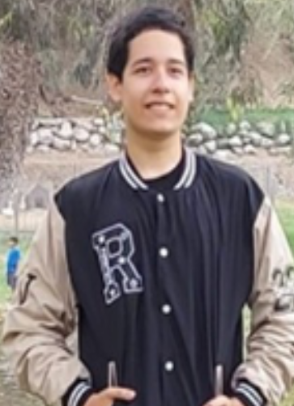

    </img> 
    <strong>Universidad Peruana de Ciencias Aplicadas</strong> 
     
    <strong>Ingeniería de Software</strong>  
    <strong>1ASI0657  Fundamentos de Arquitectura de Software</strong> 
    <strong>202610</strong>
       
    <strong>NRC: 16363</strong>
        
    <strong>Profesor: Marino Humberto Jara Palacios</strong>
     
    <strong>  
     <strong>TRABAJO FINAL</strong>
       
           
     <strong> Nombre del Producto :</strong> VSafe

| Alumno | Código |
|:---:|:---:|
| Gianfranco Jared Durand Vega | u202312614 |
| Stephano Mayrzon Landauri Preciado | u202311828 |
| Oscar Leonardo Espinoza Quijandría | u202311842 |
| Renzo Sebastián Uribe Livia | u202311745 |

 Versión | Fecha | Autor(es) | Descripción |
|---------|-------|-----------|-------------|

## Student Outcome

El curso contribuye al cumplimiento del Student Outcome ABET:

**ABET – EAC - Student Outcome 7**

**Aprendizaje Continuo y Autónomo**

**Criterio:** La capacidad de adquirir y aplicar nuevos conocimientos según sea necesario, utilizando estrategias de aprendizaje apropiadas.

En el siguiente cuadro se describen las acciones realizadas y las conclusiones del equipo que sustentan el cumplimiento del **ABET – EAC - Student Outcome 7**.

| Criterio específico | Acciones realizadas | Conclusiones |
|---|---|---|
| **3.c1.** Comunica oralmente sus ideas y/o resultados con objetividad a público de diferentes especialidades y niveles jerárquicos, en el marco del desarrollo de un proyecto en ingeniería de software. | **TB1:** - **Oscar Espinoza:** Desarrollé el capítulo IV completo y preparé la explicación oral de las decisiones arquitectónicas de VSafe. Organicé las ideas sobre ADD, DDD, Clean Architecture y microservicios, apoyándome en los diagramas para explicar las responsabilidades de cada contexto y sus relaciones con un lenguaje comprensible para públicos con distintos conocimientos técnicos. - **Renzo Sebastián Uribe Livia:** Desarrollé todo el capítulo III y preparé la explicación oral de la especificación de requisitos de VSafe. Organicé los To-Be Scenario Maps, las Epics y User Stories con sus criterios de aceptación, el Impact Mapping y el Product Backlog, relacionando las necesidades de los usuarios con los objetivos del negocio mediante un lenguaje comprensible para públicos técnicos y no técnicos. | **TB1:** La preparación de VSafe permitió integrar los aportes del equipo en una explicación del problema, las necesidades de los usuarios, los requerimientos y la solución propuesta. El uso de ejemplos y diagramas facilita comunicar las decisiones del proyecto a públicos con diferentes especialidades y niveles de responsabilidad, distinguiendo los resultados obtenidos de los aspectos pendientes de validación. |
| **3.c2.** Comunica en forma escrita ideas y/o resultados con objetividad a público de diferentes especialidades y niveles jerárquicos, en el marco del desarrollo de un proyecto de ingeniería de software. | **TB1:** - **Oscar Espinoza:** Elaboré y documenté todo el capítulo IV de VSafe, incluyendo el diseño guiado por atributos de calidad, los drivers y las decisiones arquitectónicas, el EventStorming, el descubrimiento de contextos, los flujos del dominio, los Bounded Context Canvases, el Context Mapping y los diagramas de arquitectura. Expliqué la propuesta de microservicios y la aplicación de Clean Architecture, manteniendo coherencia con los capítulos anteriores y diferenciando las decisiones propuestas de los resultados pendientes de validación. - **Renzo Sebastián Uribe Livia:** Elaboré y documenté todo el capítulo III de VSafe, incluyendo los To-Be Scenario Maps, la definición de Epics, User Stories y Technical Stories con criterios de aceptación, el Impact Mapping y la priorización del Product Backlog. Organicé los requisitos y su trazabilidad con los objetivos del negocio, manteniendo coherencia con la problemática, los segmentos objetivo y las hipótesis definidas en el capítulo I. | **TB1:** La documentación de VSafe consolidó los aportes del equipo y estableció una relación entre el análisis del problema, los objetivos, las necesidades de los usuarios, los requerimientos y el diseño de la solución. La organización del informe mediante textos, tablas y diagramas facilita su comprensión y revisión por lectores técnicos y no técnicos, y proporciona una base común para continuar el desarrollo y validar las decisiones propuestas. |

## Contenido

### Tabla de contenidos

- [Student Outcome](#student-outcome)
- [Capítulo I: Introducción](#capítulo-i-introducción)
  - [1.1 Startup Profile](#11-startup-profile)
    - [1.1.1 Descripción de la Startup](#111-descripción-de-la-startup)
    - [1.1.2 Perfiles de integrantes del equipo](#112-perfiles-de-integrantes-del-equipo)
  - [1.2 Solution Profile](#12-solution-profile)
    - [1.2.1 Nombre del producto](#121-nombre-del-producto)
    - [1.2.2 Antecedentes y problemática](#122-antecedentes-y-problemática)
    - [1.2.3 Lean UX Process](#123-lean-ux-process)
      - [1.2.3.1 Lean UX Problem Statement](#1231-lean-ux-problem-statement)
      - [1.2.3.2 Lean UX Assumptions](#1232-lean-ux-assumptions)
      - [1.2.3.3 Lean UX Hypothesis](#1233-lean-ux-hypothesis)
      - [1.2.3.4 Lean UX Canvas](#1234-lean-ux-canvas)
  - [1.3 Segmentos objetivo](#13-segmentos-objetivo)
- [Capítulo II: Requirements & Analysis](#capítulo-ii-requirements--analysis)
  - [2.1 Competidores](#21-competidores)
  - [2.2 Entrevistas](#22-entrevistas)
  - [2.3 Needfinding](#23-needfinding)
    - [2.3.1 User Personas](#231-user-personas)
    - [2.3.2 User Task Matrix](#232-user-task-matrix)
    - [2.3.3 Empathy Maps](#233-empathy-maps)
    - [2.3.4 As-is Scenario Mapping](#234-as-is-scenario-mapping)
- [Capítulo III: Requirements Specification](#capítulo-iii-requirements-specification)
  - [3.1 To-Be Scenario Mapping](#31-to-be-scenario-mapping)
  - [3.2 User Stories](#32-user-stories)
  - [3.3 Impact Map](#33-impact-map)
  - [3.4 Product Backlog](#34-product-backlog)
- [Capítulo IV: Product Architecture Design](#capítulo-iv-product-architecture-design)
  - [4.1 Design Concepts, ViewPoints & ER Diagrams](#41-design-concepts-viewpoints--er-diagrams)
    - [4.1.1 Principles Statements](#411-principles-statements)
    - [4.1.2 Approaches Statements Architectural Styles & Patterns](#412-approaches-statements-architectural-styles--patterns)
    - [4.1.3 Context Diagram](#413-context-diagram)
    - [4.1.4 Approach driven ViewPoints Diagrams](#414-approach-driven-viewpoints-diagrams)
    - [4.1.5 Relational/Non Relational Database Diagram](#415-relationalnon-relational-database-diagram)
    - [4.1.6 Design Patterns](#416-design-patterns)
    - [4.1.7 Tactics](#417-tactics)
  - [4.2 Architectural Drivers](#42-architectural-drivers)
    - [4.1.8 Design Purpose](#418-design-purpose)
    - [4.1.9 Primary Functionality (Primary User Stories)](#419-primary-functionality-primary-user-stories)
    - [4.1.10 Quality Attribute Scenarios](#4110-quality-attribute-scenarios)
    - [4.1.11 Constraints](#4111-constraints)
    - [4.1.12 Architectural Concerns](#4112-architectural-concerns)
  - [4.3 ADD Iterations](#43-add-iterations)
- [Capítulo V: Product Implementation, Validation & Deployment](#capítulo-v-product-implementation-validation--deployment)
  - [5.1 Testing Suites & General Patterns](#51-testing-suites--general-patterns)
    - [5.1.1 Backend Application Core Testing Suite](#511-backend-application-core-testing-suite)
    - [5.1.2 Pattern Based Backend Application(s)](#512-pattern-based-backend-applications)
    - [5.1.3 Pattern Based Custom Software Library](#513-pattern-based-custom-software-library)
    - [5.1.4 Framework Pattern Driven Refactoring Report](#514-framework-pattern-driven-refactoring-report)
  - [5.2 Software Configuration Management](#52-software-configuration-management)
    - [5.2.1 Software Development Environment Configuration](#521-software-development-environment-configuration)
    - [5.2.2 Source Code Management](#522-source-code-management)
    - [5.2.3 Source Code Style Guide & Conventions](#523-source-code-style-guide--conventions)
    - [5.2.4 Software Deployment Configuration](#524-software-deployment-configuration)
  - [5.3 Microservices Implementation](#53-microservices-implementation)
    - [Sprint 1](#sprint-1)
    - [Sprint 2](#sprint-2)
    - [Sprint 3](#sprint-3)
    - [Sprint 4](#sprint-4)
  - [5.4 Microservices Deployment](#54-microservices-deployment)
    - [5.3.1 Cloud Architecture Diagram](#531-cloud-architecture-diagram)
    - [5.3.2 Cloud Architecture Deployment](#532-cloud-architecture-deployment)
- [Conclusiones](#conclusiones)
- [Referencias Bibliográficas](#referencias-bibliográficas)
- [Anexos](#anexos)

## Capítulo I: Introducción

### 1.1 Startup Profile

#### 1.1.1 Descripción de la Startup

Vsafe es una startup tecnológica enfocada en mejorar la experiencia de desplazamiento de las personas dentro de la ciudad mediante una plataforma de navegación urbana inteligente. Nuestra solución utiliza inteligencia artificial, geolocalización y reportes de incidentes para recomendar rutas considerando no solo aspectos como el tiempo y la distancia, sino también el nivel de riesgo estimado de las zonas por las que transita el usuario. A través de la plataforma, los usuarios podrán ingresar un punto de origen y destino para visualizar diferentes alternativas de recorrido, conocer incidentes reportados cerca de su ubicación y recibir alertas sobre situaciones que puedan afectar su desplazamiento. Asimismo, podrán contribuir con la comunidad registrando incidentes relacionados con robos, asaltos u otras situaciones que puedan representar un riesgo para las personas que transitan por determinadas zonas. Nuestra startup busca complementar los sistemas tradicionales de navegación incorporando la seguridad como un criterio adicional para la elección de una ruta. De esta manera, los usuarios podrán contar con mayor información antes y durante sus desplazamientos y elegir el recorrido que mejor se adapte a sus necesidades.

### Misión

Facilitar el desplazamiento urbano de las personas mediante una solución tecnológica que combine inteligencia artificial, geolocalización y reportes de incidentes para recomendar rutas rápidas y con un menor nivel de riesgo estimado.

### Visión

Convertirse en una plataforma de navegación urbana reconocida por incorporar la seguridad como un factor importante dentro de la planificación de rutas, contribuyendo a que las personas puedan movilizarse de manera más informada por la ciudad.

### Valores

Nuestros valores se basan en la innovación, utilizando nuevas tecnologías para mejorar la experiencia de navegación urbana; la seguridad, priorizando información que permita a los usuarios tomar mejores decisiones durante sus recorridos; la colaboración, fomentando la participación de la comunidad mediante el reporte de incidentes; la accesibilidad, desarrollando una plataforma sencilla y fácil de utilizar; y la responsabilidad, gestionando adecuadamente la información y ubicación de los usuarios.

### Objetivo General

Desarrollar una plataforma de navegación urbana inteligente que permita a los usuarios encontrar rutas rápidas y con menor nivel de riesgo estimado mediante el uso de inteligencia artificial, geolocalización y reportes de incidentes.

#### 1.1.2 Perfiles de integrantes del equipo

| Foto                                          | Nombre completo               | Código     | Carrera                | Habilidades técnicas y rol                                   |
|-----------------------------------------------|-------------------------------|------------|------------------------|--------------------------------------------------------------|
|  | Gianfranco Jared Durand Vega    | U202312614 | Ingeniería de Software | Desarrollo Frontend (Vue/React), UI/UX, Integración de servicios externos |
|  | Oscar Leonardo Espinoza Quijandria | U202311842 | Ingeniería de Software | Desarrollo de software, análisis de requerimientos, diseño de arquitectura y documentación técnica. Colaboración en equipo para proponer soluciones y organizar el desarrollo del proyecto. |
|  | Renzo Sebastián Uribe Livia | U202311745 | Ingeniería de Software | Análisis y especificación de requisitos, elaboración de User Stories y criterios de aceptación, Impact Mapping, Product Backlog y documentación técnica. |
| | | | | |

### 1.2 Solution Profile

#### 1.2.1 Nombre del producto

**Vsafe** es una startup tecnológica enfocada en mejorar la experiencia de desplazamiento de las personas dentro de la ciudad mediante una plataforma de navegación urbana inteligente. La solución utiliza inteligencia artificial, geolocalización y reportes de incidentes para recomendar rutas considerando no solo factores como el tiempo y la distancia, sino también el nivel de riesgo estimado de las zonas por las que transita el usuario. A través de la plataforma, los usuarios podrán ingresar un punto de origen y destino, visualizar diferentes alternativas de recorrido, conocer incidentes reportados cerca de su ubicación y recibir alertas sobre situaciones que puedan afectar su desplazamiento. Asimismo, podrán contribuir con la comunidad registrando incidentes relacionados con robos, asaltos u otras situaciones de riesgo, permitiendo que Vsafe complemente los sistemas tradicionales de navegación al incorporar la seguridad como un criterio adicional para elegir una ruta.

### 1.2.2. Antecedentes y problemática

La inseguridad ciudadana representa una preocupación importante para las personas que se desplazan diariamente dentro de los espacios urbanos. Según el Instituto Nacional de Estadística e Informática (INEI, 2026), durante el año 2025 el **84.4 % de la población urbana de 15 años a más consideraba que podía ser víctima de algún hecho delictivo durante los siguientes doce meses**, mientras que en Lima Metropolitana esta percepción alcanzó el **85.5 %**; además, el **62.9 % de la población de Lima Metropolitana manifestó sentirse insegura al caminar sola durante la noche por su zona o barrio**, evidenciando que la seguridad puede influir en las decisiones relacionadas con los desplazamientos cotidianos. En este contexto, las herramientas de navegación suelen centrarse principalmente en factores como la distancia, el tiempo y el tráfico, a pesar de que diferentes investigaciones han demostrado que es posible incorporar datos relacionados con criminalidad e incidentes para calcular rutas considerando también niveles de riesgo (Galbrun et al., 2016; Mata et al., 2016). Asimismo, Sohrabi et al. (2022) señalan que la búsqueda de rutas con criterios de seguridad requiere considerar diferentes fuentes de información, métodos para estimar riesgos y el equilibrio entre la rapidez y la seguridad del recorrido. Frente a esta problemática, se propone **Vsafe**, una plataforma que utiliza inteligencia artificial, geolocalización y reportes de incidentes para estimar el nivel de riesgo de diferentes recorridos y ofrecer a los usuarios alternativas que les permitan desplazarse de manera más informada.

#### Análisis 5W + 2H

| Elemento | Descripción |
| --- | --- |
| **What? (¿Qué?)** | Dificultad de las personas para conocer y considerar el nivel de riesgo de determinadas zonas al momento de seleccionar una ruta para desplazarse por la ciudad. |
| **Why? (¿Por qué?)** | Porque los sistemas de navegación suelen priorizar factores como el tiempo y la distancia, mientras que la información relacionada con incidentes o niveles de riesgo no siempre se encuentra integrada dentro del proceso de selección de una ruta (Galbrun et al., 2016). |
| **Who? (¿Quién?)** | Personas que se desplazan diariamente por la ciudad, especialmente estudiantes, trabajadores, peatones y usuarios que deben transitar por zonas que desconocen. |
| **Where? (¿Dónde?)** | En entornos urbanos, principalmente en ciudades que presentan altos niveles de percepción de inseguridad, como Lima Metropolitana (INEI, 2026). |
| **When? (¿Cuándo?)** | Durante los desplazamientos cotidianos, especialmente cuando una persona se moviliza por lugares desconocidos, durante la noche o cuando debe elegir entre diferentes recorridos para llegar a un destino. |
| **How? (¿Cómo?)** | Los usuarios seleccionan sus recorridos principalmente a partir de información relacionada con distancia, tiempo o tráfico, sin disponer necesariamente de información integrada sobre incidentes ocurridos en las zonas por las que transitarán. |
| **How much? (¿Cuánto?)** | En 2025, el 84.4 % de la población urbana del Perú consideraba que podía ser víctima de un hecho delictivo durante los siguientes doce meses, mientras que en Lima Metropolitana esta cifra alcanzó el 85.5 % (INEI, 2026). |

### 1.2.3. Lean UX Process

#### 1.2.3.1. Lean UX Problem Statements

Las personas que se desplazan diariamente por la ciudad pueden presentar dificultades para identificar qué recorridos poseen un menor nivel de riesgo, debido a que las herramientas tradicionales de navegación se enfocan principalmente en factores como el tiempo, la distancia y el tráfico, mientras que la información relacionada con incidentes de seguridad no siempre se encuentra integrada durante la planificación del recorrido. Investigaciones relacionadas con navegación urbana han demostrado que los datos sobre criminalidad pueden incorporarse a modelos de rutas para comparar recorridos según distancia y riesgo, mientras que la combinación de información oficial y datos proporcionados por ciudadanos puede contribuir a mejorar este tipo de sistemas. Por ello, Vsafe busca integrar geolocalización, reportes de incidentes e inteligencia artificial para ofrecer diferentes alternativas de navegación y permitir que el usuario tome una decisión considerando tanto la rapidez como el nivel de riesgo estimado del recorrido.

> **¿Cómo podríamos facilitar el desplazamiento de las personas por la ciudad, permitiéndoles encontrar rutas rápidas y con menor nivel de riesgo mediante información actualizada sobre los incidentes ocurridos en su entorno?**

#### 1.2.2.3. Lean UX Assumptions

##### Business Assumptions

- Creemos que los usuarios necesitan una herramienta de navegación que considere el nivel de riesgo además del tiempo y la distancia al momento de recomendar una ruta.

- Creemos que integrar inteligencia artificial, geolocalización y reportes de incidentes permitirá ofrecer alternativas de recorrido más útiles para los usuarios.

- Creemos que los usuarios valorarán poder visualizar información sobre incidentes antes de iniciar un desplazamiento.

- Creemos que la participación de los usuarios mediante reportes puede contribuir a mantener actualizada la información disponible en la plataforma.

- Creemos que una plataforma disponible desde dispositivos móviles facilitará el acceso a la información durante los desplazamientos cotidianos.

##### User Assumptions

- Creemos que los usuarios sienten preocupación al desplazarse por zonas que desconocen o consideran poco seguras.

- Creemos que los usuarios desean conocer el nivel de riesgo estimado de una ruta antes de iniciar su recorrido.

- Creemos que los usuarios estarían dispuestos a elegir una ruta ligeramente más larga si esta presenta un menor nivel de riesgo estimado.

- Creemos que los usuarios consideran importante recibir alertas sobre incidentes cercanos que puedan afectar su recorrido.

- Creemos que algunos usuarios estarían dispuestos a reportar incidentes para contribuir con información útil para otros miembros de la comunidad.

- Creemos que los usuarios utilizarían una plataforma de navegación enfocada en la seguridad si esta resulta sencilla, rápida y confiable.

---

#### 1.2.2.3. Lean UX Hypothesis Statements

1. Creemos que mostrar diferentes alternativas de ruta acompañadas de un nivel de riesgo estimado permitirá que los usuarios tomen decisiones más informadas antes de iniciar un desplazamiento.

2. Creemos que integrar reportes de incidentes dentro del mapa ayudará a los usuarios a identificar zonas que podrían representar un mayor riesgo durante su recorrido.

3. Creemos que utilizar inteligencia artificial para analizar datos de ubicación e incidentes permitirá ofrecer recomendaciones de rutas más adecuadas a las necesidades de los usuarios.

4. Creemos que enviar alertas cuando se detecten incidentes relevantes cerca de la ruta seleccionada ayudará a los usuarios a conocer posibles riesgos y evaluar recorridos alternativos.

5. Creemos que permitir que los usuarios reporten incidentes de manera sencilla contribuirá a incrementar la información disponible y mantener actualizados los niveles de riesgo estimados de las diferentes zonas.

6. Creemos que ofrecer una plataforma sencilla, accesible y organizada aumentará la disposición de las personas a utilizar Vsafe como complemento de sus herramientas habituales de navegación.

---

##### 1.2.3.4 Lean UX Canvas

### 1.2.3.4. Lean UX Canvas

| Sección | Contenido |
|---|---|
| **1. Business Problem** | • Los usuarios no cuentan con información integrada sobre el nivel de riesgo de las rutas que utilizan. • Las aplicaciones de navegación suelen priorizar tiempo, distancia y tráfico, sin considerar suficientemente la seguridad del recorrido. • Existe dificultad para conocer incidentes recientes ocurridos en determinadas zonas de la ciudad. • Los usuarios pueden desplazarse por zonas desconocidas sin información suficiente sobre posibles riesgos. • La información relacionada con incidentes urbanos se encuentra distribuida en diferentes fuentes y no siempre está disponible durante el recorrido. |
| **2. Business Outcomes** | • Incrementar la cantidad de usuarios que utilizan Vsafe para planificar sus desplazamientos. • Aumentar la cantidad de rutas consultadas dentro de la plataforma. • Incrementar la cantidad de reportes de incidentes realizados por los usuarios. • Lograr que los usuarios consulten el nivel de riesgo antes de seleccionar una ruta. • Incrementar el uso recurrente de la plataforma. • Mejorar progresivamente la precisión de las recomendaciones mediante la información recopilada. |
| **3. Users and Customers** | • Estudiantes que se desplazan diariamente hacia universidades o institutos. • Trabajadores que realizan recorridos frecuentes dentro de la ciudad. • Peatones que se movilizan por zonas que no conocen. • Personas que realizan desplazamientos durante horarios nocturnos. • Usuarios de transporte público que necesitan caminar hasta paraderos o estaciones. • Personas que visitan zonas desconocidas y necesitan orientación sobre sus recorridos. |
| **4. User Benefits** | • Conocer el nivel de riesgo estimado de una ruta antes de iniciar el recorrido. • Identificar incidentes reportados cerca de su ubicación o destino. • Comparar rutas considerando tiempo, distancia y nivel de riesgo. • Recibir alertas sobre incidentes relevantes durante el desplazamiento. • Tomar decisiones más informadas al desplazarse por zonas desconocidas. • Tener mayor control sobre la planificación de sus recorridos. • Contribuir con otros usuarios mediante el reporte de incidentes. |
| **5. Solution Ideas** | • Mapa interactivo con visualización de rutas y zonas de riesgo. • Sistema de recomendación de rutas mediante inteligencia artificial. • Clasificación del nivel de riesgo de las rutas mediante indicadores visuales. • Sistema de reportes de robos, asaltos y otros incidentes urbanos. • Geolocalización en tiempo real del usuario. • Alertas sobre incidentes cercanos al recorrido seleccionado. • Comparación entre la ruta más rápida y una ruta con menor nivel de riesgo estimado. • Historial de rutas realizadas y consultadas. • Sistema de validación de reportes realizados por la comunidad. |
| **6. Hypotheses** | • Creemos que mostrar el nivel de riesgo estimado de diferentes rutas permitirá a los usuarios tomar decisiones más informadas sobre sus recorridos. • Creemos que integrar reportes de incidentes dentro del mapa ayudará a los usuarios a identificar zonas que podrían representar un mayor riesgo. • Creemos que los usuarios estarán dispuestos a elegir una ruta ligeramente más larga si presenta un menor nivel de riesgo estimado. • Creemos que enviar alertas sobre incidentes cercanos permitirá a los usuarios evaluar rutas alternativas durante su desplazamiento. • Creemos que permitir reportar incidentes de manera sencilla aumentará la información disponible dentro de la plataforma. • Creemos que utilizar inteligencia artificial para analizar información de ubicación e incidentes permitirá mejorar las recomendaciones de rutas. • Creemos que una plataforma sencilla y rápida aumentará la intención de los usuarios de utilizar Vsafe de manera recurrente. |
| **7. What's the most important thing we need to learn first?** | • Validar si los usuarios consideran importante conocer el nivel de riesgo antes de seleccionar una ruta. • Identificar qué factores utilizan actualmente los usuarios para decidir por dónde desplazarse. • Determinar si los usuarios estarían dispuestos a utilizar una ruta más larga a cambio de un menor nivel de riesgo estimado. • Conocer qué tipos de incidentes consideran más relevantes para evaluar una ruta. • Identificar si los usuarios estarían dispuestos a reportar incidentes dentro de la plataforma. • Determinar qué información necesitan visualizar para confiar en una recomendación de Vsafe. • Validar qué tipo de alertas consideran útiles durante sus desplazamientos. |
| **8. What's the least amount of work we need to do to learn the next most important thing?** | • Realizar entrevistas a potenciales usuarios de Vsafe. • Aplicar encuestas para conocer hábitos de navegación y percepción de seguridad. • Crear un prototipo de baja fidelidad de la plataforma. • Realizar pruebas de usabilidad con usuarios potenciales. • Diseñar un mapa simulado que muestre rutas con diferentes niveles de riesgo. • Probar diferentes formas de representar visualmente el nivel de riesgo. • Crear una landing page para evaluar el interés de los usuarios en la propuesta. • Desarrollar un MVP con las funcionalidades principales de búsqueda de rutas, visualización de incidentes y reporte de eventos. |

---

## Registro de Versiones del Informe

