# Capítulo IV: Strategic-Level Software Design

VSafe es una plataforma de navegación urbana orientada a estudiantes universitarios y trabajadores que necesitan planificar sus desplazamientos considerando tiempo, distancia y nivel de riesgo estimado. Su propuesta integra información geoespacial, reportes comunitarios y estimación de riesgo para facilitar decisiones informadas antes y durante un recorrido.

El presente capítulo establece el diseño estratégico de la solución mediante Attribute-Driven Design, Strategic Domain-Driven Design y el modelo C4. Se identifican las funcionalidades con mayor impacto arquitectónico, se especifican escenarios de calidad, se evalúan alternativas de diseño y se delimitan las responsabilidades de los principales contextos del dominio.

La arquitectura de VSafe se basa en microservicios, de acuerdo con el requisito del proyecto. Route Planning, Risk Assessment, Incident Reporting y Journey Alerts se implementan como servicios ejecutables y desplegables de forma independiente, cada uno con datos propios y contratos explícitos. Un API Gateway expone el acceso de la aplicación y RabbitMQ transporta los eventos de integración. Esta estructura mantiene la trazabilidad entre requisitos, reglas del negocio y elementos de la solución.

## 4.1. Strategic-Level Attribute-Driven Design

Attribute-Driven Design permite orientar la arquitectura a partir de requisitos funcionales, atributos de calidad y restricciones. En VSafe, este enfoque se utiliza para determinar cómo obtener alternativas de recorrido, estimar su riesgo, procesar reportes y comunicar cambios relevantes sin comprometer la privacidad de los usuarios.

El Quality Attribute Workshop sirve como referencia para identificar, priorizar y refinar escenarios. Posteriormente, las iteraciones de diseño permiten evaluar tácticas y patrones capaces de responder a esos escenarios. [Wojcik et al., 2006](https://www.sei.cmu.edu/library/attribute-driven-design-add-version-20/); [Barbacci et al., 2003](https://www.sei.cmu.edu/library/quality-attribute-workshops-qaws-third-edition/).

### 4.1.1. Design Purpose

El propósito del diseño arquitectónico de VSafe es establecer una estructura que permita ofrecer alternativas de desplazamiento con información comprensible, oportuna y consistente sobre duración, distancia y riesgo estimado.

La problemática identificada en los capítulos anteriores requiere integrar información que suele encontrarse distribuida entre herramientas cartográficas, datos de incidentes y experiencias de los propios usuarios. Por ello, la arquitectura debe facilitar la integración de estas fuentes y permitir que sus limitaciones sean visibles durante la comparación de rutas.

El diseño se orienta a los siguientes objetivos:

1. Permitir la consulta y comparación de alternativas de recorrido.
2. Separar el cálculo cartográfico de la estimación de riesgo.
3. Procesar reportes comunitarios mediante reglas de consistencia, duplicidad y vigencia.
4. Informar incidentes pertinentes durante un recorrido activo.
5. Mantener una respuesta controlada ante fallos de servicios externos.
6. Proteger los datos de ubicación y limitar su almacenamiento.
7. Facilitar cambios de proveedores, reglas y modelos sin afectar innecesariamente toda la solución.

Estos objetivos se relacionan con las metas del capítulo III:

| Objetivo de negocio | Relación con el diseño arquitectónico |
|---|---|
| **G01:** alcanzar 300 usuarios activos mensuales al finalizar los primeros tres meses del piloto. | Requiere una experiencia accesible y una plataforma operativa para consultar recorridos. |
| **G02:** conseguir que al menos el 60 % de las consultas válidas termine en la selección de una ruta durante las primeras ocho semanas. | Requiere alternativas comparables, respuestas oportunas y una presentación clara del riesgo y su incertidumbre. |
| **G03:** obtener 100 reportes comunitarios procesables durante los primeros tres meses. | Requiere recepción confiable, validación y seguimiento de los reportes. |
| **G04:** alcanzar una tasa de retorno mensual del 30 % al cierre del tercer mes. | Requiere alertas pertinentes, reutilización de recorridos y confianza en el tratamiento de la información. |

Para concretar el diseño se propone el siguiente alcance inicial:

| Aspecto | Alcance propuesto |
|---|---|
| Productos digitales | Landing Page, aplicación web adaptable a dispositivos móviles, API Gateway y cuatro microservicios de negocio. |
| Estilo arquitectónico | Microservicios con despliegue independiente, base de datos por servicio y comunicación mediante HTTP y eventos. |
| Segmentos principales | Estudiantes universitarios y trabajadores urbanos. |
| Cobertura inicial | Zonas de Lima Metropolitana habilitadas mediante configuración. La cobertura cartográfica y la cobertura de datos de riesgo se evaluarán por separado. |
| Modalidad de desplazamiento | Recorridos peatonales. La incorporación de transporte público o navegación vehicular requerirá ampliar los requisitos. |
| Alertas | Disponibles durante un recorrido activo, mientras la aplicación esté visible y conectada. |
| Acceso | Sesión anónima asociada al navegador, sin registro obligatorio en el MVP. |
| Historial | Almacenamiento local y optativo en el navegador. |
| Estimación de riesgo | Modelo de aprendizaje automático versionado, sujeto a disponibilidad de datos y validación. |
| Capacidad de referencia | Pruebas con 50 sesiones simultáneas, 5 consultas de rutas por segundo y 100 000 incidentes de prueba. |

Los valores de capacidad son hipótesis técnicas para evaluar la solución. No representan demanda observada ni se deducen directamente de la cantidad de usuarios activos mensuales.

### 4.1.2. Attribute-Driven Design Inputs

Las entradas del proceso de diseño se clasifican en tres grupos:

- Funcionalidades principales que afectan la organización de la solución.
- Escenarios de atributos de calidad que establecen condiciones verificables.
- Restricciones impuestas por la guía y el requisito del proyecto de utilizar microservicios.

Se conservan los identificadores de las historias del capítulo III para mantener trazabilidad entre requisitos y arquitectura.

#### 4.1.2.1. Primary Functionality (Primary User Stories)

Se seleccionan las historias que requieren integración geoespacial, estimación de riesgo, procesamiento de reportes, comunicación de alertas y protección de datos.

Las historias del Landing Page mantienen su importancia comercial, pero no determinan la descomposición principal del dominio.

| Epic / User Story ID | Título | Descripción | Criterios de aceptación | Epic ID |
|---|---|---|---|---|
| **US06** | Visualizar rutas alternativas | Como usuario, deseo recibir diferentes alternativas de ruta para no depender de una única opción. | **Escenario 1:** Dado que existen recorridos disponibles, cuando finaliza el cálculo, entonces el sistema presenta más de una alternativa cuando las condiciones lo permiten.  **Escenario 2:** Dado que solo existe una alternativa válida, cuando finaliza el cálculo, entonces presenta esa ruta e informa la limitación. | EP02 |
| **US07** | Comparar tiempo, distancia y riesgo | Como usuario, deseo comparar las rutas por duración, distancia y nivel de riesgo estimado para tomar una decisión informada. | **Escenario 1:** Dado que se obtuvieron alternativas, cuando el usuario las compara, entonces cada una presenta duración, distancia y riesgo estimado bajo criterios consistentes.  **Escenario 2:** Dado que falta información suficiente, cuando se muestra una ruta, entonces el sistema comunica la incertidumbre. | EP02 |
| **US09** | Consultar incidentes del recorrido | Como usuario, deseo conocer los incidentes cercanos a las rutas para comprender el contexto del riesgo estimado. | **Escenario 1:** Dado que existen incidentes relevantes, cuando se consulta una ruta, entonces el sistema presenta tipo, ubicación aproximada y vigencia.  **Escenario 2:** Dado que no existen reportes aplicables, cuando se consulta la ruta, entonces informa esta condición sin afirmar que la zona carece de riesgo. | EP02 |
| **US10** | Recibir alertas de incidentes | Como usuario, deseo recibir alertas sobre incidentes relevantes cercanos a mi ruta para evaluar si debo modificarla. | **Escenario 1:** Dado un recorrido activo, cuando aparece un incidente pertinente, entonces el sistema informa al usuario.  **Escenario 2:** Dado que el incidente no afecta el recorrido, cuando se procesa, entonces evita generar una alerta innecesaria. | EP03 |
| **US11** | Solicitar una ruta alternativa | Como usuario, deseo recalcular mi recorrido después de una alerta para continuar por una alternativa disponible. | **Escenario 1:** Dado que el usuario recibe una alerta, cuando solicita recalcular, entonces el sistema evalúa rutas vigentes desde su posición disponible.  **Escenario 2:** Dado que no existe una alternativa, cuando termina el cálculo, entonces informa la situación sin ocultar el incidente. | EP03 |
| **US12** | Consultar recorridos anteriores | Como usuario, deseo revisar mis rutas consultadas anteriormente para reutilizar información en desplazamientos similares. | **Escenario 1:** Dado que existen consultas anteriores, cuando se accede al historial, entonces se presentan sus datos esenciales.  **Escenario 2:** Dado que no existen consultas, cuando se accede al historial, entonces se informa que no hay recorridos registrados. | EP03 |
| **US13** | Registrar un incidente | Como usuario, deseo reportar un incidente observado para contribuir con información sobre el entorno urbano. | **Escenario 1:** Dados los datos requeridos, cuando el usuario envía el reporte, entonces se registra para procesamiento.  **Escenario 2:** Dado que falta información, cuando intenta enviarlo, entonces el sistema identifica los datos pendientes. | EP04 |
| **US15** | Confirmar la ubicación del reporte | Como usuario, deseo confirmar la ubicación aproximada del incidente para evitar que afecte zonas incorrectas. | **Escenario 1:** Dada una ubicación disponible, cuando el usuario la confirma, entonces se asocia al reporte.  **Escenario 2:** Dado que la posición detectada es incorrecta, cuando el usuario la corrige, entonces se conserva la ubicación confirmada. | EP04 |
| **TS01** | Consultar información geoespacial | Como desarrollador, deseo disponer de un servicio que obtenga rutas e incidentes aplicables para construir alternativas de recorrido. | **Escenario 1:** Dados origen y destino válidos, cuando se recibe la solicitud, entonces se devuelven alternativas con sus datos geoespaciales.  **Escenario 2:** Dado que una fuente no responde, cuando se procesa la solicitud, entonces se devuelve un estado controlado y se registra la incidencia técnica. | EP05 |
| **TS02** | Estimar el riesgo de una ruta | Como desarrollador, deseo disponer de un servicio de estimación de riesgo para comparar rutas bajo un criterio consistente. | **Escenario 1:** Dada una ruta e información de incidentes, cuando se solicita una estimación, entonces se devuelve un nivel de riesgo y la vigencia de los datos.  **Escenario 2:** Dada información insuficiente, cuando se solicita una estimación, entonces se devuelve un resultado identificado como incierto. | EP05 |
| **TS03** | Procesar la confiabilidad de reportes | Como desarrollador, deseo validar reportes comunitarios para reducir información duplicada, inconsistente o desactualizada. | **Escenario 1:** Dado un reporte coincidente en tipo, espacio y tiempo con otro incidente, cuando se procesa, entonces se identifica como posible duplicado.  **Escenario 2:** Dado que un reporte supera su vigencia, cuando se actualiza la información, entonces deja de influir como incidente activo. | EP05 |
| **TS04** | Proteger datos de ubicación | Como desarrollador, deseo limitar el tratamiento de la ubicación a lo necesario para gestionar la información responsablemente. | **Escenario 1:** Dada una función que necesita ubicación, cuando solicita acceso, entonces utiliza únicamente los datos autorizados para esa finalidad.  **Escenario 2:** Dada la ausencia de autorización, cuando se utiliza una función compatible, entonces permite continuar mediante ingreso manual. | EP05 |

US04, US05 y US08 completan el flujo de definición, ubicación y selección de ruta. US14 y US16 completan la clasificación y consulta del estado de los reportes. Estas historias se incorporan a la distribución de responsabilidades presentada en la sección 4.2.

#### 4.1.2.2. Quality Attribute Scenarios

Los escenarios iniciales concretan las condiciones que debe satisfacer la solución. Sus métricas constituyen objetivos propuestos que deberán verificarse durante la implementación.

| Atributo | Fuente | Estímulo | Artefacto | Entorno | Respuesta | Medida |
|---|---|---|---|---|---|---|
| **QA01. Eficiencia de desempeño** | Estudiante o trabajador. | Solicita alternativas entre dos puntos válidos. | Consulta de rutas y estimador. | Carga de referencia; proveedor operativo. | Devuelve alternativas con sus datos y estimación o incertidumbre. | p95 ≤ 4 s; p99 ≤ 6 s; éxito técnico ≥ 99 %. |
| **QA02. Oportunidad de alertas** | Gestión de incidentes. | Publica un incidente pertinente. | Procesamiento de eventos y alertas. | 50 recorridos activos; aplicación visible y conectada. | Muestra una alerta por incidente y versión de recorrido. | p95 ≤ 15 s desde publicación hasta visualización; cero duplicados en pruebas. |
| **QA03. Tolerancia a fallos externos** | Proveedor cartográfico. | No responde o devuelve un error. | Adaptador cartográfico. | Dependencia degradada. | Limita la espera e informa indisponibilidad. | 100 % de fallos controlados en ≤ 4 s; recepción de reportes disponible. |
| **QA04. Calidad de información** | Datos de incidentes o modelo. | Información insuficiente, vencida o fuera de cobertura. | Estimación de riesgo. | Consulta con evidencia insuficiente. | Devuelve incertidumbre y explica su causa. | 100 % de casos insuficientes identificados; ninguna etiqueta LOW causada solo por ausencia de reportes. |
| **QA05. Seguridad y privacidad** | Usuario o cliente sin autorización. | Revoca ubicación o intenta acceder a otra sesión. | Sesiones, recorridos e historial. | Uso normal y solicitudes manipuladas. | Respeta permisos y limita acceso por propietario. | Cero accesos cruzados en pruebas; cero coordenadas precisas en logs; limpieza del recorrido en ≤ 5 min tras cierre o revocación. |
| **QA06. Integridad y consistencia** | Cliente, productor o consumidor de eventos. | Reenvía una operación o reinicia durante su procesamiento. | Base del propietario, outbox, RabbitMQ e inbox. | Reintentos y fallos temporales. | Recupera el procesamiento sin duplicar efectos. | Un reporte por clave idempotente; cero eventos confirmados perdidos por reinicio del consumidor; recuperación ≤ 60 s tras su retorno. |
| **QA07. Modificabilidad** | Equipo de desarrollo. | Sustituye proveedor o modelo. | Adaptadores y contratos. | Evolución de la solución. | Incorpora el cambio sin modificar las reglas de los consumidores. | 100 % de pruebas de contrato aprobadas; objetivo ≤ 2 jornadas para cambios compatibles. |
| **QA08. Disponibilidad y recuperación** | Fallo de proceso o infraestructura. | Detiene un microservicio, gateway, broker o host. | Despliegue y respaldos. | Operación del piloto. | Detecta, reinicia o restaura el servicio. | Objetivo 99,5 % mensual para funciones propias; reinicio ≤ 60 s; RTO ≤ 4 h; RPO ≤ 24 h. |
| **QA09. Despliegue independiente** | Equipo de desarrollo. | Publica una versión compatible de Incident Reporting Service. | Pipeline e imagen del servicio. | Piloto operativo con los demás servicios estables. | Actualiza únicamente el servicio y mantiene consultas de rutas mediante proyecciones vigentes o incertidumbre explícita. | Cero recompilaciones o despliegues de otros servicios; 100 % de contratos aprobados; éxito técnico de rutas ≥ 99 % durante la prueba. |

Una respuesta con riesgo desconocido puede ser técnicamente correcta, pero no constituye una estimación informativa. Por ello, se medirá también la proporción de consultas con estimaciones utilizables, diferenciándola de la disponibilidad del API.

#### 4.1.2.3. Constraints

CON01–CON07 proceden de la guía del trabajo. CON08 incorpora el requisito explícito del proyecto de utilizar microservicios; no se atribuye esta condición al docente. Las tecnologías concretas siguen siendo decisiones propuestas para implementar esa arquitectura.

| Technical Story ID | Título | Descripción | Criterios de aceptación | Epic ID |
|---|---|---|---|---|
| **CON01** | Servicios e integración | Como desarrollador, deseo implementar servicios internos REST e integrar un servicio externo para conectar los productos digitales. | Dada una solicitud válida, cuando se procesa, entonces el backend utiliza contratos definidos e integra la fuente externa correspondiente. | EP05 |
| **CON02** | Backend permitido | Como desarrollador, deseo utilizar Spring Boot con Java, ASP.NET Core con C# o Nest con TypeScript para respetar las opciones del curso. | Dado el backend, cuando se revisa su configuración, entonces utiliza una de las alternativas autorizadas. | EP05 |
| **CON03** | Tecnologías web | Como desarrollador, deseo construir el Landing Page con HTML5, CSS3 y JavaScript, y la aplicación con Angular o Vue. | Dado el código de interfaz, cuando se inspecciona, entonces utiliza las tecnologías permitidas y una biblioteca de componentes compatible con la guía. | EP01 |
| **CON04** | Internacionalización y accesibilidad | Como desarrollador, deseo soportar en_US y es_419, con inglés predeterminado y accesibilidad web. | Dado un idioma seleccionado, cuando se recorren las funciones principales, entonces los mensajes utilizan ese idioma y los controles tienen nombres accesibles y navegación por teclado. | EP01 / EP02 |
| **CON05** | Documentación de arquitectura | Como desarrollador, deseo mantener C4 en Structurizr y documentar el dominio mediante las herramientas indicadas. | Dado el modelo arquitectónico, cuando se revisa, entonces incluye las vistas Landscape, Context, Container y Deployment, junto con los artefactos DDD. | EP05 |
| **CON06** | Contratos OpenAPI | Como desarrollador, deseo documentar los servicios mediante OpenAPI y Swagger. | Dado un endpoint, cuando se consulta su documentación, entonces se identifican entradas, respuestas, errores y requisitos de sesión. | EP05 |
| **CON07** | Control de versiones | Como desarrollador, deseo versionar el informe y sus diagramas en GitHub mediante GitFlow y conventional commits. | Dado un cambio integrado, cuando se revisa el repositorio, entonces las fuentes, imágenes y referencias corresponden a la misma versión. | EP05 |
| **CON08** | Arquitectura de microservicios | Como desarrollador, deseo implementar servicios con ejecución, datos y despliegue independientes para cumplir el requisito arquitectónico del proyecto. | Dado un cambio compatible en un servicio, cuando se construye y despliega su versión, entonces no se requiere recompilar ni desplegar los demás; cada servicio accede únicamente a su propia base de datos. | EP05 |

### 4.1.3. Architectural Drivers Backlog

El backlog arquitectónico reúne cuatro drivers funcionales, nueve drivers de calidad y ocho restricciones: veintiún drivers en total.

La importancia para stakeholders expresa el efecto sobre la utilidad del producto, la confianza y las condiciones de entrega. El impacto en complejidad técnica considera integración, coordinación de procesos y dificultad de verificación.

Los drivers High–High se ubican primero. La ordenación presentada constituye una priorización técnica propuesta para su revisión con el equipo.

| Driver ID | Título del driver | Descripción | Importancia para stakeholders | Impacto en complejidad técnica |
|---|---|---|---|---|
| **QA04** | Transparencia del riesgo | Distinguir datos suficientes, insuficientes y vencidos. | High | High |
| **QA05** | Protección de ubicación | Controlar permisos, propiedad y retención de información. | High | High |
| **QA02** | Alertas oportunas | Informar incidentes pertinentes durante un recorrido activo. | High | High |
| **FD01** | Comparación de recorridos | Integrar US04–US09, TS01 y TS02. | High | High |
| **QA01** | Respuesta de planificación | Mantener tiempos aceptables bajo la carga propuesta. | High | High |
| **QA03** | Aislamiento de fallos externos | Evitar esperas indefinidas y respuestas engañosas. | High | High |
| **FD02** | Gestión de reportes | Integrar US13–US16 y TS03. | High | High |
| **QA06** | Procesamiento íntegro | Evitar efectos duplicados y recuperar eventos confirmados. | High | High |
| **FD03** | Acompañamiento del recorrido | Integrar selección, alertas y recálculo de US08, US10 y US11. | High | High |
| **CON01** | Integración de productos | Utilizar servicios REST internos y una dependencia externa. | High | High |
| **CON08** | Microservicios independientes | Descomponer el backend en servicios con despliegue y persistencia propios. | High | High |
| **QA09** | Despliegue independiente | Actualizar un servicio manteniendo compatibles los contratos de sus consumidores. | High | High |
| **QA08** | Recuperación del piloto | Recuperar procesos y datos dentro de los objetivos establecidos. | High | Medium |
| **FD04** | Historial y acceso responsable | Relacionar US12 con TS04. | High | Medium |
| **CON02** | Backend autorizado | Respetar las familias tecnológicas de la guía. | High | Medium |
| **CON03** | Experiencia web | Utilizar las tecnologías de interfaz permitidas. | High | Medium |
| **CON04** | Idiomas y accesibilidad | Incorporar internacionalización y accesibilidad desde el diseño. | High | Medium |
| **CON05** | Modelado arquitectónico | Mantener representaciones C4 y DDD revisables. | High | Low |
| **CON06** | Documentación de servicios | Definir contratos mediante OpenAPI. | High | Low |
| **CON07** | Versionado del informe | Conservar trazabilidad del documento y los diagramas. | High | Low |
| **QA07** | Cambios acotados | Sustituir adaptadores y modelos sin propagar cambios innecesarios. | Medium | Medium |

El orden arquitectónico no sustituye al Product Backlog. Por ejemplo, aunque TS04 figure al final del backlog comercial, la protección de ubicación debe implementarse desde la primera funcionalidad que utilice esos datos.

### 4.1.4. Architectural Design Decisions

El análisis se estructura utilizando las etapas del QAW. La siguiente tabla describe cómo se aplicarán al proyecto y qué artefactos permiten revisar cada etapa; no representa un acta de una sesión realizada.

| Etapa | Aplicación en VSafe | Resultado esperado |
|---|---|---|
| Presentación e introducciones | Delimitar el piloto y los roles participantes. | Alcance y responsabilidades de revisión. |
| Presentación del negocio | Relacionar necesidades y funcionalidades con G01–G04. | Criterios de valor. |
| Presentación del plan arquitectónico | Examinar interfaz, backend, datos y proveedores. | Visión inicial de integración. |
| Identificación de drivers | Clasificar funcionalidades, atributos y restricciones. | Backlog arquitectónico. |
| Generación de escenarios | Considerar lentitud, incertidumbre, fallos, duplicados y permisos. | Escenarios iniciales. |
| Consolidación | Unificar escenarios equivalentes y separar problemas distintos. | Conjunto consistente de escenarios. |
| Priorización | Evaluar importancia y complejidad. | Orden de atención. |
| Refinamiento | Precisar condiciones, métricas y preguntas pendientes. | Escenarios verificables. |

Estas etapas siguen la organización propuesta por el SEI para el QAW. [Barbacci et al., 2003](https://www.sei.cmu.edu/documents/716/2003_005_001_14249.pdf).

#### Iteraciones de diseño

| Iteración | Drivers considerados | Resultado | Criterio de decisión |
|---|---|---|---|
| **I1. Estructura** | FD01–FD04, QA07, QA09, CON02 y CON08. | Cuatro microservicios, API Gateway y bases de datos privadas. | Respetar el requisito de independencia de despliegue y propiedad de datos. |
| **I2. Rutas y riesgo** | QA01, QA03 y QA04. | Adaptadores, límites de espera y estimación con incertidumbre explícita. | Responder oportunamente sin ocultar limitaciones. |
| **I3. Reportes y alertas** | FD02, FD03, QA02 y QA06. | RabbitMQ, outbox por productor e inbox por consumidor. | Recuperar mensajes entre servicios y evitar efectos duplicados. |
| **I4. Privacidad y operación** | FD04, QA05, QA08 y restricciones documentales. | Sesión anónima, historial local y despliegue recuperable. | Limitar datos persistentes y facilitar soporte del piloto. |

#### Candidate Pattern Evaluation Matrix

| Driver ID | Título | Patrón 1: Pro / Con | Patrón 2: Pro / Con | Patrón 3: Pro / Con |
|---|---|---|---|---|
| CON08, QA09 | Descomposición en servicios | **Un servicio por bounded context.** Pro: responsabilidades y despliegues coherentes. Con: requiere contratos y coordinación de eventos. | **Un servicio por operación.** Pro: unidades pequeñas. Con: fragmentación y llamadas excesivas. | **Un servicio por capa técnica.** Pro: separación técnica visible. Con: los cambios de negocio atraviesan varios servicios. |
| CON01, QA03 | Integración cartográfica | **Adaptador con ACL.** Pro: contratos propios. Con: requiere traducción y pruebas. | **SDK dentro del dominio.** Pro: menos código inicial. Con: dependencia directa del proveedor. | **Motor cartográfico propio.** Pro: control de los datos. Con: mantenimiento y procesamiento adicionales. |
| QA01, QA03 | Fallos externos | **Timeout y Circuit Breaker.** Pro: tiempos acotados. Con: rechazo temporal de solicitudes. | **Reintentos ilimitados.** Pro: algunas operaciones terminan recuperándose. Con: consumo y espera sin límites. | **Proveedor secundario.** Pro: alternativa ante fallos. Con: doble integración y diferencias de cobertura. |
| QA04 | Estimación de riesgo | **Modelo versionado con abstención.** Pro: aprendizaje y límites explícitos. Con: exige datos y validación. | **Reglas fijas.** Pro: explicación sencilla. Con: umbrales rígidos y sin aprendizaje. | **Modelo generativo que califica zonas.** Pro: explicación textual. Con: difícil calibración y riesgo de afirmaciones no sustentadas. |
| QA06 | Publicación de eventos | **Transactional Outbox.** Pro: estado y evento se guardan juntos. Con: necesita procesamiento e inbox. | **Guardar y luego publicar.** Pro: implementación corta. Con: posible pérdida entre ambas operaciones. | **Event Sourcing completo.** Pro: reconstrucción histórica. Con: mayor complejidad de modelos y retención. |
| QA02 | Comunicación de alertas | **SSE.** Pro: canal servidor-cliente y reconexión. Con: restricciones en segundo plano. | **Polling frecuente.** Pro: implementación sencilla. Con: solicitudes repetidas y retraso por intervalo. | **WebSocket.** Pro: comunicación bidireccional. Con: administración adicional de conexiones y protocolo. |
| QA05, FD04 | Identidad e historial | **Sesión anónima e historial local.** Pro: menor almacenamiento central. Con: no sincroniza dispositivos. | **Cuenta persistente.** Pro: recuperación y sincronización. Con: amplía requisitos y gestión de credenciales. | **Consulta pública por identificador.** Pro: acceso simple. Con: riesgo de exposición de datos. |
| QA08 | Despliegue | **Host recuperable con respaldos externos.** Pro: operación controlable. Con: punto único de fallo. | **Clúster con réplica de base.** Pro: tolerancia a determinados fallos. Con: mayor costo y administración. | **Multirregión.** Pro: aislamiento geográfico. Con: replicación y consistencia más complejas. |
| QA06, CON08 | Mensajería entre servicios | **RabbitMQ con outbox.** Pro: colas por consumidor y desacoplamiento temporal. Con: operación del broker e idempotencia. | **HTTP encadenado para propagar eventos.** Pro: menos infraestructura. Con: dependencia de disponibilidad simultánea. | **Log distribuido de eventos.** Pro: retención y reproducción extensas. Con: mayor administración para el piloto. |

#### ADR01. Microservicios por bounded context y datos privados

Se implementarán cuatro microservicios de negocio, propuestos en **NestJS y TypeScript**: Route Planning Service, Risk Assessment Service, Incident Reporting Service y Journey Alerts Service. Cada uno tendrá proceso ejecutable, imagen de despliegue, configuración, health checks, pruebas y migraciones propios. Los contextos se asignan inicialmente uno a uno por la coherencia de sus reglas; esta correspondencia se revisará si aparecen interacciones excesivas.

Un API Gateway implementado como aplicación independiente centraliza el enrutamiento de las solicitudes públicas y las verificaciones comunes de acceso. Las decisiones de rutas, riesgo, incidentes y pertinencia de alertas permanecen en sus respectivos servicios. Route Planning consulta Risk Assessment por HTTP; la propagación de cambios se realiza mediante RabbitMQ.

Se adopta **Database per Service**: `route_planning_db`, `risk_assessment_db`, `incident_reporting_db` y `journey_alerts_db`. Cada servicio dispone de credenciales exclusivas y solo ejecuta sus propias migraciones. Se prohíben consultas SQL, claves foráneas y transacciones que atraviesen estas bases. Los consumidores mantienen proyecciones locales construidas mediante eventos o contratos autorizados. Esta autonomía de datos permite acotar cambios y despliegues. [Microsoft, Data considerations for microservices](https://learn.microsoft.com/en-us/azure/architecture/microservices/design/data-considerations).

El piloto puede alojar las cuatro bases lógicas en un mismo servidor PostgreSQL, manteniendo aislamiento de permisos. Compartir infraestructura física supone una dependencia operativa común; no autoriza compartir tablas ni modelos de dominio.

El repositorio puede ser único o dividirse por servicio, pero cada microservicio tendrá un pipeline de construcción y despliegue seleccionable. Los contratos se versionan por separado; las bibliotecas compartidas no incluirán entidades, repositorios ni reglas que obliguen a actualizar todos los servicios a la vez. La consecuencia de esta decisión es asumir latencia de red, consistencia eventual y mayor observabilidad operativa.

#### ADR02. Proveedor cartográfico mediante adaptador

Route Planning utiliza un puerto denominado `RouteProvider`. Su implementación inicial propuesta integra **Mapbox Directions** con perfil peatonal.

El adaptador transforma la respuesta externa en un contrato propio con geometría, duración, distancia y puntos del recorrido. También traduce errores y resultados incompletos.

Mapbox permite solicitar alternativas, aunque no garantiza que existan para todas las consultas. VSafe comparará los recorridos obtenidos y comunicará cuando solo exista una opción. [Mapbox, Directions API](https://docs.mapbox.com/api/navigation/directions/).

El riesgo ciudadano será calculado por VSafe. La comparación se limita a las alternativas disponibles; no se afirmará que la opción elegida es la ruta globalmente más segura de toda la ciudad.

En el alcance inicial, origen y destino pueden definirse sobre el mapa. Una búsqueda textual de direcciones requerirá añadir el servicio de geocodificación correspondiente.

#### ADR03. Respuestas acotadas ante fallos

Se propone un límite de dos segundos para cada consulta al proveedor cartográfico y un presupuesto global de respuesta coherente con QA01.

Tras cinco fallos consecutivos, el Circuit Breaker suspenderá las llamadas durante treinta segundos. Posteriormente permitirá una solicitud de prueba para comprobar la recuperación.

No se realizarán reintentos ilimitados dentro de una misma consulta. Ante indisponibilidad se devolverá un error controlado, manteniendo operativas las funciones que no dependan de cartografía.

Una ruta ya mostrada podrá conservarse como referencia fechada, pero no se presentará como una recomendación actualizada.

La llamada de Route Planning a Risk Assessment tendrá un límite inicial de 1 s, dentro del presupuesto extremo a extremo de QA01. Si falla únicamente Risk Assessment, Route Planning podrá devolver la cartografía obtenida con riesgo UNKNOWN y causa `RISK_SERVICE_UNAVAILABLE`. Las llamadas internas tendrán límites de concurrencia y cancelación. La caída de Incident Reporting no bloqueará las consultas de rutas: Risk Assessment utiliza su proyección local y aplica controles de frescura.

Si RabbitMQ no está disponible, los productores conservan eventos en sus outboxes y muestran los reportes como pendientes. En ese intervalo no se promete cumplir QA02. Los consumidores verifican un checkpoint periódico de sincronización: el productor emite un heartbeat con la última secuencia confirmada cada 30 s y el consumidor solo marca vigente su proyección si ha procesado hasta esa secuencia. Tras 60 s sin sincronización comprobada, Risk Assessment se abstiene de clasificar y devuelve UNKNOWN. Estos intervalos son parámetros iniciales de prueba.

#### ADR04. Estimación versionada y manejo de incertidumbre

Risk Assessment será responsable de combinar geometría, información temporal e incidentes disponibles.

Se propone un modelo supervisado compacto, exportable a **ONNX**, para estimar intensidad relativa de incidentes reportados por segmento y franja horaria. ONNX Runtime dispone de integración con Node.js, compatible con el entorno tecnológico propuesto. [ONNX Runtime, Node.js binding](https://onnxruntime.ai/docs/get-started/with-javascript/node.html).

El modelo podrá considerar:

- Densidad de incidentes por categoría.
- Recencia de los reportes.
- Franja horaria.
- Cobertura de información.
- Distribución de incidentes a lo largo de los segmentos.

Sus resultados no se interpretarán como una probabilidad individual de sufrir un delito.

Las categorías propuestas son:

| Categoría | Interpretación |
|---|---|
| **LOW** | Menor intensidad estimada dentro de los criterios y cobertura del modelo. |
| **MEDIUM** | Intensidad intermedia según los umbrales validados. |
| **HIGH** | Mayor intensidad estimada según los umbrales validados. |
| **UNKNOWN** | Información, cobertura o validación insuficiente para emitir una clasificación. |

Los umbrales se establecerán después de evaluar datos históricos y una línea base. Se utilizarán separaciones temporales de entrenamiento y prueba, evitando que reportes duplicados del mismo incidente aparezcan en ambos conjuntos.

Hasta disponer de un modelo y cobertura aceptables, VSafe podrá mostrar rutas e incidentes, pero devolverá `UNKNOWN` en la estimación.

Cada resultado contendrá fecha de evaluación, vigencia, versión del método, cobertura y causa de incertidumbre cuando corresponda.

#### ADR05. Mensajería distribuida con RabbitMQ y outbox por servicio

Incident Reporting guarda un reporte y su evento en una transacción de su base privada. Route Planning aplica el mismo principio a los cambios del recorrido. Cada productor ejecuta un relay de outbox propio que publica en RabbitMQ y conserva el pendiente hasta recibir confirmación. No existe un worker global con acceso a todas las bases. El outbox resuelve la separación entre guardar el estado y publicar su evento. [AWS, Transactional outbox pattern](https://docs.aws.amazon.com/prescriptive-guidance/latest/cloud-design-patterns/transactional-outbox.html).

Se propone un exchange de eventos de VSafe con claves de enrutamiento y colas durables por suscripción: Risk Assessment recibe incidentes y Journey Alerts recibe incidentes y recorridos. Los mensajes se publican como persistentes; cada consumidor confirma recepción después de guardar su inbox y el efecto de negocio en una transacción local. Las confirmaciones del publicador y del consumidor cumplen funciones diferentes. [RabbitMQ, Consumer Acknowledgements and Publisher Confirms](https://www.rabbitmq.com/docs/confirms).

La entrega es **al menos una vez**. `eventId` identifica reentregas y `aggregateVersion` permite detectar cambios antiguos o faltantes. Los mensajes no procesables utilizan reintentos limitados con espera creciente y una cola de errores para inspección y reejecución. La retención se coordina con los checkpoints y la capacidad de reconstruir proyecciones; un mensaje no se descarta silenciosamente.

Si un consumidor pierde una versión, solicita la información vigente al servicio propietario antes de continuar. La recuperación de un host completo requiere reconstruir las proyecciones desde los datos autorizados del productor y reanudar eventos; una copia de una base aislada no equivale a una instantánea consistente de todo el sistema.

El análisis de reportes distingue formato, consistencia espacial y temporal, duplicidad, vigencia y condición de publicación. Un reporte procesable no equivale a un hecho confirmado. La publicación de información comunitaria no verificada debe indicar esa condición.

Los eventos de recorridos transportan identificadores, versión y expiración; no llevan geometrías precisas. Journey Alerts obtiene el mínimo estado vigente mediante un endpoint interno autorizado de Route Planning y lo conserva temporalmente. Las transacciones fuertes son locales a cada servicio; la coordinación de proyecciones es eventualmente consistente.

#### ADR06. Alertas mediante Server-Sent Events

Se utilizará **SSE** desde Journey Alerts Service, a través del API Gateway y el reverse proxy, hacia la aplicación web. El gateway retransmite el flujo sin concentrar la lógica de alertas. NestJS proporciona soporte para este mecanismo de comunicación. [NestJS, Server-Sent Events](https://docs.nestjs.com/techniques/server-sent-events).

Journey Alerts mantendrá en su base privada una proyección de los recorridos activos y de los incidentes recibidos por RabbitMQ. Sus consumidores evaluarán los incidentes cercanos al tramo restante. El gateway y el reverse proxy deshabilitarán el buffering del flujo SSE y permitirán heartbeats y reconexión por identificador de alerta.

Como regla inicial, se propone un radio de 200 metros. Las consultas deben utilizar distancias métricas; PostGIS proporciona operaciones como `ST_DWithin` para evaluar proximidad. [PostGIS, ST_DWithin](https://postgis.net/docs/ST_DWithin.html).

La combinación de incidente, recorrido y versión de ruta permitirá evitar alertas duplicadas. Al reconectarse, el cliente recuperará únicamente las alertas que sigan siendo pertinentes.

El usuario decidirá si solicita un recálculo. La alerta no modificará automáticamente la ruta seleccionada.

#### ADR07. Sesión anónima e historial local

El MVP utilizará una sesión anónima asociada al navegador mediante una cookie protegida con Secure, HttpOnly y SameSite. El API Gateway verifica la credencial y genera un contexto interno firmado, de corta duración y con audiencia del servicio receptor. Los servicios verifican ese contexto y autorizan cada recurso según su propietario; no confían en encabezados de identidad enviados libremente por el cliente. Las llamadas entre servicios utilizan identidad técnica y canal protegido. El gateway concentra funciones de acceso y transporte, sin almacenar reglas ni bases de negocio.

El historial de US12 será local, optativo y limitado inicialmente a veinte consultas durante siete días. Su reutilización generará una nueva evaluación, evitando presentar estimaciones antiguas como actuales.

Se evitará almacenar una trayectoria continua del usuario. El servidor conservará solo la información temporal necesaria para el recorrido activo.

El cierre del recorrido o la revocación de autorización provocará la eliminación de sus proyecciones en un máximo de cinco minutos. Route Planning registra el cierre y publica el evento correspondiente. Para que una caída del broker no mantenga datos personales indefinidamente, la proyección de Journey Alerts tiene una vigencia máxima de cinco minutos y solo se renueva consultando un recorrido activo al propietario. Si esa consulta falla, se suspende la alerta y se deja expirar la proyección. Al regresar, el servicio ejecuta la limpieza de expirados antes de atender solicitudes. Los eventos durables no incluyen coordenadas precisas.

Los logs técnicos no incluirán coordenadas precisas. Las operaciones de cambio de estado incorporarán validación, protección contra solicitudes cruzadas y límites de frecuencia.

#### ADR08. Despliegue independiente y recuperación de infraestructura

Se propone un piloto en una máquina virtual Linux de AWS con contenedores separados para API Gateway, Route Planning, Risk Assessment, Incident Reporting, Journey Alerts y RabbitMQ. Un reverse proxy sirve archivos estáticos y termina HTTPS. PostgreSQL aloja cuatro bases privadas, con credenciales y migraciones independientes. Los costos y recursos definitivos deberán evaluarse antes del despliegue.

Cada servicio se construye y publica como una imagen versionada. Un despliegue compatible actualiza únicamente la imagen del servicio afectado. Las migraciones seguirán cambios aditivos y eliminación posterior de campos, manteniendo compatibilidad entre la versión nueva y la anterior. Las comprobaciones de readiness y las pruebas de contratos forman parte del pipeline. El rollback aplica al servicio y no revierte automáticamente migraciones destructivas.

La operación local puede utilizar Docker Compose y DNS de la red de contenedores para resolver servicios. En el piloto se permite actualizar o replicar selectivamente un proceso; su escalado se valida con métricas de CPU, memoria, conexiones y cola. Una sola réplica por servicio puede interrumpir su propia función durante un reemplazo; QA09 comprueba que no obliga a desplegar las demás funciones.

Se realizarán respaldos diarios por base y se conservarán siete copias fuera del host. El broker utilizará almacenamiento persistente, configuración versionada, colas durables y mensajes persistentes. Las pruebas de recuperación deberán incluir productores, broker, consumidores y reconciliación de proyecciones. La fiabilidad depende de la colaboración de estas partes. [RabbitMQ, Reliability Guide](https://www.rabbitmq.com/docs/reliability).

Los respaldos excluirán el estado transitorio de recorridos y la información personal que ya deba eliminarse. Tras una restauración completa, se iniciarán nuevos recorridos y se reconstruirán las proyecciones de incidentes. Las copias independientes se reconciliarán mediante IDs, versiones y snapshots del propietario; no se asumirá atomicidad entre bases.

La independencia de despliegue no elimina los puntos únicos de fallo: el host, el gateway, el servidor de bases y el broker del piloto aún pueden interrumpir varias funciones. El RTO de 4 h, RPO de 24 h y disponibilidad objetivo se mantendrán sujetos a pruebas y medición; una evolución posterior puede distribuir instancias e infraestructura.

### 4.1.5. Quality Attribute Scenario Refinements

Los escenarios refinados se presentan por prioridad. Cada ficha conserva el identificador inicial e incorpora condiciones de verificación, objetivos de negocio y preguntas pendientes.

#### Scenario Refinement for Scenario QA04

| Campo | Especificación |
|---|---|
| **Scenario(s)** | Consulta de una ruta con información insuficiente, vencida o fuera de cobertura. |
| **Business Goals** | G02 y G04. |
| **Relevant Quality Attributes** | Calidad de información y transparencia. |
| **Stimulus** | Se solicita una estimación sin evidencia suficiente. |
| **Stimulus Source** | Servicio de incidentes, cobertura o modelo de inferencia. |
| **Environment** | Operación normal con datos incompletos. |
| **Artifact** | Risk Assessment y comparación de rutas. |
| **Response** | Devuelve `UNKNOWN`, conserva los datos cartográficos disponibles y explica la causa. |
| **Response Measure** | El 100 % de los casos insuficientes del conjunto de prueba se identifica; ninguno recibe LOW por ausencia de reportes. |
| **Verificación** | Probar falta de datos, cobertura parcial, modelo ausente, inferencia inválida y resultados caducados. Verificar metadatos de vigencia y método. |
| **Questions** | ¿Qué información permite considerar suficiente la cobertura de una zona? |
| **Issues** | Los criterios de suficiencia y aceptación del modelo necesitan datos reales y revisión del dominio. |
| **Decisión relacionada** | ADR04. |

#### Scenario Refinement for Scenario QA05

| Campo | Especificación |
|---|---|
| **Scenario(s)** | Revocación de ubicación o intento de acceso a información de otra sesión. |
| **Business Goals** | G04. |
| **Relevant Quality Attributes** | Seguridad y privacidad. |
| **Stimulus** | Se revoca un permiso o se manipula un identificador. |
| **Stimulus Source** | Usuario o cliente sin autorización. |
| **Environment** | Navegador personal o compartido; solicitudes normales y manipuladas. |
| **Artifact** | Sesiones, recorridos activos e historial. |
| **Response** | Limita el acceso al propietario, detiene el uso no autorizado y permite ingreso manual cuando corresponda. |
| **Response Measure** | Cero accesos cruzados en pruebas; cero coordenadas precisas en logs; eliminación del estado activo en ≤ 5 minutos tras cierre o revocación. |
| **Verificación** | Intercambiar identificadores entre sesiones; probar permisos permitidos, denegados y revocados; inspeccionar respuestas, logs y persistencia. |
| **Questions** | ¿Se incorporarán cuentas y sincronización en una versión posterior? |
| **Issues** | El permiso del navegador debe acompañarse de información clara sobre el uso de datos y su envío al proveedor cartográfico. |
| **Decisión relacionada** | ADR07. |

#### Scenario Refinement for Scenario QA02

| Campo | Especificación |
|---|---|
| **Scenario(s)** | Aparición de un incidente pertinente durante un recorrido. |
| **Business Goals** | G04. |
| **Relevant Quality Attributes** | Oportunidad y consistencia de alertas. |
| **Stimulus** | Se publica un incidente activo próximo al tramo restante. |
| **Stimulus Source** | Incident Reporting. |
| **Environment** | Cincuenta recorridos activos; aplicación visible y conectada. |
| **Artifact** | Relay de Incident Reporting, RabbitMQ, Journey Alerts, API Gateway y SSE. |
| **Response** | Evalúa la pertinencia y entrega una alerta identificable. |
| **Response Measure** | p95 ≤ 15 segundos desde el commit de publicación hasta la visualización; cero duplicados lógicos. |
| **Verificación** | Publicar incidentes pertinentes y no pertinentes; registrar tiempos sincronizados y acuses del cliente; reenviar eventos. |
| **Questions** | ¿El radio inicial de 200 metros produce demasiadas alertas? |
| **Issues** | La meta no aplica a pestañas suspendidas, pérdida de conectividad o dispositivos bloqueados. |
| **Decisiones relacionadas** | ADR05 y ADR06. |

#### Scenario Refinement for Scenario QA01

| Campo | Especificación |
|---|---|
| **Scenario(s)** | Consulta de alternativas bajo carga de referencia. |
| **Business Goals** | G01 y G02. |
| **Relevant Quality Attributes** | Eficiencia de desempeño. |
| **Stimulus** | Se envían solicitudes válidas de rutas. |
| **Stimulus Source** | Estudiantes y trabajadores. |
| **Environment** | Cincuenta sesiones, cinco consultas por segundo y 100 000 incidentes de prueba. |
| **Artifact** | API Gateway, Route Planning Service, Risk Assessment Service y sus bases privadas. |
| **Response** | Devuelve alternativas completas o incertidumbre explícita. |
| **Response Measure** | p95 ≤ 4 segundos; p99 ≤ 6 segundos; éxito técnico ≥ 99 %. |
| **Verificación** | Ejecutar quince minutos de carga estable después del calentamiento. Utilizar un proveedor simulado con respuesta ≤ 2 segundos. Medir desde el envío hasta la recepción completa. |
| **Questions** | ¿Cuál será la carga real por horario y zona? |
| **Issues** | Los percentiles de respuestas exitosas y la tasa de errores deben reportarse por separado; las fallas no se excluirán del análisis global. |
| **Decisiones relacionadas** | ADR01, ADR02, ADR03 y ADR04. |

#### Scenario Refinement for Scenario QA03

| Campo | Especificación |
|---|---|
| **Scenario(s)** | Indisponibilidad del proveedor cartográfico. |
| **Business Goals** | G02 y G04. |
| **Relevant Quality Attributes** | Tolerancia a fallos. |
| **Stimulus** | Timeout, rechazo por cuota, error de servidor o geometría inválida. |
| **Stimulus Source** | Proveedor externo. |
| **Environment** | Dependencia degradada durante dos minutos. |
| **Artifact** | Adaptador cartográfico y búsqueda. |
| **Response** | Limita la espera, aísla la dependencia e informa el problema. |
| **Response Measure** | El 100 % de los casos fallidos termina de forma controlada en ≤ 4 segundos. Las operaciones de reportes continúan funcionando. |
| **Verificación** | Inyectar fallos y verificar timeout, apertura del circuito, recuperación y ausencia de respuestas inventadas. |
| **Questions** | ¿Qué cuotas tendrá la cuenta del proveedor? |
| **Issues** | El Circuit Breaker protege la aplicación, pero no hace disponible el cálculo de nuevas rutas durante la caída externa. |
| **Decisiones relacionadas** | ADR02 y ADR03. |

#### Scenario Refinement for Scenario QA06

| Campo | Especificación |
|---|---|
| **Scenario(s)** | Reenvío de reportes o interrupción del procesamiento. |
| **Business Goals** | G03 y G04. |
| **Relevant Quality Attributes** | Integridad y consistencia eventual. |
| **Stimulus** | Se repite una solicitud o reinicia un productor, consumidor o broker después del commit. |
| **Stimulus Source** | Cliente o infraestructura. |
| **Environment** | Reentrega de operaciones y fallos temporales. |
| **Artifact** | Bases privadas, relays, RabbitMQ, inbox por consumidor y alertas. |
| **Response** | Recupera los pendientes y conserva un único efecto lógico. |
| **Response Measure** | Un reporte por clave idempotente; cero eventos confirmados perdidos por reinicio; recuperación ≤ 60 segundos tras el retorno del consumidor y del broker. |
| **Verificación** | Repetir solicitudes con la misma clave, modificar su contenido para comprobar conflicto y reiniciar por separado productor, broker y consumidor entre almacenamiento y confirmación; comprobar reentrega sin duplicados. |
| **Questions** | ¿Qué retención de claves y eventos necesita el piloto? |
| **Issues** | Se propone retener claves idempotentes durante 24 horas. La garantía de reinicio no equivale a ausencia de pérdida ante destrucción completa del almacenamiento. |
| **Decisiones relacionadas** | ADR05 y ADR06. |

#### Scenario Refinement for Scenario QA09

| Campo | Especificación |
|---|---|
| **Scenario(s)** | Actualización independiente de Incident Reporting Service. |
| **Business Goals** | G01 y G04. |
| **Relevant Quality Attributes** | Desplegabilidad, modificabilidad y aislamiento de fallos. |
| **Stimulus** | Se publica una versión con un cambio compatible de contrato y migración aditiva. |
| **Stimulus Source** | Equipo de desarrollo y pipeline del servicio. |
| **Environment** | Piloto con Route Planning, Risk Assessment, Journey Alerts, gateway y broker operativos. |
| **Artifact** | Imagen, pipeline, base privada y contratos de Incident Reporting. |
| **Response** | Actualiza únicamente Incident Reporting. Los demás procesos conservan su versión; sus proyecciones se reconcilian al recibir nuevos eventos. |
| **Response Measure** | Cero recompilaciones o despliegues de otros servicios; 100 % de pruebas de contrato aprobadas; éxito técnico de consultas de rutas ≥ 99 % durante quince minutos de prueba. |
| **Verificación** | Registrar hashes de imágenes antes y después; desplegar Incident Reporting durante la carga de QA01 y ejecutar su rollback compatible. Verificar versiones sin cambios en los otros servicios, ausencia de consultas cruzadas a bases y recuperación de eventos. |
| **Questions** | ¿Qué periodo de convivencia necesitan las versiones anterior y nueva de cada contrato? |
| **Issues** | Una sola réplica puede interrumpir temporalmente la función del servicio reemplazado. UNKNOWN por proyección vencida no cuenta como estimación informativa; el objetivo técnico de rutas se reporta junto con ese indicador. |
| **Decisiones relacionadas** | ADR01, ADR05 y ADR08; restricción CON08. |

#### Scenario Refinement for Scenario QA08

| Campo | Especificación |
|---|---|
| **Scenario(s)** | Fallo del proceso o pérdida del host. |
| **Business Goals** | G01 y G04. |
| **Relevant Quality Attributes** | Disponibilidad y recuperabilidad. |
| **Stimulus** | Se interrumpe un microservicio, gateway, broker o servidor. |
| **Stimulus Source** | Infraestructura. |
| **Environment** | Piloto con un host de aplicación. |
| **Artifact** | Despliegue, monitoreo y respaldos. |
| **Response** | Detecta el fallo, reinicia procesos o restaura la solución. |
| **Response Measure** | Objetivo 99,5 % mensual para funciones propias; reinicio ≤ 60 segundos; RTO ≤ 4 horas; RPO ≤ 24 horas. |
| **Verificación** | Ejecutar sondeos por minuto, pruebas de reinicio y restauración aislada. Medir tiempo de recuperación y antigüedad del último dato recuperado. |
| **Questions** | ¿El presupuesto permite incorporar redundancia? |
| **Issues** | El objetivo no es un SLA demostrado. La disponibilidad de las rutas dependientes del proveedor se medirá por separado. |
| **Decisión relacionada** | ADR08. |

#### Scenario Refinement for Scenario QA07

| Campo | Especificación |
|---|---|
| **Scenario(s)** | Sustitución de un proveedor o modelo compatible. |
| **Business Goals** | G02. |
| **Relevant Quality Attributes** | Modificabilidad e interoperabilidad. |
| **Stimulus** | Se introduce otra implementación de un adaptador. |
| **Stimulus Source** | Equipo de desarrollo. |
| **Environment** | Pruebas de integración entre versiones compatibles de servicios desplegados por separado. |
| **Artifact** | Puertos, adaptadores y contratos. |
| **Response** | Integra el cambio conservando los contratos públicos. |
| **Response Measure** | El 100 % de las pruebas de contrato se aprueba; objetivo de hasta dos jornadas para cambios compatibles. |
| **Verificación** | Sustituir el proveedor o modelo y ejecutar contratos HTTP y de eventos de los servicios consumidores; comprobar que no requieren cambios de código. |
| **Questions** | ¿La alternativa ofrece capacidades equivalentes? |
| **Issues** | La estimación de esfuerzo no aplica a proveedores que exijan nuevas capacidades del producto. |
| **Decisiones relacionadas** | ADR01, ADR02 y ADR04. |

<!-- 4.1.4. Clean Architecture -->

  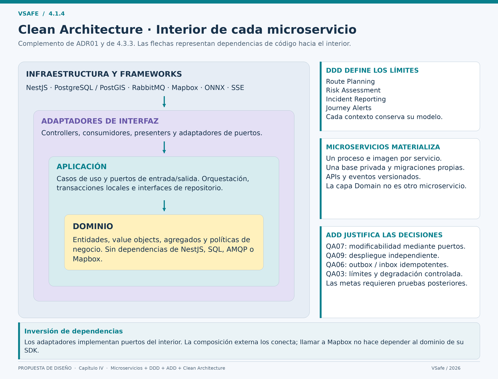

## 4.2. Strategic-Level Domain-Driven Design

El diseño estratégico del dominio organiza VSafe alrededor de capacidades del negocio. La separación se fundamenta en diferencias de lenguaje, reglas, datos y ciclos de vida. Los cuatro contextos identificados se materializan en microservicios independientes, con contratos HTTP y eventos de integración.

Una ruta describe un recorrido posible; una estimación expresa una evaluación contextual; un reporte representa una contribución comunitaria; y una alerta comunica información pertinente para un recorrido activo. Estos conceptos se relacionan, pero no comparten las mismas reglas.

### 4.2.1. EventStorming

EventStorming permite explorar el dominio mediante eventos que representan hechos relevantes del negocio. Para VSafe, el análisis se estructura alrededor de planificación de recorridos, contribución de incidentes y acompañamiento durante el desplazamiento. [Brandolini, EventStorming](https://www.eventstorming.com/).

Se propone una sesión de entre una y dos horas con representantes del equipo y de los segmentos objetivo. El modelo presentado constituye una base para esa sesión y deberá ajustarse con sus observaciones.

#### Organización del análisis

| Etapa | Actividad | Resultado esperado |
|---|---|---|
| Identificación de hechos | Enumerar acontecimientos relevantes expresados en pasado. | Catálogo inicial de eventos. |
| Ordenamiento | Ubicar los eventos según su relación temporal. | Flujos de planificación y reportes. |
| Identificación de causas | Asociar actores y comandos que desencadenan los eventos. | Relación entre intención y resultado. |
| Identificación de reglas | Incorporar políticas de publicación, vigencia y alertas. | Reglas del dominio. |
| Detección de dudas | Señalar criterios todavía no definidos. | Hotspots para discusión. |
| Revisión de límites | Agrupar eventos con lenguaje y responsabilidades comunes. | Contextos candidatos. |

#### Catálogo inicial de eventos

| Actor o fuente | Comando o acción | Evento del dominio | Regla o consecuencia |
|---|---|---|---|
| Usuario | Solicitar alternativas. | `RouteAlternativesObtained` | Solo se presentan recorridos cartográficamente válidos. |
| Route Planning | Solicitar evaluación. | `RiskAssessmentCompleted` | La evaluación puede terminar con una clasificación o con UNKNOWN. |
| Usuario | Seleccionar una ruta. | `JourneyStarted` | Se establece una ruta activa con una versión. |
| Usuario | Enviar un reporte. | `IncidentReportSubmitted` | El reporte se almacena como pendiente. |
| Procesamiento de reportes | Evaluar formato y consistencia. | `IncidentReportAssessed` | Se determina si puede publicarse, rechazarse o revisarse como duplicado. |
| Procesamiento de reportes | Vincular un duplicado. | `ReportLinkedToIncident` | El aporte no crea un segundo incidente equivalente. |
| Política de publicación | Publicar información procesable. | `IncidentPublished` | Se comunica procedencia y condición de verificación. |
| Reloj del sistema | Evaluar vigencia. | `IncidentExpired` | El incidente deja de influir como activo. |
| Journey Alerts | Evaluar pertinencia. | `JourneyAlertCreated` | Solo se alerta sobre un recorrido activo afectado. |
| Usuario | Solicitar otro recorrido. | `JourneyRouteChanged` | Se incrementa la versión de la ruta activa. |
| Usuario o expiración | Finalizar el recorrido. | `JourneyClosed` | Se detienen las alertas y se elimina el estado temporal. |

#### Hotspots identificados

| Hotspot | Tratamiento propuesto |
|---|---|
| Diferencia entre reporte y hecho confirmado. | Mantener procedencia y estado de verificación; no atribuir confirmación a una validación automática de formato. |
| Falta de información para calcular riesgo. | Utilizar UNKNOWN y explicar la causa. |
| Reportes similares. | Detectarlos como posibles duplicados antes de sumar su influencia. |
| Tiempo de vigencia. | Configurarlo por categoría; utilizar 24 horas como hipótesis inicial del piloto. |
| Pertinencia de una alerta. | Evaluar incidente activo y proximidad al tramo restante de la ruta. |
| Cambio de recorrido mientras se procesa una alerta. | Comprobar la versión vigente antes de entregar y mostrar la notificación. |

<!-- 4.2.1. EventStorming -->

  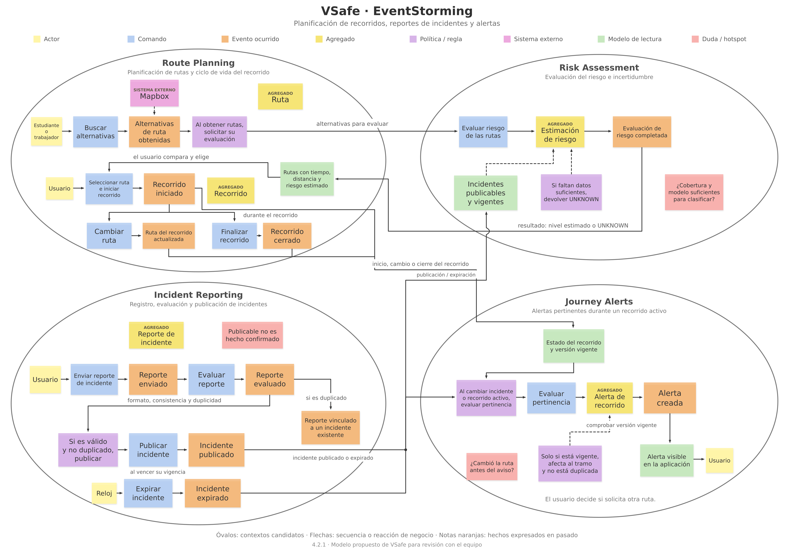

### 4.2.2. Candidate Context Discovery

La identificación de contextos combina las técnicas **start-with-value** y **look-for-pivotal-events**.

Primero se identifican las capacidades que generan el principal valor: comparación informada y estimación de riesgo. Después se analizan los eventos que representan cambios relevantes, como publicar un incidente, iniciar un recorrido o completar una evaluación.

#### Primera agrupación

Inicialmente se reconocen tres grupos:

| Grupo inicial | Capacidades incluidas | Observación |
|---|---|---|
| Navegación | Obtener rutas, estimar riesgo, seleccionar recorridos y recalcular. | Agrupa reglas cartográficas y analíticas que cambian por razones diferentes. |
| Comunidad | Registrar, clasificar y procesar reportes. | Presenta un ciclo de vida propio. |
| Acompañamiento | Mantener recorridos activos y comunicar alertas. | Depende de rutas e incidentes, pero tiene reglas temporales particulares. |

#### Refinamiento de los límites

El grupo Navegación se divide porque la obtención de rutas y la estimación de riesgo requieren modelos distintos:

- Route Planning administra alternativas y recorridos.
- Risk Assessment administra evaluaciones, cobertura, vigencia y versiones del modelo.

La evolución propuesta queda representada así:

<!-- 4.2.2. Candidate Context Discovery -->

  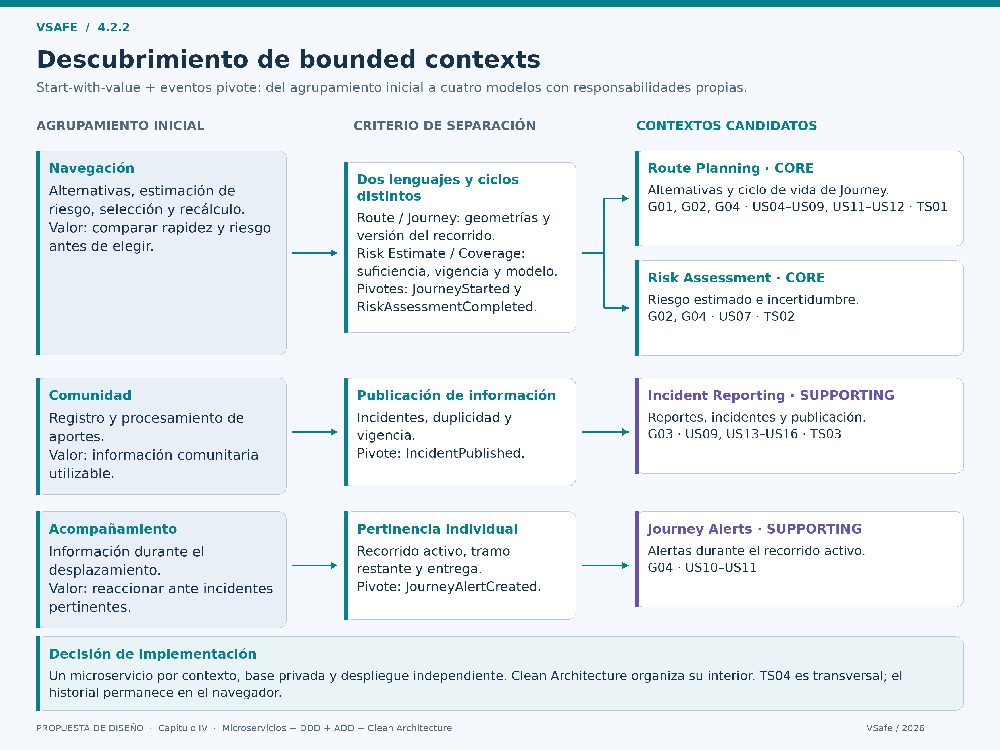

#### Contextos candidatos

| Bounded Context | Clasificación | Responsabilidad principal | Historias relacionadas |
|---|---|---|---|
| **Route Planning** | Core. | Obtener alternativas, compararlas y administrar la ruta seleccionada. | US04–US09, US11, US12 y TS01. |
| **Risk Assessment** | Core. | Evaluar el riesgo estimado y representar su incertidumbre. | US07 y TS02. |
| **Incident Reporting** | Supporting. | Gestionar aportes comunitarios e información publicable. | US09, US13–US16 y TS03. |
| **Journey Alerts** | Supporting. | Determinar y comunicar incidentes pertinentes durante un recorrido. | US10 y US11. |

La clasificación distingue capacidades centrales para la diferenciación de VSafe y capacidades que las sostienen. El Bounded Context Canvas propone este tipo de clasificación estratégica como parte del análisis de cada contexto. [DDD Crew, Bounded Context Canvas](https://github.com/ddd-crew/bounded-context-canvas).

Cada bounded context corresponde inicialmente a un microservicio de negocio con despliegue y base propios. La sesión anónima y las verificaciones comunes de acceso se incorporan al API Gateway; la autorización de recursos permanece en cada servicio. Configuración y observabilidad son capacidades de infraestructura. No se añaden contextos de negocio por cada herramienta técnica.

#### Lenguaje del dominio propuesto

| Término | Definición |
|---|---|
| **Route** | Alternativa cartográfica entre origen y destino, con geometría, distancia y duración. |
| **Journey** | Recorrido que el usuario ha activado para recibir acompañamiento. |
| **Route Version** | Número que identifica la alternativa vigente dentro de un recorrido activo. |
| **Incident Report** | Contribución enviada por un usuario sobre una situación observada. |
| **Published Incident** | Información procesada y habilitada para consulta según la política de publicación. |
| **Risk Estimate** | Evaluación contextual de una ruta mediante un método y datos identificables. |
| **Coverage** | Disponibilidad y suficiencia de información para una zona y periodo. |
| **Validity Period** | Intervalo durante el cual un dato o evaluación puede considerarse vigente. |
| **Journey Alert** | Comunicación sobre un incidente pertinente para un recorrido activo. |
| **Unknown Risk** | Estado utilizado cuando no existe evidencia suficiente para clasificar una ruta. |

### 4.2.3. Domain Message Flows Modeling

La colaboración se modela mediante **Domain Storytelling**, utilizando actores, objetos de trabajo y actividades numeradas. Esta representación permite explicar quién realiza una actividad, sobre qué información y con qué participante colabora. [Hofer y Schwentner, Domain Storytelling Quick-Start Guide](https://domainstorytelling.org/quick-start-guide).

Los siguientes diagramas muestran escenarios concretos. Las variaciones y errores se describen después de cada historia.

#### Historia 1. Comparación informada de rutas

Un estudiante define origen y destino. Route Planning obtiene alternativas del proveedor cartográfico y solicita su evaluación a Risk Assessment. Finalmente, presenta información comparable para que el estudiante seleccione un recorrido.

<!-- 4.2.3. Domain Message Flows Modeling: comparar rutas -->

  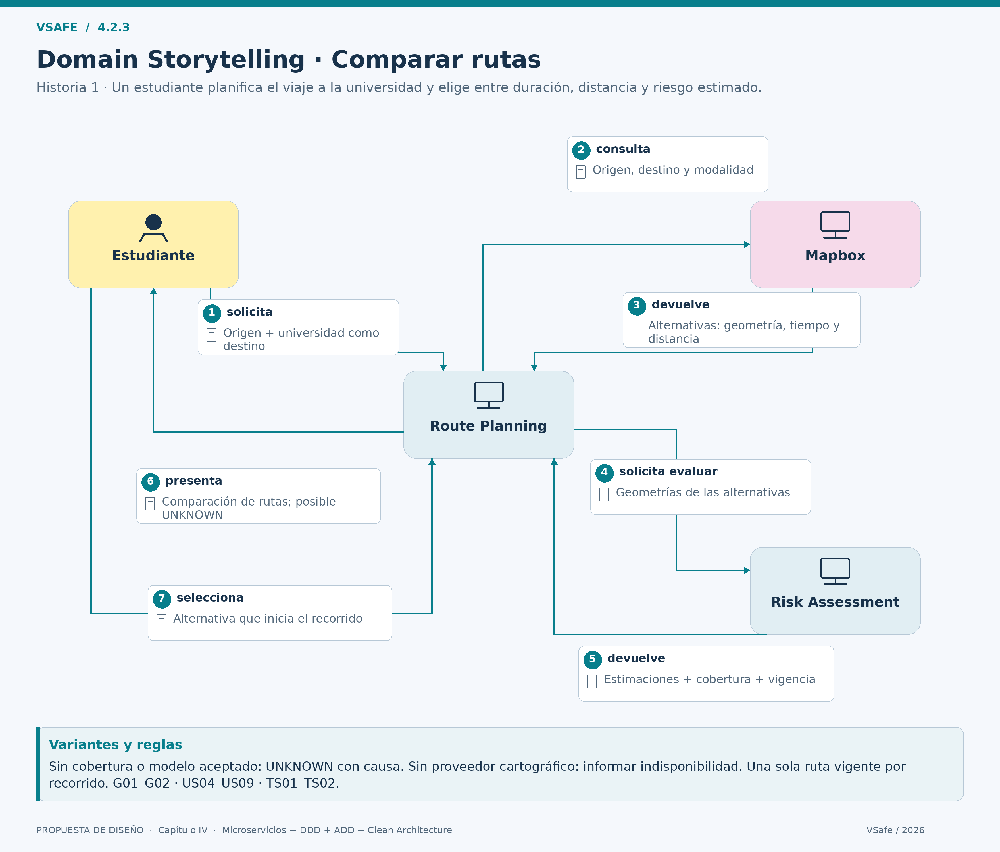

Si Risk Assessment no dispone de información suficiente, devuelve UNKNOWN con su causa. Route Planning conserva las alternativas cartográficas disponibles y permite comparar sus demás características.

Si el proveedor no responde, el sistema informa indisponibilidad; no fabrica geometrías ni tiempos.

#### Historia 2. Registro y publicación de un incidente

Un trabajador reporta un incidente y confirma su ubicación aproximada. Incident Reporting comprueba el aporte y determina su condición de publicación.

Cuando el reporte se incorpora como incidente publicable, Risk Assessment y Journey Alerts reciben la información necesaria para actualizar sus proyecciones.

<!-- 4.2.3. Domain Message Flows Modeling: reportar incidente -->

  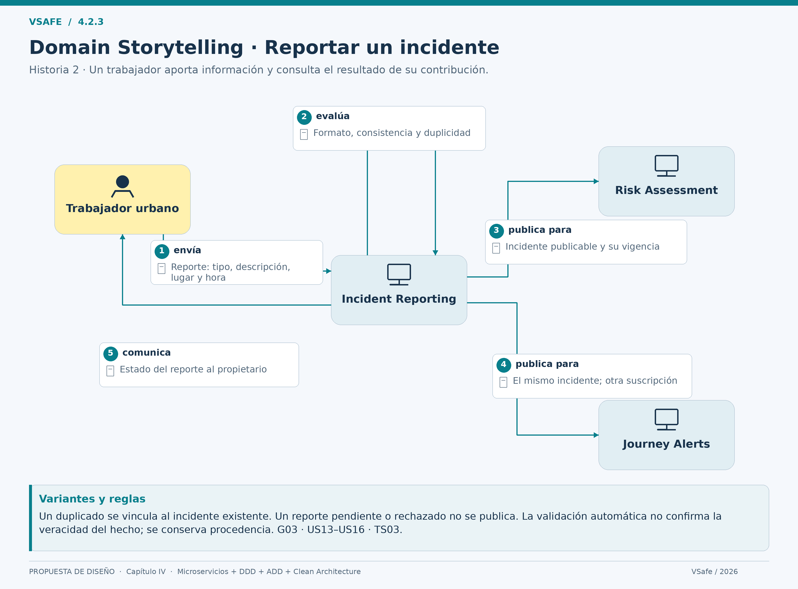

La detección de un posible duplicado evita crear un segundo incidente equivalente. Un reporte rechazado o todavía pendiente no se incorpora a la evaluación de rutas.

#### Historia 3. Alerta y cambio de recorrido

Journey Alerts recibe información de un incidente publicado, evalúa su relación con un recorrido activo y entrega una alerta. El usuario decide solicitar una nueva alternativa a Route Planning.

<!-- 4.2.3. Domain Message Flows Modeling: alerta y recálculo -->

  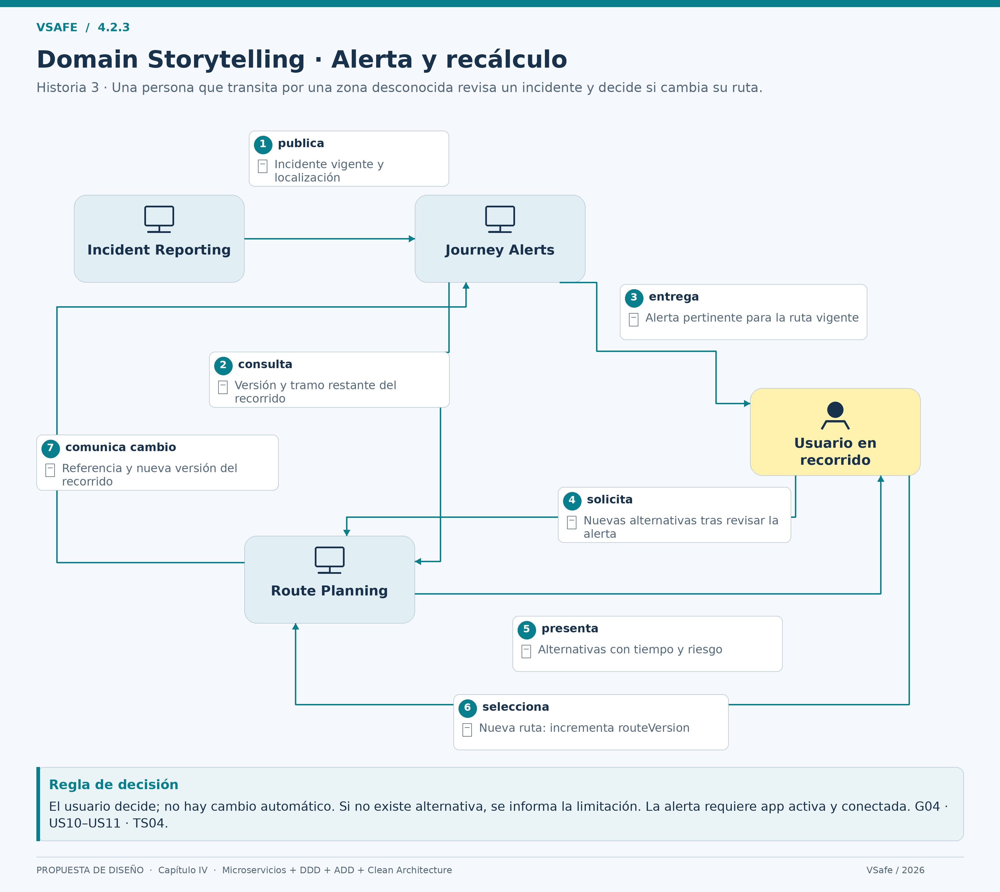

Si no existe una alternativa, se mantiene visible la información del incidente y se comunica la limitación. Si el usuario selecciona otra ruta, se incrementa su versión y se actualizan las condiciones utilizadas por Journey Alerts.

#### Contratos de colaboración

| Mensaje | Emisor | Receptor | Tipo | Información principal |
|---|---|---|---|---|
| `FindRouteAlternatives` | Aplicación web. | Route Planning. | Solicitud. | Origen, destino y modalidad. |
| `AssessRoutes` | Route Planning Service. | Risk Assessment Service. | HTTP interno síncrono. | Geometrías, instante de consulta e identificadores de ruta; timeout y autenticación entre servicios. |
| `SubmitIncidentReport` | Aplicación web. | Incident Reporting. | Comando. | Categoría, descripción, ubicación aproximada y momento observado. |
| `IncidentPublished` | Incident Reporting. | Risk Assessment y Journey Alerts. | Evento. | Incidente, categoría, ubicación, vigencia, procedencia y versión. |
| `IncidentExpired` | Incident Reporting. | Risk Assessment y Journey Alerts. | Evento. | Identificador, fecha de expiración y versión. |
| `JourneyStarted` | Route Planning Service. | Journey Alerts Service. | Evento por RabbitMQ. | Identificador del recorrido, versión, expiración y referencia de propietario; el consumidor consulta la geometría vigente mediante un contrato interno. |
| `JourneyRouteChanged` | Route Planning. | Journey Alerts. | Evento. | Recorrido y nueva versión de ruta. |
| `JourneyClosed` | Route Planning. | Journey Alerts. | Evento. | Recorrido y motivo de cierre. |
| `JourneyAlertCreated` | Journey Alerts. | Canal de entrega al cliente. | Evento interno. | Alerta, recorrido, incidente y versión de ruta. |

Los eventos incorporarán `eventId`, `occurredAt`, `schemaVersion`, `aggregateVersion` y un identificador de correlación. Los consumidores comprobarán duplicados y versiones antes de aplicar cambios. La comunicación de consultas se realiza mediante HTTP interno y la distribución de eventos mediante RabbitMQ. Cada consumidor actualiza únicamente su base privada. Los eventos con una versión faltante activan reconciliación con el productor; los eventos de recorridos no contienen coordenadas precisas.

### 4.2.4. Bounded Context Canvases

Los canvases detallan propósito, clasificación, lenguaje, capacidades, reglas y dependencias de cada contexto.

Su elaboración sigue una secuencia de definición general, identificación de reglas, captura del lenguaje, análisis de capacidades, revisión de dependencias y crítica del diseño.

#### Bounded Context Canvas: Route Planning

| Elemento | Definición |
|---|---|
| **Nombre** | Route Planning. |
| **Propósito** | Permitir que el usuario obtenga, compare y seleccione alternativas de recorrido. |
| **Clasificación estratégica** | Core domain. |
| **Valor para el negocio** | Hace posible la principal experiencia de comparación de VSafe y contribuye a G01 y G02. |
| **Usuarios** | Estudiantes y trabajadores. |
| **Lenguaje ubicuo** | Route, Origin, Destination, Route Alternative, Journey y Route Version. |
| **Capacidades** | Definir puntos, consultar alternativas, asociar evaluaciones, seleccionar una ruta, recalcular y cerrar recorridos. |
| **Datos propios** | Solicitudes de alternativas, rutas seleccionadas y estado temporal de recorridos activos. |
| **Reglas de negocio** | Origen y destino deben ser válidos; una alternativa debe corresponder a la modalidad; solo una versión de ruta está vigente por recorrido. |
| **Reglas de vigencia** | Una estimación vencida se vuelve a solicitar antes de presentarse como actual. |
| **Entradas** | Solicitudes del usuario, alternativas del proveedor y evaluaciones de Risk Assessment. |
| **Salidas** | Comparaciones, rutas activas y eventos de inicio, cambio y cierre. |
| **Dependencias** | Proveedor cartográfico y Risk Assessment. |
| **Límites** | No valida reportes ni decide los umbrales del modelo de riesgo. |
| **Capas de capacidades** | Experiencia de planificación; coordinación de consultas; integración cartográfica. |
| **Crítica del diseño** | Debe evitar convertirse en un módulo que concentre todas las reglas. La estimación y la pertinencia de alertas permanecen en sus respectivos contextos. |

<!-- 4.2.4. Bounded Context Canvas: Route Planning -->

  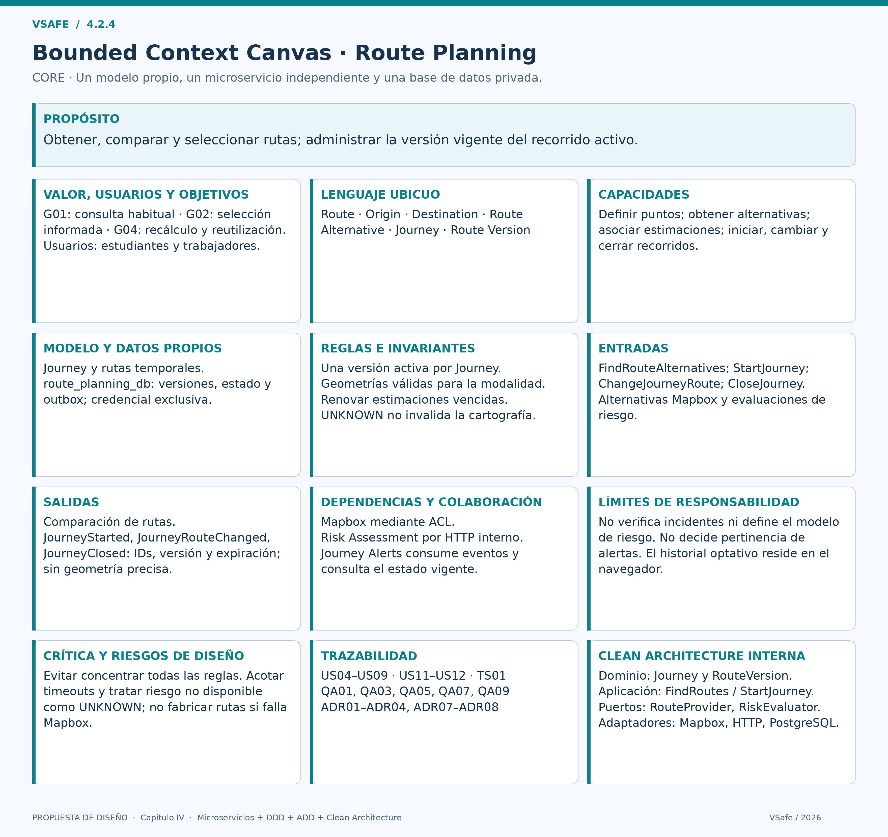

#### Bounded Context Canvas: Risk Assessment

| Elemento | Definición |
|---|---|
| **Nombre** | Risk Assessment. |
| **Propósito** | Producir evaluaciones comparables y explicar cuándo la información es insuficiente. |
| **Clasificación estratégica** | Core domain. |
| **Valor para el negocio** | Sostiene la diferenciación de VSafe y contribuye a G02 y G04. |
| **Consumidor principal** | Route Planning. |
| **Lenguaje ubicuo** | Risk Estimate, Coverage, Model Version, Assessment Time, Validity Period y Unknown Risk. |
| **Capacidades** | Construir características geoespaciales, ejecutar inferencia, revisar suficiencia y emitir resultados con metadatos. |
| **Datos propios** | Proyección de incidentes para análisis, metadatos del modelo y evaluaciones temporales. |
| **Reglas de negocio** | Ausencia de reportes no implica bajo riesgo; una evaluación debe identificar método, vigencia y cobertura. |
| **Reglas del modelo** | Solo una versión aceptada puede emitir LOW, MEDIUM o HIGH; un fallo o falta de evidencia produce UNKNOWN. |
| **Entradas** | Geometrías de rutas y eventos de publicación, modificación o expiración de incidentes. |
| **Salidas** | Evaluaciones asociadas a cada alternativa. |
| **Dependencias** | Información publicable de Incident Reporting y motor de inferencia. |
| **Límites** | No obtiene rutas del proveedor ni administra sesiones de navegación. |
| **Capas de capacidades** | Preparación de información; evaluación; interpretación y comunicación de incertidumbre. |
| **Crítica del diseño** | Debe distinguir calidad técnica de la inferencia y validez de la información. Un servicio disponible puede devolver una evaluación no utilizable. |

<!-- 4.2.4. Bounded Context Canvas: Risk Assessment -->

  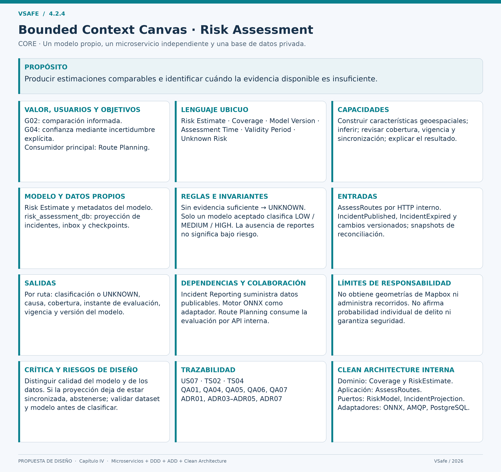

#### Bounded Context Canvas: Incident Reporting

| Elemento | Definición |
|---|---|
| **Nombre** | Incident Reporting. |
| **Propósito** | Gestionar aportes comunitarios y determinar qué información puede consultarse como incidente publicable. |
| **Clasificación estratégica** | Supporting domain. |
| **Valor para el negocio** | Facilita contribuciones y mejora la información disponible; contribuye a G03. |
| **Usuarios** | Miembros de la comunidad. |
| **Lenguaje ubicuo** | Incident Report, Category, Observed At, Approximate Location, Duplicate Candidate y Published Incident. |
| **Capacidades** | Registrar, clasificar, validar, detectar duplicados, publicar, expirar y consultar estados. |
| **Datos propios** | Reportes, incidentes, categorías, relaciones de duplicidad y trazabilidad de procesamiento. |
| **Reglas de negocio** | El reporte requiere información mínima; la publicación no equivale a confirmación del hecho; los duplicados no se cuentan como incidentes independientes. |
| **Reglas temporales** | La vigencia se calcula desde el momento observado y puede variar por categoría. |
| **Entradas** | Reportes de usuarios y acciones programadas de revisión temporal. |
| **Salidas** | Estados de reportes e información publicable para otros contextos. |
| **Dependencias** | Sesión y autorización técnica del propietario. |
| **Límites** | No selecciona rutas ni decide si un incidente afecta a un recorrido particular. |
| **Capas de capacidades** | Recepción; evaluación; publicación y mantenimiento de vigencia. |
| **Crítica del diseño** | La validación automática debe evitar aparentar una verificación de hechos. Los estados y mensajes deben expresar claramente qué comprobaciones se realizaron. |

<!-- 4.2.4. Bounded Context Canvas: Incident Reporting -->

  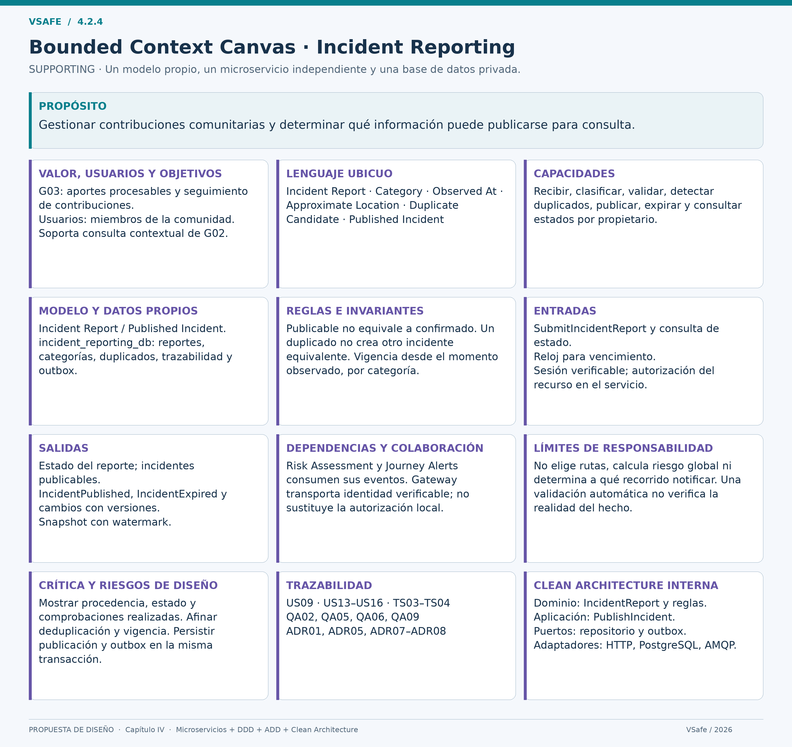

#### Bounded Context Canvas: Journey Alerts

| Elemento | Definición |
|---|---|
| **Nombre** | Journey Alerts. |
| **Propósito** | Informar incidentes pertinentes para un recorrido activo. |
| **Clasificación estratégica** | Supporting domain. |
| **Valor para el negocio** | Aporta utilidad durante el desplazamiento y contribuye a G04. |
| **Usuarios** | Personas con un recorrido activo. |
| **Lenguaje ubicuo** | Active Journey, Remaining Route, Relevant Incident, Journey Alert y Delivery Status. |
| **Capacidades** | Mantener suscripciones, evaluar proximidad, generar alertas, deduplicar y recuperar entregas. |
| **Datos propios** | Proyección de recorridos activos, incidentes pertinentes, alertas y estados de entrega. |
| **Reglas de negocio** | Solo se generan alertas para recorridos activos; el incidente debe estar vigente y afectar el tramo restante. |
| **Reglas de consistencia** | La versión de ruta se comprueba antes de emitir; una reentrega no crea una nueva alerta lógica. |
| **Entradas** | Eventos de recorridos y de incidentes. |
| **Salidas** | Alertas destinadas a la sesión propietaria. |
| **Dependencias** | Route Planning e Incident Reporting. |
| **Límites** | No modifica automáticamente la ruta ni calcula su riesgo global. |
| **Capas de capacidades** | Suscripción; determinación de pertinencia; entrega y recuperación. |
| **Crítica del diseño** | Debe separar pertinencia y transporte. Una alerta correctamente generada puede no ser visible si el navegador pierde conexión o queda suspendido. |

<!-- 4.2.4. Bounded Context Canvas: Journey Alerts -->

  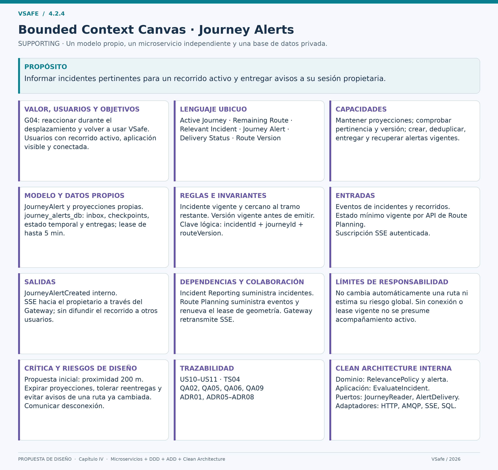

### 4.2.5. Context Mapping

El Context Map representa las relaciones estructurales entre los contextos y define quién proporciona información, quién la consume y cómo se evita trasladar modelos externos al dominio.

Los patrones seleccionados consideran las relaciones Customer/Supplier, Open Host Service, Published Language y Anti-corruption Layer. [DDD Crew, Context Mapping](https://github.com/ddd-crew/context-mapping).

#### Alternativas evaluadas

| Alternativa | Beneficio | Dificultad | Decisión |
|---|---|---|---|
| Unir rutas y riesgo. | Menos interfaces internas. | Mezcla integración cartográfica con evolución analítica. | Separar Route Planning y Risk Assessment. |
| Unir incidentes y alertas. | Acceso inmediato a los reportes. | Mezcla publicación general con pertinencia individual. | Mantener contextos separados. |
| Compartir todas las entidades. | Reduce mapeos iniciales. | Acopla ciclos de vida y cambios. | Compartir contratos, no un modelo de dominio completo. |
| Un microservicio por bounded context. | Despliegue y propiedad de datos independientes. | Requiere contratos, observabilidad y consistencia eventual. | Adoptar cuatro servicios de negocio, conforme a CON08. |
| Utilizar eventos para todas las consultas. | Uniformidad del transporte. | Complica respuestas que el usuario necesita inmediatamente. | Combinar HTTP entre servicios y eventos asíncronos mediante RabbitMQ. |

#### Mapa de contextos

Las flechas representan suministro de información o servicios desde el proveedor hacia el consumidor.

<!-- 4.2.5. Context Mapping -->

  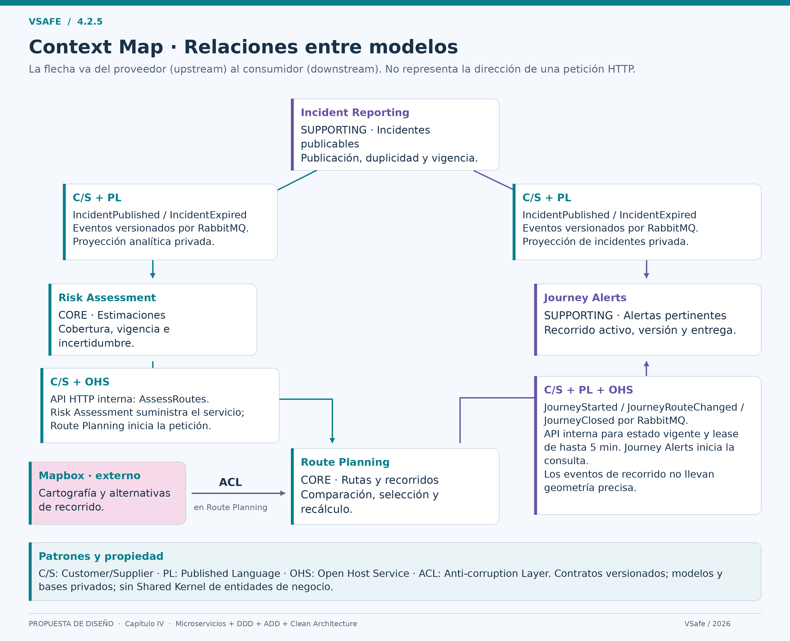

#### Relaciones seleccionadas

| Proveedor — Upstream | Consumidor — Downstream | Patrón | Aplicación |
|---|---|---|---|
| Proveedor cartográfico. | Route Planning. | Anti-corruption Layer. | El adaptador transforma el modelo externo a tipos propios. |
| Incident Reporting. | Risk Assessment. | Customer/Supplier y Published Language. | El consumidor recibe eventos estables para actualizar su proyección analítica. |
| Incident Reporting. | Journey Alerts. | Customer/Supplier y Published Language. | El consumidor recibe incidentes publicables y sus cambios de vigencia. |
| Risk Assessment. | Route Planning. | Customer/Supplier y Open Host Service. | Un API HTTP interno versionado permite solicitar evaluaciones sin acceder a su base privada. |
| Route Planning. | Journey Alerts. | Customer/Supplier y Published Language. | Los eventos comunican inicio, cambio de versión y cierre de recorridos. |

No se propone un Shared Kernel de entidades de negocio para el MVP. Los identificadores y contratos pueden compartirse mediante esquemas versionados, manteniendo independientes las reglas, bases de datos e imágenes de despliegue de cada microservicio.

Los consumidores aplicarán estas reglas de integración:

1. Ignorar eventos ya procesados.
2. Rechazar versiones incompatibles del contrato.
3. Aplicar solo cambios más recientes que el estado conocido.
4. Mantener referencias por identificador.
5. Evitar consultas directas a las bases privadas de otros microservicios.
6. Eliminar las proyecciones temporales cuando termine su finalidad.

## 4.3. Software Architecture

La arquitectura se representa mediante las vistas System Landscape, System Context, Container y Deployment.

En C4, un container representa una aplicación o un almacén de datos. Por ello, las vistas de containers describen responsabilidades lógicas y tecnologías, mientras que Deployment muestra dónde se ejecutan sus instancias. [Brown, Container diagram](https://c4model.com/diagrams/container); [Brown, Deployment diagram](https://c4model.com/diagrams/deployment).

Los diagramas siguientes presentan el modelo para revisión. La versión formal del informe deberá conservar su fuente en Structurizr, de acuerdo con CON05.

### 4.3.1. Software Architecture System Landscape Diagram

El System Landscape ubica a VSafe dentro de su entorno de uso y desarrollo.

Los estudiantes y trabajadores utilizan el producto. El proveedor cartográfico aporta mapas y alternativas de recorrido. El equipo mantiene el código, los contratos y los diagramas mediante GitHub.

<!-- 4.3.1. Software Architecture System Landscape Diagram -->

  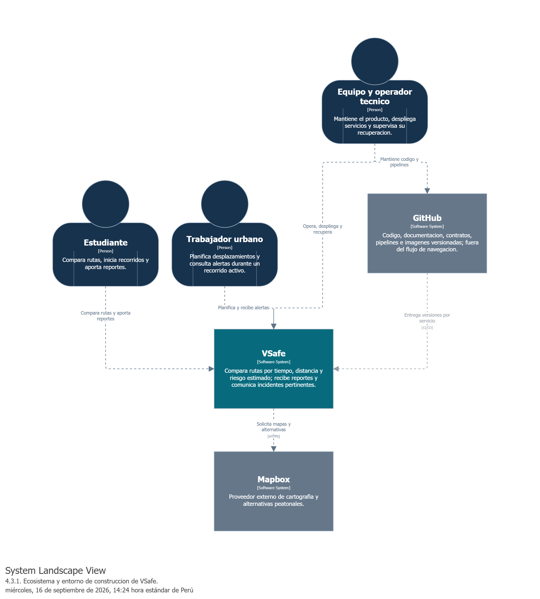

GitHub forma parte del entorno de construcción y mantenimiento. La navegación de los usuarios no depende de consultar GitHub durante su ejecución.

El diseño no presupone que exista una integración disponible con una municipalidad o una fuente oficial de incidentes. La incorporación de esas fuentes requerirá comprobar acceso, cobertura, formato y condiciones de uso.

### 4.3.2. Software Architecture Context Level Diagrams

El Context Diagram representa a VSafe como un sistema único, delimitando sus usuarios y dependencias externas.

<!-- 4.3.2. Software Architecture Context Level Diagram -->

  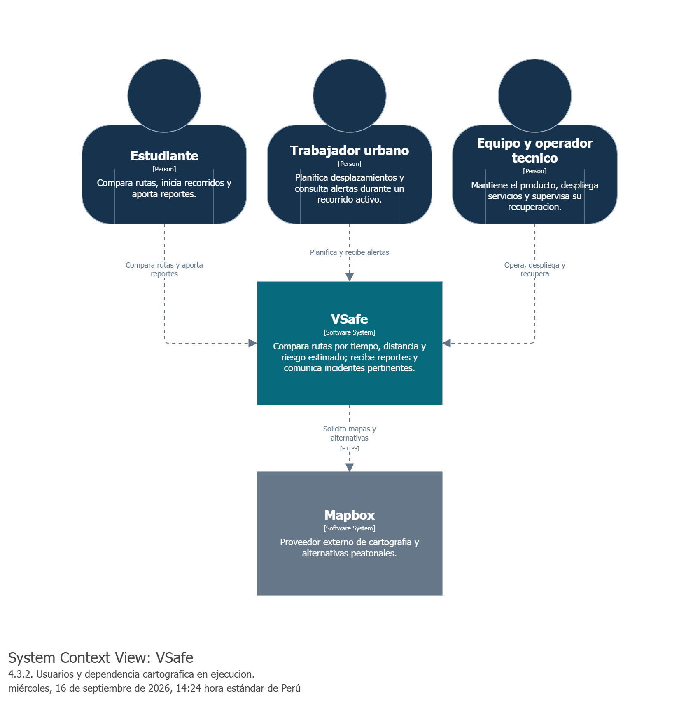

#### Responsabilidades del sistema

| Elemento | Responsabilidad |
|---|---|
| Estudiante | Definir recorridos, comparar alternativas y aportar información de incidentes. |
| Trabajador | Planificar desplazamientos, consultar contexto y reaccionar ante alertas. |
| VSafe | Coordinar navegación, estimación de riesgo, reportes y acompañamiento. |
| Proveedor cartográfico | Entregar datos cartográficos y alternativas de recorrido. |
| Operador técnico | Supervisar disponibilidad, fallos, trabajos pendientes y recuperación. |

La geolocalización procede del dispositivo a través de las capacidades del navegador y requiere autorización. VSafe debe informar al usuario cuando origen y destino se envían al proveedor para calcular las rutas.

### 4.3.3. Software Architecture Container Level Diagrams

La solución incluye un API Gateway y cuatro microservicios de negocio desplegables de manera independiente. Cada servicio tiene su propia base de datos y administra sus procesos de recepción, consumo de eventos y publicación. RabbitMQ conecta productores y consumidores sin convertir sus bases en un almacenamiento compartido.

<!-- 4.3.3. Software Architecture Container Level Diagram -->

  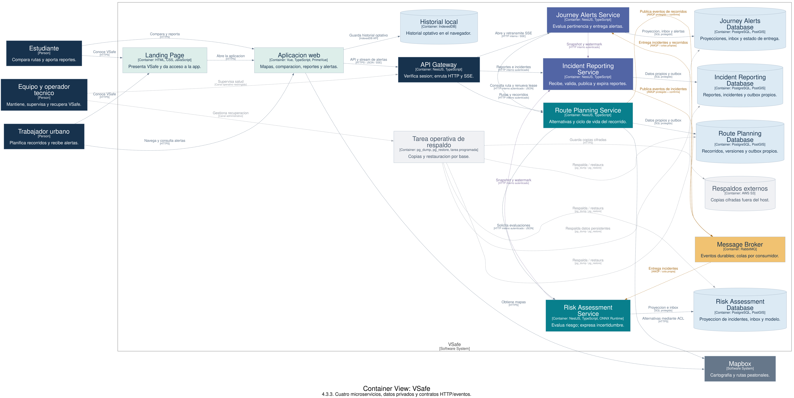

<!-- Diagrama de contenedores -->

  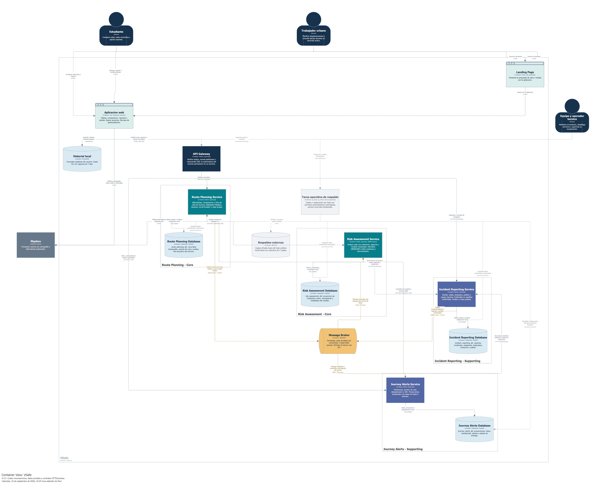

#### Descripción de containers

| Container | Tecnología propuesta | Responsabilidad |
|---|---|---|
| **Landing Page** | HTML5, CSS3 y JavaScript. | Comunicar la propuesta de valor y conducir a la aplicación. |
| **Aplicación web** | Vue, TypeScript y PrimeVue. | Gestionar mapas, comparación, reportes, permisos y visualización de alertas. |
| **API Gateway** | NestJS y TypeScript. | Verificar la sesión, emitir contexto interno autorizado, enrutar solicitudes y retransmitir SSE. |
| **Route Planning Service** | NestJS y TypeScript. | Obtener alternativas, consultar evaluaciones y administrar recorridos; publicar sus eventos. |
| **Risk Assessment Service** | NestJS, TypeScript y ONNX Runtime. | Mantener la proyección de incidentes, evaluar rutas y devolver incertidumbre cuando corresponda. |
| **Incident Reporting Service** | NestJS y TypeScript. | Registrar, evaluar, publicar y expirar reportes; mantener su outbox y relay. |
| **Journey Alerts Service** | NestJS y TypeScript. | Consumir eventos, evaluar pertinencia, deduplicar alertas y entregarlas mediante SSE. |
| **Message Broker** | RabbitMQ. | Enrutar eventos mediante exchange, colas durables por consumidor y colas de errores. |
| **Route Planning Database** | PostgreSQL y PostGIS. | Recorridos temporales, versiones y outbox; acceso exclusivo de Route Planning. |
| **Risk Assessment Database** | PostgreSQL y PostGIS. | Proyección analítica, inbox, checkpoints y metadatos de evaluación; acceso exclusivo de Risk Assessment. |
| **Incident Reporting Database** | PostgreSQL y PostGIS. | Reportes, incidentes, estados, categorías y outbox; acceso exclusivo de Incident Reporting. |
| **Journey Alerts Database** | PostgreSQL y PostGIS. | Proyecciones temporales, inbox, checkpoints, alertas y estado de entrega; acceso exclusivo de Journey Alerts. |
| **Historial local** | IndexedDB. | Conservar consultas autorizadas en el navegador. |
| **Respaldos** | Almacenamiento de objetos fuera del host. | Conservar copias por servicio con políticas de retención y recuperación. |

#### Distribución de contextos y despliegues

| Bounded Context | Microservicio | Base privada | Unidad de despliegue |
|---|---|---|---|
| Route Planning | Route Planning Service. | `route_planning_db`. | Imagen y pipeline `route-planning-service`. |
| Risk Assessment | Risk Assessment Service. | `risk_assessment_db`. | Imagen y pipeline `risk-assessment-service`. |
| Incident Reporting | Incident Reporting Service. | `incident_reporting_db`. | Imagen y pipeline `incident-reporting-service`. |
| Journey Alerts | Journey Alerts Service. | `journey_alerts_db`. | Imagen y pipeline `journey-alerts-service`. |

Cada servicio controla sus repositorios y migraciones. Sus relays e inbox pertenecen al mismo propietario; no existe una tabla de integración que permita a todos los servicios leer los datos privados de los demás. PostgreSQL puede compartir servidor físico en el piloto, pero las bases, roles y permisos se mantienen separados.

La aplicación accede a rutas públicas a través del gateway. Risk Assessment expone únicamente contratos internos; no requiere un endpoint público para el usuario. Los servicios permanecen en red privada y autentican las llamadas internas, aun cuando procedan de esa red.

#### Comunicaciones principales

| Origen | Destino | Mecanismo | Finalidad |
|---|---|---|---|
| Aplicación web. | API Gateway. | HTTPS y JSON. | Acceder a las operaciones públicas mediante una entrada controlada. |
| API Gateway. | Route Planning, Incident Reporting o Journey Alerts. | HTTP protegido y contexto de identidad verificable. | Enrutar la solicitud al propietario de la capacidad. |
| Route Planning Service. | Risk Assessment Service. | HTTP interno síncrono con timeout. | Solicitar evaluación de alternativas sin consultar su base. |
| Journey Alerts Service. | Route Planning Service. | HTTP interno autenticado. | Obtener y renovar el mínimo estado vigente de un recorrido. |
| Route Planning Service. | Mapbox. | HTTPS. | Obtener alternativas cartográficas. |
| Aplicación web. | Proveedor de mapas. | HTTPS. | Obtener cartografía con credenciales públicas restringidas. |
| Route Planning e Incident Reporting. | RabbitMQ. | AMQP protegido y publisher confirms. | Publicar eventos desde sus respectivos outboxes. |
| RabbitMQ. | Risk Assessment y Journey Alerts. | Colas por consumidor y acuse manual. | Entregar eventos para actualizar proyecciones privadas. |
| Journey Alerts Service. | Aplicación web, mediante gateway. | SSE sobre HTTPS. | Entregar alertas autorizadas y recuperar mensajes vigentes. |
| Cada microservicio. | Su propia base. | Credencial exclusiva y conexión protegida. | Mantener datos, versiones y transacciones locales. |
| Tarea operativa de respaldo. | Bases privadas y almacenamiento de copias. | Acceso administrativo restringido. | Generar y recuperar respaldos por propietario. |

#### Contratos públicos propuestos

El gateway conserva una dirección pública estable, mientras la operación pertenece a un microservicio. Cada servicio mantiene su especificación OpenAPI y las pruebas de sus consumidores.

| Operación | Endpoint público | Servicio responsable | Resultado esperado |
|---|---|---|---|
| Consultar alternativas. | `POST /api/v1/routes/search` | Route Planning. | Rutas con distancia, duración y evaluación o incertidumbre. |
| Iniciar recorrido. | `POST /api/v1/journeys` | Route Planning. | Identificador y versión inicial. |
| Cambiar ruta. | `PATCH /api/v1/journeys/{id}/route` | Route Planning. | Nueva versión del recorrido. |
| Cerrar recorrido. | `DELETE /api/v1/journeys/{id}` | Route Planning. | Cierre local, evento durable y limpieza temporal. |
| Registrar reporte. | `POST /api/v1/incident-reports` | Incident Reporting. | Identificador y estado pendiente. |
| Consultar reporte propio. | `GET /api/v1/incident-reports/{id}` | Incident Reporting. | Estado autorizado por propietario. |
| Consultar incidentes aplicables. | `GET /api/v1/incidents` | Incident Reporting. | Información publicable filtrada por zona y vigencia. |
| Recibir alertas. | `GET /api/v1/journeys/{id}/alerts/stream` | Journey Alerts. | Flujo SSE autorizado y retransmitido por el gateway. |

#### Contratos internos propuestos

| Endpoint interno | Propietario | Consumidor | Condiciones |
|---|---|---|---|
| `POST /internal/v1/risk-assessments` | Risk Assessment. | Route Planning. | Lista acotada de rutas; respuesta versionada; timeout y resultado UNKNOWN ante insuficiencia. |
| `GET /internal/v1/journeys/{id}/active` | Route Planning. | Journey Alerts. | Identidad técnica autorizada; devuelve versión, geometría mínima y expiración; recorrido cerrado responde sin datos activos. |
| `GET /internal/v1/incidents/snapshot` | Incident Reporting. | Risk Assessment y Journey Alerts. | Snapshot paginado con watermark consistente; permite reconstruir una proyección y reanudar desde una secuencia conocida. |

El snapshot se obtiene sobre una vista consistente del productor. Los cambios posteriores a su watermark se conservan para reanudación; la reconstrucción no se considera completa hasta alcanzar el checkpoint correspondiente. Estos contratos no se exponen al navegador.

Los errores públicos utilizan códigos identificables, como `INVALID_LOCATION`, `OUTSIDE_COVERAGE`, `PROVIDER_UNAVAILABLE` y `JOURNEY_NOT_ACTIVE`. La caída de Risk Assessment puede representarse en una consulta cartográfica exitosa como UNKNOWN con causa `RISK_SERVICE_UNAVAILABLE`. No se confunden la disponibilidad de rutas y la disponibilidad de una estimación informativa.

### 4.3.4. Software Architecture Deployment Diagrams

El entorno inicial contiene instancias separadas del gateway y de cada microservicio. Se propone un piloto en una región de AWS. La independencia de ejecución y despliegue se conserva aunque las instancias compartan una máquina virtual por razones operativas.

<!-- 4.3.4. Software Architecture Deployment Diagram -->

  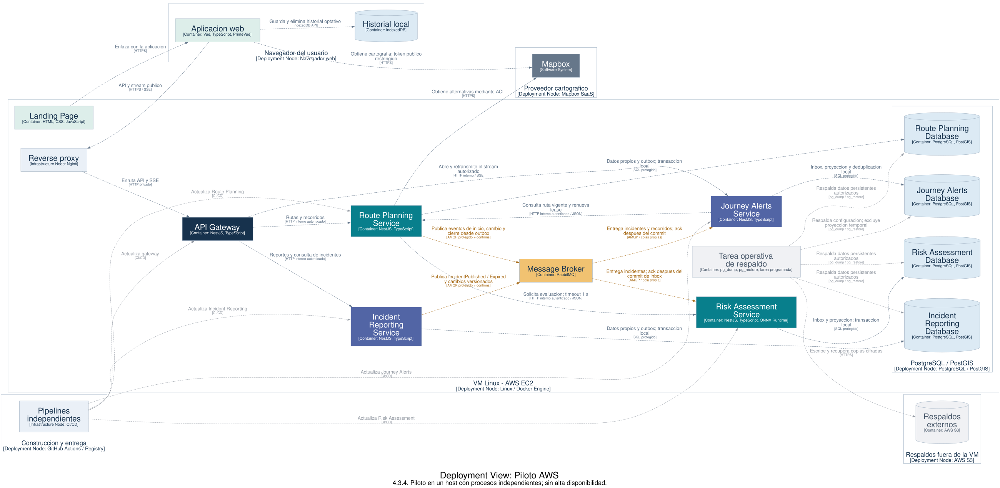

<!-- Diagrama de despliegue -->

  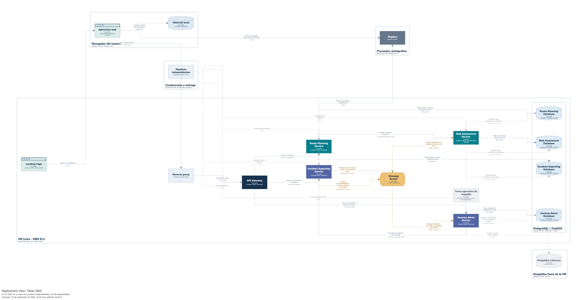

#### Nodos de despliegue

| Nodo | Elementos alojados | Consideraciones |
|---|---|---|
| Dispositivo del usuario | Navegador e IndexedDB. | Permisos y persistencia local optativa. |
| Reverse proxy | HTTPS y archivos estáticos. | Entrada pública, retransmisión de SSE sin buffering y enrutamiento al gateway. |
| API Gateway | Aplicación NestJS independiente. | Control de entrada y transporte; no contiene reglas de riesgo ni acceso a bases de negocio. |
| Route Planning | Contenedor del servicio. | Imagen propia, credencial de `route_planning_db`, timeout y Circuit Breaker. |
| Risk Assessment | Contenedor del servicio e inferencia ONNX. | Imagen y modelo versionados; credencial de `risk_assessment_db`. |
| Incident Reporting | Contenedor del servicio con su procesamiento y relay. | Imagen propia y credencial de `incident_reporting_db`. |
| Journey Alerts | Contenedor del servicio con consumidores y SSE. | Imagen propia y credencial de `journey_alerts_db`. |
| Message Broker | RabbitMQ con almacenamiento persistente. | Colas y permisos por servicio; puerto y administración sin exposición pública. |
| Servidor de persistencia | PostgreSQL y PostGIS. | Cuatro bases lógicas privadas y volumen persistente. |
| Almacenamiento de respaldos | Copias externas al host. | Retención, cifrado y acceso operativo restringido. |
| Proveedor cartográfico | Mapbox. | Dependencia externa separada de la operación interna. |

#### Configuración operativa propuesta

| Aspecto | Definición |
|---|---|
| Entornos | Desarrollo local y piloto con datos, colas y secretos separados. |
| Construcción | Una imagen por servicio y otra para el gateway; cada imagen tiene versión propia. |
| Pipelines | Construcción, pruebas de contrato, despliegue y rollback seleccionables por servicio. |
| Despliegue | Actualizar solo el servicio modificado cuando sus contratos sean compatibles; conservar los demás hashes de imagen. |
| Descubrimiento | DNS de la red de contenedores y nombres configurados por entorno; sin direcciones fijas dentro del código. |
| Persistencia | Database per Service, credenciales exclusivas y migraciones ejecutadas por el propietario. |
| Mensajería | RabbitMQ, colas durables por suscripción, confirmaciones, inbox y reintentos limitados. |
| Seguridad | HTTPS público, autenticación interna, sesiones verificables y broker/bases en red privada. |
| Escalado | Ajustar recursos o réplicas por microservicio según métricas; comprobar concurrencia e idempotencia antes de aumentar consumidores. |
| Recuperación | Respaldos por base, reconstrucción de proyecciones, reinicio controlado de consumidores y pruebas de reconciliación. |
| Observabilidad | Correlation ID entre gateway, HTTP y eventos; latencia por servicio, backlog de colas, antigüedad de outbox, UNKNOWN y errores. |
| Limitación inicial | Host, gateway, PostgreSQL y RabbitMQ sin redundancia; no se presupone alta disponibilidad. |

#### Secuencia de despliegue de una versión compatible

1. Construir la imagen del servicio modificado y ejecutar sus pruebas y contratos.
2. Ejecutar migraciones aditivas de su base con la credencial del propietario.
3. Publicar la nueva imagen y actualizar únicamente esa instancia o conjunto de réplicas.
4. Comprobar readiness, errores, consumo de eventos y compatibilidad con los servicios existentes.
5. Conservar la imagen anterior para rollback; las eliminaciones de campos se posponen hasta retirar consumidores antiguos.

Las actualizaciones incompatibles exigen una transición de versiones del contrato. No se consideran independientes si requieren cambiar simultáneamente todos los servicios para que el producto continúe funcionando.

#### Trazabilidad entre drivers y arquitectura

| Driver o capacidad | Elementos que lo atienden |
|---|---|
| Comparación de recorridos. | Aplicación web, gateway, Route Planning y adaptador cartográfico. |
| Estimación e incertidumbre. | Risk Assessment, base privada, proyección vigente y modelo versionado. |
| Reportes comunitarios. | Incident Reporting, persistencia privada y relay de outbox. |
| Alertas oportunas. | RabbitMQ, Journey Alerts, contratos de recorrido activo y SSE. |
| Integridad ante reintentos. | Transacciones locales, outbox por productor, inbox por consumidor y claves idempotentes. |
| Protección de ubicación. | Gateway, autorización por recurso en cada servicio, historial local y expiración de proyecciones. |
| Tolerancia a fallos. | Timeouts y límites de concurrencia por llamada, Circuit Breaker y abstención ante información no sincronizada. |
| Recuperabilidad. | Supervisión por proceso, almacenamiento durable, respaldos y reconciliación entre servicios. |
| Modificabilidad. | APIs y eventos versionados, adaptadores y pruebas de contratos. |
| Despliegue independiente. | Imágenes, pipelines, migraciones y datos privados de cada servicio; QA09 y CON08. |

La arquitectura responde al requisito de microservicios mediante independencia de despliegue, propiedad de datos y comunicación contractual. Sus metas de desempeño y recuperación deberán verificarse con servicios y broker ejecutándose como procesos separados. La validación del dominio y de la información de riesgo continúa siendo necesaria para que la solución resulte útil.
