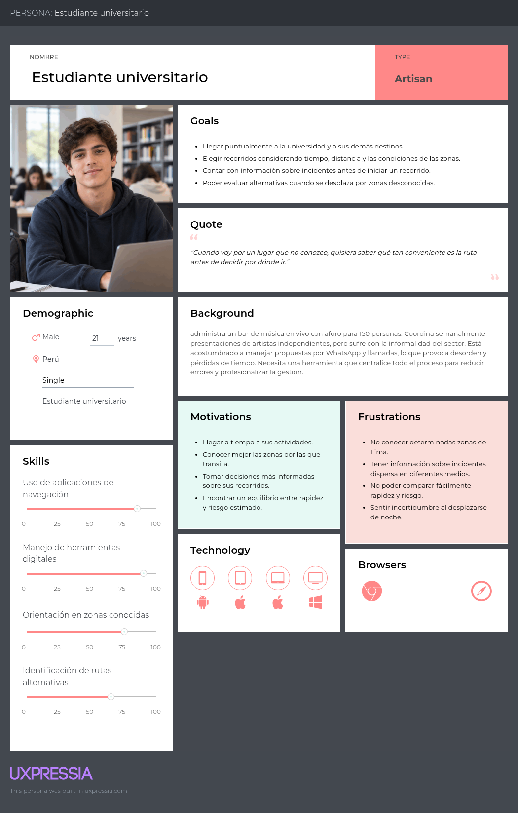
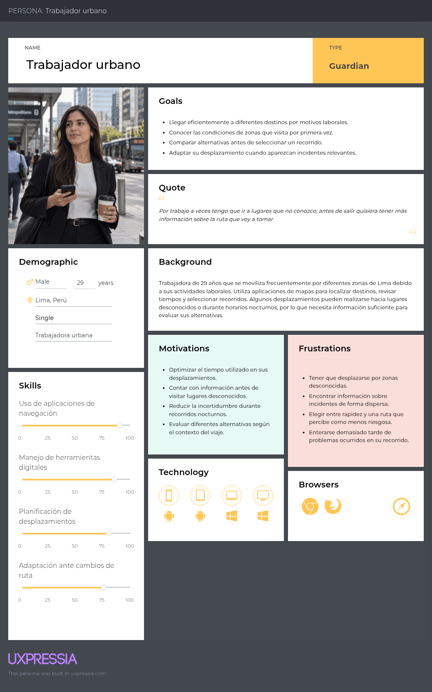
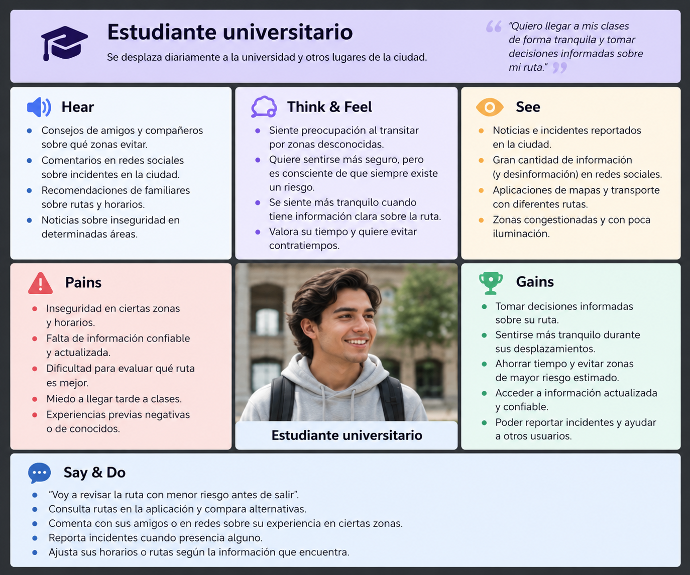
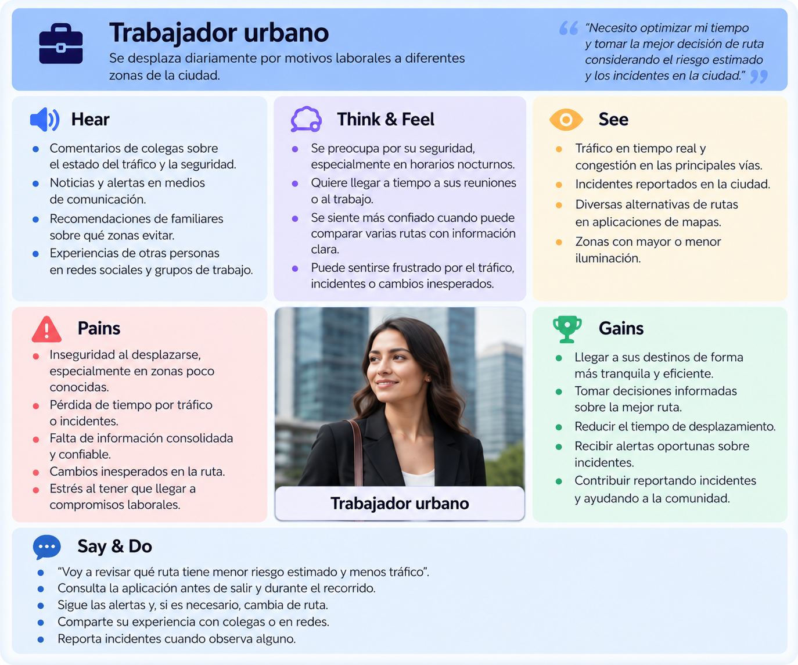

# Capítulo II : Requirements Elicitation & Analysis

## 2.1. Competidores

El análisis competitivo permite identificar plataformas relacionadas con la navegación, movilidad y seguridad urbana que poseen características similares o complementarias a VSafe. Para este análisis se consideran Google Maps, Waze, My Safetipin y Citizen, debido a que presentan funcionalidades relacionadas con la planificación de rutas, información de tráfico, reportes colaborativos, alertas de incidentes o evaluación de condiciones de seguridad urbana.

El análisis de estas plataformas permite reconocer sus principales fortalezas y debilidades, así como identificar oportunidades de diferenciación para VSafe. La propuesta de VSafe se enfoca en integrar la planificación de recorridos con información relacionada con el nivel de riesgo estimado, permitiendo que los usuarios comparen alternativas considerando principalmente tiempo, distancia e información sobre incidentes relevantes.

### 2.1.1. Análisis competitivo

| Sección | Subcategoría | VSafe | Google Maps | Waze | My Safetipin | Citizen App |
|---|---|---|---|---|---|---|
| **Perfil** | **Overview** | Plataforma de navegación urbana inteligente que compara rutas según tiempo, distancia y nivel de riesgo estimado mediante geolocalización, información de incidentes e inteligencia artificial. | Plataforma de mapas y navegación que permite buscar lugares, obtener indicaciones, visualizar rutas alternativas y consultar tráfico en tiempo real. | Aplicación de navegación colaborativa orientada principalmente a conductores, utilizando información de tráfico y reportes de su comunidad. | Plataforma enfocada en seguridad urbana que analiza información de espacios públicos para apoyar decisiones sobre desplazamientos. | Aplicación de seguridad pública que proporciona alertas e información sobre incidentes cercanos a la ubicación del usuario. |
| **Ventaja competitiva** | **¿Qué valor ofrece a los clientes?** | Integra la comparación de tiempo, distancia y riesgo estimado, acompañada de información sobre incidentes relevantes asociados al recorrido. | Amplia infraestructura cartográfica, navegación multimodal e información de tráfico en tiempo real. | Información colaborativa sobre tráfico, accidentes y condiciones de las vías que permite adaptar los recorridos. | Utiliza un Safety Score para evaluar aspectos relacionados con seguridad urbana y dispone de funcionalidades orientadas a recorridos. | Permite conocer incidentes cercanos mediante alertas basadas en ubicación e información contextual. |
| **Perfil de Marketing** | **Mercado objetivo** | Estudiantes universitarios y trabajadores urbanos que realizan desplazamientos frecuentes, especialmente por zonas desconocidas o en determinados horarios. | Público general que necesita mapas, navegación, búsqueda de lugares y planificación de desplazamientos. | Principalmente conductores que desean optimizar sus desplazamientos considerando las condiciones del tráfico. | Personas interesadas en conocer información relacionada con la seguridad de espacios urbanos durante sus desplazamientos. | Personas interesadas en conocer incidentes relacionados con seguridad que ocurren cerca de su ubicación. |
| | **Estrategias de marketing** | Posicionamiento como plataforma de movilidad urbana inteligente enfocada en decisiones informadas sobre rapidez y riesgo, inicialmente dirigida a estudiantes y trabajadores de Lima. | Integración con el ecosistema de Google y disponibilidad en múltiples plataformas y dispositivos. | Posicionamiento basado en navegación colaborativa y participación de una comunidad de conductores. | Posicionamiento basado en seguridad urbana, análisis de espacios públicos y utilización de datos. | Posicionamiento como plataforma de información y alertas en tiempo real relacionadas con seguridad pública. |
| **Perfil de Producto** | **Productos & Servicios** | Búsqueda de rutas, comparación de tiempo, distancia y riesgo estimado, visualización de incidentes, reportes comunitarios, alertas y recálculo de recorridos. | Mapas, navegación, rutas alternativas, tráfico en tiempo real, transporte público, búsqueda de lugares e información sobre incidentes viales. | Navegación, planificación de viajes, tráfico, alertas viales, reportes comunitarios y redireccionamiento. | Safety Score, mapas de seguridad, análisis de espacios urbanos y funcionalidades relacionadas con recorridos. | Alertas de incidentes cercanos, búsqueda de incidentes, actualizaciones e información contextual. |
| | **Precios & Costos** | El MVP tendrá inicialmente acceso gratuito para facilitar la validación de la propuesta. El modelo de monetización será evaluado posteriormente. | Uso general gratuito para el usuario final. | Uso gratuito para el usuario final. | Aplicación disponible gratuitamente para usuarios y servicios especializados para organizaciones y ciudades. | Funcionalidades principales gratuitas y servicios adicionales mediante Citizen Premium. |
| | **Canales de distribución (Web/Móvil)** | Landing Page, aplicación web y aplicación móvil según el alcance de VSafe. | Web, Android e iOS, además de integraciones con diferentes dispositivos y vehículos. | Android, iOS y servicios web relacionados con mapas y planificación de viajes. | Aplicaciones móviles y plataformas web pertenecientes al ecosistema Safetipin. | Principalmente aplicaciones móviles para Android e iOS y plataforma web informativa. |
| **Análisis SWOT** | **Fortalezas** | Integración de navegación, riesgo estimado, incidentes y participación comunitaria, con adaptación inicial al contexto urbano de Lima. | Amplia cobertura cartográfica, navegación multimodal, tráfico en tiempo real y ecosistema tecnológico consolidado. | Comunidad colaborativa, información vial en tiempo real y capacidad de adaptar los recorridos. | Especialización en seguridad urbana, Safety Score y experiencia analizando espacios urbanos. | Especialización en información sobre incidentes y alertas basadas en ubicación. |
| | **Debilidades** | Producto nuevo sin una comunidad inicial amplia. La calidad de las estimaciones dependerá de la disponibilidad, actualidad y confiabilidad de los datos. | No está específicamente enfocado en comparar rutas mediante un indicador explícito de riesgo de seguridad ciudadana. | Su enfoque principal está en tráfico y condiciones viales y no específicamente en estimar el riesgo de seguridad ciudadana de una ruta. | Sus funcionalidades dependen de la disponibilidad y cobertura de información existente en cada ciudad. | Su función principal es informar sobre incidentes y no proporcionar una experiencia completa de navegación entre origen y destino. |
| | **Oportunidades** | Aprovechar datos abiertos, IA, geolocalización y participación comunitaria para desarrollar estimaciones adaptadas a Lima y establecer alianzas con universidades y organizaciones. | Incorporar nuevas fuentes de información contextual y ampliar funcionalidades relacionadas con movilidad urbana. | Incorporar nuevos tipos de información colaborativa relevante durante los desplazamientos. | Expandir su metodología y cobertura hacia nuevas ciudades y proyectos de seguridad urbana. | Ampliar su cobertura geográfica e incorporar nuevas fuentes de información sobre incidentes. |
| | **Amenazas** | Competencia de plataformas consolidadas, disponibilidad limitada de datos, reportes falsos, privacidad de ubicación y responsabilidad asociada a las estimaciones de riesgo. | Competencia de otras plataformas y preocupaciones relacionadas con privacidad y datos de ubicación. | Dependencia de la participación de su comunidad y competencia de otras plataformas de navegación. | Competencia de plataformas de navegación que incorporen características similares y necesidad de mantener información actualizada. | Problemas relacionados con moderación, confiabilidad de información, privacidad, cobertura y competencia de plataformas de navegación. |

### 2.1.2. Estrategias y tácticas frente a competidores

A partir del análisis competitivo realizado, se desarrolla una matriz FODA y C.A.M.E. para establecer las estrategias que VSafe puede aplicar frente a sus competidores. La matriz relaciona las fortalezas y debilidades internas de VSafe con las oportunidades y amenazas del entorno.

<table>
  <thead>
    <tr>
      <th>MATRIZ FODA y C.A.M.E.</th>
      <th>Oportunidades: Crecimiento de soluciones de movilidad inteligente, disponibilidad de datos abiertos y mayor interés por información de seguridad urbana.</th>
      <th>Amenazas: Competidores consolidados, calidad de los datos, privacidad de ubicación y aparición de funcionalidades similares.</th>
    </tr>
  </thead>
  <tbody>
    <tr>
      <td>
        <strong>Fortalezas:</strong> 
        Integración de navegación, riesgo estimado, información de incidentes, inteligencia artificial y participación comunitaria, con un enfoque inicial adaptado al contexto urbano de Lima.
      </td>
      <td>
        <strong>Estrategia Ofensiva (F + O):</strong> 
        Aprovechar la integración de navegación, IA e información de incidentes para desarrollar una solución especializada en movilidad urbana. El enfoque inicial en Lima permitirá adaptar progresivamente el análisis de riesgo a las características del mercado local y diferenciar la propuesta frente a plataformas de navegación generalistas.
      </td>
      <td>
        <strong>Estrategia Defensiva (F + A):</strong> 
        Diferenciar VSafe frente a Google Maps, Waze y otras plataformas consolidadas mediante la comparación de tiempo, distancia y riesgo estimado. La presentación de información contextual sobre los incidentes permitirá fortalecer la transparencia de las estimaciones.
      </td>
    </tr>
    <tr>
      <td>
        <strong>Debilidades:</strong> 
        Bajo reconocimiento de marca, ausencia de una comunidad inicial, cantidad limitada de reportes propios y dependencia de la disponibilidad, actualidad y confiabilidad de los datos.
      </td>
      <td>
        <strong>Estrategia de Reorientación (D + O):</strong> 
        Aprovechar la disponibilidad de datos abiertos para reducir la dependencia inicial de reportes propios. Además, establecer alianzas con universidades, municipalidades y otras organizaciones para facilitar la obtención de información, incrementar la adopción inicial y desarrollar la comunidad de VSafe.
      </td>
      <td>
        <strong>Estrategia de Supervivencia (D + A):</strong> 
        Concentrar inicialmente VSafe en estudiantes y trabajadores urbanos de Lima. Implementar mecanismos de validación de reportes, protección de datos de ubicación y transparencia en las estimaciones para fortalecer progresivamente la confianza de los usuarios.
      </td>
    </tr>
  </tbody>
</table>

## 2.2. Entrevistas

### 2.2.1. Diseño de entrevistas

Para cada segmento se elaboró un conjunto de diez preguntas. Las entrevistas buscan explorar experiencias reales relacionadas con la planificación de recorridos, uso de aplicaciones de navegación, percepción de riesgo, desplazamientos por zonas desconocidas, horarios de viaje y acceso a información sobre incidentes.

#### Segmento 1: Estudiantes universitarios

**Objetivo de la entrevista:** Comprender cómo los estudiantes universitarios planifican sus desplazamientos hacia y desde la universidad, qué factores consideran al seleccionar una ruta y qué dificultades experimentan cuando transitan por zonas que desconocen o consideran de mayor riesgo.

1. ¿Cómo sueles desplazarte desde tu casa hacia la universidad y de regreso?

2. ¿Qué aplicaciones o herramientas utilizas normalmente para planificar tus recorridos y por qué las utilizas?

3. ¿Qué factores consideras más importantes al momento de elegir una ruta hacia la universidad?

4. ¿Alguna vez has cambiado o evitado una ruta porque considerabas que una zona podía ser peligrosa? ¿Qué ocurrió?

5. Cuando tienes que desplazarte por una zona que no conoces, ¿qué haces para decidir por dónde ir?

6. ¿Tu manera de elegir una ruta cambia cuando te desplazas de noche? ¿De qué manera?

7. ¿Cómo obtienes actualmente información sobre zonas que consideras peligrosas o sobre incidentes ocurridos durante tus recorridos?

8. Si tuvieras dos rutas hacia el mismo destino, una más rápida y otra un poco más larga pero con información que indique un menor nivel de riesgo, ¿qué aspectos considerarías para elegir entre ellas?

9. ¿Qué tipo de información sobre un recorrido te ayudaría a sentirte mejor informado antes de iniciar el viaje?

10. ¿Qué necesitarías conocer sobre una aplicación que estima el nivel de riesgo de diferentes rutas para confiar en la información que presenta?

#### Segmento 2: Trabajadores urbanos

**Objetivo de la entrevista:** Comprender cómo los trabajadores urbanos planifican sus desplazamientos laborales, especialmente cuando deben movilizarse hacia lugares desconocidos o durante horarios nocturnos, e identificar los principales factores que influyen en la elección y modificación de sus recorridos.

1. ¿Cómo sueles desplazarte durante un día normal de trabajo?

2. ¿Con qué frecuencia necesitas trasladarte hacia lugares o zonas que no conoces bien por motivos laborales?

3. ¿Qué aplicaciones o herramientas utilizas para planificar tus desplazamientos y qué información consultas en ellas?

4. ¿Qué factores consideras más importantes cuando tienes que elegir una ruta para llegar a un destino de trabajo?

5. ¿Puedes contarme alguna situación en la que hayas decidido cambiar de ruta debido a que una zona te generaba preocupación o inseguridad?

6. Cuando debes dirigirte hacia un lugar que no conoces, ¿cómo investigas previamente la zona o el recorrido que vas a realizar?

7. ¿Tu forma de seleccionar una ruta cambia cuando debes desplazarte en horarios nocturnos? ¿Por qué?

8. ¿Qué haces actualmente si durante tu recorrido te enteras de que ocurrió un incidente cerca de la ruta que estás utilizando?

9. ¿En qué circunstancias estarías dispuesto a utilizar una ruta que tome más tiempo si cuentas con información que indique un menor nivel de riesgo?

10. ¿Qué información necesitarías para confiar en una aplicación que compara rutas utilizando tiempo, distancia e información sobre el nivel de riesgo estimado?

### 2.2.2. Registro de entrevistas

#### Segmento 1: Trabajadores urbanos

##### Entrevista 1

| Campo | Información |
| --- | --- |
| **Nombre** | Zayda Preciado |
| **Edad** | 42 años |
| **Ocupación** | Jefa de Finanzas |
| **Segmento** | Trabajador urbano |
| **Duración** | 00:00 - 06:29 |
| **Resumen** | Zayda Preciado, de 42 años, se desplaza diariamente en auto propio y utiliza principalmente Waze para sus recorridos habituales y Google Maps para viajes de mayor distancia. Al seleccionar una ruta prioriza la rapidez, incluso si implica recorrer más kilómetros; sin embargo, relató una experiencia negativa en la que una aplicación la dirigió por una zona desconocida y que percibió como peligrosa en Chorrillos. Indicó que actualmente no investiga previamente las zonas por las que transitará, sino que revisa principalmente el tiempo y la distancia del recorrido. Considera importante contar con alertas sobre cierres, accidentes y condiciones de las vías, así como conocer si una ruta presenta zonas de mayor riesgo estimado o características como vías no asfaltadas. Señaló que durante la noche estaría dispuesta a utilizar una ruta más larga si cuenta con información que indique un menor nivel de riesgo. También valoró disponer de rutas alternativas, alertas sobre recorridos no habituales, configuración de indicaciones por voz, participación de otros usuarios mediante comentarios y una posible integración con el calendario para recibir recomendaciones sobre cuándo iniciar un desplazamiento según las condiciones del tráfico. |

  

##### Entrevista 2 

| Campo | Información |
| --- | --- |
| **Nombre** | Pedro Romano Preciado Carvajal |
| **Edad** | 73 años |
| **Ocupación** | Conductor de taxi |
| **Duración** | 00:00 - 06:03 |
| **Resumen** | Pedro Romano Preciado Carvajal, de 73 años, trabaja como conductor de taxi mediante Uber y se desplaza constantemente hacia diferentes zonas de la ciudad según los destinos solicitados por sus pasajeros. Para planificar sus recorridos utiliza principalmente Waze, donde consulta las rutas y los tiempos estimados de llegada. Su principal criterio al seleccionar una ruta es el tiempo, debido a que este influye directamente en su actividad laboral y sus ganancias. Sin embargo, también relaciona determinadas condiciones del recorrido con el riesgo, señalando que una congestión vehicular puede incrementar su exposición a posibles asaltos al mantener el vehículo detenido. Antes de dirigirse hacia una zona desconocida revisa previamente el recorrido propuesto y, si no está conforme, busca una alternativa. Durante la noche modifica sus prioridades y está dispuesto a utilizar una ruta que tome más tiempo cuando considera que permite evitar zonas de mayor riesgo. Ante accidentes durante el recorrido, reduce la velocidad y conduce con mayor precaución. Asimismo, estaría dispuesto a modificar una ruta previamente establecida cuando exista información que indique un riesgo elevado en la zona. Para confiar en una aplicación que compare tiempo, distancia y riesgo estimado, considera fundamental conocer la procedencia de la información, que esta sea verificable y confiable, y que la estimación del riesgo sea revisada y actualizada constantemente. |

  

#### Segmento 2: Estudiantes universitarios 

##### Entrevista 1 

 Campo | Información |
| --- | --- |
| **Nombre** | Fernanda Valderrama |
| **Edad** | 20 años |
| **Ocupación** | Estudiante universitaria |
| **Duración** | 00:00 - 04:23 |
| **Resumen** | Fernanda Valderrama, de 20 años, se desplaza hacia la universidad en auto propio y utiliza principalmente Google Maps porque le permite visualizar diferentes rutas y considera acertadas sus estimaciones de tiempo. Al elegir un recorrido, sus prioridades cambian según el horario: durante el día prioriza el tiempo de llegada, mientras que durante la noche presta mayor atención a las zonas por las que transitará. Indicó que ha optado por recorridos más largos para evitar lugares que considera peligrosos y que, cuando se encuentra en zonas desconocidas, prefiere utilizar avenidas o carreteras en lugar de calles pequeñas. Durante la noche busca transitar por lugares conocidos, concurridos e iluminados. Actualmente, la información que utiliza sobre determinadas zonas proviene principalmente de su conocimiento previo, por lo que reconoce que no dispone de información actualizada ni en tiempo real. Ante dos alternativas, afirmó que elegiría una ruta más larga si conoce que la opción más rápida presenta mayor presencia de delincuencia o robos. Considera importante conocer la seguridad de las zonas, el tiempo estimado de llegada y el estado actual del tráfico antes de iniciar un recorrido. Para confiar en una estimación de riesgo, considera relevante que esta se encuentre respaldada por información como casos registrados de robos, noticias e incidentes ocurridos en la zona. |

  

##### Entrevista 2 

| Campo | Información |
| --- | --- |
| **Nombre** | Adrián Navarro |
| **Edad** | 21 años |
| **Ocupación** | Estudiante de Contabilidad y Administración / Practicante preprofesional |
| **Duración** | 00:00 - 04:29 |
| **Resumen** | Adrián Navarro, de 21 años, suele desplazarse hacia la universidad en transporte público y utiliza taxi cuando necesita reducir el tiempo de viaje, especialmente antes de una evaluación. Para estos viajes utiliza principalmente Cabify y Yango, mientras que emplea Google Maps cuando se desplaza caminando y Moovit para consultar los recorridos del transporte público. Al seleccionar una ruta prioriza principalmente el tiempo y señaló que, incluso ante una alternativa más larga con menor nivel de riesgo, su decisión dependería del destino, aunque mantendría el tiempo como principal criterio. Debido a que conoce las zonas por las que suele movilizarse, generalmente no modifica sus recorridos durante la noche. Sin embargo, cuando debe pasar por lugares que considera peligrosos utiliza Google Maps para observar previamente la zona y Moovit para identificar por dónde circulará el transporte público. Considera útil disponer de información sobre accidentes y sobre el nivel de riesgo de las zonas. Además, señaló que para confiar en información relacionada con la seguridad considera importante conocer los mecanismos de validación utilizados por la plataforma. En el contexto de servicios de taxi, también manifestó preocupación por la confiabilidad de los conductores y mencionó medidas como evaluaciones adicionales y grabación de audio durante el trayecto, destacando que el riesgo percibido durante un desplazamiento no depende únicamente de la ruta. |

  

##### Entrevista 3 

| Campo | Información |
| --- | --- |
| **Nombre** | Aixa Valle |
| **Edad** | 21 años |
| **Ocupación** | Estudiante universitaria de Ingeniería de Sistemas de Información |
| **Duración** | 00:00 - 04:10 |
| **Resumen** | Aixa Valle, de 21 años, se desplaza normalmente en auto hacia la universidad y utiliza principalmente Waze para consultar el tráfico, accidentes, calles cerradas y cambios de ruta. Al seleccionar un recorrido considera principalmente el tiempo, el tráfico y qué tan conocida es la ruta, aunque la importancia del riesgo aumenta cuando debe transitar de noche o por lugares desconocidos. Ha evitado rutas sugeridas por Waze que atraviesan calles pequeñas o zonas que no conoce, prefiriendo continuar por avenidas principales aunque esto incremente el tiempo de viaje. Antes de desplazarse por una zona desconocida revisa previamente el recorrido e identifica las principales avenidas utilizando Waze o Google Maps. Durante la noche prioriza avenidas grandes, iluminadas y transitadas. Actualmente obtiene información sobre las zonas mediante familiares, amigos, noticias, redes sociales y alertas de aplicaciones de navegación. Ante dos rutas, estaría dispuesta a utilizar una alternativa con menor nivel de riesgo estimado si la diferencia de tiempo es razonable, especialmente durante la noche. Considera importante conocer robos y accidentes recientes, las partes del recorrido con mayor riesgo, el horario de los incidentes y su frecuencia. Para confiar en una aplicación que estime el riesgo, considera fundamental conocer el origen y la actualidad de los datos, así como entender por qué una zona recibe determinado nivel de riesgo, por ejemplo, mediante denuncias, reportes oficiales o incidentes recientes. |

  

### 2.2.3. Análisis de entrevistas

## 2.3. Needfinding

### 2.3.1. User Personas

A partir de los segmentos objetivo definidos para VSafe, se plantean dos User Personas que representan a los principales tipos de usuarios de la solución. Estas personas permiten sintetizar sus objetivos, necesidades, motivaciones, frustraciones y comportamiento tecnológico relacionado con sus desplazamientos urbanos.

#### User Persona - Estudiante universitario

Este User Persona representa a estudiantes universitarios que realizan desplazamientos frecuentes entre su hogar, universidad y otros destinos de la ciudad. Su principal necesidad se relaciona con poder evaluar sus recorridos considerando no solo el tiempo y la distancia, sino también información sobre las zonas transitadas, especialmente cuando se movilizan por lugares desconocidos o en horarios nocturnos.

  

#### User Persona - Trabajador urbano

Este User Persona representa a trabajadores que se desplazan frecuentemente por diferentes zonas de la ciudad debido a sus actividades laborales. Sus recorridos pueden involucrar lugares desconocidos y diferentes horarios, por lo que requieren información que les permita comparar alternativas y tomar decisiones más informadas ante posibles incidentes o cambios durante el desplazamiento.

### 2.3.2. User Task Matrix

La User Task Matrix permite identificar y comparar las principales actividades que realizan los segmentos objetivo de VSafe durante sus desplazamientos urbanos. Para cada tarea se considera la frecuencia con la que se realiza y su nivel de importancia para cada tipo de usuario. Este análisis permite identificar las actividades que deben recibir mayor prioridad dentro de la solución.

| Tarea del usuario | Estudiante - Frecuencia | Estudiante - Importancia | Trabajador - Frecuencia | Trabajador - Importancia |
| --- | --- | --- | --- | --- |
| Definir origen y destino | Alta | Alta | Alta | Alta |
| Utilizar la ubicación actual como origen | Alta | Alta | Alta | Alta |
| Consultar rutas alternativas | Alta | Alta | Alta | Alta |
| Comparar tiempo y distancia entre rutas | Alta | Alta | Alta | Alta |
| Consultar el riesgo estimado de una ruta | Alta | Alta | Alta | Alta |
| Visualizar incidentes asociados al recorrido | Alta | Alta | Alta | Alta |
| Seleccionar una ruta considerando tiempo, distancia y riesgo estimado | Alta | Alta | Alta | Alta |
| Recibir alertas sobre incidentes durante el recorrido | Media | Alta | Alta | Alta |
| Solicitar una ruta alternativa ante un incidente | Media | Alta | Alta | Alta |
| Reportar un incidente observado | Media | Media | Media | Media |
| Consultar el estado de un reporte | Baja | Media | Baja | Media |
| Consultar recorridos anteriores | Media | Media | Alta | Media |

A partir de la matriz se observa que ambos segmentos comparten como tareas prioritarias la definición del recorrido, la consulta de rutas alternativas y la comparación de tiempo, distancia y riesgo estimado. Estas actividades constituyen el núcleo de la experiencia de VSafe y permiten que los usuarios dispongan de mayor información antes de seleccionar un recorrido.

En el caso del trabajador urbano, las alertas, la solicitud de rutas alternativas y la consulta de recorridos anteriores presentan una mayor frecuencia debido a que sus actividades laborales pueden requerir desplazamientos hacia diferentes zonas de la ciudad. Por otro lado, el estudiante universitario suele realizar recorridos más recurrentes entre su hogar, universidad y otros destinos habituales.

A partir de este análisis, las funcionalidades relacionadas con la planificación de rutas, estimación de riesgo, visualización de incidentes y comparación de alternativas representan actividades de alta prioridad para ambos segmentos y deberán considerarse dentro de las principales funcionalidades de VSafe.

### 2.3.3. Empathy Mapping

El Empathy Mapping permite comprender con mayor profundidad las necesidades, pensamientos, emociones, comportamientos y dificultades de los segmentos objetivo de VSafe. A partir de este análisis se identifican los principales factores que influyen en la manera en que estudiantes universitarios y trabajadores urbanos toman decisiones durante sus desplazamientos.

#### Empathy Mapping - Estudiante universitario

El mapa de empatía del estudiante universitario representa a usuarios que se desplazan frecuentemente entre su hogar, universidad y otros destinos de la ciudad. Este segmento busca llegar puntualmente a sus actividades y contar con información que le permita tomar decisiones más informadas, especialmente cuando debe transitar por zonas desconocidas o en determinados horarios.

Entre sus principales preocupaciones se encuentran la falta de información confiable sobre determinadas zonas, la dificultad para evaluar diferentes recorridos y la incertidumbre que puede generar desplazarse por lugares poco conocidos. Asimismo, suele recurrir a aplicaciones de navegación, recomendaciones de amigos o familiares, noticias y redes sociales para obtener información antes de desplazarse.

  

#### Empathy Mapping - Trabajador urbano

El mapa de empatía del trabajador urbano representa a personas que realizan desplazamientos frecuentes por motivos laborales y que pueden necesitar movilizarse hacia diferentes zonas de la ciudad. Para este segmento resulta importante optimizar el tiempo de traslado y disponer de información suficiente para evaluar las alternativas disponibles.

Sus principales dificultades se relacionan con el tráfico, los cambios inesperados durante el recorrido, la falta de información consolidada sobre incidentes y la incertidumbre al desplazarse hacia lugares poco conocidos. Debido a ello, consulta aplicaciones de navegación, alertas, noticias, recomendaciones y otras fuentes antes o durante sus recorridos.

  

A partir de ambos mapas de empatía se identifica que los dos segmentos comparten la necesidad de acceder a información clara y actualizada antes de seleccionar un recorrido. Sin embargo, mientras el estudiante universitario presenta una mayor preocupación por sus desplazamientos habituales hacia la universidad y el cumplimiento de sus horarios académicos, el trabajador urbano requiere una mayor capacidad de adaptación debido a la variedad de destinos y situaciones que pueden presentarse durante sus actividades laborales.

### 2.3.4. As-is Scenario Mapping

#### As-Is Scenario Mapping - Estudiante universitario

El As-Is Scenario Mapping del estudiante universitario representa la experiencia actual de un estudiante que necesita desplazarse desde su hogar hacia la universidad u otros destinos relacionados con sus actividades académicas. El escenario permite identificar las acciones, pensamientos, emociones y dificultades que experimenta actualmente antes de contar con una solución como VSafe.

| Aspecto | Planificar | Buscar información | Evaluar | Desplazarse | Reaccionar |
| --- | --- | --- | --- | --- | --- |
| **Doing** | Define su destino y calcula a qué hora debe salir. | Consulta aplicaciones de mapas, redes sociales o recomendaciones de conocidos. | Compara rutas principalmente por tiempo y distancia. | Sigue la ruta seleccionada hacia la universidad. | Busca otra alternativa si encuentra un problema durante el recorrido. |
| **Thinking** | “Quiero llegar a tiempo a clases.” | “¿Por qué zona me conviene ir?” | “¿Cuál de estas rutas debería elegir?” | “Espero no encontrar problemas en el camino.” | “¿Por dónde puedo continuar?” |
| **Feeling** | Preocupación | Incertidumbre | Duda | Atención | Estrés |
| **Pain Points** | Debe equilibrar el tiempo disponible con sus preocupaciones sobre determinadas zonas. | La información sobre incidentes se encuentra dispersa entre diferentes fuentes. | No dispone de una comparación integrada entre tiempo, distancia e información sobre incidentes. | Puede encontrarse con situaciones que desconocía antes de iniciar el recorrido. | Debe buscar una alternativa mientras ya se encuentra desplazándose. |
| **Opportunities** | Facilitar la planificación previa del recorrido. | Centralizar información relevante sobre las zonas transitadas. | Facilitar la comparación de diferentes factores antes de seleccionar una ruta. | Proporcionar información contextual durante el recorrido. | Facilitar la evaluación de alternativas ante cambios o incidentes. |

#### As-Is Scenario Mapping - Trabajador urbano

El As-Is Scenario Mapping del trabajador urbano representa la experiencia actual de una persona que necesita desplazarse hacia diferentes destinos por motivos laborales, incluyendo lugares que conoce poco o recorridos realizados en determinados horarios. El escenario permite identificar las dificultades que enfrenta al planificar, seleccionar y modificar sus recorridos.

| Aspecto | Buscar destino | Investigar | Seleccionar | Desplazarse | Adaptarse |
| --- | --- | --- | --- | --- | --- |
| **Doing** | Busca la ubicación de su destino laboral. | Consulta mapas, tráfico, noticias y referencias disponibles sobre la zona. | Selecciona una ruta considerando principalmente tiempo y distancia. | Sigue las indicaciones proporcionadas por su aplicación de navegación. | Busca otra ruta cuando encuentra tráfico, incidentes u otros inconvenientes. |
| **Thinking** | “Necesito llegar puntual.” | “No conozco bien esta zona.” | “¿Cuál de estas rutas me conviene más?” | “¿Habrá algún problema más adelante?” | “Necesito encontrar otra ruta rápidamente.” |
| **Feeling** | Presión | Incertidumbre | Duda | Precaución | Estrés |
| **Pain Points** | Puede disponer de poco tiempo para planificar el desplazamiento. | Debe consultar distintas fuentes para conocer las condiciones de una zona. | No cuenta con información consolidada para evaluar el recorrido desde diferentes criterios. | Los cambios inesperados pueden afectar su tiempo de llegada. | Debe tomar una nueva decisión mientras se encuentra en movimiento. |
| **Opportunities** | Simplificar la planificación de desplazamientos laborales. | Consolidar información relevante sobre las zonas y recorridos. | Facilitar la comparación de alternativas utilizando información contextual. | Proporcionar información oportuna durante el desplazamiento. | Facilitar la búsqueda de alternativas ante situaciones inesperadas. |

## 2.4. Ubiquitous Language

El Ubiquitous Language de VSafe establece un vocabulario común para describir los principales conceptos del dominio de la solución. Su propósito es mantener una terminología consistente entre el equipo de desarrollo, los stakeholders, la documentación, los modelos de dominio y la implementación del software, reduciendo ambigüedades durante el desarrollo del proyecto.

| Término | Definición |
| --- | --- |
| **Usuario (User)** | Persona registrada o que utiliza VSafe para consultar información y planificar sus desplazamientos. |
| **Origen (Origin)** | Punto desde el cual el usuario desea iniciar un recorrido. Puede ser ingresado manualmente o determinado mediante su ubicación actual. |
| **Destino (Destination)** | Punto al cual el usuario desea llegar mediante un recorrido. |
| **Ubicación actual (Current Location)** | Posición geográfica actual del usuario obtenida mediante los servicios de geolocalización autorizados. |
| **Ruta (Route)** | Recorrido posible entre un origen y un destino que contiene información como distancia, duración e información contextual asociada. |
| **Ruta alternativa (Route Alternative)** | Opción adicional de recorrido entre el mismo origen y destino que puede diferir en tiempo, distancia y riesgo estimado. |
| **Ruta activa (Active Route)** | Ruta seleccionada por el usuario y utilizada durante un desplazamiento en curso. |
| **Comparación de rutas (Route Comparison)** | Proceso mediante el cual el usuario evalúa diferentes alternativas considerando tiempo, distancia, riesgo estimado e incidentes asociados. |
| **Incidente (Incident)** | Evento ocurrido en una ubicación determinada que puede ser relevante para evaluar las condiciones de una zona o recorrido. |
| **Reporte de incidente (Incident Report)** | Registro realizado por un usuario para comunicar la ocurrencia de un incidente observado. |
| **Categoría de incidente (Incident Category)** | Clasificación utilizada para identificar el tipo de incidente reportado. |
| **Ubicación del incidente (Incident Location)** | Posición geográfica asociada a un incidente registrado en la plataforma. |
| **Estado del reporte (Report Status)** | Situación actual de un reporte dentro de su proceso de registro y validación. |
| **Validez del reporte (Report Validity)** | Resultado del proceso mediante el cual se determina si un reporte puede considerarse válido para ser utilizado por la plataforma. |
| **Confiabilidad del reporte (Report Reliability)** | Nivel de confianza asignado a un reporte considerando la información disponible y los mecanismos de validación definidos por VSafe. |
| **Reporte duplicado (Duplicate Report)** | Reporte que representa un incidente previamente registrado en una ubicación y periodo similares. |
| **Riesgo (Risk)** | Concepto utilizado para representar la posibilidad de exposición a incidentes o condiciones desfavorables durante un recorrido. |
| **Estimación de riesgo (Risk Estimation)** | Proceso mediante el cual VSafe analiza la información disponible para estimar el nivel de riesgo asociado a una ruta o zona. |
| **Puntuación de riesgo (Risk Score)** | Valor generado por el proceso de estimación para representar cuantitativamente el riesgo asociado a una ruta o zona. |
| **Nivel de riesgo (Risk Level)** | Representación comprensible de la estimación de riesgo que permite al usuario interpretar y comparar diferentes alternativas. |
| **Incidente relevante (Relevant Incident)** | Incidente cuya ubicación, momento u otras características hacen que pueda afectar la evaluación de una ruta activa o alternativa. |
| **Alerta (Alert)** | Notificación presentada al usuario cuando se identifica información relevante relacionada con su recorrido. |
| **Recálculo de ruta (Route Recalculation)** | Proceso de obtención y evaluación de nuevas alternativas cuando cambian las condiciones del recorrido o el usuario solicita otra opción. |
| **Historial de recorridos (Route History)** | Registro de recorridos anteriores asociados a un usuario para su posterior consulta. |

